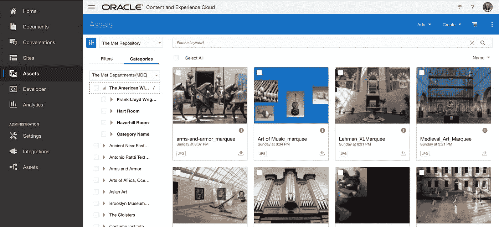
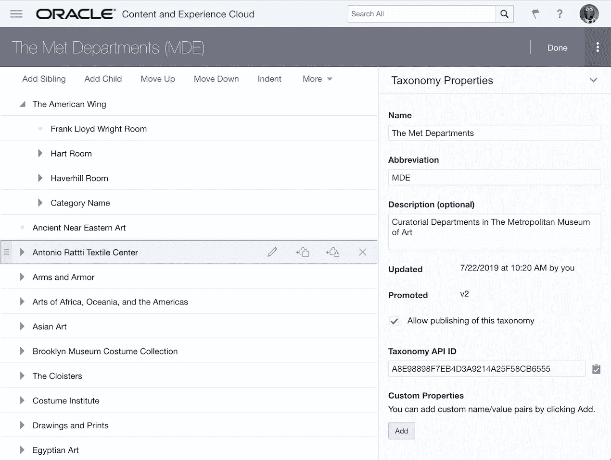
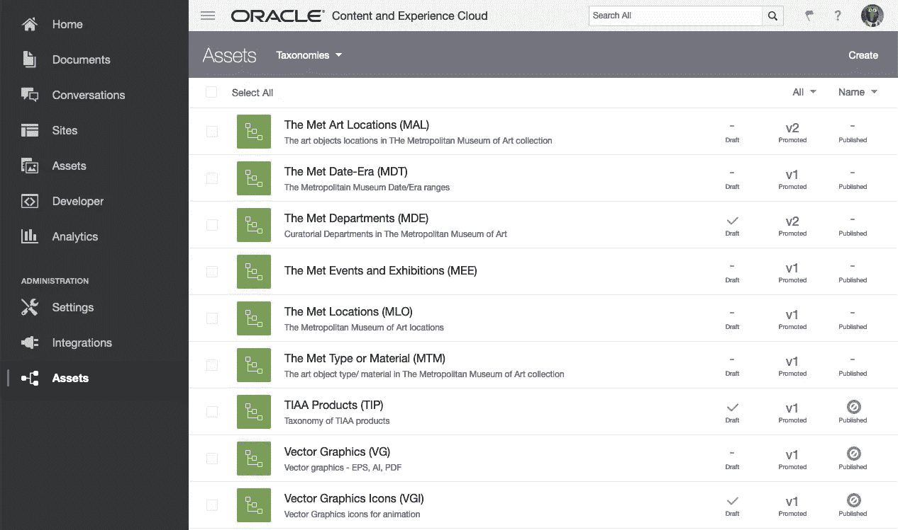
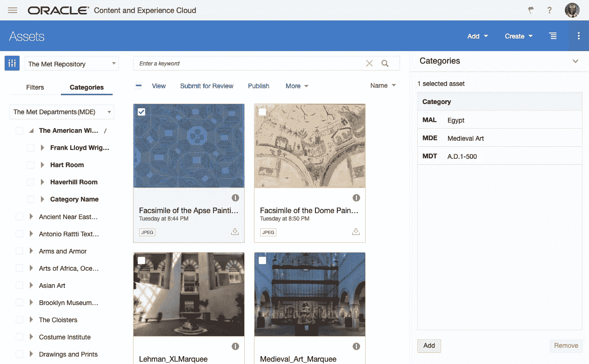

# Oracle 内容和体验中的分类法—第一部分

> 原文：<https://medium.com/oracledevs/taxonomies-in-oracle-content-and-experience-part-i-66d414f20870?source=collection_archive---------8----------------------->

在 3 月份的版本(19.1.5)中，Oracle Content and Experience (OCE)增加了对管理按层次结构组织的受控词汇(分类)的支持，并将其用于内容分类。在 OCE 中，不止一种分类法可以将受控词汇表表示为“方面”,这些方面表征内容分类的不同维度/上下文。这允许您从使用分面导航来缩小存储库中资产的搜索范围中获益。

7 月发行版(19.3.1)支持分类法发布，使有关分类法和内容分类的信息可供外部使用。这使您不仅可以在 OCE 中使用分类法对存储库中的资产进行分类，还可以控制网站或自定义应用程序页面上的内容显示。总之，您可以在 OCE 中定义分类法，用它在存储库中对资产进行分类，然后发布分类法和资产，使资产的分类信息通过 Content Delivery API 可用。

# 用例

让我们通过查看内容分类的典型用例来开始关于 OCE 中分类法的对话:

*   您组织中的内容编辑人员需要能够快速、轻松地在 CMS 存储库中找到内容，以便进行更新、发布或用作参考。他们通常还需要能够将内容项目标记为与其他内容相关，例如，关于事件或贸易展览的文章可以与为特定产品创建的内容相关。
*   品牌经理需要能够确保 CMS 存储库中的内容项目被分配到其团队正在进行的正确的产品品牌、型号或促销，即，将它们标记为与品牌、产品或促销相关。
*   电子商务企业中的商人需要能够将 CMS 存储库中的图像、视频或文档与其电子商务商店目录中的项目相关联，即在产品目录中将它们标记为相关类别或 SKU。

在内容编辑、品牌经理或业务员将内容项目与 CMS 存储库中的产品或其他内容项目相关联后，作为内容架构师或前端开发人员，您通常需要在网站或应用程序页面上显示这些内容项目以及相关项目，例如:

*   大都会博物馆网站上的一个页面显示了大都会博物馆收藏的一件艺术品的信息，同时也显示了相关物品的列表([参见此处](https://www.metmuseum.org/art/collection/search/483515))或同一页面上的相关展览的列表。
*   甲骨文网站上的产品页面还会显示更多与所选产品相关的见解、特色、客户案例和其他内容([参见此处](https://www.oracle.com/database/autonomous-database.html))。
*   亚马逊网站上的一个产品页面显示经常一起购买的产品，来自制造商，比较类似的项目，产品视频和其他与您选择的产品相关的内容。

你如何满足这些要求？作为一名前端开发人员，您需要能够管理内容检索及其在页面或页面部分上的定位，方法是使用带有参数的内容查询，这些参数基于内容项、内容项和品牌或内容项和目标受众之间的预定义关系。

此外，在内容丰富的网站上，如电子商务店面或客户支持网站，您经常要求启用分面导航，通过允许访问者根据相关内容分类应用过滤器来优化内容搜索。为了满足这一要求，您的 CMS 不仅应该支持内容分类，还应该允许带有方面的搜索查询。

# 传统的 CMS 解决方案

无论您使用哪种 CMS，对于内容分类、标记或索引，您都需要有一个受控词汇表，其中包含可以用作 CMS 存储库中内容属性类别的术语。受控词汇表将特定于一个用例。

在传统的 CMS 中，受控词汇表通常作为代表词汇表检索词的值列表(LOV)的集合来管理。要启用内容分类，您的内容架构师需要在内容类型上添加属性，这些属性链接到集合中的 LOVs“类别”属性。需要将这些属性添加到 CMS 存储库中需要分类的所有类型的内容中。

内容编辑者将对内容进行分类，方法是从 LOV 中选取一个相关值，并将其分配给他们在存储库中创建的新内容的“类别”属性，或者更新现有项目以根据需要修改分配给此类属性的值。

要创建内容呈现解决方案，前端开发人员需要与 content architect 合作，了解内容类型上添加的“category”属性，以及 lov 中链接到这些属性以支持内容分类的术语。

传统 CMS 中的搜索引擎通常不支持具有方面的内容索引。如果您需要启用分面导航来细化站点上的内容搜索结果，您需要集成一个支持分面的外部搜索解决方案。

# 传统 CMS 解决方案的缺点

传统的内容分类 CMS 方法确实允许您为上述相关内容用例构建解决方案。它是否提供了一个灵活的解决方案，使您能够快速应对随着时间的推移而发展的新业务需求？我认为不是，因为:

1.  内容分类的任何新业务需求或产品目录的变化都要求内容架构师添加或删除内容类型的“类别”属性，然后更新现有 lov 中的术语或添加新 lov。
2.  更新内容类型后，编辑人员需要修改 CMS 存储库中的内容项目，通过设置新属性的值或更新现有属性的值来对内容进行重新分类。
3.  内容模型的改变通常需要前端开发人员改变页面布局和页面呈现逻辑。
4.  只有在贡献者和开发人员完成他们的工作后，才能发布内容和站点的更新。

即使内容分类中所需的更改相对较小，这种工作也需要时间和资源来完成。你可以做得更好！

# OCE 中可出版的分类学

Oracle Content and Experience 为内容分类和构建相关内容使用案例的解决方案提供了一种卓越得多的方法— **可发布的分类法**:

> 通过将内容分类置于内容项目之外，并允许将分类法与内容一起发布，OCE 消除了修改内容模型、更新存储库中的内容以及站点页面以满足新的内容分类业务需求的需要。

如果您愿意，您仍然可以使用传统方法进行内容分类，并在 OCE 中为相关内容用例构建解决方案。您的内容架构师可以使用表示受控词汇表的 lov 来定义数据模型中内容类型的属性。编辑人员将使用这些 lov 为内容项目的属性赋值。前端开发人员将使用 lov 根据内容模型对页面布局进行编码。这太乏味了…

# 可发布分类法是如何工作的

我希望，我已经引起了您的注意…现在让我们详细了解一下 Oracle Content and Experience 中的可发布分类法特性是如何工作的。

OCE 使您能够将您的组织用于内容分类的受控词汇组织到一个分层结构中，即分类法:

*   分类中的术语与其他术语(也称为节点或类别)之间存在父项/广义术语、子项/狭义术语的关系。
*   一个类别可以在分类法中的多个位置重复出现。

要创建新的分类，请导航至“管理”>“资产”>“分类”，并使用灰色工具栏上的“创建操作”。这将在编辑器中打开空的 taxonomy，您可以使用它来定义类别的层次结构。

新分类作为草稿版本创建。完成分类更改后，您应该提升它，使其可用于 OCE 存储库中。推广会创建你的分类的 v.1。如果以后需要修改，将会创建新的草稿。您可以添加新类别、删除类别或更改它们在层次结构中的位置。在更新升级时，会创建 taxonomy v.2，然后使用 v.1 的 OCE 存储库中的资产会自动重新分类，以说明类别的变化。

要通过 OCE Content Delivery REST API 向外部提供分类法和资产分类信息，您需要将提升的分类法发布到渠道。你应该记住:

*   交付 API 将始终使用当前**发布的**版本在该分类发布到的所有渠道上运行。
*   发布分类将**而不是**触发分类资产的发布
*   编辑可以继续用**升级的**版分类法对内容进行分类，并发布这些资产。
*   资产的发布将**而不是**触发分类的分类的发布，即**关于升级版本的**信息、**和**关于资产分类的信息都不能通过交付 API 获得，因为分类还没有发布
*   升级版本发布后，交付 API 将使**发布的**版本和关于发布的资产分类的信息通过该分类发布到的所有渠道可用。

贡献者可以使用提升的分类法对 OCE 存储库中存在的任何类型的内容进行分类—内容类型不需要具有特定的属性来允许对这种类型的项目进行分类。他们也不需要编辑内容项目来对它们进行分类—他们可以简单地选择几个内容项目，选择类别并将它们分配给所有或选定的项目

不止一个分类法可以代表受控词汇表。如果是这种情况，您可以将这些分类法分配给一个存储库，这将允许贡献者用几个分类法中的类别对资产进行分类。总而言之，一个资产可以被添加到同一个分类法中的多个类别中，也可以被添加到多个分类法中的多个类别中。

内容架构师可以创建一组分类法来表示“内容方面”，其中每个分类法都为内容分类描述了不同的维度/上下文:

*   通过将这样一组分类法附加到 OCE 存储库中，可以很容易地允许内容的分面分类。任何资产都可以添加到同一个分类法中的多个类别中，或者添加到多个分类法中的多个类别中。
*   此外，内容贡献者可以通过应用基于类别的过滤器来快速找到他们需要使用的资产，从而受益于使用分面导航来缩小搜索结果。刻面导航在 OOTB OCE 资源库中可用。

从 OCE 存储库中发布资产和分类后，通过 OCE Content Delivery REST API 可以获得关于分类和内容分类的信息:

*   通过对任何类型的内容运行基于分类法类别的搜索，您可以使用此 API 获取呈现页面或在页面上显示相关内容所需的内容，而不是依赖内容类型来获得指定内容到页面或内容到内容关系的属性。
*   如果分类法代表“分面”，您还可以使用交付 API 中的搜索来为您的网站或自定义应用程序中的分面导航提供支持。

OCE 中的分类法可以发布到不同的渠道，就像内容一样。这允许您根据内容发布到的渠道来定义和使用不同的分类来组织内容。例如，在您的电子商务网站上，您可以使用“深度”分类法来管理产品相关信息的显示。同样的内容可以在你的移动应用上使用“浅层”分类法来显示。太棒了。

您可以在这里找到 Oracle Content 的详细信息并体验用于内容交付的 REST API[，在这里](https://docs.oracle.com/en/cloud/paas/content-cloud/rest-api-content-delivery/index.html)体验用于内容管理的 REST API[。](https://docs.oracle.com/en/cloud/paas/content-cloud/rest-api-manage-content/index.html)

# Oracle 内容和体验解决方案的优势

现在，让我总结一下使用 Oracle 内容和经验来交付解决方案以支持相关内容使用情形的优势:

1.  灵活的内容模型—任何类型的内容都可以在业务需求发生变化后进行分类和重新分类。架构师不需要在内容类型上添加额外的类别字段来实现内容分类，也不需要在以后更改或删除这些字段来满足内容分类的新要求。
2.  易于内容分类—不需要参与者编辑内容来分配类别。相反，他们可以选择几个项目，挑选一个或多个类别，并将它们分配给所有或选定的内容项目。以类似的方式，他们可以从内容中删除类别。
3.  分面搜索—OOTB 支持按类别过滤资产。如果分类法被定义为表示“方面”，那么贡献者可以通过应用基于方面值的过滤器来查找他们需要使用的项目，从而使用方面导航来缩小内容范围。前端开发人员可以使用相同的分类法对站点上发布的内容进行分面搜索。
4.  多渠道分类—相同的内容可以用几种分类法进行分类；每个都特定于内容发布到的交付渠道。这允许根据消费渠道以不同的方式呈现相同的内容。

# 摘要

通过将内容分类置于内容项目之外，并允许将分类与内容一起发布，OCE 消除了为满足内容分类的新业务需求而修改内容模型、更新存储库中的内容以及网站页面的需要。这使得 Oracle Content and Experience 能够为您提供更好的内容分类方法，并为相关内容用例构建解决方案。

在这篇博文的第二部分，我将解释如何使用 OCE REST API 来构建一个简单的博客站点，用于内容管理和交付，以显示相关的博文。