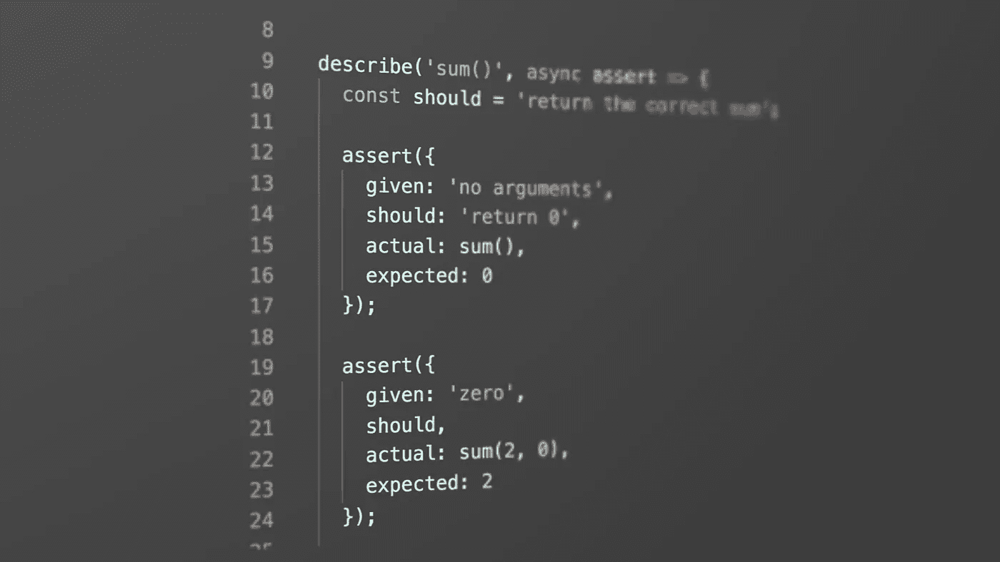
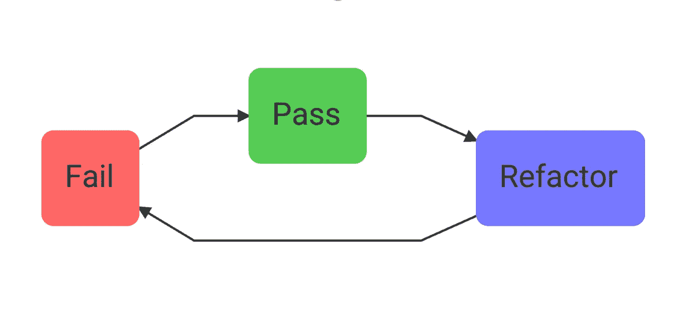
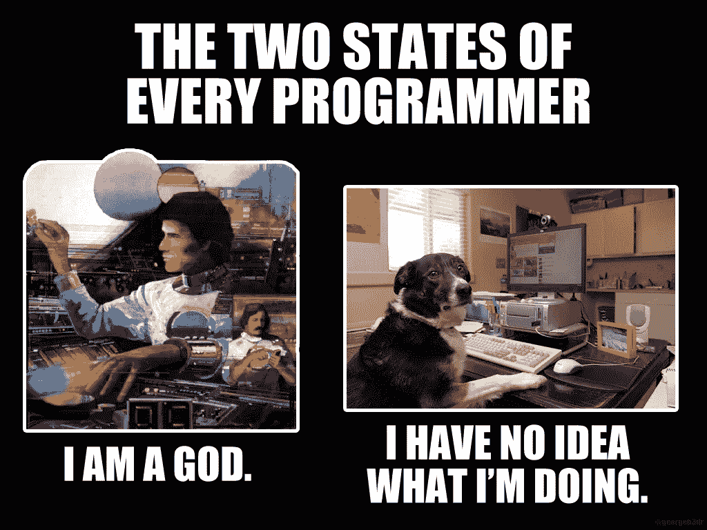

# TDD 改变了我的生活

> 原文：<https://medium.com/javascript-scene/tdd-changed-my-life-5af0ce099f80?source=collection_archive---------0----------------------->



现在是早上 7:15，客户支持忙得不可开交。我们刚刚上了《早安美国》的专题节目，一大群第一次来的顾客遇到了问题。

所有人都在甲板上。我们将在转化更多新用户的机会消失之前发布一个补丁。其中一名开发人员已经实施了一项他认为可以解决这个问题的更改。我们在公司聊天中粘贴了阶段链接，并要求每个人在我们将它投入生产之前去测试修复。有用！

我们的行动超级英雄启动了他的部署脚本，几分钟后，更改就开始了。突然，客户支持呼叫量**翻倍。**我们的热补丁打破了一些别的东西，开发人员同步爆发`git blame`而操作英雄回复了变化。

## 为什么是 TDD？

我已经有一段时间没有处理这种情况了。不是因为开发人员不再犯错，而是因为多年来，我领导和参与的每个团队都有使用 TDD 的政策。当然，bug 仍然会发生，但是发布到产品中的令人窒息的 bug 已经下降到接近于零，尽管从那时起软件变更和升级维护负担的速度已经呈指数增长。

每当有人问我为什么他们应该为 TDD 烦恼时，我就会想起这个故事——以及更多类似的故事。我转向 TDD 的主要原因之一是为了[提高测试覆盖率](https://ieeexplore.ieee.org/abstract/document/4343755)，这导致[产品中的 bug](https://www.researchgate.net/publication/3249271_Guest_Editors'_Introduction_TDD--The_Art_of_Fearless_Programming)减少 40%-80%。这是我最喜欢的 TDD 的好处。这就像一个巨大的重量从你的肩膀上卸下来。

> TDD 根除了对变化的恐惧。

在我的项目中，我们的自动化单元和功能测试套件防止灾难性的重大变更几乎每天都会发生。例如，我目前正在查看过去一周的 10 个自动化库升级，我过去对合并很偏执，因为如果它破坏了什么呢？

所有这些升级都是自动集成的，并且已经投入生产。我没有手动查看它们中的任何一个，我一点也不担心它们。我不用去打猎就能想出这个例子。我打开 GitHub，查看最近的合并，它们就在那里。曾经的手动维护(或者更糟，忽视)现在是自动化的后台流程。你可以在没有良好测试覆盖的情况下尝试，但是我不建议你这么做。

## 什么是 TDD？

TDD 代表测试驱动开发。过程很简单:



Red, Green, Refactor

1.  在编写实现代码之前，先编写一些代码来证明实现是成功还是失败。在进入下一步之前，观察测试失败(这就是我们如何知道通过测试不是假阳性——我们如何测试我们的测试)。
2.  编写实现代码，看着测试通过。
3.  如果需要，重构。既然有测试告诉你是否破坏了什么，你应该对重构代码充满信心。

## TDD 如何节省您的开发时间

从表面上看，编写所有这些测试似乎是许多额外的代码，所有这些额外的代码都需要额外的时间。起初，这对于我来说是正确的，因为我首先努力理解如何编写可测试的代码，并努力理解如何向已经编写的代码添加测试。

TDD 有一条学习曲线，当你在这条学习曲线上攀登时，它可以并且经常[增加 15% — 35%的实现时间](https://www.infoq.com/news/2009/03/TDD-Improves-Quality)。但是在马克的 2 年左右，神奇的事情开始发生了:我开始用单元测试比没有单元测试时更快地编写代码。

几年前，我在 UI 中构建了一个视频剪辑范围特性。这个想法是，你为一个视频设置一个起点和一个终点，当用户链接到它时，它会链接到那个精确的剪辑，而不是整个视频。

但是没有用。播放器会播放到剪辑的结尾，然后继续播放，我不知道为什么。

我一直认为这与事件监听器没有正确连接有关。我的代码看起来像这样:

```
video.addEventListener('timeupdate', () => {
  if (video.currentTime >= clip.stopTime) {
    video.pause();
  }
});
```

改变。编译。重新装弹。点击。等等。重复一遍。

每一个变化都要花将近一分钟的时间来测试，我尝试了很多有趣的事情(大多数都是 2-3 次)。

我拼错了`timeupdate`吗？我得到的 API 正确吗？`video.pause()`通话正常吗？我会做些改变，添加一个`console.log()`，跳回浏览器，点击刷新，点击到剪辑结束前的一刻，然后耐心等待它结束。在`if`语句中记录日志没有任何作用。好吧，这是个线索。从 API 文档中复制并粘贴`timeupdate`，以确保这不是一个打印错误。刷新，点击，等待。没有运气！

最后，我在`if`语句外面放了一个`console.log()`。“这没办法，”我想。毕竟，那个`if`语句太简单了，我不可能搞砸逻辑。它记录了。我把咖啡吐在键盘上了。WTF？！

> 墨菲除错定律:你深信不疑的东西不可能是错的，所以你从来不会费心去测试它。在你敲打你的桌子并改变它之后，你肯定会在那里找到错误，因为你已经尝试了你能想到的所有其他方法。

我设置了一个断点来弄清楚发生了什么。我检查了`clip.stopTime`的值。`undefined`？？？我回头看了看我的代码。当用户点击选择停止时间时，它会放置小的停止光标图标，但不会设置`clip.stopTime`。“天哪，我是个超级大白痴，在我有生之年，任何人都不应该让我再接近电脑。”

多年以后，我仍然记得这件事，因为那种感觉。你很清楚我在说什么。我们都经历过。我们都是活着的迷因。



Actual photos of me while I’m coding.

如果我现在编写这个 UI，我会这样开始:

```
describe('clipReducer/setClipStopTime', async assert => {
  const stopTime = 5;
  const clipState = {
    startTime: 2,
    stopTime: Infinity
  }; assert({
    given: 'clip stop time',
    should: 'set clip stop time in state',
    actual: clipReducer(clipState, setClipStopTime(stopTime)),
    expected: { ...clipState, stopTime }
  });
});
```

当然，从表面上看，这看起来比`clip.stopTime = video.currentTime`要多得多。但这才是重点。这段代码就像一个规范。文档，以及代码按照文档工作的证明。因为它的存在，如果我改变在 UI 中定位停止时间光标的方式，我不必担心在这个过程中是否会破坏剪辑停止时间代码。

> 注意:想这样写单元测试吗？查看[“重新思考单元测试断言”](/javascript-scene/rethinking-unit-test-assertions-55f59358253f)。

重点不在于输入这段代码需要多长时间。重点是如果出了问题需要多长时间调试。如果这段代码出错，这个测试会给我一个很好的错误报告。我马上就知道问题不在于事件处理程序。我知道它在`setClipStopTime()`或`clipReducer()`中，实现了状态突变。我知道它应该做什么，实际的输出和预期的输出——更重要的是，我的一个同事，在未来的 6 个月里，他试图在我构建的代码中添加一些特性。

我在每个项目中做的第一件事就是[设置一个监视脚本](/javascript-scene/streamline-code-reviews-with-eslint-prettier-6fb817a6b51d)，它会在每次文件更改时自动运行我的单元测试。我经常在两个监视器上并行编码，并在一个监视器上运行 watch 脚本，而我在另一个监视器上编码。当我做出改变时，我通常会在 3 秒钟内知道这个改变是否有效。

对我来说，TDD 不仅仅是一个安全网。它也是持续、快速、实时的反馈。当我做对了的时候，立即得到满足。当我出错时，立即提供描述性的错误报告。

## TDD 教会了我如何写出更好的代码

我要承认一些尴尬的事情:在我学习 TDD 和单元测试之前，我不知道如何构建应用程序。我是如何被录用的，这超出了我的能力范围，但是在采访了成百上千的开发人员之后，我可以非常自信地告诉你:有很多开发人员都处在同一条船上。TDD 几乎教会了我所知道的关于软件组件的有效解耦和组合的一切(意味着模块、函数、对象、UI 组件等等。)

这是因为单元测试迫使你测试相互隔离的组件，以及 I/O。给定一些输入，被测试的单元应该产生一些已知的输出。如果没有，测试就失败了。如果有，就通过了。关键是它应该独立于应用程序的其余部分来完成。如果您正在测试状态逻辑，您应该能够测试它，而不需要在屏幕上显示任何内容，也不需要将任何内容保存到数据库中。如果您正在测试 UI 呈现，您应该能够在不在浏览器中加载页面或访问网络的情况下进行测试。

除此之外，TDD 告诉我，当你尽可能地保持 UI 组件最少时，生活会变得简单得多。将业务逻辑和副作用从 UI 中分离出来。实际上，这意味着如果你使用基于组件的 UI 框架[，比如 React](/javascript-scene/unit-testing-react-components-aeda9a44aae2) 或 Angular，创建显示组件和容器组件，并把它们分开可能会更有利。

对于显示组件，给定一些道具，总是呈现相同的状态。可以很容易地对这些组件进行单元测试，以确保属性连接正确，并且 UI 布局中的任何条件逻辑都能正常工作(例如，如果列表为空，列表组件可能根本不应该呈现，而是应该呈现一个向列表添加一些内容的邀请)。

早在我学习 TDD 之前，我就知道关注点分离，但是我不知道如何分离关注点。

单元测试教会了我如何使用模仿来测试东西，然后它教会了我[模仿是一种代码味道](/javascript-scene/mocking-is-a-code-smell-944a70c90a6a)，这让我大吃一惊，并完全改变了我处理软件合成的方式。

所有的软件开发都是组合(composition )( T7 ):将大问题分解成许多容易解决的小问题，然后组合这些问题的解决方案以形成应用程序的过程。为了单元测试而嘲笑是一种迹象，表明你的组合的原子单元不是真正的原子，学习如何在不牺牲测试覆盖的情况下根除嘲笑教会了我如何发现紧密耦合的无数偷偷摸摸的来源。

这使我成为一名更好的开发人员，并教会我如何编写更简单的代码，更容易扩展、维护和伸缩，无论是在复杂性方面，还是在像云基础设施这样的大型分布式系统中。

## TDD 如何节省整个团队的时间

我之前提到过[测试首先会提高测试覆盖率](https://ieeexplore.ieee.org/abstract/document/4343755)。原因是，在我们编写了测试以确保其工作之前，我们不会开始编写实现代码。**首先，写测试。**然后看着它失败。然后写实现代码。失败，通过，重构，重复。

这个过程建立了一个安全网，很少会有错误漏网，这个安全网对整个团队有着神奇的影响。**它消除了对合并按钮的恐惧。**

这个令人放心的覆盖率数字给了你的整个团队信心，让他们不再对代码库的每一个小变化把关，让变化茁壮成长。

消除对变化的恐惧就像给机器加油一样。如果你不这样做，机器会慢慢停下来，直到你清理干净，转动曲柄，吱吱嘎嘎地转动起来。

没有这种担心，开发节奏会运行得更加顺畅。拉请求停止备份。您的 CI/CD 正在运行您的测试——如果您的测试失败，它将停止运行。它会大声地失败，并在失败时指出哪里出错了。

这使得一切都不同了。

# 想了解更多关于 TDD 的知识吗？

TDD 日是全天录制的网络研讨会。[EricElliottJS.com](https://ericelliottjs.com/)成员[可以观看录制](https://ericelliottjs.com/premium-content)。

您将了解到:

*   为什么 TDD 接管了
*   软件质量经济学
*   单元对比功能对比集成测试
*   每个单元测试必须回答的 5 个问题
*   TDD 礼仪之道
*   嘲讽是一种代码气味
*   为什么可测试软件导致更好的架构
*   紧密耦合的原因
*   如何用纯函数做更多事情
*   单元测试反应组件

[报名入门。](https://ericelliottjs.com/premium-content)

***埃里克·艾略特*** *是一位科技产品和平台顾问，《 [*【作曲软件】*](https://leanpub.com/composingsoftware)*[*【EricElliottJS.com】*](https://ericelliottjs.com)*[*devanywhere . io*](https://devanywhere.io)*的联合创始人，以及 dev 团队导师。他曾为 Adobe Systems、* ***、Zumba Fitness、*** ***【华尔街日报、*******【ESPN、*******【BBC】****等顶级录音艺人和包括* ***Usher、【Metallica】********

*他和世界上最美丽的女人享受着与世隔绝的生活方式。*