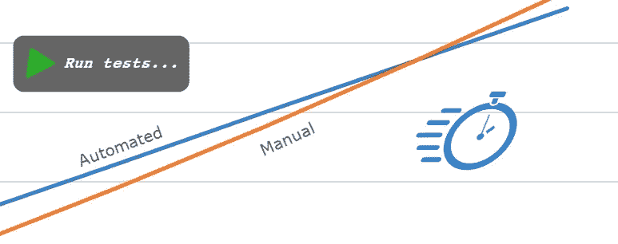
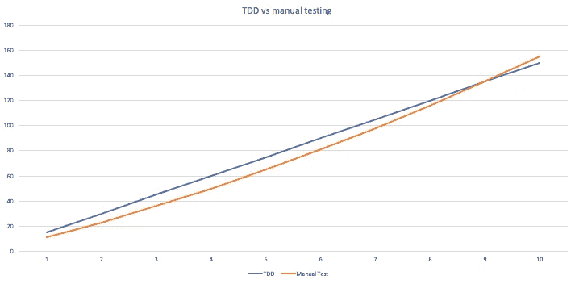
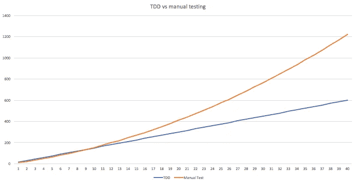

# 实践中的 TDD

> 原文：<https://blog.kotlin-academy.com/tdd-in-practice-f914d36b7d66?source=collection_archive---------1----------------------->

在 [*之前的一篇文章*](https://medium.com/p/42977fcedb27) *中，我解释了为什么编写干净的代码对开发人员和他们的经理来说都更有利可图:从长远来看，这将帮助他们更快地构建，减少错误，节省时间和金钱。这一次，我想用一些基本的数学知识来展示测试优先的方法是如何帮助您加速开发的，以及其他的好处。*

当我们第一次决定搬到科特林时，我们的经理似乎并不热衷于接受这种变化。既然这种语言很新，培训每个人都采用它不是更昂贵吗？寻找懂这门语言的新开发人员不是更复杂吗？如果团队中的新成员对语言不够熟悉，理解我们的应用程序并修复错误不是更复杂吗？

为了让他们相信放弃 Java 会给我们带来极大的好处，我试图解释 Kotlin 将如何帮助我们产生更安全、更便宜的代码，使用的词汇有*改进的空安全性*、*更好的可读性*、*更好的可维护性*。但事实证明，除非我能用数字来证明，否则经理们不会真的相信我的说法。他们以前听过类似的说法，但他们不一定见过作者宣传的效果。

最终，我们设法说服了他们，但是当涉及到软件质量，尤其是是否值得为我的代码编写自动化测试时，我有时会有同样类型的争论。毕竟，编写测试需要时间，所以逻辑告诉你，如果你跳过测试，你将能够更快地产生价值，不是吗？我没有把我的那本《TDD by example》推到他们面前，希望 Kent Beck 能够更成功地说服他们，而是试着做了一些计算。

# 一点数学知识

很难选择确切的数字来说明我的观点，所以我们先选择一些任意的值。正如我们稍后将看到的，实际值并不重要，但它们将帮助我们更容易地感知差异。假设我们想要评估构建一个满足一定数量需求的程序所需的时间。我们将一步一步地实现它们，定期检查我们的代码是否做了它应该做的事情。我们将保持每一步相对较小，这样我们可以很容易地找到错误(调试大量代码总是比少量更改复杂得多)。

假设我们的步骤很小，让我们假设我们将花费 10 分钟实现需求，5 分钟编写相应的测试。运行我们所有的自动化测试只需要几秒钟，所以相比之下，这个时间可以忽略不计。手动测试这个特性比为它编写测试更快，但比运行自动化测试时间更长:我需要启动我的应用程序，导航到正确的状态，然后有效地检查这个特性。假设我平均花 1 分钟做这件事。

我们现在可以比较当我使用 TDD 和手工测试时我必须做的工作量:

*   使用 TDD，我将开始编写一个新的测试(5 分钟)，实现这个特性(10 分钟)并运行我的完整测试套件(0 分钟)。所以总共 15 分钟。下一步也是如此，所以每一个新功能都会再增加 15 分钟。
*   对于手动测试，实现这个特性也需要 10 分钟，但是测试只需要 1 分钟，所以总共需要 11 分钟。当我实现我的第二个特性时，我会花 10 分钟编写代码，1 分钟测试它，但是会再花一分钟验证我没有破坏第一个特性(所以 2 个特性需要 23 分钟)。对于第三个功能，我必须多花 2 分钟(每个功能一分钟，所以总共 36 分钟)。

我们可以看到，基于这些数字，一开始不写测试似乎更快，这似乎证实了编写测试会增加时间的普遍直觉。但问题是，随着每个新特性的出现，检查以前的特性没有被破坏的时间将会增加。在第九个特征之后，TDD 曲线下降到低于手动测试曲线。

如果你保持这种趋势一段时间，差异会变得更加明显。

在这些图表中开始出现的是，使用 TDD，添加一个新特性所需的时间几乎是恒定的:测试所有先前的特性只需要几秒钟，并且可以完全忽略。所以增长是完全线性的( *t = 15 * n* )。另一方面，手动测试的时间随着每个新特性的增加而增加，因为手动重新测试每样东西花费的时间越来越长。利用这个简单模型，我们得到了曲线的二次增长( *t = 10 * n + n * (n + 1) / 2* )。

这就是为什么我们选择的价值观，即使完全武断，也没有多大关系。不管这些数字实际上是什么，你将会比较一个线性数列和一个二次数列。即使你一开始调整数字以最大化两条曲线之间的差距，你最终也会到达红线在蓝线上方跳跃的点。

你可以建议不要一直重复测试所有的东西来减缓红色曲线。这确实是一种可能性(实际上也是我们在实践中倾向于做的)。但是请注意，到目前为止，我们一直在假设一个最好的情况:我们编码的所有东西在第一次尝试时就工作了。这种态度的问题是，如果你打破了什么东西，你会花更长的时间去注意它。当您发现某些东西不再像预期的那样工作时，您可能要花很长时间来追踪产生该 bug 的变更。更糟糕的是，当你找到它时，你可能会意识到你已经做了一些依赖于这个错误的改变。在这些情况下，最好的选择通常是回到代码按计划运行时的最后状态。也就是你最后一次运行测试套件的时间。对于手动测试，如果您没有在每次修改代码时测试所有的代码，那么跟踪您最后一次确定代码工作的时间将会很痛苦(请记住，在某个状态下检查您的代码需要时间，因为这意味着运行所有的测试，如果您有许多提交要检查，这是不合理的)。

# 降低你的精神负荷

现在这些数字可能是说服经理的好工具。但是事情远不止如此。作为一名开发人员，首先编写自动化测试还有很多其他的好处。大多数都依赖于一个简单的原则:TDD 帮助你将任务分解成非常小的步骤。

对于手动测试，检查代码的成本很高，这将阻止你经常测试。但是，如果您的测试是自动化的，并且在几秒钟内运行，您就可以随时检查代码的正确性，并采取尽可能小的步骤。

这带来了一些好处:

*   运行您的代码并意识到您解决了某个问题总是值得的。但是在你测试它之前必须等待很长时间，这会延迟你的满足感。另一方面，经常验证较小的步骤意味着你会更经常地体验那种满足感，这对于保持你的高动力是非常好的。没有什么比想到你的目标还很遥远更令人沮丧的了。每一个有经验的徒步旅行者都知道，如果你面临一次长途旅行，在精神上把你的旅行分成几段，一次专注于一段，这是非常有帮助的。
*   专注于更小的任务也限制了你在特定时间内头脑中杂耍的概念数量。为要解决的问题建立一个心智模型，并设计适当的算法来解决它，需要一些努力和专注。如果你在完成任务的过程中被打断了，那些努力就白费了。任务越小，就越容易对手头的工作有一个完整的理解，并在你的脑海中一直玩到完成。

Source : [https://www.monkeyuser.com/2018/focus/](https://www.monkeyuser.com/2018/focus/)

*   通过在每次开始做某事时添加一个新的失败测试，你也添加了一个清晰的里程碑来跟踪你的进展。如果您需要在某个时候停止编码，从您停止的地方重新开始会更容易:无论什么测试没有通过都是您的下一个任务。
*   此外，测试用例列表给你一个你已经处理过的场景的清晰列表，所以你不必依赖于你前几天手工测试的记忆。添加测试就像保存一份您所做的所有事情的书面清单。

# 结论

作为一名移动开发人员，我不得不承认，每当我添加更多代码时，运行我的应用程序并检查其行为的诱惑通常都存在。但正如我们所见，这只会让我慢下来。此外，能够快速测试我的假设的愿望可能会影响我的设计，并促使我将业务逻辑更贴近 GUI 层。另一方面，编写自动化测试一开始可能看起来是反直觉的，但它肯定会加速我的开发，并减少我完成每一步所需的注意力。

不幸的是，并不是每一个测试都能容易地自动化。有些架构层自然比其他层更容易交互。所以如果你想快速产生价值，整个目标就是最大化你代码的可测试性。最好的方法是从编写测试开始！

# 点击👏说“谢谢！”并帮助他人找到这篇文章。

了解卡帕头最新的重大新闻。学院，[订阅时事通讯](https://kotlin-academy.us17.list-manage.com/subscribe?u=5d3a48e1893758cb5be5c2919&id=d2ba84960a)，[观察推特](https://twitter.com/ktdotacademy)，在 Medium 上关注我们。

如果你需要一个科特林工作室，看看我们如何能帮助你: [kt.academy](https://kt.academy/) 。

