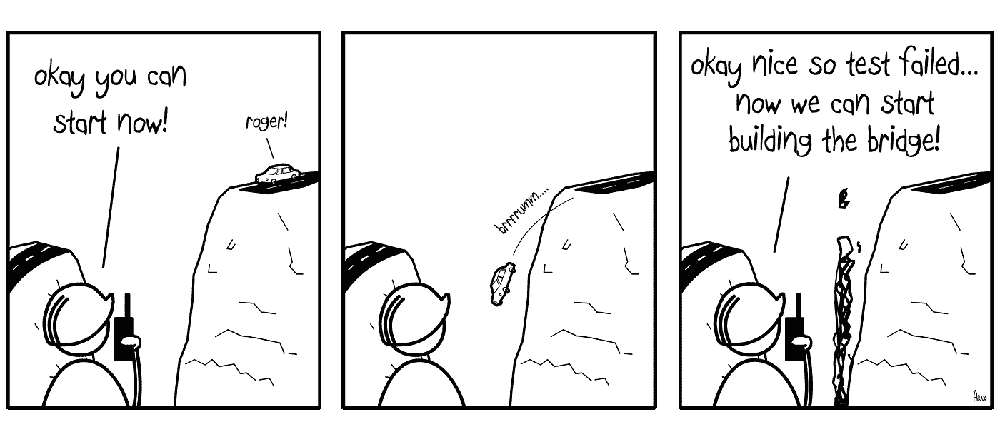
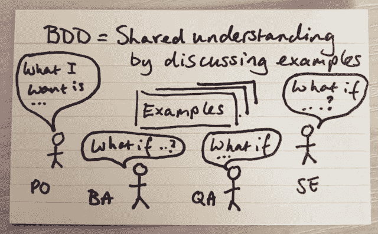
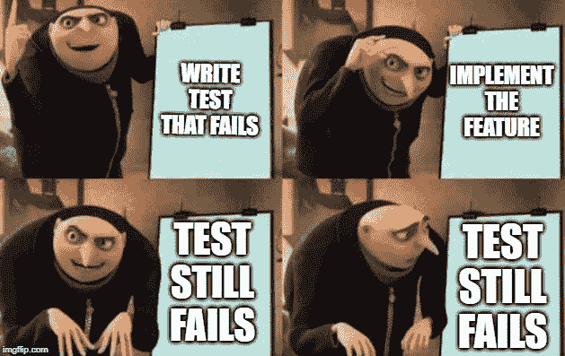

# TDD 还是 BDD…你的口味是什么？

> 原文：<https://medium.com/globant/tdd-or-bdd-whats-your-flavor-8be8d0a1b202?source=collection_archive---------8----------------------->

Let’s test first! Taken from: [https://brandnewbox.com/notes/2020/01/test-driven-development](https://brandnewbox.com/notes/2020/01/test-driven-development/)

最近，我被邀请做一系列关于工作中的单元测试的演讲，我必须说，我绝不是专家，但是在我的职业生涯中，我已经做了我份内的单元测试，所以我想我已经学到了一些东西。

在为这些演讲做研究时，*只是为了确定我所说的是真的*，我意识到 Jasmine 是一个 BDD 框架，如果你使用过它，它完全有意义。所以，这让我想到，没有多少人知道开发方法，这个**肯定是我必须谈论的主题之一。**

# 让我们从基础开始，什么是软件开发方法论？

方法本身是一系列先前建立的步骤，为了实现一个目标或目的而遵循，那么，软件开发方法是关于软件开发的步骤和技术。

在开发项目时，有几种方法可以遵循，目前最广为人知的是 TDD *测试驱动开发*。

# 什么是测试驱动开发？

简单地说，这是基于测试的开发，这是一个循环，一个测试被构建为失败，根据结果，一个函数被构建为使测试成功，然后一个新的测试被构建为失败，循环再次开始。

写测试->失败->代码->成功->重复，直到一切完成。

It’s just a cycle. From: [https://www.kamui.co.uk/2018/07/01/test-driven-development-tdd-a-practical-example/](https://www.kamui.co.uk/2018/07/01/test-driven-development-tdd-a-practical-example/)

另一种方法，有点类似，是 BDD 行为驱动开发，基于预期行为的开发，明白吗？没那么多？让我们看看。

# 什么是行为驱动开发？

BDD 是一种方法，其目标是满足一组验收标准。在这里，测试被构建来验证项目必须遵守的预定义的、讨论过的和接受的标准。

这是一个循环，一个测试被构建为失败，根据结果，代码被构建为使测试成功，然后一个新的测试被构建为失败，然后循环开始……嗯？

*等等！那不是和 TDD 一样吗？*嗯……有点(？)

Confused?

# 都是你想考什么的问题。

你看，这两种方法之间的主要区别是测试目标和我们如何知道那个目标是什么，就这样，就这样，严肃地说。

BDD 测试所基于的标准应该从最终用户的角度反映预期的功能，所以我们需要一个完整的团队，这意味着利益相关者、项目经理、技术负责人、业务分析师、设计师、开发人员、QA 团队，是的，所有的团队。

实际上，这可以转化为:

*   作为一个最终用户，我希望看到一个应用程序，计算两个给定值不同的基本操作。
*   该应用程序应该显示从 0-9 的数字按钮；并且每个按钮在被点击时应该触发给定数字的显示。
*   应用程序应该显示运算符+、-、*、/的按钮；并且每个按钮在被点击时应该触发给定操作员的显示。
*   该应用程序应符合下一个 UX 准则:…
*   诸如此类…

We all have ideas. Taken from: [https://itsadeliverything.com/specification-by-example-versus-behaviour-driven-development](https://itsadeliverything.com/specification-by-example-versus-behaviour-driven-development)

当然，你可以在没有开发和 QA 团队的情况下定义验收标准，但从我的角度来看，我永远不会低估一个 Jr 开发人员可能给出的洞察力，最好的想法可能来自你最意想不到的地方，还记得《料理鼠王》吗？

另一方面，TDD 不一定需要整个团队，一个 Dev 就足够了，为什么？因为 TDD 的目标是测试孤立的代码片段，并确保它们按照预期的方式工作。把它写成代码就意味着:

*   我需要一个将两个值相加的函数。
*   我需要一个两个值相乘的函数。
*   诸如此类…

# 它们是互斥的吗？

绝对不是，你可以测试你的整个代码实际上满足用户故事接受标准，同时，测试代码的不同部分满足它们自己不同的目的。

# 那么，哪个更好呢？

问得好，这两种方法虽然步骤相似，但目标不同。因此，正如我最喜欢的导师之一总是说的“视情况而定”，BDD 可以被认为是 TDD 的进化，我个人喜欢把它看作是 TDD 的补充。

BDD 可能需要更多的时间来开始，同时验收标准被定义，由于同样的原因，它变得更加复杂，TDD 更多的是一种实践方法，所以如果做得好，通常会更快更容易。

TDD 帮助您测试您的代码，但是，因为它是独立的代码，您可能无法测试与代码其余部分的交互，而使用 BDD，您可以确保您的整个代码交付了客户期望得到的东西，因为您测试的是代码的不同部分之间的交互。

We’ve all been there.

就我个人而言，我喜欢两者都用，BDD 用于整个用户故事，TDD 用于定义我的函数和类，这是不是太怪异了？

那么，告诉我，TDD 还是 BDD，你的口味是什么？

大家编码快乐！下次再见，记住，*生活就是在你调试并试图解决你找不到的 bug 的过程中度过的。*