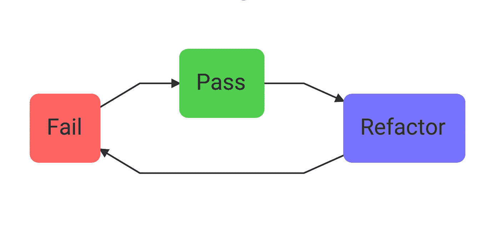

# TDD 礼仪之道

> 原文：<https://medium.com/javascript-scene/tdd-the-rite-way-53c9b46f45e3?source=collection_archive---------3----------------------->

Red, Green, Refactor

**测试驱动开发** ( **TDD** )是一个编写可证明满足软件需求的软件的过程。这个过程是这样的:

1.  从一个可证伪的规定需求开始，例如，`double()`应该取一个数字`x`并返回`x`和`2`的乘积。
2.  编写一个测试来证明所陈述的需求得到了满足。
3.  看着测试失败。这证明了测试不会产生误报，并且添加的代码是测试通过的原因。
4.  添加实现代码。
5.  看测试通过。
6.  仔细检查代码，并在必要时进行改进，依靠测试来证明改进后的代码继续按预期工作。

这个工作流程通常被称为红绿重构。

# 关于框架

当你深入研究 TDD 时，你会发现测试框架有很多选择。让我为您节省一些时间:您选择哪一个并不重要，重要的是您的测试套件有多简单。一些更好的框架(Mocha，Jasmine)倾向于鼓励用户产生过于复杂的测试，但是如果你遵循本文中的建议，几乎任何框架都足够了。

如果你想鼓励你团队中的开发人员保持你的测试简单，看看[“重新思考单元测试断言”](/javascript-scene/rethinking-unit-test-assertions-55f59358253f)。

事实上，如果您不测试大型应用程序，一个简单的 vanilla-js 测试套件可能就可以了:

对于本文，我们将在示例中使用[磁带](https://github.com/substack/tape)，因为它非常简单。*更新:查看* [*“重新思考单元测试断言”*](/javascript-scene/rethinking-unit-test-assertions-55f59358253f) *以获得更简单的测试。我以上面的例子为基础，所以用法应该看起来很熟悉。*

# TDD 礼仪之道

RITE 是一个首字母缩略词，帮助你记住一些要记住的要点。测试应该是:

*   eadable
*   隔离或整合
*   彻底地
*   透明的

# 易读的

一个好的单元测试是可读的。以下建议有助于实现这一目标:

## **提示:回答每个单元测试必须回答的 5 个问题**

失败的测试读起来应该像一份好的错误报告。这意味着以下问题的答案应该一目了然:

*   测试的是什么组件？
*   正在测试组件的什么行为(测试设置/给定)？
*   实际效果如何？
*   预期结果是什么？
*   如何重现实际结果？

我把这些[称为“每个单元测试必须回答的 5 个问题”](/javascript-scene/what-every-unit-test-needs-f6cd34d9836d#.reqots18y)。

**提示:尽量减少测试中的代码。**

您应该能够使用工厂函数来处理安装和拆卸。例如，我经常使用 reducers 和工厂函数测试我的应用程序中的状态转换。

我使用一个工厂函数来创建测试的初始状态。这样，设置逻辑不会给测试本身增加太多混乱。您只需要看到突出的部分——对于手头的特定测试很重要的东西。

想象一下，你正在构建一个[拒绝游戏应用](https://github.com/learn-javascript-courses/rejection)，用户可以因为请求被其他人拒绝而获得积分。游戏中有两种重要的状态:用户请求的记录和用户的个人资料数据。

如果您正在测试一些只是更新用户配置文件的代码，您可以安全地忽略处理用户请求的部分。通过使用带有默认值的工厂来创建初始状态，您可以将不想要的细节排除在测试之外。

想象这是我们的默认状态:

我们可以创建以下工厂来为每个测试创建初始状态:

现在我们可以调用工厂来生成测试所需的任意状态:

并且只覆盖每个单独测试所需的状态部分:

## **提示:比起花哨的断言类型，更喜欢等式断言。**

等式断言本质上回答了每个单元测试必须回答的 5 个问题中的 3 个:

1.  实际结果如何？
2.  预期的结果是什么？
3.  你如何重现这些发现？

因为这些信息封装了单元测试提供的如此多的关键数据，所以我倾向于使用相等比较而不是其他断言类型。偶尔，我会使用通过/失败断言来测试是否调用了某个函数，但是我的测试案例中 90%以上都是等式断言。

## **提示:明确命名你的** `**actual**` **和** `**expected**` **值。**

这些信息对于理解一个测试做什么和如何工作是如此重要，以至于我不喜欢在断言调用中隐藏它。相反，我将值赋给显式变量，这样就可以一目了然地看出哪些值是哪些值，以及这些值是如何计算的。

# 隔离/集成

有三种主要的测试，都同样重要。功能/E2E 测试、集成测试和单元测试。

*   单元测试必须测试**隔离的**组件。
*   功能/E2E 和集成测试组件必须**集成。**
*   **所有测试**必须**与其他测试隔离。测试应该有**没有共享的可变状态**。**

**隔离组件**意味着我们正在测试一个与系统其他部分隔离的代码单元(思考模块)。您在黑盒接口级别测试它们。每个组件都被视为一个独立的小程序。

我们不像功能/E2E 测试那样测试整个程序，而是独立于程序的其余部分和其他松散耦合的模块来测试单元。

为了满足 RITE way 的要求，单元测试必须:

1.  快速运行，以便在开发人员编码时向他们提供实时反馈。
2.  确定性:给定具有相同输入的相同组件，测试应该总是产生相同的结果。

因为单元测试需要快速运行，并且需要确定性，所以它们不应该依赖于网络、对存储的访问等…

黑盒只有单向通信:有东西进去(一般是参数)，有东西出来(一般是返回值)。您的测试不应该关心中间发生了什么。

**单元测试**应该关注[大部分是纯粹的](/javascript-scene/master-the-javascript-interview-what-is-a-pure-function-d1c076bec976)行为:

*   给定**相同的输入**，总是返回**相同的输出**
*   有没有副作用

显然，代码的某些部分会有副作用。程序的某些部分是为了通过网络与某些 API 通信、写入磁盘、绘制到屏幕或登录到控制台而存在的。

对于有副作用的组件，通常最好忘记单元测试，而是依靠**功能或集成测试。**

为什么？因为如果您试图测试与非确定性过程紧密耦合的代码，会发生两件事:

1.  测试不再是确定性的，这意味着当代码正常工作时，测试可能会失败。单元测试不应该因为这些原因而中断。
2.  **有副作用的单元测试代码需要嘲讽。试图将紧密耦合的代码与非确定性过程隔离开来需要大量的嘲讽。嘲讽是一种代码气味。**

嘲讽一两件小事没问题。有时我会将一个假函数传递给一个函数，只是为了看看它是否是用正确的值调用的。然而，为复杂系统创建复杂的模拟是不好的。不要那样做。

> 嘲讽是一种代码气味。

如果您发现您不得不模拟很多东西来测试一个小东西，这可能表明您的应用程序耦合得太紧了。您应该能够将网络/数据库/API 通信之类的事情与处理从网络/数据库/API 返回的数据的逻辑分开。

处理数据的那部分代码可以并且很可能**应该**使用确定性过程&纯函数来实现。

> 将副作用与业务规则和领域逻辑隔离开来。

将副作用与业务规则和领域逻辑隔离开来，您将发现您的软件不仅变得更易于测试，而且更易于调试、扩展和维护。

为什么？因为您已经最小化了随机性和非确定性过程对代码可靠性的影响。您的代码不容易出现错误，并且在出现问题时更容易测试、单步调试和调试。

然而，如果您试图使用单元测试来测试所有的东西，您可能会试图扭曲您的应用程序架构，以便更容易模拟出大块的东西。我见过团队将他们的应用程序架构变得比需要的复杂得多，在 TDD 的祭坛上牺牲了开发人员的体验和可维护性。

你将在许多 Angular 应用中看到的高压依赖注入和嘲讽就是这个问题的症状。

## 而不是嘲讽:

如果你想做很多嘲讽，而不是嘲笑，问问自己:

1.  相反，我是不是在模仿那些有副作用的东西，而这些副作用可以用功能/集成测试来更好地测试？
2.  这个组件做**比做**副作用多吗？是否有业务规则或数据处理使得**可以是纯粹的**，并且如果从副作用中提取和隔离出来，可以很容易地进行单元测试？

这里有一个简单的规则要记住:

> 当你使你的应用程序更易测试时，它也应该使应用程序更简单，更易维护。TDD 应该改进架构:永远不要伤害它。

## 棱角分明呢？

我见过的大多数 Angular 应用程序都有太多的嘲讽，因为 Angular 鼓励嘲笑其集成的依赖注入系统的所有东西。Angular 用户不应该严重依赖依赖注入，而应该创建用于显示的哑组件，这种组件可以在没有模仿的情况下进行简单的测试。数据处理和业务逻辑可以使用类似于 [ngrx/store](https://github.com/ngrx/store) 的东西从组件中分离出来。使用商店中间件或服务可以将副作用与其他任何事情隔离开来。

## 功能测试必须是集成的

功能/验收/ E2E 测试的想法是，当所有组件一起工作时，他们确保整个应用程序工作。这意味着你需要运行应用程序的所有部分，从数据库到用户界面，所有需要的服务都连接起来并运行。

你的应用应该是一个完整的工作部署，包括一个真正的数据库。如果你需要测试一个假的用户，把一个测试用户记录注入到真实的数据库中。

因为集成的应用程序会招致网络延迟和实际延迟的惩罚，功能测试往往太慢，无法在开发人员编码时向他们提供实时测试反馈。出于这个原因，我将功能测试和单元测试分开，并独立运行它们。

单元测试在开发人员编码时为他们提供了一个实时测试反馈控制台。功能测试提供端到端的验收和集成测试，以验证用户场景是否得到满足。功能测试通常需要在自动化持续集成测试期间将应用部署到测试服务器。

# 彻底的

我坚信，关键的快乐路径(用户注册、购买流程等)应该在每次产品部署后立即进行冒烟测试，这些测试主要集中在典型的预期行为上是没问题的，但一般来说，你的应用有很多不快乐的路径:

*   网络故障
*   错误/不正确的用户输入
*   超出范围的值
*   磁盘错误

一个完整的测试套件将会考虑这些事情。接受数字的函数应该用`0`，负数输入，预期范围内的正数输入，以及非常大/超出范围的数字进行测试。你需要知道当意想不到的(或恶意的)事情发生时，你的应用程序将如何表现。

# **显式**

您的单元测试应该包含重现结果所需的一切。避免魔法。避免引用共享状态——尤其是单元测试之间的共享可变状态。而是使用工厂函数(如上所述)。

出于这个原因，我倾向于避开`beforeEach()`和`afterEach()`，而更喜欢让每个测试处理自己的安装/拆卸。我见过太多使用`beforeEach()`和`afterEach()`的套件意外地改变了测试之间的共享状态，当测试执行的顺序被重新安排时，或者当为了节省时间而并行运行测试时，只会导致问题。

随着时间的推移，包含您需要了解的关于状态、设置和拆卸的一切的测试也更容易理解、调试和维护。

# 结论

现在你知道了，测试应该是:

*   可读取的
*   隔离(单元测试)或集成(功能/集成测试)
*   透透
*   透明的

你还应该记住，你的应用架构应该支持 RITE way 测试。程序逻辑应该独立于副作用& I/O。你应该能够编写独立的单元测试，而不需要太多的模仿。如果你不能写出那样的测试，那就是代码味道。也许你应该重新思考你的方法，更加努力地将你的应用程序中具有确定性的部分去耦合。

# 后续步骤

想学习更多关于 TDD 的知识并在实际项目中看到它的作用吗？

[跟随 Eric Elliott](http://ericelliottjs.com/product/lifetime-access-pass/) 学习 JavaScript。如果你不是会员，你就错过了！

***埃里克艾略特*** *著有* [*【编程 JavaScript 应用】*](http://pjabook.com) *(奥赖利)，以及* [*【跟埃里克艾略特学 JavaScript】*](http://ericelliottjs.com/product/lifetime-access-pass/)*。他曾为****Adobe Systems*******尊巴健身*******华尔街日报*******ESPN*******BBC****等顶级录音师贡献过软件经验*****

**他大部分时间都在旧金山湾区和世界上最美丽的女人在一起。**