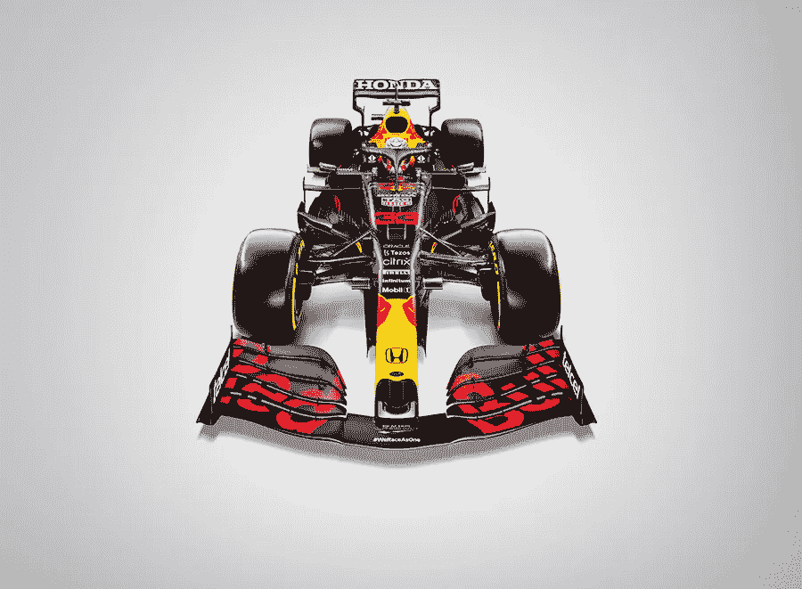

# 与红牛车队本田和甲骨文合作，通过赛车数据进行实验室教学

> 原文：<https://medium.com/oracledevs/team-up-with-red-bull-racing-honda-and-oracle-for-hands-on-lab-teaching-machine-learning-with-70eafcf78383?source=collection_archive---------6----------------------->

甲骨文邀请您在一个没有压力、对初学者友好的环境中使用其云平台 OCI 的比赛数据。

被恐吓是一件不舒服的事情。当你不是被一个人，不是被一个大的人生目标(为退休储蓄，有人吗？)，但是到了一门学科，就很难知道从何下手了。

更糟糕的是，推迟学习这件事会让你感觉很好，但会让你的处境更加不稳定。当你拖延时间的时候，其他人都在追赶，学科本身在发展，现有的文献和文档变得过时。

唷，我需要躺下来！

对于许多开发人员来说，机器学习(ML)是一件可怕的大事情。开发人员可能会对前端或后端情况的特定方面感到自在，但当涉及到机器学习时，涉足大数据的冰冻湖泊就足以成为留在岸上的理由。

这就是为什么我们为您提供与甲骨文和红牛本田合作的机会，加入一系列使用真实比赛数据教授机器学习的动手实验室。

这些实验，总共三个，从难度上来说是递进的。这意味着第一个实验室将面向没有机器学习背景的初学者，下一个会议将面向具有中级经验的开发人员，最后一个实验室将使用高级 ML 技术。没有 ML 经验的开发人员可以从第一个实验室开始，继续通过第二个和第三个实验室，这将很快公布。

目前，第一次实验将于 2021 年 8 月 11 日上午 8:00(太平洋标准时间)开始。在实验室期间，参与者可以在 OCI 注册一个[永远免费的 tier](https://www.oracle.com/cloud/free/) 账户。这个帐号提供了足够的火力来训练一个 ML 模型，并且为开发者提供了一个 OCI 帐号，他们可以在会话结束后使用。

注册了一个永远免费的等级账户后，与会者将会得到一份文件，他们可以按照自己的进度进行。虽然这些指南足以开始和完成对您的 ML 模型的训练，但 Oracle 数据科学家将随时待命，随时可以帮助回答任何问题。

如果你喜欢高速赛车，并且想开发机器学习算法，来和我们一起玩吧，看看它是如何工作的！

[报名链接](https://developer.oracle.com/redbull?source=:so:bl:or:awr:odv:::RC_WWMK210628P00062:Med[…]wr:odv:::RC_WWMK210628P00062:Medium&pcode=WWMK210628P00062)

**更新**

点击此处重新观看整个实验室: