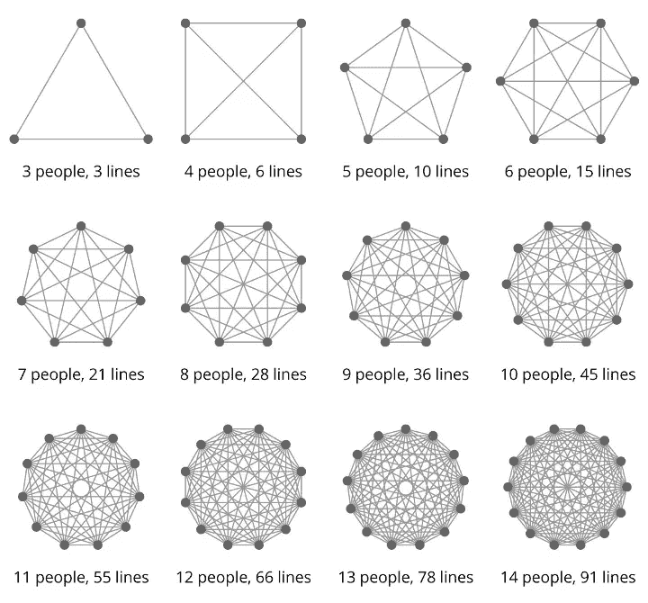

# 大规模的技术现代化—博客系列

> 原文：<https://medium.com/walmartglobaltech/tech-modernization-at-scale-blog-series-32165d0ea23c?source=collection_archive---------1----------------------->

Image credits: [Pixabay](https://pixabay.com/illustrations/technology-internet-network-data-3464633/)

平台重构计划有各种冠冕堂皇的术语——平台现代化、技术更新、敏捷转型和开发运维转型。这些计划的目标主要是重构系统和重组构建和操作这些系统的团队。这两者——团队和系统——之间的相互关系，没有比康威定律更简洁的表达了，它是基于梅尔文·康威的文章“委员会如何发明”

"*任何设计系统(广义定义)的组织都会产生一个设计，其结构是该组织沟通结构的副本"*

*康威*[T5【2】](https://en.wikipedia.org/wiki/Conway%27s_law#cite_note-Conway-2)*[*http://www.melconway.com/Home/Conways_Law.html*](http://www.melconway.com/Home/Conways_Law.html)*

*反之亦然——团队与系统一起发展，并被这样的系统所激活或限制。举一个开发单一应用程序的团队的例子。当团队开始构建一个新的应用程序来解决一个新的复杂问题时，这可能是有意义的。随着应用程序的成熟、扩展并开始托管多个复杂的用例，团队会努力处理这个整体，并尝试围绕应用程序以不同的方式组织自己。这种团队之间的沟通渠道成倍增加(见下图),因为他们努力协调工作，以确保他们不会踩到对方的脚趾。如果这样的团队在不同的地理位置，他们每天只有很少的时间见面和合作。*

**

*Photo Credit: [Lighthouse](https://getlighthouse.com/blog/developing-leaders-team-grows-big/)*

*任何低估——或者没有考虑到——团队和系统之间的相互依赖的“转换”计划从一开始就注定要失败。像我们这样的大多数公司，通过这些现代化计划，都以敏捷性为目标——如何在不牺牲质量的情况下提高吞吐量。因此，消除复杂的沟通途径，让团队尽可能独立地运行，是这项工作的核心。*

*回到巨石柱的问题，我们正在努力解决许多被它们压垮的应用程序。可伸缩性和稳定性随着每次变更而降低，维护开发和代码卫生变得不可能，因为团队处于不同的地理位置。更重要的是，团队努力增加甚至是很小的功能。*

*因此，我们开始进入“微服务”领域，这是破碎巨石的自然和最明显的选择。毕竟，如果我们将一个大的应用程序分解成更小的应用程序，并将它们分布在各处，我们就可以避免我们之前看到的通信混乱，不是吗？因此团队的敏捷性应该提高？遗憾的是，较少被理解为微服务的术语和架构风格更少。首先:*

*1.一个服务应该有多“微”才算是微服务——是每个服务一个操作吗？或者是每个服务一个业务实体？*

*2.服务应该基于技术能力还是业务流程来分解？*

*3.在分布式服务的世界中，您将如何处理数据一致性？数据一致性在任何时候都是必要的吗？*

*4.在一个庞大的相互依赖的服务网络中，我们如何观察失败？*

*5.我们如何防止一项服务的不可用或故障影响到许多其他服务？*

*6.服务可以彼此不同吗？我们如何在多语言环境中处理开发人员的经验？*

*当我们开始的时候，问题比答案多，我们犯了很多错误。我们陷入的陷阱帮助我们完善了我们的方法，因为我们在整块巨石上凿出了缺口。例如，我们从 monolith 中提取的第一批服务之一仍然与 monolith 共享相同的域边界。两个应用程序同时在同一个域实体上工作。补偿事务和传奇通常是解决分布式更新的良方，但在这里没有多大帮助，因为域边界是不正确的。我们还没有完全建立一个分布式的整体，但我们正在创建一个。*

*幸运的是，虽然有帮助:领域驱动设计(DDD)是识别清晰系统边界的关键工具——不仅在一个整体内部，而且在任何复杂的业务领域。有优秀的书籍和文章——Sam Newman 的构建微服务，Martin Fowler 的关于微服务的文章，举几个最受欢迎的吧。有无数的技术讲座、博客和文章是由不同的组织撰写的，它们都走上了同一条道路。我们采用了其中的一些知识来重新设计我们的应用程序和团队。*

*我们想分享我们重构系统的一些经验，并介绍一些指导原则和概念，这些原则和概念会让任何走这条路的人感兴趣。我们打算在未来几周写一系列博客，主题如下。这些主题绝非详尽无遗，但我们旨在讨论一些重要的事情，假设读者将进一步探索它们。我们可能还会忽略一些构建和管理分布式系统的有据可查的概念。例如，公平地说，登录单个机器来查看日志的日子已经一去不复返了。如果没有集中的日志和警报，构建分布式系统将毫无意义。虽然我们可能会强调我们是否以及如何偏离了群体，但我们可能不会详细讨论这些记录良好的概念。但是我们打算讨论一些有争议的话题，比如一个合适的 CI/CD 管道是什么样子，什么样的标准和实践是值得强制的，微服务世界中测试的界限，以及连续交付，等等。*

*[**构建领域驱动的微服务**](/walmartlabs/building-domain-driven-microservices-af688aa1b1b8) —在本系列的第一篇博客中，我们将讨论微服务的总体情况，以及开始构建微服务时需要采取的一些初步措施。我们将讨论领域驱动设计如何帮助划分服务边界，并实现服务和团队之间的低耦合。我们还将介绍一些重要的设计启发、方法和设计微服务时要注意的陷阱。*

***为敏捷性设计应用程序—** [**第 1 部分**](/walmartglobaltech/implementing-cart-service-with-ddd-hexagonal-port-adapter-architecture-part-1-4dab93b3fa9f) **和** [**第 2 部分**](/walmartglobaltech/implementing-cart-service-with-ddd-hexagonal-port-adapter-architecture-part-2-d9c00e290ab) **:** 我们生活在一个每天都在发生变化的世界，我们的应用程序需要跟上这些变化的步伐。可重构性、模块化和可测试性应该是我们应用程序设计的核心。我们涵盖了领域驱动设计的一些概念——注意，DDD 在微服务成为事物之前就存在了——比如无处不在的语言、揭示意图的接口、反腐败层，以及非贫血的领域模型。我们还将在另一种有用的应用程序分层方法的上下文中探讨这些——[端口和适配器](https://alistair.cockburn.us/hexagonal-architecture/)模式*

***加速软件交付和组织绩效:**我们将探索以提高敏捷性的方式联合团队和系统——也称为[逆康威策略](https://www.thoughtworks.com/radar/techniques/inverse-conway-maneuver)。我们还将讨论采用 DevOps 文化如何转变建筑和 SRE 等功能。我们还将讨论重要的度量标准——代码质量、检测故障的平均时间、恢复的平均时间，等等——我们可能希望测量和跟踪这些度量标准，以确保我们不会偏离正确的道路太远。*

***现代应用程序的 CI/CD 实践:**现代应用程序必须为企业提供一种在不影响质量的情况下更快实现价值的方式——快速行动，但不要破坏东西。这种敏捷性需要持续的交付流程和工具，不仅能够安全地交付变更(自动运行所有必要的测试)，还能提供安全网，在生产中发生意外故障时减小爆炸半径。理想情况下，我们希望将每一个承诺部署到生产中，通过所有的质量关，并测量和保护重要的卫生指标——开发和部署卫生。*

***支持持续交付的测试策略和工具:***

*持续地将每个变更集部署到生产环境中，只需要足够的测试来确保测试下的服务按预期工作，但是多少才够呢？换句话说，服务的测试边界是什么？这个服务的依赖性和依赖这个服务的任何消费者又如何呢？尽早获得反馈也很重要，最好是在开发人员的机器上使用 mocks 和 stubs。—如今，左移测试相当流行——但我们可能还想在实际的基础设施中运行一些高级测试:端到端测试、性能测试和任何弹性测试。有时，在生产中进行测试可能是唯一的选择。我们还讨论了如何使用黄金数据集来避免不可靠的测试。*

***设计高可用性:***

*随着应用程序变得越来越分散，一个失控的应用程序很容易完全瘫痪平台；因此，当我们设计微服务及其交互时，容错和弹性至关重要。我们还将讨论各种流量整形模式和安全措施，这些模式和措施有助于服务及其消费者应对意外故障模式。*