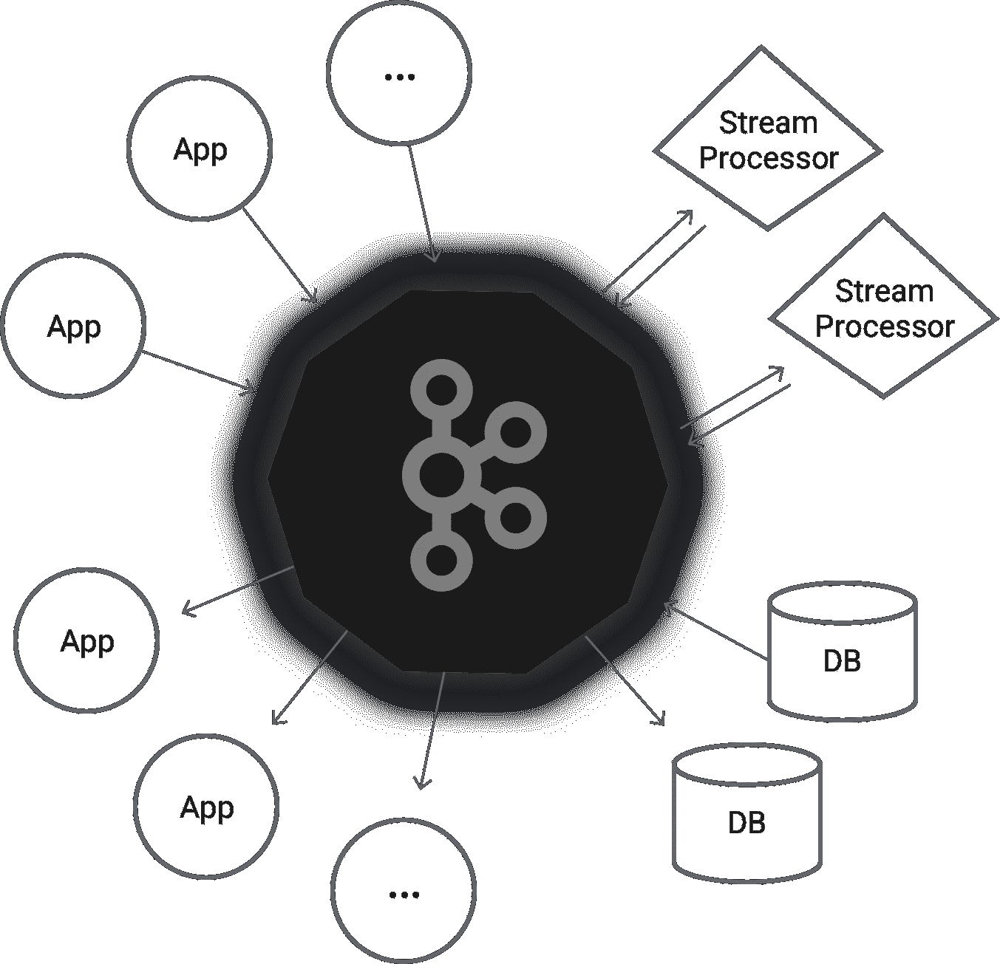
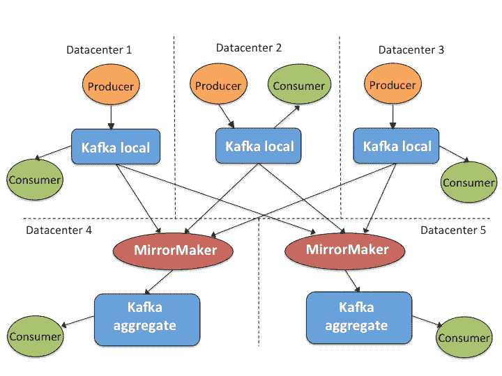

# 技术转型:沃尔玛的实时信息传递

> 原文：<https://medium.com/walmartglobaltech/tech-transformation-real-time-messaging-at-walmart-8787f5ab19e8?source=collection_archive---------1----------------------->

Photo Credit: [Apache Kafka](https://kafka.apache.org/)

[据报道，许多顶级组织](http://www.zdnet.com/article/ten-companies-where-soa-made-a-difference-in-2006/)受益于[面向服务的架构](https://en.wikipedia.org/wiki/Service-oriented_architecture)(SOA)[沃尔玛也基于 SOA 和弹性云](http://www.walmartlabs.com/2015/02/why-we-chose-openstack-for-walmart-global-ecommerce/)重建了其电子商务网站(walmart.com)。SOA 的一个重要子集是**消息驱动的**架构，它作为异步通信的通道来分离捆绑的组件。结果是一个更加可扩展和高效的体系结构，其中每个组件或服务都可以通过消息传递平台与其他组件或服务进行通信来独立制作和扩展。

传统的消息队列曾经是消息驱动架构的解决方案，但是当涉及到处理大规模的时候，它已经变得有一种内在的缺陷。

Photo Credit: [Apache Kafka](https://kafka.apache.org/)

当我们审视当今的高吞吐量消息传递解决方案领域时， [Apache Kafka](http://kafka.apache.org/) 已被证明是最佳选择，因为它是一个高度可伸缩、持久和分布式的消息传递系统，单个 Kafka 消息代理每秒可以处理来自数千个客户端的数百兆字节的读取和写入。Kafka 已经被许多硅谷科技公司高度采用，如 Twitter、网飞、LinkedIn、优步、Airbnb、Pinterest，以及硅谷以外的大型 IT 公司，如 Cerner 和高盛。[这里](https://cwiki.apache.org/confluence/display/KAFKA/Powered+By)显示了著名的 Kafka 用户列表。

[沃尔玛](http://www.walmartlabs.com/)[沃尔玛](https://www.walmart.com/)的技术部门沃尔玛实验室，从两年前开始就在许多不同的用例中使用 Kafka。在这篇博客中，我们将介绍早期的 Kafka 用例，Kafka 部署模型的转变，以及从这一转变中吸取的教训。

# 早期

经过数月的调查，甚至考虑编写我们自己的信息系统，Kafka 于 2014 年初被沃尔玛采用。主要的用例是我们的跟踪像素 feed，为此我们使用了一个定制的 Apache Flume fork[和一个简单的共享 TCP 流服务相结合，该服务是为下游的实时应用程序设计的。](https://flume.apache.org/)

另一个用例是我们的应用程序日志收集服务，它也使用了 [Apache Flume](https://flume.apache.org/) 。在这两种情况下，我们对性能、灵活性、缓冲能力和弹性都不满意。

当时，Kafka 几乎没有交付保证的意识，Kafka 的大部分使用只是因为它的高吞吐量和低延迟对他们来说已经足够好了，即使在极少数情况下可能会有少量的消息丢失。

# 裸机上的共享卡夫卡

我们从部署在裸机服务器上的几个独立 Kafka 集群开始，并迅速扩展到遍布各州的 7 个地理数据中心。

在七个数据中心中，有五个是只包含本地消息的“本地”Kafka 集群。有两个“聚合”集群，每个集群位于不同的 DC 中，用于冗余。我们使用 [Kafka MirrorMaker](https://cwiki.apache.org/confluence/pages/viewpage.action?pageId=27846330) 从本地聚合消息到聚合集群。

Shared Kafka Deployment on Bare-metal with Redundancy

一些应用程序只关心单个 Kafka 集群中发生的事情，因此它们只从本地集群中进行消费。许多其他应用程序需要全面了解所有数据中心的情况，因此它们从聚合集群中进行消耗。

所有 Kafka 集群都由一组运营人员维护，希望使用 Kafka 服务的应用程序团队(也称为租户)可以独立创建他们的主题，插入他们的生产者和消费者，然后开始通过 Kafka 集群发送他们的消息，因此这种模式被称为“共享”Kafka。

在运行 Kafka 的第一年，集中管理和共享的 Kafka 模式对 Kafka 租户和运营团队都非常有效，因为:

1.  *Kafka 租户不必担心硬件容量和 Kafka 日常运营，他们可以专注于自己的应用程序开发。*
2.  Kafka 租户的数量并不多，而且每个租户发送的消息量都是受控的，因此租户仍然可以享受足够好的吞吐量，即使与他人共享硬件容量。
3.  *租户对 Kafka 的期望不过是一个高吞吐量的消息传递系统。在极少数情况下，Kafka 经历了短暂或极少量的消息丢失，大多数应用程序可以容忍由于非关键业务用例或在自己的流程中处理糟糕的情况。*

然而不久之后，随着越来越多的租户迁移他们的应用程序并依赖 Kafka，共享 Kafka 模式开始遇到越来越多的阻碍:

1.  *争夺容量:如果一个租户对一个共享的 Kafka 集群产生流量高峰，其余的 Kafka 租户将立即受到影响。*
2.  缺乏认证:任何租户都可以向其他租户的 Kafka 主题发送消息，甚至更糟，错误地更改或删除它。
3.  *“漏洞百出”的客户端:租户在 Kafka 客户端实现中的软件漏洞可能会耗尽 Kafka 资源，并阻止其他团队连接到 Kafka。*
4.  *没有“一刀切”:Kafka 租户开始设定不同的期望，从配置、集群可用性到消息交付的可靠性，因为 Kafka 本身随着时间的推移已经成为一个成熟的生产就绪项目。*

不可避免的是，随着越来越多的租户开始使用共享 Kafka 模式并计划将其用于关键业务，该模式变得效率低下。从那时起，我们开始寻找更高效的 Kafka 部署和运营模式，OneOps 进入了我们的视野。

# 由云和 OneOps 支持的自助式 Kafka

[OneOps](http://www.oneops.com/) 是一个由 WalmartLabs 开源的[多云和应用生命周期管理平台。在上游，OneOps 可以协调应用模式/包，以便在整个生命周期中进行配置、操作和管理。在下游，OneOps 可以将任何应用模式部署到主要的公共云和私有云提供商，如](https://techcrunch.com/2016/01/26/walmart-launches-oneops-an-open-source-cloud-and-application-lifecycle-management-platform/) [OpenStack](https://www.openstack.org/) 。

[沃尔玛一直采用 OpenStack](https://www.openstack.org/summit/vancouver-2015/summit-videos/presentation/walmart-and-039s-cloud-journey) 作为其电子商务业务的计算骨干，而[连接 OpenStack 和应用的桥梁是 **OneOps**](http://www.zdnet.com/article/walmarts-oneops-open-source-cloud-management-platform-could-become-part-of-openstack/) 。受 OneOps 产品的启发和激励，我们开始将 Kafka 从共享裸机部署过渡到面向云的**分散自助式**部署。

OneOps 培养了真正的 DevOps 文化，其中一部分意味着通过 OneOps 提升服务的团队应该对其整个生命周期事件负责，例如添加容量、微调配置、升级/修补以及在需要时反弹服务。这种新的 OneOps(自助服务)模型允许 Kafka 用户通过 OneOps 定制和部署自己的 Kafka 集群，方法是使用生产驱动的 Kafka“OneOps pack”。自助服务模式的商业价值可以概括为:

它更加面向业务:每个团队部署并拥有自己的基础设施和服务，以满足业务目标和期望，而不是共享的集群和服务。

通过使用 Kafka pack，它不仅可以自动部署和配置 Kafka 集群，还可以为 Kafka 提供 GUI。GUI 托管操作功能和性能监控，提供涵盖大多数 Kafka 日常操作任务和全面的 Kafka 级和服务器级性能指标的“一站式”体验。此外，Kafka pack 可以在出现问题时通过 OneOps 提醒用户，例如 Kafka 进程停止、分区复制不足、leader 丢失、磁盘空间不足、CPU 利用率非常高。

通过采用自助式 Kafka 模型，应用程序团队现在可以完全控制操作、容量和配置调整，从而保证专用资源的性能。监控和警报大大增强了 Kafka 支持的消息服务的可见性和生产就绪性。

# 从过渡中吸取的经验教训

自助式模型有助于应用程序团队快速、轻松地拥有和操作 Kafka 集群。与此同时，它也给 Kafka 集群所有者和 Kafka pack 开发者带来了新的挑战:

**卡夫卡集群主人**:学习适应新的自助模式和 DevOps 文化。当从第一天开始拥有 Kafka 集群时，他们负责操作和监控它，特别是学习如何快速处理常见故障并在影响最小的情况下恢复。

**Kafka 模式/包开发者**:提供健壮的、高度可用的、可伸缩的 Kafka 部署策略。例如，Kafka pack 利用了 OneOps 的“自动驾驶”功能，它可以自动修复坏节点，在自动修复失败时自动替换它，并在负载达到预定义的阈值时自动扩展 Kafka 集群。

运行自助式 Kafka 集群的成功取决于所有者和开发者之间的密切沟通和协作。开发人员不仅负责开发和支持该包，而且还是 Kafka 的内部专家，所有者可以咨询任何 Kafka 技术问题，包括最佳实践、部署策略、配置调整甚至 Kafka 生态系统的构建。

反过来，开发人员也从所有者的日常操作中获得有价值的反馈，并在下一次迭代中对其进行概括以改进 Kafka pack。这将形成一个积极的循环，令人满意地积累最佳实践，并将它们反馈给现有的和新的所有者。

# 摘要

这并不是我们 Kafka 故事的结尾:更多的技术细节可以在部署策略、内部 Kafka 分叉、监控管道和跨数据中心的高可用性上分享。

请继续关注关于卡夫卡的深度解读！

推特: [@ningZhang6](https://twitter.com/NingZhang6)