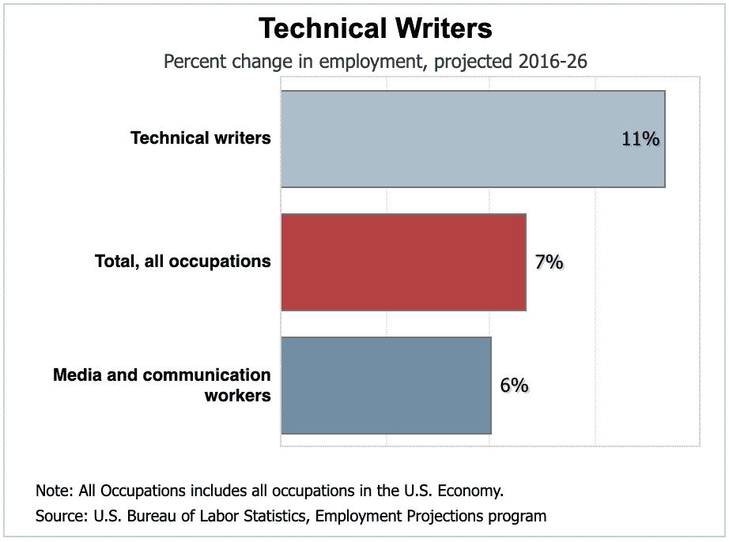
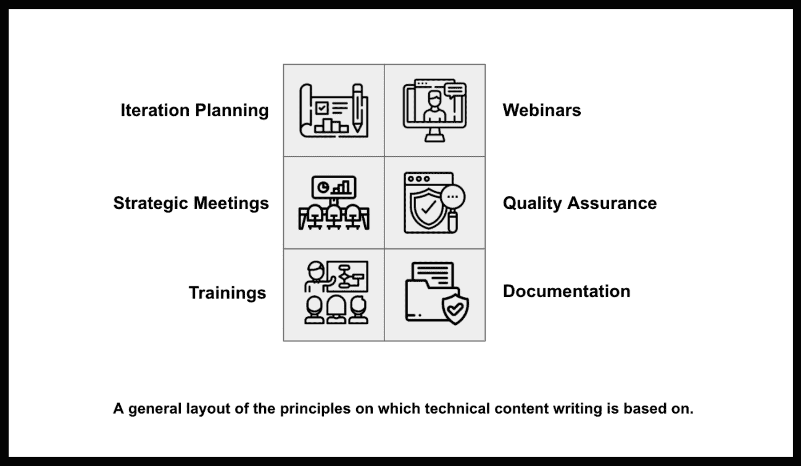

# 技术写作:当务之急？

> 原文：<https://medium.com/globant/technical-writing-need-of-the-hour-999e236f9937?source=collection_archive---------1----------------------->

了解技术内容写作如何成为 2021 年增长最快、要求最高的技能之一…

“Brevity is pivotal to clarity”. You have to be clear and crisp when it comes to communicating, strategy and writing.

当你听到有人说，“*我是一名技术作家”或*”*我的职责包括撰写技术内容*时，你明显的反应会是把自己拉回来，好像这不寻常。许多人认为，技术写作并不像作家想象的那样有创造性，因为人们认为创造性和技术是不可同日而语的。

从某种意义上来说，技术写作的确是建立在分析技巧和批判性思维的基础上的，人们不会喜欢直接阅读这样的文章，但是技术写作有一个全新的概念，它正在以非常快的速度发展和流行，并且需求量很大。

所以问题是为什么技术写作在技术中成为一个热门话题？根据**美国劳工部的统计，**相对于其他职业的总体平均水平，技术含量写作的就业将增长 11%。

*来源:美国劳工统计局*

嗯，技术写作是市场上增长最快的工作。随着随后几年电子学习平台和网络应用的兴起，对技术写作者的需求以一个没人相信会发生的更快的速度增长。

技术写作增加的第二个原因是技术产品的增加，如基于网络的新技术、软件和服务，正在快速发展。

随着新技术和新产品的出现，需要交流专家来传达深入的信息，也需要设计师来引起更多人的兴趣。

# **什么是技术写作？**

技术写作与知识转移的过程相关，并且是特定于技术的。如果你按照维基百科上的定义:

**“技术写作者是一个专业人士，他的任务是通过最好的方式和媒介在两个或多个实体之间提供知识转移。”**

The principles on which technical writing relies, plays an important role.

# **技术写手到底是做什么的？**

技术写作更多的是一种面向用户的方法。它意味着简化产品或服务的复杂的、技术性的方面和特征。换句话说，技术作家准确地解释先进的技术和相关的概念，以便用户能清楚地理解它。

精通技术的作者能够以高效的方式创建、编辑、提炼和改进内容。技术写作者从各种来源收集信息，从技术部门到组织的销售部门。

除此之外，分析受众和创建文档的目的在技术写作中非常重要。这包括彻底的研究，校对和内容监管。

# **使用技术内容写作的一些媒介:**

1.  面向主题的参考文档
2.  用户手册
3.  白皮书
4.  设计规范
5.  项目计划
6.  软件测试手册
7.  在线培训材料

# **需要技术含量的写手:**

*据《福布斯》报道，“电子学习是未来——毋庸置疑”*。据估计，到 2025 年，全球电子学习市场将达到 3250 亿美元(研究和市场)。

随着电子学习平台和网络应用的兴起，对技术写作和信息便捷流动的需求越来越大。

进一步补充一点，虽然电子学习正在塑造行业，但平台共享的知识必须是建设性的，以便向初学者和专家传达信息和共享知识。

此外，随着技术和产品走向完全自动化，对熟练劳动力的需求呈指数增长。随着熟练劳动力的增加，传播新技术和对个人进行特定技能培训的重要性变得势在必行。

因此，技术写作专家的需求空前高涨。

# **结论:**

幸运的是，技术写作不仅仅取决于作者起草信息的创造性。但与此同时，人们不能否认创造性在科技写作中的重要性。首先，这取决于作者如何让读者更容易理解技术信息。

随着统计数据显示对技术作家的需求明显上升，现在是将这种职业视为主流职业的时候了。

确定需求并提高你的技能，以塑造你的科技写作生涯。技术写作是一个很有前途的职业，你可以帮助联系企业和人们，帮助他们了解可以提高企业绩效的产品和服务。

**。。。**