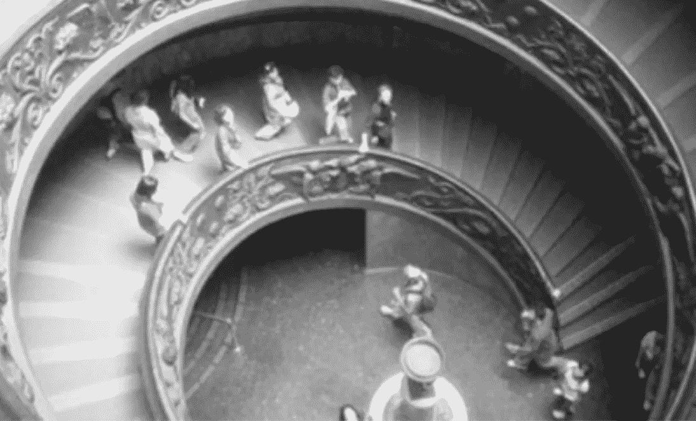
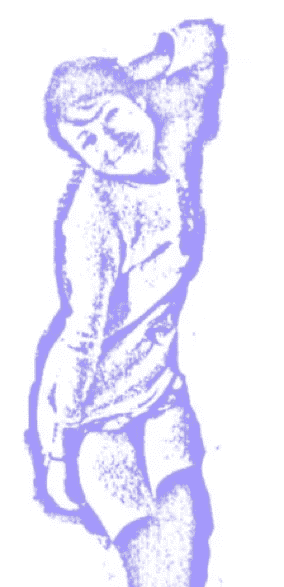
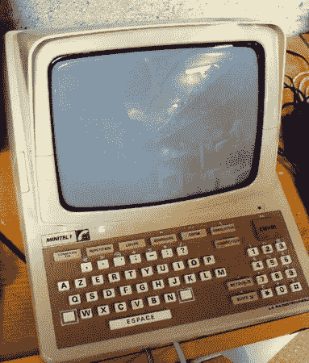

# 技术和社会变革

> 原文：<https://medium.com/capital-one-tech/technology-social-change-ff75e1eb1dee?source=collection_archive---------0----------------------->

## 历史的五个教训

> 当我们创造一项新技术时，它将如何被使用？它的社会影响会是什么？它将如何改变我们生活的世界？随着新技术塑造我们的社会和经济互动，无论是作为生产者还是消费者，我们的社会责任是什么？

如果你是一棵巨大的红杉树，观察人类五百年，也许你会发现人类既有趣又可预测。演员变了，但情节不变。这就是我们在回顾技术和社会变迁的历史时所看到的。历史让我们洞察我们所居住的世界，让我们更批判性地理解它，并为未来做出明智的规划。因此，我们可能会问，关于我们是谁，关于技术，关于我们的未来，历史告诉了我们什么？

# 第一课:历史是循环的

***你不一定是发明，甚至是彻底发明，轮子***

在现代互联网发展的一百多年前，我们见证了第一个“全球通信网络”的诞生——洲际电报。洲际电报是一个由电报、气压管和信使组成的广泛网络，用于连接“文明世界”的几乎每个角落，在当时是革命性的。

当时的流行杂志对洲际电报进行了描述，使用了令人惊讶的现代术语和概念。*它“跨越了大陆和海洋，”* *“革新了商业，”*并促进了*“平等和相互理解。”* Tom Standage 阐述道:

> 在维多利亚女王统治期间，一种新的通信技术被开发出来，使得人们几乎可以在很远的距离上即时通信，实际上比以往任何时候都更快更远地缩小了世界。一个全球性的通信网络，其电缆横跨大陆和海洋，它彻底改变了商业惯例，产生了新的犯罪形式，并使其用户淹没在信息洪流中。浪漫在电线上开花。一些用户设计了密码，另一些用户破解了密码。网络的好处被它的支持者无情地大肆宣传，而被怀疑者摒弃。政府和监管者试图控制这种新媒体，但都失败了。从新闻采集到外交，人们对一切事物的态度都必须彻底反思。

[汤姆·斯坦迪奇《维多利亚时代的互联网》](https://www.amazon.com/Victorian-Internet-Remarkable-Nineteenth-line/dp/162040592X)

这种语言在当今世界感觉非常熟悉。当我看到 19 世纪 80 年代后期的修辞和今天的修辞之间的相似之处时，我觉得这令人吃惊和怪异。这就像一部电影，主角一遍又一遍地过着同一天。互联网曾被称为信息高速公路，电报曾被称为思想高速公路，T2。在过去的一百年里，似乎没有太大的变化，点和破折号仅仅被 1 和 0 所取代。

然而，从另一个角度来看，如果我们从相同的成分开始，为什么我们应该期待不同的输出？T4:利用人类，加上网络技术，可预测的模式将会出现。

我们知道，通信技术颠覆了传统的商业模式，改变了社会互动模式。向上流动的新技术工人阶层出现了，一些行业适应了，而另一些行业灭绝了，社会相应地反应和收缩，这些希望和恐惧以类似的言辞表达，而不管技术如何。

1884 年，当代杂志宣称，我们被告知，新通信技术带来的*“情感和思想的快速交流”将把社区‘编织’在一起，并将‘消灭距离、隔离和偏见’这些新的通信技术被视为改造现代社会的变革力量。*

在过去的 130 年里，似乎没有什么变化，因为这些基本观点仍然存在。听你平均的技术主题演讲，数一数*【改变】*(如《改变世界》)*【第一】**【革命性】**这些词出现了多少次。在最近的一次会议上，我把这些词数了 43 次。但让我们不要不公平；从电脑到电话以及其他，科技已经改变了世界。*

然而，有多少智能手机消费者知道第一个现代的、被公众采用的互联网是在法国创造的，或者智能手机革命起源于日本，而不是硅谷。毫无疑问，新技术具有变革性——事实上，人类历史的很大一部分是由技术和变革的故事塑造的——但我们应该小心，不要认为我们在追赶最新的技术潮流时是在重复发明轮子。

# 第二课:虚拟世界是现实世界的延伸。

***人们在虚拟空间建造房屋，因为这是人类做的事情***

无论我们在网上看到哪里，我们都看到人类在做非常人性化的事情——他们做生意、与他人互动、学习新事物、享受美好的娱乐、参加体育运动和游戏、恋爱等等。用霍华德·莱茵戈尔德的话说，我们目前正在电子前沿安家落户。虽然互联网对许多人来说意义重大，但它必须首先被理解为我们人类的延伸，是我们生活方式的延伸。我们仍然阅读体育版，购物和娱乐——现在我们只是在网上这样做。如果网上生活不是由人类动力驱动的，那将是一个非常奇怪的地方，真的！

那么人们为什么要在虚拟空间里盖房子呢？因为如果互联网不是真实的反映，它对我们来说就没什么用了。随着我们在虚拟空间花费越来越多的时间，随着虚拟世界的重要性增加，它变得更加紧密地融入日常生活和活动。无论我们谈论的是工作、社会交往、政府还是法律，现实和虚拟正在合二为一。

举例来说，在互联网的早期，人们会问网上关系是否真实(就像他们问电话一样)。但是今天我们明白了，当然，它们是真实的！越来越多的人使用约会和寻人应用来追求他们。曾经被认为是虚拟的，或者在某种程度上是不真实的，随着时间的推移成为普通生活的一部分。

当新的通信技术融入到日常生活的结构中时，它们就成为我们使用的延伸、增强或集成工具。虚拟世界仅仅是我们自己的延伸。

# 第三课。人类会利用一项技术来达到自己的目的。

***给一个孩子两个纸杯和一些细绳，他们就能打电话***

人们总是会为了自己的最大利益而使用一种技术。无论是商人还是少年；或者更笼统地说，好莱坞、华尔街、华盛顿或硅谷。如果你想知道一项技术将如何被使用，你只需要问，“人们想要什么？”

因为通信技术挑战传统的界限和制度，我们经常看到那些寻求利用技术加强界限和那些希望打破界限的人之间的猫捉老鼠的游戏。举例来说，电话挑战了家庭、阶级和种族的传统界限，因为不再需要面对面的交谈。我奶奶转述**、**、*“如果你光着身子在洗澡的时候电话响了，你问自己，你能接吗？你毕竟是裸体的。”*

随着电话的发明，引用[卡洛琳·马文，](https://www.amazon.com/When-Old-Technologies-Were-Communication/dp/0195063414) *的话来说，“有些人突然离得太近，而另一些人又离得太远……其后果在电气文献中不知疲倦地展开。”电话提供了一种社会交往的选择，即使是陌生人之间，也可以按需进行，无需仪式、介绍或证书。新的通信技术可以用来与家人和朋友联系。或者，正如早期的电话广告所强调的那样，*“让一个人与杂货商、肉商、面包师立即取得联系。”**

一些专家对互联网作为社交媒体的早期成功感到惊讶，但他们不应该感到惊讶。人们将迅速采用和适应新技术，以追求他们的需求。而在今天的互联网上，社交需求已经凸显出来。即使在最没有人情味的环境中，人类也会建立关系。成功的团体——甚至是虚拟社区——需要对个人和团体身份的投资。然而，社会动态很难预测或控制，即使是计划最周密的虚拟社区或技术也可能陷入混乱。通过了解群体互动和在线行为模式，我们对构建可用的以社区为中心的虚拟环境有了更深入的了解。

# 第四课:技术天生具有破坏性

***把一台电视机扔进一个偏僻的村庄比喻***

西格蒙德·弗洛伊德在《文明及其不满》中反思道:“如果没有铁路来跨越距离，我的孩子永远不会离开他的家乡——我不需要电话来听到他的声音……”

随着电话的发展，出现了新的商业模式和专业化程度的提高。当客户可以简单地打电话给远在一栋大楼里的专家时，就不再需要成为一个多面手了。这改变了城市的天际线，促进了摩天大楼和郊区的诞生——它们的建设超出了街道(眼睛)的高度，超出了步行城市中心的便利。

> 说贝尔和他的继任者是现代商业建筑——摩天大楼之父，听起来可能很可笑。但是等一下。以辛格大厦、熨斗大厦、交易所大厦、三一大厦或任何一座巨型办公楼为例。你认为每天会有多少信使进出这些建筑？假设没有电话，每条信息都必须由私人信使传递。你认为必要的电梯会为办公室留出多少空间？这种结构在经济上是不可能的。

约翰·j·卡蒂是贝尔实验室的第一任负责人，1908 年

但如果有一个理解技术和变化的隐喻，那就是西方电视的引入，因为它传播到了全球文化和地理上偏远的村庄。拿一台电视，放在一个偏远的村庄，你会看到戏剧性的文化变化。人们将开始模仿他们在电视上看到的演员，经常挑战传统的做事方式。人们将开始对足球、名人、全球事件和当代时尚产生更大的兴趣，而不再关注本地和地区利益。

技术挑战“旧方式”，无论我们谈论的是商业模式还是曾经偏远村庄的消费模式:

*   挑战传统的规则和界限。
*   破坏现有的商业模式和机构。
*   改变我们如何度过时间，我们如何娱乐，我们如何做生意，以及我们如何与他人互动。

# 第五课:当我们讨论如何使用技术时，重要的问题出现了

***是否存在严格的技术决定论***

1905 年,《电话技术》杂志反映,*“新机器、设备和流程的发明不断带来新的法律问题，困扰着法官、律师和外行人。”*

20 世纪 70 年代，对通信技术持怀疑态度的法国政府通过创建第一个现代互联网来应对新兴的网络通信。同时保持对内容的严格控制。然而，令法国政府惊讶的是，这个用于网上购物和火车订票(以及其他功能)的系统被“黑客”用于不太被认可的用途。

随着任何新通信技术的发展，都有一个关于如何“使用、设计和理解”该技术的协商过程手机是青少年用来会见朋友的工具，还是父母用来跟踪和监视同一个孩子的工具？

我们今天在互联网上看到了这种情况——对身份盗窃和隐私、在线欺凌、数字版权管理、加密货币等的担忧。这些问题可以从如何使用和理解技术的角度来理解，既可以从社会边界的角度来理解，也可以从对 1 和 0 的控制的角度来理解。

如前所述，技术变革自然是破坏性的。虽然它挑战传统的界限和制度，但随着技术塑造社会、经济和政治生活，它也可以用来建设一个更美好的世界。新技术正导致人类活动各个方面的重大变化。只有通过批判性地思考这个世界——无论是虚拟的还是真实的——我们才有希望明智地规划未来。

世界会变成什么样子？严格的技术决定论是不存在的，这取决于我们。

# 最后:

> “当生活就是坐在扶手椅上按下按钮时，我们正危险地接近现代乌托邦的理想。这不是一个理想的前景；我们将没有钱，没有野心，没有青春，没有欲望，没有个性，没有名字，没有智慧。”—电工，1892 年

如果这篇文章让你想起了三件事，我希望是:

*   **历史是周期性的。**
*   **把一台电视机扔进一个偏远的村庄，比喻理解技术和变化。**
*   未来取决于我们在协商如何使用、设计和理解技术时所做的选择。

虚拟现实和增强现实等新技术将导致人类活动各个方面的重要变化。我们可能会看到什么？对人际交往模式会有什么影响？对更大的社会会有什么影响？

无论答案是什么，都要为新兴技术带来的破坏性社会、经济、政治和文化变革做好准备。随着我们继续将现实世界的规范和实践扩展到虚拟现实中，历史告诉我们要寻找:

*   **电话的人际功能。**
*   **电视机的广播功能。**
*   **虚拟制造。**
*   **宅基地行为。**

如果历史给我们任何启示，我们可以在这个清单上增加第五个项目。

*   下一代很像我们，会忘记过去的教训。

— — — — — — — — — — — — — — — — — — — — — -

Mychilo Cline 是 Capital One 的软件开发人员，拥有人机交互/技术和社会的研究生学位，是《权力、疯狂和不朽:虚拟现实的未来》和《帝国的衰落:数字权利管理、虚拟权利》的作者。

声明:这些观点是作者的观点。除非本帖中另有说明，否则 Capital One 不属于所提及的任何公司，也不被其认可。使用或展示的所有商标和其他知识产权都是其各自所有者的所有权。本文为 2017 首都一。