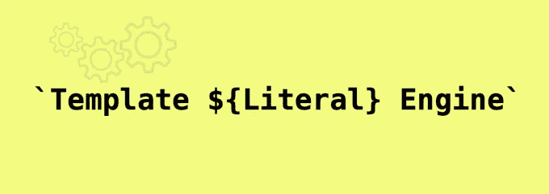
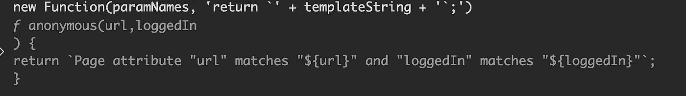

# 模板文字引擎

> 原文：<https://medium.com/walmartglobaltech/template-literal-engine-87e98f3c1f49?source=collection_archive---------0----------------------->

这篇博客是在吉恩·潘的帮助下共同撰写的

随着 ES6 中模板文字的引入，在 JavaScript 中构建字符串模板得到了极大的改进。但是以正确的方式构建模板可能需要一些思考，甚至会带来挑战。

当在**沃尔玛全球技术**建立我们的 A/B 实验平台时，其中一个关键特性是识别用户*何时有资格*进行实验。一个*合格的*用户被定义为一个被分配到实验中的人，他看到了(据我们所知)正在进行实验的那部分场地。为了确定用户是否合格，我们需要通过一组预先确定的标准从我们的网站(Walmart.com)或我们的本地应用程序查询数据。这个预先确定的标准是在实验设置阶段建立的，并且是查询表达式的形式(类似于 SQL)。这些表达式可能会变得非常复杂，任何熟悉构建 SQL 查询或标量函数的人都可以证明这一点。此外，表达式中的属性由外部系统定义，即。网站/本机应用程序，因此可能会在我们的应用程序控制之外发生变化。

这给我们提出了两个需要解决的挑战。首先，我们需要*将*查询表达式模板化，使值可以被替换。其次，我们需要将这些模板存储在配置文件中的代码库之外。

## Con+cat+enation

JavaScript 中的字符串串联从来都不怎么好。当试图使用字符串连接来构建模板时尤其如此。

> const 形容词= "棒极了"；
> 
> "字符串串联不是一种“+形容词+”的方式来构建模板."

如果你曾经试图构建一个字符串模板，并且你做了其中的一个，*" SELECT "+fields+" FROM "+table*，你很快就会意识到这个设计的伸缩性有多差。原来 JavaScript 有一个很棒的语法，可以帮助我们解决使用模板文字的第一个问题。

## 模板文字

模板文字在 JavaScript 中是一个很棒的构造，尤其是在构建复杂的字符串时，比如查询字符串或多行字符串。JavaScript 中的模板文字是插值字符串，这意味着它们允许字符串中有变量，JavaScript 引擎将用值替换这些变量。插值的最终结果是一个字符串。

> ` Template literal 是构建模板的一种$ {形容词}方式。'

模板文字本身不是字符串类型，因此在 JavaScript 环境之外不受支持，例如在 JSON 文件中。为什么最后一部分很重要？

## 配置

几乎所有的应用程序都使用配置文件来存储运行时代码之外的数据。无论是初始化应用程序、保护 API 令牌还是存储运行时标志。如果我们的应用程序使用 JavaScript 配置文件”。js“那么我们的故事就到此为止了，因为我们可以将可配置的模板文本直接放入文件中。然而，许多应用程序利用 JSON 文件来存储配置，就像我们的 A/B 实验工具一样。

> 提示:不要让 JSON 中的 **JS** 迷惑了你，它是独立于语言的。

JSON 是许多编程语言和架构中广泛使用的数据结构。因为它是语言不可知的，所以它只支持数据类型 text。

## TempLitSON？

这就引出了我们的第二个问题。如果模板文字是 JavaScript 的构造，而 JSON 只支持文本，那么我们如何在 JSON 中存储模板文字配置呢？

> 显而易见的答案是:将其存储为一个字符串

JavaScript 又有了两个方法来计算对象或函数的字符串，甚至…模板文字！那么这些神奇的选项是什么，我们如何选择最好的一个呢？

*   eval 危险，因为它打开了安全漏洞，性能不佳，并且*非常不鼓励*
*   函数构造器——小的安全问题取决于它的使用方式，比 *eval* 的性能好一点，全局范围，即。不是构造它的函数的词法

JavaScript 中的函数构造函数让我们创建一个新的函数对象，传递一个字符串作为函数体。稍后将详细介绍。

> **新函数(' a '，' b '，' return a+b；));**

## 发动机

因为函数体是求值的，所以它可以是字符串、对象或模板文本。通过利用函数构造器的这一特性，我们创建了模板文字引擎。我们通过让我们使用模板文字*和*构建复杂的查询，让我们将模板作为字符串存储在我们的配置 JSON 中，从而解决了上述两个挑战。

> 我们利用模板文字的力量，同时将外部逻辑抽象成一个配置。

## 让我们看看它的实际效果

*以下演练和代码示例由* [*Jean Pan*](https://www.linkedin.com/in/jeanpan/) 提供

## **第一次尝试:字符串连接**

string concatenation example

上面的代码显然是有效的，但是如果字符串很长，用单引号和双引号将字符串括起来会变得很笨拙，你需要对引号进行转义。这很容易出错，尤其是当有更复杂和更长的字符串时。

> 我们能做得更好吗？

## **第二次尝试:字符串插值**

模板文字提供了一种简洁的方式，允许我们操作字符串文字，并且易于阅读。要使用模板文字，只需将字符串文字用反斜杠括起来。有了它，我们可以像这样重构我们的函数:

string interpolation example

当使用 url = "www.walmart.com "调用该函数时，它会将 *${url}* 替换为参数 URL“www . Walmart . com”，并返回结果如下:

> ***页面属性“网址”应与“www . Walmart . com”***相匹配

将字符串中的占位符 *${url}* 替换为值“www.walmart.com”的过程称为字符串插值。

因为它是用反斜线包装的，所以可以在模板文字中使用单引号或双引号，不再需要难看的转义反斜线了！

## **第三次尝试:带动态函数的模板文字**

上面的代码可以工作，但是缺乏灵活性。如果查询依赖于外部变量，就像我们上面的问题陈述一样，该怎么办？

我们想要的解决方案是在 JSON 配置文件中定义查询，并在运行时加载查询。现在的问题是当查询被加载时，它是一个字符串。我们如何将一个字符串转换成一个模板文字，并进行字符串插值？

解决方案是使用函数构造器动态生成函数。

> [https://developer . Mozilla . org/en-US/docs/Web/JavaScript/Reference/Global _ Objects/Function](https://developer.mozilla.org/en-US/docs/Web/JavaScript/Reference/Global_Objects/Function)

上述示例可以重构为:

让我们仔细看看它是如何工作的

语法:

> **新函数([args]，Function definition)；**

调用这个新生成的函数:

> **新函数([args]，Function definition)(…value)；**

Dev Tools console showing evaluated function

如您所见，生成的新函数接受两个名为 *url* 和 *loggedIn* 的参数，并返回一个模板文本。

注意我们如何用(…value)调用新生成的函数。这种语法被称为“rest parameters ”,它允许向函数传递可变数量的参数。函数的最后一个参数可以以`...`为前缀，这将导致所有剩余的(用户提供的)参数被放置在一个“标准”JavaScript 数组中。

有关详细信息，请参见文档。

> [https://developer . Mozilla . org/en-US/docs/Web/JavaScript/Reference/Functions/rest _ parameters](https://developer.mozilla.org/en-US/docs/Web/JavaScript/Reference/Functions/rest_parameters)

## 结论

在沃尔玛全球技术公司，我们每天都在努力寻找优雅的解决方案，让复杂的问题变得简单。通过我们新的模板文字引擎，我们使用了 JavaScript 功能的组合(字符串插值、函数构造器、rest 参数)来解决我们的问题。在 JSON 配置中，我们使用动态函数生成，从存储为字符串的模板文字中构建复杂的查询。或者用更简单的话来说，我们已经使我们的模板可配置。