# 张量流精简版:第一个定制模型

> 原文：<https://medium.com/globant/tensor-flow-lite-first-custom-model-44ff9fe98c3a?source=collection_archive---------0----------------------->

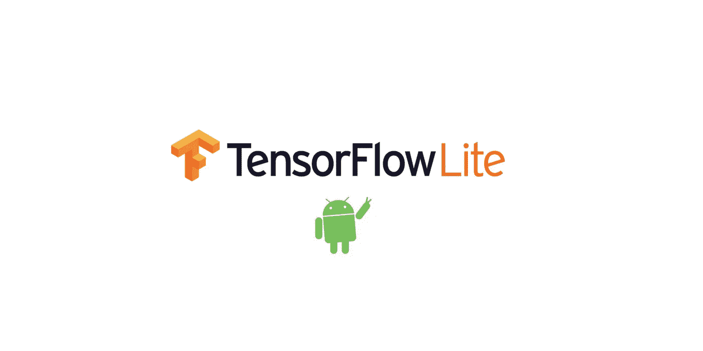

最终，您将拥有一个工作的 Android 应用程序来使用您的定制模型。它将从存储在可绘制文件夹中的静态图像中预测项目。

# 小介绍

## 什么是张量流精简版？

它是一套支持设备上机器学习的工具。这是一个针对移动设备和嵌入式设备的轻量级解决方案。它允许你在移动设备上运行 ML 模型。

它的一个主要特点是**多平台支持。**它涵盖了 Android 和 iOS 设备、嵌入式 Linux 和微控制器。

## 模型制作者是什么？

在为设备上的 ML 应用部署 TensorFlow 神经网络模型时，TFLite Model Maker 库简化了将该模型调整和转换为特定的**输入数据(您的训练图像)**的过程。

## 为什么要用这个模型制作机？

Model Maker 笔记本显示了一个端到端的示例，为您创建一个示例模型。您不需要去任何其他地方或安装任何其他工具或进行任何复杂的配置。

您可以将图像更新到驱动器目录中。我们可以用这个模型制作工具得到一个模型(。tflite)文件。

# 我们开始吧

有 3 个步骤:

1.  收集图片并上传到 google drive。
2.  使用 Model Maker 创建模型。
3.  在 Android 应用程序中使用您的模型。

# 1.收集图片并上传到 google drive

在我们必须做的事情上，图像本身应该是自足的。建议每个类别至少有 100 张图片。

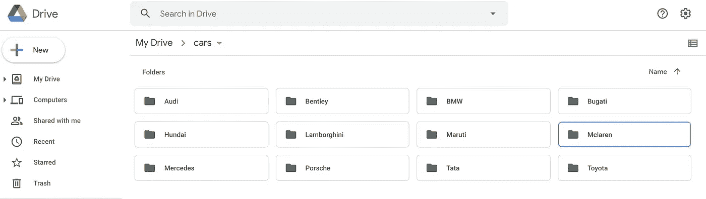

# 2.使用模型制作工具创建您的模型

转到模型制作人:[https://colab . research . Google . com/github/tensor flow/tensor flow/blob/master/tensor flow/lite/g3doc/tutorials/model _ maker _ image _ class ification . ipynb](https://colab.research.google.com/github/tensorflow/tensorflow/blob/master/tensorflow/lite/g3doc/tutorials/model_maker_image_classification.ipynb)

你不需要做什么，只需要一个接一个地运行 python 脚本。从...开始，

*   安装 Model Maker 包。

*   导入所需的包。

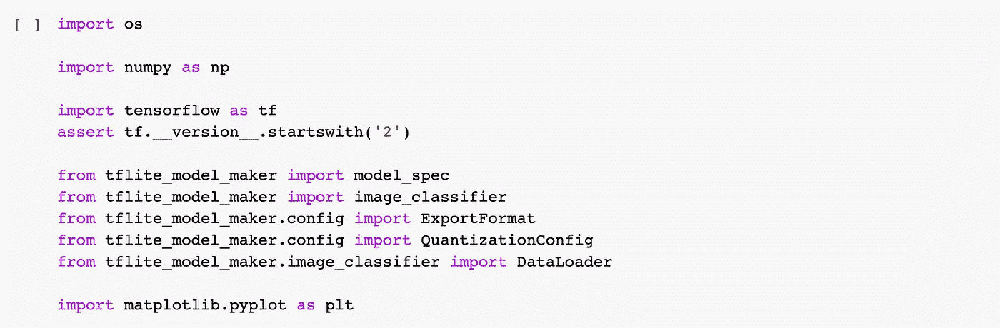

*   单击左侧栏中的“文件”图标。
*   单击顶栏上的“安装驱动器”图标。

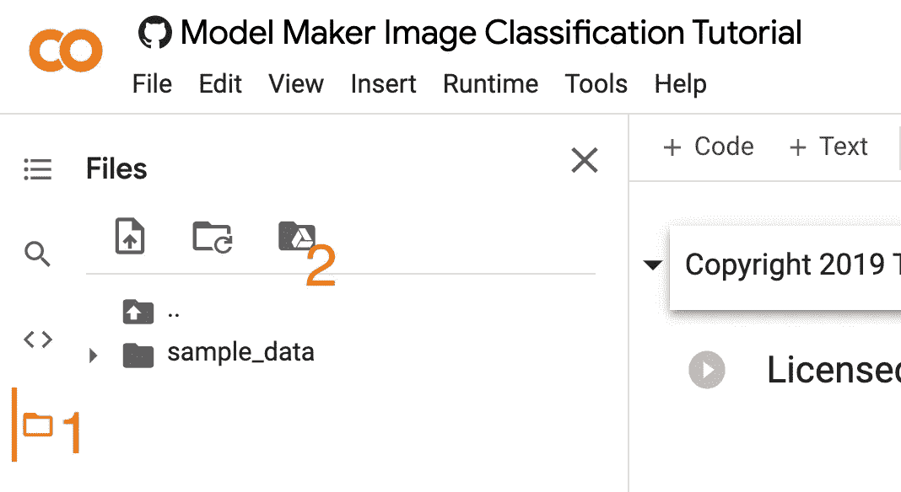

*   脚本中包含了一个新代码，用于装载驱动器。

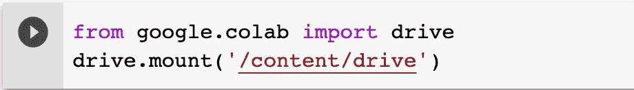

*   转到给定的 URL 并授权使用 google drive。
*   复制粘贴最后给出的授权码，然后按**回车。**

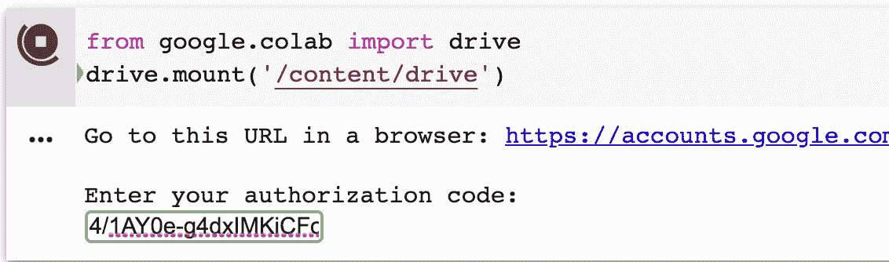

*   现在驱动器已安装，您可以从步骤 1 访问映像。

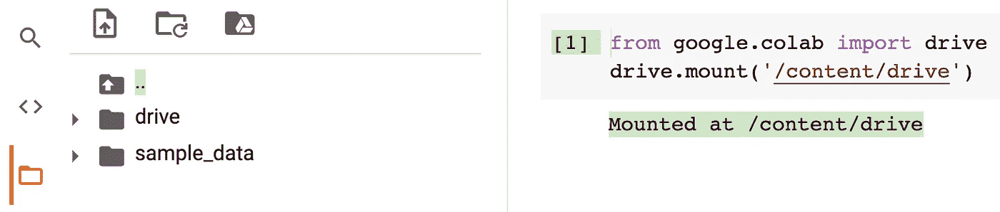

*   打开驱动器并转到您的文件夹(汽车)。
*   右键单击并点击“复制路径”。
*   **现在你有了图片的路径。**

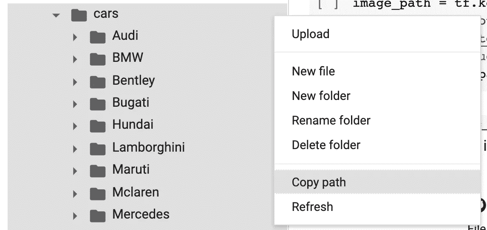

*   注释下一个代码，并添加如图所示的代码。
*   这里将使用图像路径。

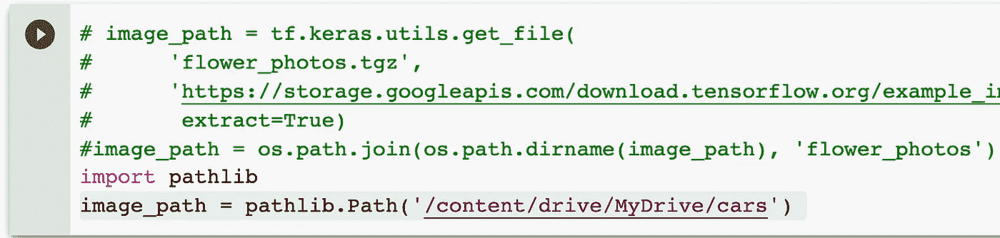

*   加载特定于设备上 ML 应用程序的输入数据。将其拆分为训练数据和测试数据。

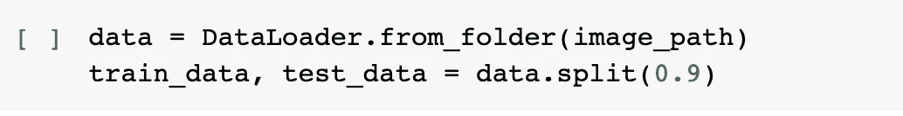

*   自定义张量流模型。

*   评估模型。

*   导出到 TensorFlow Lite 模型。

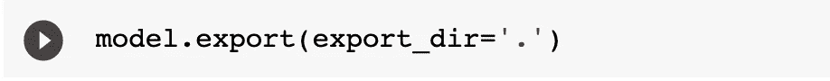

*   下载 **model.tflite** 。

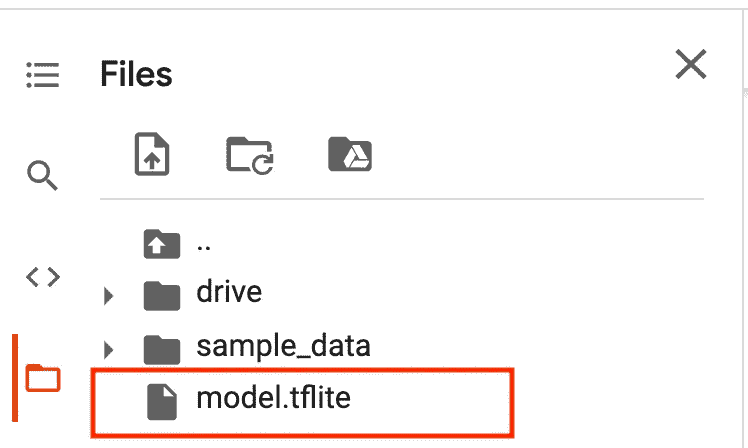

# 搞定了。！！

# 3.在 Android 应用程序中使用您的模型。

> 资产

*   将 **model.tflite** 放到**资产**目录下。

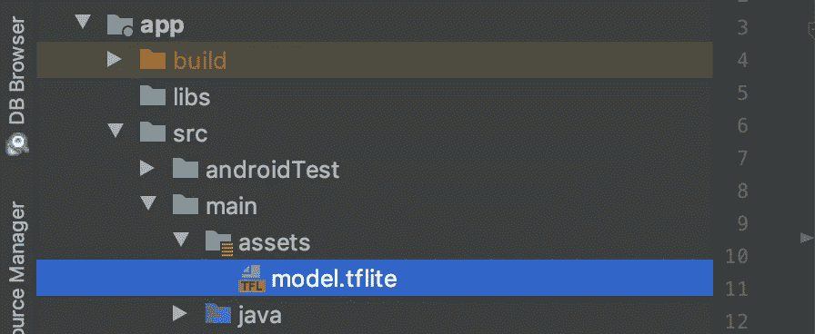

> build.gradle

> activity_home.xml

> HomeActivity.java

# 尽情享受吧！！！