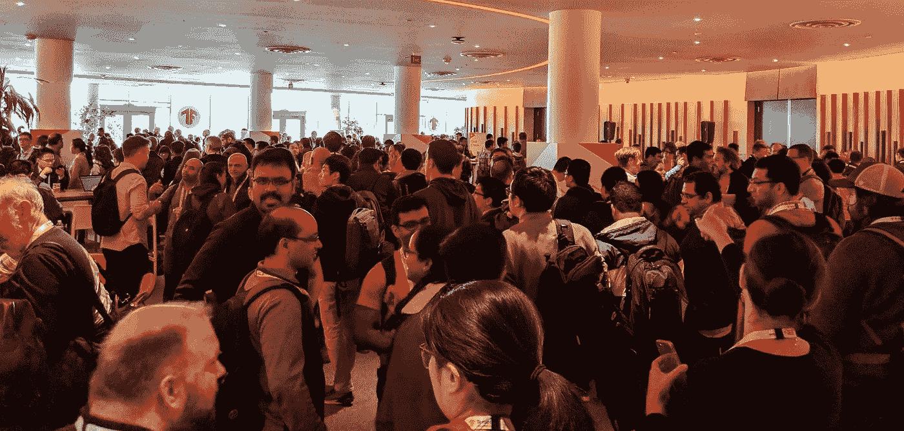
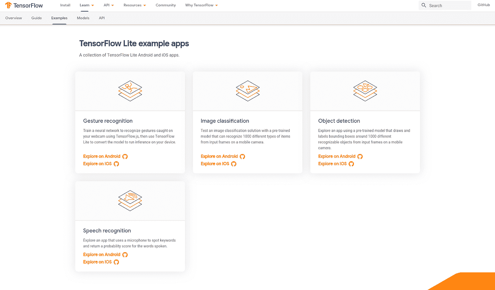
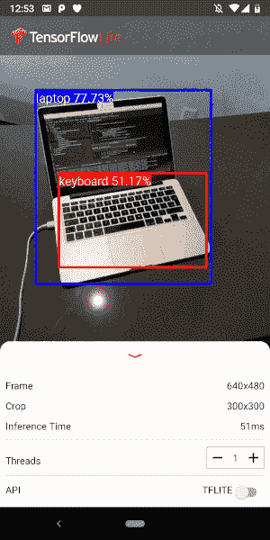

# TensorFlow 开发峰会 Android 开发人员的主要收获

> 原文：<https://medium.com/androiddevelopers/tensorflow-dev-summit-key-takeaways-for-android-developers-20533a8d2656?source=collection_archive---------4----------------------->

TensorFlow Dev Summit

两周前，在 TensorFlow Dev 峰会上，宣布了许多令人兴奋的 Android 新开发([会话记录](https://www.youtube.com/playlist?list=PLQY2H8rRoyvzoUYI26kHmKSJBedn3SQuB))。其中包括 GPU 代理加速(比 CPU 快 2-7 倍)、扩展文档和展示如何在 Android 上使用 TensorFlow Lite 模型的新代码实验室。这篇文章重点介绍了其中的一些公告，并总结了我与开发人员的一些有趣的对话。

# GPU 加速将设备上的 ML 推向大众

机器学习头条通常关注最新、最强大的设备上的最新突破。对于移动开发者来说，真正重要的是能够在各种手机上提供良好的用户体验。这就是为什么我交谈过的 Android 开发人员对新的实验性[tensor flow Lite GPU delegate](https://www.tensorflow.org/lite/performance/gpu)能够在装有 OpenGL ES 3.1 的设备上加速推理(运行 ML 模型)感到非常兴奋，OpenGL ES 3.1 是作为 Android API Level 21 (Lollipop)的一部分引入的。

要使用它，开发人员需要更新他们应用程序的 build.gradle 文件:

导入 TensorFlow 模型解释器时，使用以下内容:

这项功能是试验性的，TensorFlow 团队很乐意[听取开发者社区](https://github.com/tensorflow/tensorflow/issues)关于如何改进的意见。此外，该团队正致力于开源。更多细节可以从 GPU delegate 发布博客文章中找到。

# 扩展文档和新的 Android 示例

作为 TensorFlow 2.0 alpha 版本的一部分，TensorFlow 团队扩展了他们的文档。我个人最喜欢的是新的 [TensorFlow Lite 示例部分](https://www.tensorflow.org/lite/examples)。在这里你会发现一系列 Android(和 iOS)集成不同类型模型的例子，包括[物体检测](https://github.com/tensorflow/examples/blob/master/lite/examples/object_detection/android/README.md)和[语音识别](https://github.com/tensorflow/examples/blob/master/lite/examples/speech_commands/android/README.md)。在这些样本出现之前，图像转换(在摄像机图像上绘制分析结果)等任务可能很难实现。现在更容易了。例如，[对象检测样本](https://github.com/tensorflow/examples/blob/master/lite/examples/object_detection/android/README.md)带有[跟踪器代码](https://github.com/tensorflow/examples/blob/master/lite/examples/object_detection/android/app/src/main/java/org/tensorflow/lite/examples/detection/tracking/MultiBoxTracker.java)和[图像实用程序](https://github.com/tensorflow/examples/blob/master/lite/examples/object_detection/android/app/src/main/java/org/tensorflow/lite/examples/detection/env/ImageUtils.java)用于常见的变换。

TensorFlow Lite samples

# TensorFlow Lite、ML 套件和 NNAPI

谷歌提供了大量的设备上机器学习开发者产品。对于大多数开发人员来说，两个典型的起点是:

*   [ML 套件基础 API](https://developers.google.com/ml-kit/)如果 Google 的某个设备上模型，如文本识别、人脸检测等([支持模型列表](https://firebase.google.com/docs/ml-kit/#what_features_are_available_on_device_or_in_the_cloud))符合您的需求，或者
*   [TensorFlow](https://www.tensorflow.org) 使用另一个预训练模型或构建并训练您自己的模型

如果你想更深入地研究如何使用 TensorFlow(和其他 ML 工具)，这里有一个更详细的开发选项概述(按复杂程度排列):

*   使用谷歌预训练模型(如人脸检测)——[ML 套件基础 API](https://developers.google.com/ml-kit/)
*   使用其他预训练的模型——开发人员可以使用预训练的 TensorFlow Lite 模型，例如[姿势估计](https://www.tensorflow.org/lite/models/pose_estimation/overview)(身体和四肢检测)和[图像分割](https://www.tensorflow.org/lite/models/segmentation/overview)(人物与背景)
*   制作您自己的定制模型:

1.  训练自定义模型— [TensorFlow](https://www.tensorflow.org)
2.  在 Android / iOS / IoT 设备上转换和运行完成的模型— [TensorFlow Lite](https://www.tensorflow.org/lite/convert)
3.  将转换后的 TensorFlow Lite 模型提供给最终用户— [ML 套件定制模型提供](https://firebase.google.com/docs/ml-kit/use-custom-models)

*   编写自己的机器学习框架— [Android 神经网络 API (NNAPI)](https://developer.android.com/ndk/guides/neuralnetworks)

所有这些产品协同工作，为开发者提供端到端的体验。例如，ML Kit 基础 API 在幕后使用 TensorFlow Lite 模型向您的应用程序交付 Google 训练的模型。当这些 TensorFlow Lite 模型在移动设备上运行时，它们的性能通过 NNAPI 得到增强。

开发人员很少需要与 NNAPI 交互。唯一的例外是，如果你想创建自己的机器学习框架。

# 设备上的新用例

设备上 TensorFlow 功能的扩展以两种方式为移动开发者提供了新的机遇:

## 1.在设备上运行更强大的模型

在 TensorFlow Dev 峰会上，我们展示了一个[对象检测示例](https://github.com/tensorflow/examples/blob/master/lite/examples/object_detection/android/README.md)，其中模型不仅检测到了对象，还返回了对象在图像中的位置。

许多与会者对移动设备(Android 和 iOS)变得如此强大以至于可以在设备上使用这些功能感到惊讶。在设备上运行模型有很多好处，比如离线访问和隐私。在本地运行模型的另一个好处是减少了延迟，使得实时体验成为可能。

## 2.作为通用 ML 设备的移动设备

多年来，人们一直希望物联网设备，如工业机器或智能家居设备，能够将 [ML 带到互联网](https://www.tensorflow.org/lite/guide/microcontroller)的边缘。随着 [Edge TPUs](https://coral.withgoogle.com/) 在 Dev 峰会上的推出，这一趋势得到了推动。对我来说更有趣的是，这些物联网设备可能只有一个用途——例如，分拣鳄梨大小，或者设置舒适的室温。这些是业界已经思考了很长时间的有价值的用例。

新的是，随着 Android 等移动平台的出现，我们突然有了一个通用的 ML 设备。ML 可以帮助用户在一分钟内记录身体活动，然后在另一分钟内扫描驾驶执照。像这样的机会似乎没有被充分发掘。有了 mobile+ML，就会有新的设计模式和新的 Android 应用。

# 最好的学习方法是尝试

我遇到的许多与会者更习惯于从超级计算机的角度考虑 ML，而不是移动设备。他们很高兴看到一个提供设备上机器学习的新平台，并承诺新的发现即将到来。

我鼓励 Android 开发人员查看 Android 示例，感受一下什么是可能的:

*   [ML 试剂盒快速入门样本](https://github.com/firebase/quickstart-android/tree/master/mlkit) —在一个样本中尝试所有 ML 试剂盒 API
*   [新 TensorFlow Lite 物体检测样本](https://github.com/tensorflow/examples/tree/master/lite/examples/object_detection/android)

设备上的机器学习比以往任何时候都更容易上手。下次你遇到问题时，设备上的 ML 可能就是解决方案。