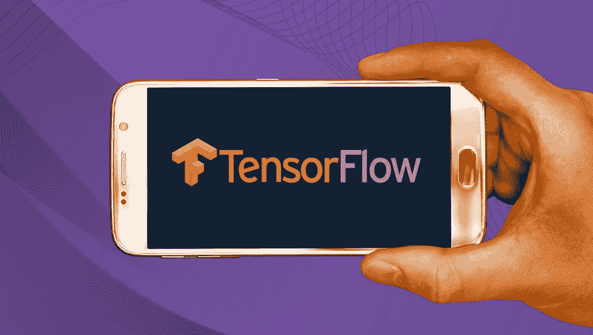
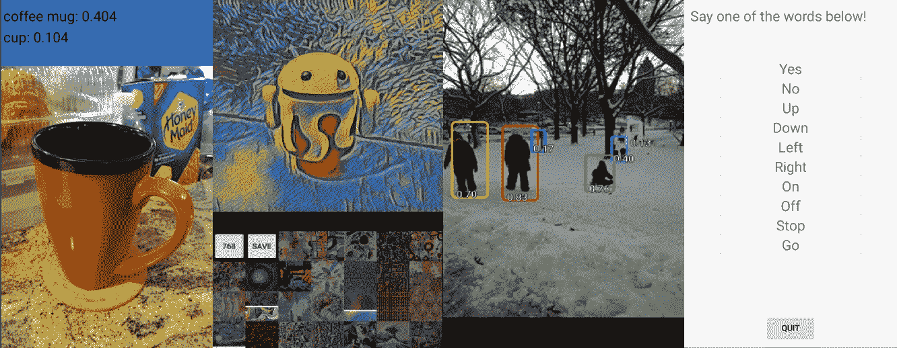
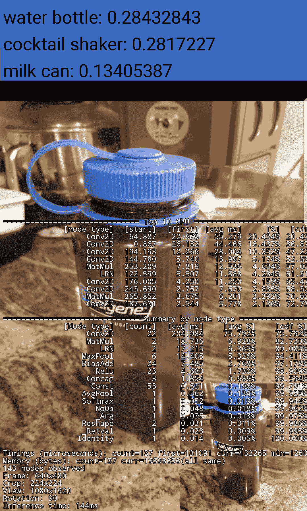
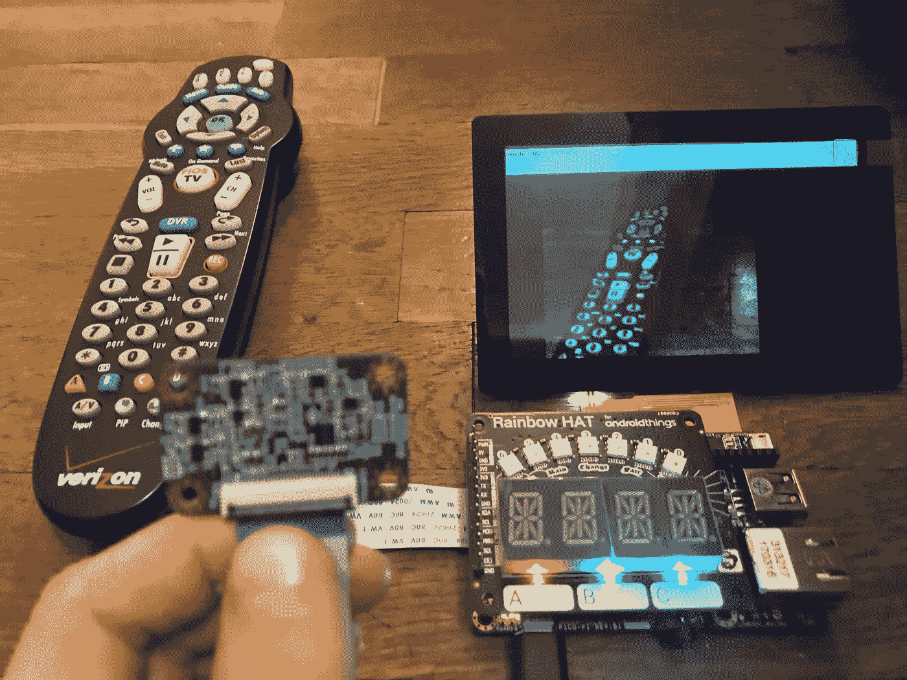
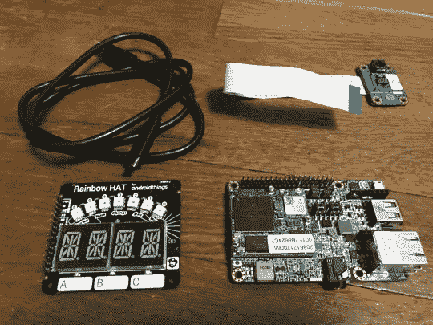
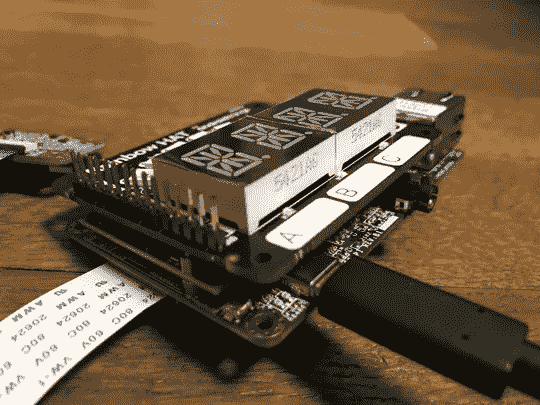
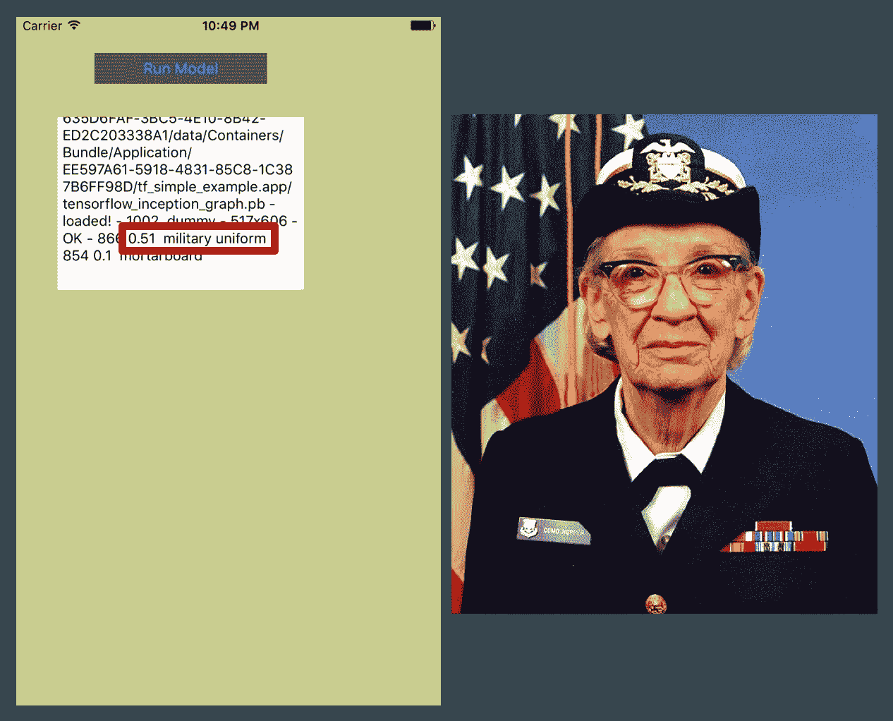
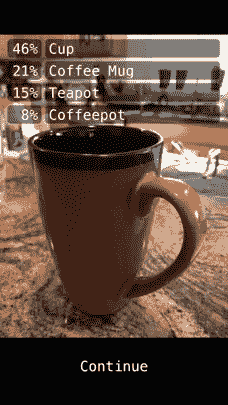
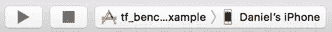

# Android、Android Things 和 iOS 上的 TensorFlow 图像分类器

> 原文：<https://medium.com/capital-one-tech/tensorflow-image-classifiers-on-android-android-things-and-ios-82cee88095d3?source=collection_archive---------4----------------------->



TensorFlow 存储库包含一系列用于 Android 和 iOS 的[示例](https://github.com/tensorflow/tensorflow/tree/master/tensorflow/examples)，包括示例移动应用程序。本文比较了 Android、Android Things 和 iOS 上的 TensorFlow 图像分类器。

# 1 —安卓系统

正如你可能对谷歌开发的开源项目所期待的那样，TensorFlow 目前在 Android 上提供的示例应用比 iOS 多。[的自述文件](https://github.com/tensorflow/tensorflow/blob/master/tensorflow/examples/android/README.md)解释了所有这些，但今天我们只看一下*图像分类器*(左图所示的应用程序)。



Current TensorFlow Samples [*https://github.com/tensorflow/tensorflow/blob/master/tensorflow/examples/android/README.md*](https://github.com/tensorflow/tensorflow/blob/master/tensorflow/examples/android/README.md)

这是一个演示视频:

[https://www.youtube.com/watch?v=4oU4N6bAjR4](https://www.youtube.com/watch?v=4oU4N6bAjR4)

它只能对它已经训练过的物品进行分类(如这里的[所解释的](/@daj/creating-an-image-classifier-on-android-using-tensorflow-part-1-513d9c10fa6a))，而且它通常做得很好。

*专业提示:您可以按下硬件音量降低按钮，在屏幕上查看诊断信息，如下所示:*



在上图中，你可以看到:

*   推断时间(左下角)。
*   用于推断的方形裁剪图像的预览(右下角)。

*如果你想了解更多关于这款应用的幕后工作原理，请参见* [*在 Android 上使用预先训练好的 TensorFlow 模型*](/capital-one-developers/using-a-pre-trained-tensorflow-model-on-android-e747831a3d6) *。*

## 表演

**~ 200–300 毫秒**根据 2015 款 Nexus 5 的推断。

**~ 100–400 毫秒**根据三星 S8+的推断。

## 大小

该应用程序为 **99MB** (包括所有四个示例应用程序):

*   初始模型= 53MB。
*   库=每个体系结构 11MB 到 17MB。

## 先决条件

*   安卓工作室。

对于在真实设备上的测试:

*   按照这些指令启用设备上的`Developer Options`和`Enable USB debugging`。

## 建筑物

*   打开 Android Studio。
*   按播放。


如果您不想构建示例应用程序，您有两个选择:

*   从 [the nightly build](http://ci.tensorflow.org/view/Nightly/job/nightly-android/lastSuccessfulBuild/artifact/out/) 下载官方预建的演示版 APK。
*   [在 Google Play 中搜索“tensor flow demo”](https://play.google.com/store/search?q=tensorflow%20demo&c=apps&hl=en)，安装任何你想试用的。:-)

# 2 —安卓的东西

除了 [TensorFlow 示例文件夹](https://github.com/tensorflow/tensorflow/tree/master/tensorflow/examples)中的 Android 和 iOS 示例应用程序之外，还有一个[示例 Android Things 图像分类器](https://developer.android.com/things/index.html)，它带有一个优秀的 [Android Things 图像分类器 codelab](https://codelabs.developers.google.com/codelabs/androidthings-classifier/index.html?index=..%2F..%2Findex#0) 来引导您完成所有步骤。



如果你有一个硬件屏幕，你将能够在那里看到照片和分类(如上)。如果没有硬件屏幕，可以在 Logcat 中查看日志。您会看到许多嘈杂的日志，但是`ImageClassifierActivity`日志是您要寻找的日志:

```
...
01-01 00:01:12.596 714-756/com.example.androidthings.imageclassifier D/**ImageClassifierActivity: Got the following results from Tensorflow: [[578] remote control (91.3%)]**
...
```

我试着给一些不同的物体拍照，获得了不同的成功:

*   遥控器、笔记本电脑屏幕和水瓶都非常好用。
*   开发板(即做硬件自拍)被归类为`holster`或`switch`。
*   给人拍照没用。显然，这是因为早期版本的 Inception 图像分类器模型没有在人的图片上进行训练，所以我猜测这暂时是“按设计工作”。:-)

## 表演

**~ 2000–5000 毫秒**在微型电路板上的每一个推论。

## 大小

app 是 **69MB** :

*   初始模型= 53MB。
*   库=每个架构 11MB(arm V7 和 arm64)。

## 先决条件

你需要的硬件的详细说明，以及设置它的步骤，都在 [Android Things 图像分类器 codelab](https://codelabs.developers.google.com/codelabs/androidthings-classifier/index.html?index=..%2F..%2Findex#0) 里。我刚刚在这里列出了亮点。

*   硬件(开发板、摄像头、彩虹帽、USB C 线)。屏幕是可选的。
*   硬件的操作系统映像。
*   Android Studio 3.0+。



在我的例子中，我使用的是 Pico Pro 开发板。

## 建筑物

*   连接一切:



*   刷新操作系统映像。
*   在 Android Studio 中按播放。
*   重启电路板(需要授予相机权限)。
*   再次按下 Android Studio 中的 play。


# 3 — iOS

TensorFlow 存储库中有三个示例 iOS 应用程序[。](https://github.com/tensorflow/tensorflow/blob/master/tensorflow/examples/ios/README.md)

如果你没有真正的 iOS 设备，那么你只能构建和运行`simple`和`benchmark`项目。

`simple`项目加载格蕾丝·赫柏的单个图像，并对其进行分类，导致其看到“军装”的置信度为 51%，看到“尸骨”的置信度为 10%。



`benchmark`项目是相同的，除了它也打印出概要信息。

`camera`项目与 Android `TF Classify`应用基本相同。它提供了超快速、实时的图像分类，并提供了一个额外的选项来冻结图像:



## 表演

**~50ms** 在 iPhone 7 上的每一个推论。

## 大小

app 是 **98MB** :

*   初始模型= 53MB
*   库=每个架构 11MB(arm V7 和 arm64)

## 先决条件

`camera`示例需要在物理 iOS 设备上运行。如果您不熟悉 iOS 开发实践，您可能会发现这些步骤有些棘手。

*   Xcode 7.3+。
*   安装 CocoaPods ( `pod`)。

对于测试真实设备:

*   苹果开发者账户——99 美元/年。
*   设置一些签名证书和预置描述文件。
*   向 Apple 提供您的测试设备。

注意——如果你想知道为什么你不能下载一个演示应用，那是因为苹果应用商店目前不允许演示/样本应用。

## 建筑物

[自述文件](https://github.com/tensorflow/tensorflow/blob/master/tensorflow/examples/ios/README.md)提供了所有详细步骤，但概括起来:

*   下载模型，运行`pod install`，下载量~800MB
*   打开。xcworkspace 文件*(。xcodeproj 给出链接器错误)*
*   新闻播放



对于测试真实设备:

*   在`Info.plist`中选择您的签名身份

# 结论

这是对 Android、Android Things 和 iOS 上可用的一些 TensorFlow 图像分类器的快速浏览。有关其各自产品的完整列表和说明，请查看:

*   [安卓](https://github.com/tensorflow/tensorflow/blob/master/tensorflow/examples/android/README.md)
*   [安卓的东西](https://developer.android.com/things/index.html)
*   [iOS](https://github.com/tensorflow/tensorflow/blob/master/tensorflow/examples/ios/README.md)

如果你喜欢这篇文章，你可能会喜欢我关于在 Android 应用中应用 TensorFlow 的视频。

*披露声明:这些观点是作者的观点。除非本帖中另有说明，否则 Capital One 不属于所提及的任何公司，也不被其认可。使用或展示的所有商标和其他知识产权都是其各自所有者的所有权。本文为 2017 首都一。*