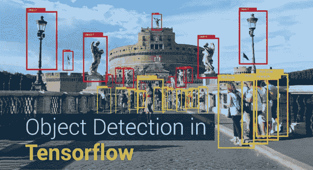
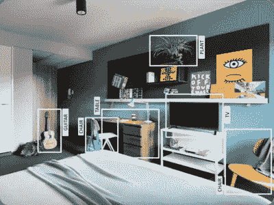
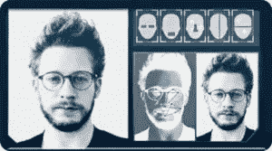
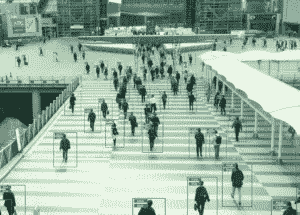
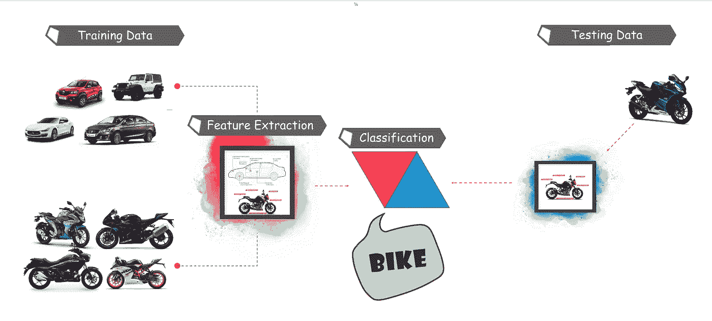
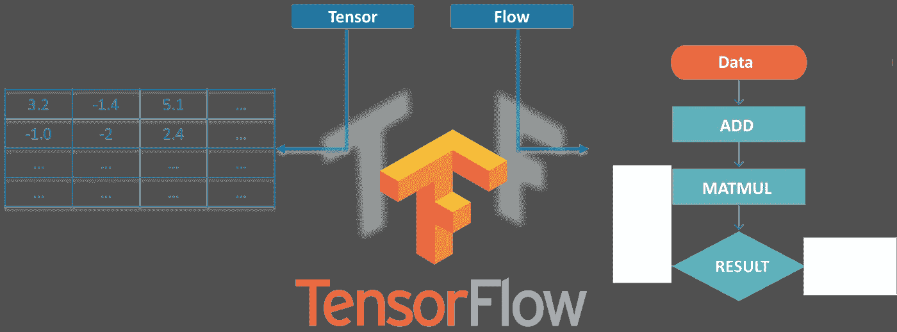
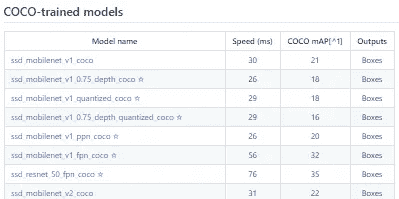
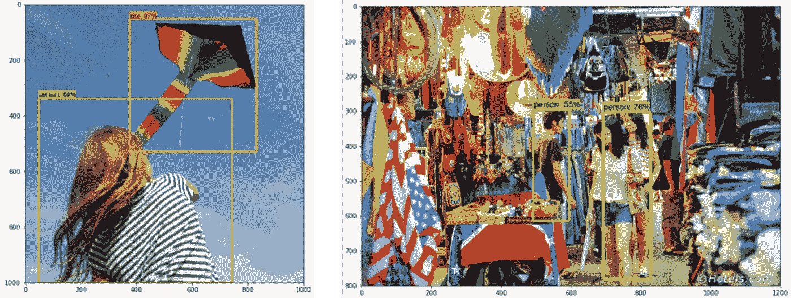
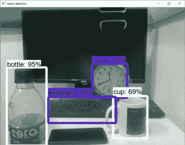

# TensorFlow 中的对象检测教程-执行实时对象检测

> 原文：<https://medium.com/edureka/tensorflow-object-detection-tutorial-8d6942e73adc?source=collection_archive---------0----------------------->



Object Detection in TensorFlow — Edureka

创建能够在单个图像中识别和定位多个对象的准确的机器学习模型仍然是计算机视觉中的核心挑战。但是，随着深度学习**的最新进展，物体检测**应用程序比以往任何时候都更容易开发。TensorFlow 的对象检测 API 是一个基于 TensorFlow 构建的开源框架，可以轻松构建、训练和部署对象检测模型。伙计们，在这个物体检测教程中，我将涉及以下主题:

*   什么是物体检测？
*   目标检测的不同应用
*   对象检测工作流程
*   什么是张量流？
*   使用 Tensorflow 进行物体检测(演示)
*   实时/活动物体检测(演示)

# 什么是物体检测？

对象检测是在静止图像或视频中寻找真实世界对象实例的过程，如汽车、自行车、电视、花和人。它允许识别、定位和检测图像中的多个对象，这为我们提供了对图像整体的更好理解。它通常用于图像检索、安全、监控和高级驾驶辅助系统(ADAS)等应用。

物体检测可以通过多种方式完成:

*   基于特征的目标检测
*   Viola Jones 对象检测
*   具有猪特征的 SVM 分类
*   深度学习对象检测

在本对象检测教程中，我们将重点关注**深度学习对象检测**，因为 Tensorflow 使用深度学习进行计算。



让我们继续学习目标检测教程，了解它在行业中的各种应用。

# 物体检测的应用

## 面部识别:



一个名为“ **DeepFace** 的深度学习面部识别系统已经由脸书**、**的一组研究人员开发出来，它可以非常有效地识别数字图像中的人脸。**谷歌**在 Google Photos 中使用自己的面部识别系统，该系统会根据图像中的人自动隔离所有照片。面部识别涉及各种组件，如眼睛、鼻子、嘴和眉毛。

## 人数统计:



物体检测也可用于人数统计，用于分析商店业绩或节日期间的**人群统计**。随着人们快速移出画面，这些往往变得更加困难。

这是一个非常重要的应用程序，因为在人群聚集期间，该功能可以用于多种目的。

## 工业质量检查:


对象检测也用于工业过程中识别产品。通过视觉检测找到特定的物体是一项基本任务，涉及分拣、库存管理、加工、质量管理、包装等多个工业过程。

库存管理可能非常棘手，因为物品很难实时跟踪。自动物品计数和定位可提高库存准确性。

## 无人驾驶汽车:


无人驾驶汽车是未来，这一点毋庸置疑。但其背后的工作非常棘手，因为它结合了多种技术来感知周围环境，包括雷达，激光，GPS，里程计和计算机视觉。

先进的控制系统解释传感信息，以识别适当的导航路径以及障碍，一旦图像传感器检测到路径上有任何生物的迹象，它就会自动停止。这种情况发生的速度非常快，是向无人驾驶汽车迈出的一大步。

## 安全性:


目标检测在安全中起着非常重要的作用。无论是苹果的 face ID 还是所有科幻电影中使用的视网膜扫描。

政府也用它来访问安全信号，并将其与现有的数据库进行匹配，以找到任何罪犯或检测劫匪的车辆。

应用是无限的。

# 对象检测工作流程

每个对象检测算法都有不同的工作方式，但它们都基于相同的原理。

**特征提取:**他们从手头的输入图像中提取特征，并利用这些特征来确定图像的类别。无论是通过 MatLab、Open CV、Viola Jones 还是深度学习。



现在你已经了解了物体检测的基本工作流程，让我们继续学习物体检测教程，了解 Tensorflow 是什么，它的组成部分是什么？

# 什么是张量流？

Tensorflow 是谷歌的开源机器学习框架，用于跨一系列任务的数据流编程。图中的节点表示数学运算，而图边表示它们之间通信的多维数据数组(**张量**)。



张量只是多维数组，是二维表向更高维数据的扩展。Tensorflow 有许多特性，这使它适合深度学习。因此，不浪费任何时间，让我们看看如何使用 Tensorflow 实现对象检测。

# 物体检测教程

## 获取先决条件

*   在开始演示之前，我们先来看看先决条件。我们将需要:

1.  计算机编程语言
2.  张量流
3.  张量板
4.  Protobuf v3.4 或更高版本

## 设置环境

*   现在，要下载 TensorFlow 和 TensorFlow GPU，您可以使用 pip 或 conda 命令:

```
# For CPU
pip install tensorflow
# For GPU
pip install tensorflow-gpu
```

*   对于所有其他库，我们可以使用 pip 或 conda 来安装它们。代码如下所示:

```
pip install --user Cython
pip install --user contextlib2
pip install --user pillow
pip install --user lxml
pip install --user jupyter
pip install --user matplotlib
```

*   接下来，我们有 Protobuf: **协议缓冲区** (Protobuf)是 Google 的语言中立、平台中立、可扩展的机制，用于序列化结构化数据，就像 XML 一样，但是更小、更快、更简单。你需要 [***下载 Protobuf***](https://github.com/google/protobuf/releases)3.4 版或以上版本进行本演示并解压。
*   现在你需要从[***Github***](https://github.com/tensorflow/models)克隆或者下载 TensorFlow 的模型。一旦*下载了*并且*提取了*，就将“模型-主控”重命名为“**模型**”。
*   现在为了简单起见，我们将“模型”和“protobuf”放在一个文件夹“ **Tensorflow** ”下。
*   接下来，我们需要进入 Tensorflow 文件夹，然后进入 research 文件夹，从那里使用以下命令运行 protobuf:

```
"path_of_protobuf's bin"./bin/protoc object_detection/protos/
```

*   要检查这是否有效，您可以转到 models>object _ detection>protos 中的 **protos** 文件夹，在那里您可以看到为每个 proto 文件都创建了一个 python 文件。

# 主代码


设置好环境后，您需要转到“ **object_detection** ”目录，然后创建一个新的 python 文件。你可以使用 **Spyder** 或 **Jupyter** 来编写你的代码。

*   首先，我们需要导入所有的库

```
import numpy as np
import os
import six.moves.urllib as urllib
import sys
import tarfile
import tensorflow as tf
import zipfile

from collections import defaultdict
from io import StringIO
from matplotlib import pyplot as plt
from PIL import Image

sys.path.append("..")
from object_detection.utils import ops as utils_ops

from utils import label_map_util

from utils import visualization_utils as vis_util
```

接下来，我们将下载在 [***COCO 数据集***](http://cocodataset.org/#home) 上训练好的模型。COCO 代表**上下文中的公共对象，**该数据集包含大约 330K 个带标签的图像。现在，型号选择很重要，因为你需要在**速度和精度**之间做出重要的权衡。根据您的要求和系统内存，必须选择正确的型号。

*模型>研究>对象 _ 检测> g3doc >检测 _ 模型 _ 动物园*里面包含了所有不同速度和精度的模型(图)。



*   接下来，我们提供所需的模型和 Tensorflow 生成的冻结推理图以供使用。

```
MODEL_NAME = 'ssd_mobilenet_v1_coco_2017_11_17'
MODEL_FILE = MODEL_NAME + '.tar.gz'
DOWNLOAD_BASE = '[http://download.tensorflow.org/models/object_detection/'](http://download.tensorflow.org/models/object_detection/')

PATH_TO_CKPT = MODEL_NAME + '/frozen_inference_graph.pb'

PATH_TO_LABELS = os.path.join('data', 'mscoco_label_map.pbtxt')

NUM_CLASSES = 90
```

*   这段代码将从互联网上下载该模型，并提取该模型的冻结推理图。

```
opener = urllib.request.URLopener()
opener.retrieve(DOWNLOAD_BASE + MODEL_FILE, MODEL_FILE)
tar_file = tarfile.open(MODEL_FILE)
for file in tar_file.getmembers():
  file_name = os.path.basename(file.name)
  if 'frozen_inference_graph.pb' in file_name:
    tar_file.extract(file, os.getcwd())

detection_graph = tf.Graph()
with detection_graph.as_default():
  od_graph_def = tf.GraphDef()
  with tf.gfile.GFile(PATH_TO_CKPT, 'rb') as fid:
    serialized_graph = fid.read()
    od_graph_def.ParseFromString(serialized_graph)
    tf.import_graph_def(od_graph_def, name='')
```

*   接下来，我们将加载所有标签

```
label_map = label_map_util.load_labelmap(PATH_TO_LABELS)
categories = label_map_util.convert_label_map_to_categories(label_map, max_num_classes=NUM_CLASSES, use_display_name=True)
category_index = label_map_util.create_category_index(categories)
```

*   现在我们将把图像数据转换成一个 numPy 数组进行处理。

```
def load_image_into_numpy_array(image):
  (im_width, im_height) = image.size
  return np.array(image.getdata()).reshape(
      (im_height, im_width, 3)).astype(np.uint8)
```

*   这里定义了用于测试目的的图像路径。这里我们有一个命名约定“**图像[i]** ”，用于 i in (1 到 n+1)，n 是提供的图像的数量。

```
PATH_TO_TEST_IMAGES_DIR = 'test_images'
TEST_IMAGE_PATHS = [ os.path.join(PATH_TO_TEST_IMAGES_DIR, 'image{}.jpg'.format(i)) for i in range(1, 8) ]
```

*   这段代码对单个图像进行推理，检测对象，制作盒子，并提供该特定对象的类别和类别分数。

```
def run_inference_for_single_image(image, graph):
  with graph.as_default():
    with tf.Session() as sess:
    # Get handles to input and output tensors
      ops = tf.get_default_graph().get_operations()
      all_tensor_names = {output.name for op in ops for output in op.outputs}
      tensor_dict = {}
      for key in [
          'num_detections', 'detection_boxes', 'detection_scores',
          'detection_classes', 'detection_masks'
     ]:
        tensor_name = key + ':0'
        if tensor_name in all_tensor_names:
          tensor_dict[key] = tf.get_default_graph().get_tensor_by_name(
            tensor_name)
      if 'detection_masks' in tensor_dict:
        # The following processing is only for single image
        detection_boxes = tf.squeeze(tensor_dict['detection_boxes'], [0])
        detection_masks = tf.squeeze(tensor_dict['detection_masks'], [0])
        # Reframe is required to translate mask from box coordinates to image coordinates and fit the image size.
        real_num_detection = tf.cast(tensor_dict['num_detections'][0], tf.int32)
        detection_boxes = tf.slice(detection_boxes, [0, 0], [real_num_detection, -1])
        detection_masks = tf.slice(detection_masks, [0, 0, 0], [real_num_detection, -1, -1])
        detection_masks_reframed = utils_ops.reframe_box_masks_to_image_masks(
            detection_masks, detection_boxes, image.shape[0], image.shape[1])
        detection_masks_reframed = tf.cast(
            tf.greater(detection_masks_reframed, 0.5), tf.uint8)
        # Follow the convention by adding back the batch dimension
        tensor_dict['detection_masks'] = tf.expand_dims(
            detection_masks_reframed, 0)
        image_tensor = tf.get_default_graph().get_tensor_by_name('image_tensor:0')

        # Run inference
        output_dict = sess.run(tensor_dict,
            feed_dict={image_tensor: np.expand_dims(image, 0)})

        # all outputs are float32 numpy arrays, so convert types as appropriate
        output_dict['num_detections'] = int(output_dict['num_detections'][0])
        output_dict['detection_classes'] = output_dict[
          'detection_classes'][0].astype(np.uint8)
        output_dict['detection_boxes'] = output_dict['detection_boxes'][0]
        output_dict['detection_scores'] = output_dict['detection_scores'][0]
        if 'detection_masks' in output_dict:
          output_dict['detection_masks'] = output_dict['detection_masks'][0]
return output_dict
```

*   我们的最终循环将调用上面定义的所有函数，并对所有输入图像逐一进行推理，这将为我们提供图像输出，其中检测到带有标签的对象以及该对象与训练数据相似的百分比/分数。

```
for image_path in TEST_IMAGE_PATHS:
  image = Image.open(image_path)
  # the array based representation of the image will be used later in order to prepare the
  # result image with boxes and labels on it.
  image_np = load_image_into_numpy_array(image)
  # Expand dimensions since the model expects images to have shape: [1, None, None, 3]
  image_np_expanded = np.expand_dims(image_np, axis=0)
  # Actual detection.
  output_dict = run_inference_for_single_image(image_np, detection_graph)
  # Visualization of the results of a detection.
  vis_util.visualize_boxes_and_labels_on_image_array(
      image_np,
      output_dict['detection_boxes'],
      output_dict['detection_classes'],
      output_dict['detection_scores'],
      category_index,
      instance_masks=output_dict.get('detection_masks'),
      use_normalized_coordinates=True,
      line_thickness=8)
plt.figure(figsize=IMAGE_SIZE)
plt.imshow(image_np)
```



现在，让我们继续学习对象检测教程，看看如何在实时视频中检测对象。

# 使用张量流的活体对象检测

对于这个演示，我们将使用相同的代码，但是我们将做一些调整。这里我们将使用 ***OpenCV*** 和摄像头模块来使用网络摄像头的实时馈送来检测对象。

*   添加 OpenCV 库和用于捕捉图像的相机。只需将下面几行添加到导入库部分。

```
import cv2
cap = cv2.VideoCapture(0)
```

*   接下来，我们不需要从目录中加载图像并将其转换为 numPy 数组，因为 OpenCV 会为我们完成这项工作

**去掉这个**

```
for image_path in TEST_IMAGE_PATHS:
image = Image.open(image_path)
# the array based representation of the image will be used later in order to prepare the
# result image with boxes and labels on it.
image_np = load_image_into_numpy_array(image)
```

**同**

```
while True:
ret, image_np = cap.read()
```

*   我们将不会使用 matplotlib 来显示最终的图像，我们也将使用 OpenCV。现在，为了这个，

**移除此**

```
plt.figure(figsize=IMAGE_SIZE)
plt.imshow(image_np)
```

**同**

```
cv2.imshow('object detection', cv2.resize(image_np, (800,600)))
if cv2.waitKey(25) & 0xFF == ord('q'):
  cv2.destroyAllWindows()
  break
```

该代码将使用 OpenCV，OpenCV 将依次使用前面初始化的 camera 对象来打开一个名为“ **Object_Detection** ”的大小为“800×600”的新窗口。它将等待 25 毫秒让摄像机显示图像，否则，它将关闭窗口。

# 包含所有更改的最终代码:

```
import numpy as np
import os
import six.moves.urllib as urllib
import sys
import tarfile
import tensorflow as tf
import zipfile

from collections import defaultdict
from io import StringIO
from matplotlib import pyplot as plt
from PIL import Image

import cv2
cap = cv2.VideoCapture(0)

sys.path.append("..")

from utils import label_map_util

from utils import visualization_utils as vis_util

MODEL_NAME = 'ssd_mobilenet_v1_coco_11_06_2017'
MODEL_FILE = MODEL_NAME + '.tar.gz'
DOWNLOAD_BASE = '[http://download.tensorflow.org/models/object_detection/'](http://download.tensorflow.org/models/object_detection/')

# Path to frozen detection graph. This is the actual model that is used for the object detection.
PATH_TO_CKPT = MODEL_NAME + '/frozen_inference_graph.pb'

# List of the strings that is used to add correct label for each box.
PATH_TO_LABELS = os.path.join('data', 'mscoco_label_map.pbtxt')

NUM_CLASSES = 90

opener = urllib.request.URLopener()
opener.retrieve(DOWNLOAD_BASE + MODEL_FILE, MODEL_FILE)
tar_file = tarfile.open(MODEL_FILE)
for file in tar_file.getmembers():
  file_name = os.path.basename(file.name)
  if 'frozen_inference_graph.pb' in file_name:
    tar_file.extract(file, os.getcwd())

detection_graph = tf.Graph()
with detection_graph.as_default():
  od_graph_def = tf.GraphDef()
  with tf.gfile.GFile(PATH_TO_CKPT, 'rb') as fid:
    serialized_graph = fid.read()
    od_graph_def.ParseFromString(serialized_graph)
    tf.import_graph_def(od_graph_def, name='')

label_map = label_map_util.load_labelmap(PATH_TO_LABELS)
categories = label_map_util.convert_label_map_to_categories(label_map, max_num_classes=NUM_CLASSES, use_display_name=True)
category_index = label_map_util.create_category_index(categories)

with detection_graph.as_default():
  with tf.Session(graph=detection_graph) as sess:
    while True:
    ret, image_np = cap.read()
    # Expand dimensions since the model expects images to have shape: [1, None, None, 3]
    image_np_expanded = np.expand_dims(image_np, axis=0)
    image_tensor = detection_graph.get_tensor_by_name('image_tensor:0')
    # Each box represents a part of the image where a particular object was detected.
    boxes = detection_graph.get_tensor_by_name('detection_boxes:0')
    # Each score represent how level of confidence for each of the objects.
    # Score is shown on the result image, together with the class label.
    scores = detection_graph.get_tensor_by_name('detection_scores:0')
    classes = detection_graph.get_tensor_by_name('detection_classes:0')
    num_detections = detection_graph.get_tensor_by_name('num_detections:0')
    # Actual detection.
    (boxes, scores, classes, num_detections) = sess.run(
      [boxes, scores, classes, num_detections],
      feed_dict={image_tensor: image_np_expanded})
    # Visualization of the results of a detection.
    vis_util.visualize_boxes_and_labels_on_image_array(
        image_np,
        np.squeeze(boxes),
        np.squeeze(classes).astype(np.int32),
        np.squeeze(scores),
        category_index,
        use_normalized_coordinates=True,
        line_thickness=8)

    cv2.imshow('object detection', cv2.resize(image_np, (800,600)))
    if cv2.waitKey(25) 0xFF == ord('q'):
      cv2.destroyAllWindows()
      break
```



至此，我们结束了这个物体检测教程。我希望你们喜欢这篇文章，并理解 Tensorflow 的力量，以及在图像和视频中检测对象是多么容易。所以，如果你读到这里，你就不再是物体检测和张量流的新手了。尝试这些例子，如果您在部署代码时遇到任何挑战，请告诉我。

*这就把我们带到了“TensorFlow 中的对象检测”这篇文章的结尾。我希望这篇文章对你有所帮助，并增加了你的知识价值。*

如果你想查看更多关于人工智能、DevOps、道德黑客等市场最热门技术的文章，那么你可以参考 [Edureka 的官方网站。](https://www.edureka.co/blog/?utm_source=medium&utm_medium=content-link&utm_campaign=tensorflow-object-detection-tutorial)

请留意本系列中的其他文章，它们将解释深度学习的各个其他方面。

> 1. [TensorFlow 教程](/edureka/tensorflow-tutorial-ba142ae96bca)
> 
> 2. [PyTorch 教程](/edureka/pytorch-tutorial-9971d66f6893)
> 
> 3.[感知器学习算法](/edureka/perceptron-learning-algorithm-d30e8b99b156)
> 
> 4.[神经网络教程](/edureka/neural-network-tutorial-2a46b22394c9)
> 
> 5.[什么是反向传播？](/edureka/backpropagation-bd2cf8fdde81)
> 
> 6.[卷积神经网络](/edureka/convolutional-neural-network-3f2c5b9c4778)
> 
> 7.[胶囊神经网络](/edureka/capsule-networks-d7acd437c9e)
> 
> 8.[递归神经网络](/edureka/recurrent-neural-networks-df945afd7441)
> 
> 9.[自动编码器教程](/edureka/autoencoders-tutorial-cfdcebdefe37)
> 
> 10.[受限玻尔兹曼机教程](/edureka/restricted-boltzmann-machine-tutorial-991ae688c154)
> 
> 11. [PyTorch vs TensorFlow](/edureka/pytorch-vs-tensorflow-252fc6675dd7)
> 
> 12.[用 Python 进行深度学习](/edureka/deep-learning-with-python-2adbf6e9437d)
> 
> 13.[人工智能教程](/edureka/artificial-intelligence-tutorial-4257c66f5bb1)
> 
> 14.[张量流图像分类](/edureka/tensorflow-image-classification-19b63b7bfd95)
> 
> 15.[人工智能应用](/edureka/artificial-intelligence-applications-7b93b91150e3)
> 
> 16.[如何成为一名人工智能工程师？](/edureka/become-artificial-intelligence-engineer-5ac2ede99907)
> 
> 17.[问学](/edureka/q-learning-592524c3ecfc)
> 
> 18. [Apriori 算法](/edureka/apriori-algorithm-d7cc648d4f1e)
> 
> 19.[马尔可夫链与 Python](/edureka/introduction-to-markov-chains-c6cb4bcd5723)
> 
> 20.[人工智能算法](/edureka/artificial-intelligence-algorithms-fad283a0d8e2)
> 
> 21.[机器学习的最佳笔记本电脑](/edureka/best-laptop-for-machine-learning-a4a5f8ba5b)
> 
> 22.[12 大人工智能工具](/edureka/top-artificial-intelligence-tools-36418e47bf2a)
> 
> 23.[人工智能(AI)面试问题](/edureka/artificial-intelligence-interview-questions-872d85387b19)
> 
> 24. [Theano vs TensorFlow](/edureka/theano-vs-tensorflow-15f30216b3bc)
> 
> 25.[什么是神经网络？](/edureka/what-is-a-neural-network-56ae7338b92d)
> 
> 26.[模式识别](/edureka/pattern-recognition-5e2d30ab68b9)
> 
> 27.[人工智能中的阿尔法贝塔剪枝](/edureka/alpha-beta-pruning-in-ai-b47ee5500f9a)

*原载于 2018 年 8 月 20 日*[*【www.edureka.co*](https://www.edureka.co/blog/tensorflow-object-detection-tutorial/)*。*