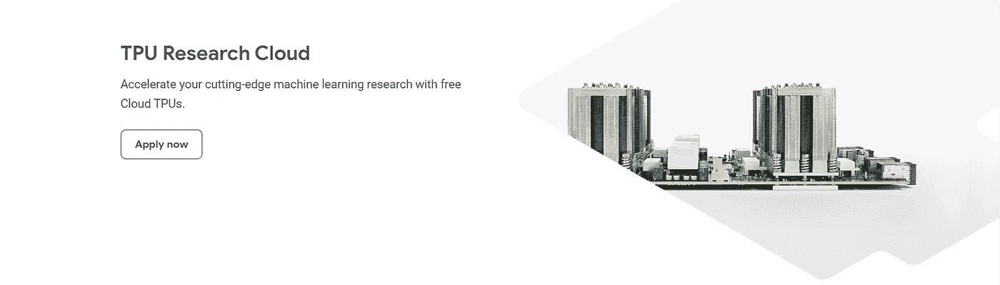
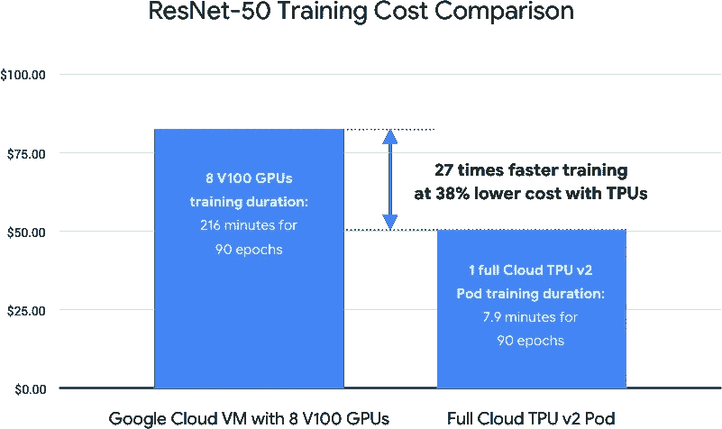

# 通过 TPU 研究云(TFRC)为您的深度学习项目获得免费的 TPU 硬件

> 原文：<https://medium.com/google-developer-experts/tensorflow-research-cloud-7657cf02811e?source=collection_archive---------4----------------------->

# 对于你的伟大想法来说，你的硬件是否太有限了？

如果你曾经做过深度学习项目，你很可能熟悉深度学习的最大瓶颈:**硬件！**就像我和其他所有人一样，您肯定已经或正在面临问题，因为您当前的硬件性能不够好。你猜怎么着？有办法让**免费**从**谷歌**获得非常强大的硬件，多亏了他们的程序“ [**TPU 研究云**](https://sites.research.google/trc/)**(**[**TRC**](https://sites.research.google/trc/)**)**”。请阅读开发伙伴！

正如你可能知道的，深度学习和机器学习的最新进展迄今为止已经使得使用个人电脑等简单硬件(除非你拥有一个怪物)进行深度学习项目变得更具挑战性。这意味着您当前的 CPU 或 GPU 将成为您的瓶颈，因为它们将花费大量时间来训练模型并对其进行微调。

因此，你可能需要更强大、更高性能的硬件，比如你可以从谷歌( [GCP](https://cloud.google.com/) )、微软( [Azure](https://azure.microsoft.com/fr-fr/) )和亚马逊( [AWS](https://aws.amazon.com/) )以及其他类似平台获得的云虚拟机。然而，这些有时是非常昂贵的，尤其是当你的项目是自筹资金的时候。事实上，在公司工作或从事个人项目的学生和年轻专业人士正在努力获得这种硬件。

我们真幸运！谷歌给了我们一个神奇的东西，叫做**[**TPU 研究云**](https://sites.research.google/trc/)**这是一个专门关注深度学习研究人员的补助金，他们正面临前述问题，让他们免费使用目前可用的最具性能的硬件:[**(**张量处理单元** )**](https://en.wikipedia.org/wiki/Tensor_Processing_Unit) **。这个单元比 GPU 快几百倍，我们不是免费得到 1 个而是多个 TPUs**！他们对你的要求只是在你的项目发布时感谢并提及他们，以此让更多的人使用他们的产品。********

************

******[Source](https://cloud.google.com/tpu)******

******要申请，你只需访问他们的 [**网站**](https://sites.research.google/trc/)**点击“现在申请**”**并填写 [**表格**](https://docs.google.com/forms/d/e/1FAIpQLSeBXCs4vatyQUcePgRKh_ZiKhEODXkkoeqAKzFa_d-oSVp3iw/viewform) 。然后，你的项目将由谷歌团队审核(你的项目越可靠，获得批准的机会就越大)。一旦获得批准，您将收到一封电子邮件，其中包含在[谷歌云平台(GCP)](https://cloud.google.com/gcp/) 上激活 TPU API 授权的链接，让您可以免费获得 30 天的 V2 和 V3 TPUs。要激活 API，您需要有一张带有有效帐单地址的国际信用卡。它不会用于任何支付，但它只是他们确保您真诚感兴趣的一种方式。万一你没有，你可以问你的朋友或家人。********

****请记住，为了实际使用 TPU，您需要一个 Google VM 和云存储，您也可以在 Google 云平台中获得。这些服务不包括在 TRC 资助中(只有 TPU 是免费的)，所以你需要支付费用。但是，不用担心！还有一个免费层，新客户可以获得 300 美元的免费积分在谷歌云上消费。这些免费积分从您兑换之日起 1 年内有效。还要注意，300 美元对于简单的项目来说绰绰有余，如果使用得当，它们可以维持你几个月！****

****因此，如果你是一名学生、研究人员或深度学习爱好者，并且你没有那么多钱，TPU 研究云就是天赐之物。更好的是，由于一切都在云上，你可以使用任何现有的计算机来工作，甚至有可能将谷歌实验室链接到你的 GCP 项目。在这两种情况下，大部分工作都将在 GCP 上完成，所以你必须习惯使用这个平台，在 Google 和 Tensorflow 上查找文档。****

****我个人在硕士期间使用 TPU 研究云对 BERT 模型进行预训练(你可以想象工作量)，我非常满意。这是一个很好的机会。****

****话虽如此，还是自己去查吧！祝你的项目好运:)****