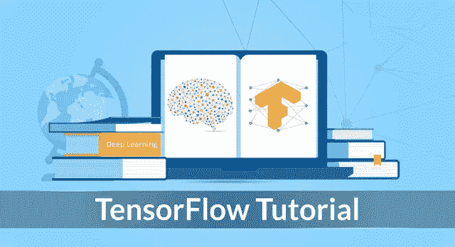
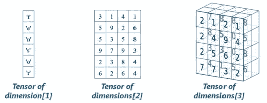
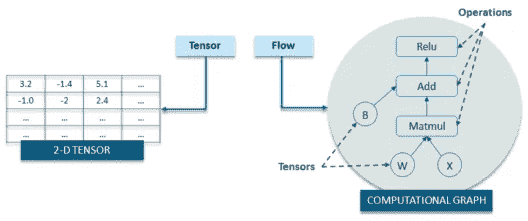
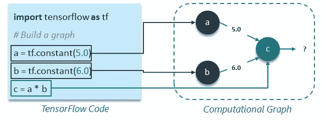
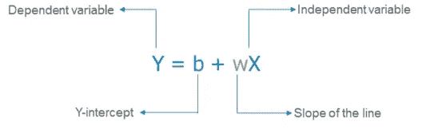
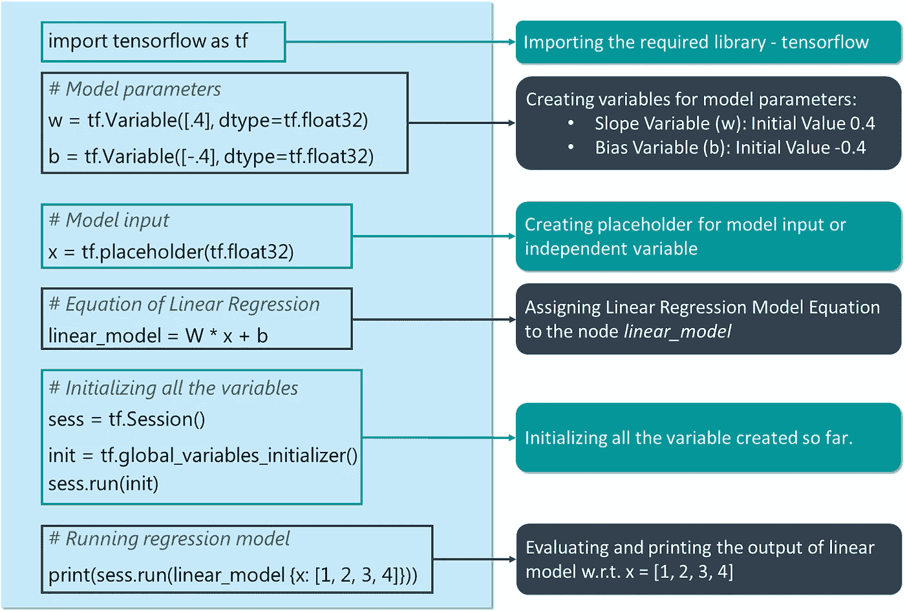
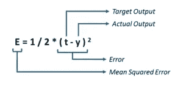
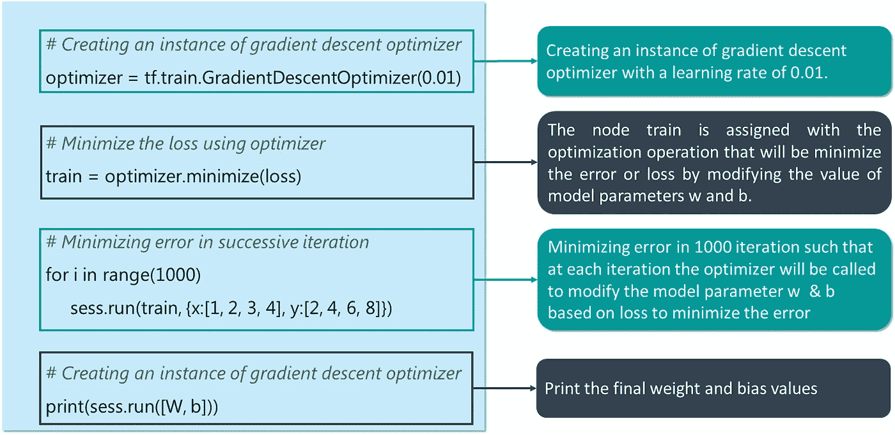

# TensorFlow 教程-使用 TensorFlow 进行深度学习的全面指南

> 原文：<https://medium.com/edureka/tensorflow-tutorial-ba142ae96bca?source=collection_archive---------4----------------------->



TensorFlow Tutorial — Edureka

我为有兴趣应用深度学习算法使用 TensorFlow 解决各种问题的专业人士和爱好者设计了这篇 TensorFlow 教程。TensorFlow 是一个开源的深度学习库，它基于数据流图的概念来构建模型。它允许您创建具有许多层的大规模神经网络。以下是这篇 TensorFlow 教程文章将讨论的主题:

*   **什么是张量流**
*   **张量流代码基础**
*   **TensorFlow 用例**

# 张量是什么？

在这篇 TensorFlow 教程中，在讲 TensorFlow 之前，我们先来了解一下*什么是张量*。张量只不过是深度学习中表示数据的事实。



如上图所示，张量只是多维数组，它允许你表示更高维的数据。一般来说，深度学习处理高维数据集，其中维度指的是数据集中存在的不同特征。事实上,“张量流”这个名字来源于神经网络对张量执行的操作。它实际上是一个张量流。既然，你已经理解了什么是张量，让我们在这个张量流教程中继续前进，理解— *什么是张量流？*

# 什么是张量流？

TensorFlow 是一个基于 Python 的库，为实现深度学习模型提供了不同类型的功能。如前所述，术语张量流由两个术语组成——张量和流:



在 TensorFlow 中，术语张量是指多维数组形式的数据表示，而术语流是指对张量执行的一系列操作，如上图所示。

现在我们已经介绍了足够多的关于 TensorFlow 的背景知识。

接下来，在这个张量流教程中，我们将讨论张量流代码基础。

# 代码基础

基本上，编写 TensorFlow 程序的整个过程包括两个步骤:

1.  构建计算图
2.  运行计算图表

我来给你一一解释一下以上两个步骤:

## 构建计算图

那么，*什么是计算图？*嗯，计算图是一系列排列成图中节点的张量流运算。每个节点取 0 个或多个张量作为输入，并产生一个张量作为输出。让我给你一个简单的计算图的例子，它由三个节点组成——a***a***，***b***&***c***如下所示:



## 以上计算图的解释:

*   常量节点用于存储常量值，因为它接受零输入，但产生存储的值作为输出。在上面的例子中，a 和 b 分别是值为 5 和 6 的常量节点。
*   节点 c 表示常量节点 a 与 b 相乘的操作。因此，执行节点 c 将导致常量节点 a 与 b 相乘。

基本上，人们可以将计算图视为一种替代方式，将张量流程序中发生的数学计算概念化。分配给计算图的不同节点的操作可以并行执行，因此在计算方面提供了更好的性能。

这里我们只是描述计算，它不计算任何东西，它不保存任何值，它只是定义你的代码中指定的操作。

## 运行计算图表

让我们以之前的计算图为例，了解如何执行它。以下是上一个示例中的代码:

**例 1:**

```
import tensorflow as tf

# Build a graph
a = tf.constant(5.0)
b = tf.constant(6.0)
c = a * b
```

现在，为了获得节点 c 的输出，我们需要在一个**会话**中运行计算图。Session 将图形操作放到设备上，如 CPU 或 GPU，并提供执行它们的方法。

会话封装了 TensorFlow 运行时的控制和状态，即它存储了有关所有操作执行顺序的信息，并将已计算操作的结果传递给管道中的下一个操作。让我向您展示如何在一个会话中运行上面的计算图(每行代码的解释已作为注释添加):

```
# Create the session object
sess = tf.Session()

#Run the graph within a session and store the output to a variable
output_c = sess.run(c)

#Print the output of node c
print(output_c)

#Close the session to free up some resources
sess.close()
```

输出将是:

```
30
```

所以，这都是关于会话和在会话中运行计算图。现在，让我们谈谈在使用 TensorFlow 构建深度学习模型时我们将广泛使用的变量和占位符。

# 常量、占位符和变量

在 TensorFlow 中，常量、占位符和变量用于表示深度学习模型的不同参数。因为我之前已经讨论过常量，所以我将从占位符开始。

## 占位符:

TensorFlow 常数允许您存储一个值，但是，如果您希望节点在运行时接受输入，该怎么办呢？对于这种功能，使用占位符允许您的图形将外部输入作为参数。基本上，占位符是对以后或运行时提供一个值的承诺。让我给你举个例子，让事情变得简单些:

```
import tensorflow as tf

# Creating placeholders
a = tf. placeholder(tf.float32)
b = tf. placeholder(tf.float32)

# Assigning multiplication operation w.r.t. a &amp;amp; b to node mul
mul = a*b

# Create session object
sess = tf.Session()

# Executing mul by passing the values [1, 3] [2, 4] for a and b respectively
output = sess.run(mul, {a: [1,3], b: [2, 4]})
print('Multiplying a b:', output)
```

输出将是:

```
**Output:**
[2\. 12.]
```

## 关于占位符需要记住的几点:

*   占位符未初始化，不包含任何数据。
*   人们必须向占位符提供在运行时要考虑的输入或反馈。
*   在没有输入的情况下执行占位符会产生错误。

现在，让我们向前看，理解— *什么是变量？*

## 变量

在深度学习中，占位符用于在你的模型或图形中获取任意输入。除了接受输入之外，您还需要修改图形，以便它可以根据相同的输入产生新的输出。为此，您将使用变量。简而言之，变量允许您向图形中添加可训练的参数或节点，即值可以在一段时间内修改。变量通过提供初始值和类型来定义，如下所示:

```
var = tf.Variable( [0.4], dtype = tf.float32 )
```

> **注:**
> 
> *如果您没有明确提供数据类型，TensorFlow 将从初始化的值中推断出常量/变量的类型。*
> 
> TensorFlow 有许多自己的数据类型，如 *tf.float32* 、 *tf.int32* 等。*这里的* *你可以参考* [*以上的全部。*](https://www.tensorflow.org/api_docs/python/tf/DType)

常数在调用 *tf.constant* 时被初始化，它们的值永远不能改变。相反，当你调用 *tf 时，变量不会被初始化。变量*。要初始化 TensorFlow 程序中的所有变量，您**必须**显式调用如下所示的特殊操作:

```
init = tf.global_variables_initializer() 
sess.run(init)
```

永远记住，在第一次使用图形之前，必须对变量进行初始化。

> **注:** *TensorFlow 变量是包含张量的内存缓冲区，但与仅在图形运行时实例化并在运行后立即删除的普通张量不同，变量在图形的多次执行中仍然存在。*

现在我们已经介绍了足够多的 TensorFlow 基础知识，让我们继续了解如何使用 TensorFlow 实现线性回归模型。

# 使用张量流的线性回归模型

线性回归模型用于使用如下所示的线性回归方程，从一个变量(因变量)的已知值预测另一个变量(自变量)的未知值:



因此，要创建线性模型，您需要:

1.  因变量或输出变量(Y)
2.  斜率变量(w)
3.  Y —截距或偏差(b)
4.  独立或输入变量(X)

因此，让我们开始使用 TensorFlow 构建线性模型:



单击下面的按钮复制代码:

```
# Creating variable for parameter slope (W) with initial value as 0.4
W = tf.Variable([.4], tf.float32)

#Creating variable for parameter bias (b) with initial value as -0.4
b = tf.Variable([-0.4], tf.float32)

# Creating placeholders for providing input or independent variable, denoted by x
x = tf.placeholder(tf.float32)

# Equation of Linear Regression
linear_model = W * x + b

# Initializing all the variables
sess = tf.Session()
init = tf.global_variables_initializer()
sess.run(init)

# Running regression model to calculate the output w.r.t. to provided x values
print(sess.run(linear_model {x: [1, 2, 3, 4]}))
```

**输出:**

```
[ 0\.     0.40000001 0.80000007 1.20000005]
```

上述代码仅代表回归模型实现背后的基本思想，即如何遵循回归线方程，以获得与一组输入值相关的输出。但是，为了使这个模型成为一个完整的回归模型，还有两件事情需要添加:

*   首先，我们需要提供一种机制，通过这种机制，我们的模型可以根据给定的一组输入和相应的输出自动训练自己。
*   我们需要做的第二件事是，根据给定的一组 x 值，通过将模型的输出与期望或目标输出进行比较，来验证我们训练好的模型。

现在，让我们了解如何将上述功能整合到我的回归模型代码中。

# 损失函数—模型验证

损失函数衡量模型的当前输出与期望输出或目标输出之间的差距。我将为我的线性回归模型使用一个最常用的损失函数，称为误差平方和或 SSE。SSE 计算出 w.r.t .模型输出(由 linear_model 表示)和期望或目标输出(y)为:



```
y = tf.placeholder(tf.float32)
error = linear_model - y
squared_errors = tf.square(error)
loss = tf.reduce_sum(squared_errors)
print(sess.run(loss, {x:[1,2,3,4], y:[2, 4, 6, 8]})
```

输出将是:

```
**Output:**
90.24
```

如你所见，我们的损失值很高。因此，我们需要调整我们的权重(W)和偏差(b ),以减少我们接收到的误差。

# tf.train API —为模型定型

TensorFlow 提供了**优化器**，它们缓慢地改变每个变量，以最小化损失函数或误差。最简单的优化器是**梯度下降**。它根据该变量的损失导数的大小来修改每个变量。


```
#Creating an instance of gradient descent optimizer
optimizer = tf.train.GradientDescentOptimizer(0.01)

train = optimizer.minimize(loss)

for i in range(1000):
     sess.run(train, {x:[1, 2, 3, 4], y:[2, 4, 6, 8]})
print(sess.run([W, b]))
```

输出将是:

```
**Output:** [array([ 1.99999964], dtype=float32), array([ 9.86305167e-07], dtype=float32)]
```

这就是如何使用 TensorFlow 创建一个线性模型，并训练它以获得所需的输出。

*这就把我们带到了“张量流教程”这篇文章的结尾。我希望这篇文章对你有所帮助，并增加了你的知识价值。*

如果你想查看更多关于人工智能、DevOps、道德黑客等市场最热门技术的文章，你可以参考 Edureka 的官方网站。

请留意本系列中的其他文章，它们将解释深度学习的各个其他方面。

> 1.[tensor flow 中的物体检测](/edureka/tensorflow-object-detection-tutorial-8d6942e73adc)
> 
> 2. [PyTorch 教程](/edureka/pytorch-tutorial-9971d66f6893)
> 
> 3.[感知器学习算法](/edureka/perceptron-learning-algorithm-d30e8b99b156)
> 
> 4.[神经网络教程](/edureka/neural-network-tutorial-2a46b22394c9)
> 
> 5.[什么是反向传播？](/edureka/backpropagation-bd2cf8fdde81)
> 
> 6.[卷积神经网络](/edureka/convolutional-neural-network-3f2c5b9c4778)
> 
> 7.[胶囊神经网络](/edureka/capsule-networks-d7acd437c9e)
> 
> 8.[递归神经网络](/edureka/recurrent-neural-networks-df945afd7441)
> 
> 9.[自动编码器教程](/edureka/autoencoders-tutorial-cfdcebdefe37)
> 
> 10.[受限玻尔兹曼机教程](/edureka/restricted-boltzmann-machine-tutorial-991ae688c154)
> 
> 11. [PyTorch vs TensorFlow](/edureka/pytorch-vs-tensorflow-252fc6675dd7)
> 
> 12.[用 Python 进行深度学习](/edureka/deep-learning-with-python-2adbf6e9437d)
> 
> 13.[人工智能教程](/edureka/artificial-intelligence-tutorial-4257c66f5bb1)
> 
> 14.[张量流图像分类](/edureka/tensorflow-image-classification-19b63b7bfd95)
> 
> 15.[人工智能应用](/edureka/artificial-intelligence-applications-7b93b91150e3)
> 
> 16.[如何成为一名人工智能工程师？](/edureka/become-artificial-intelligence-engineer-5ac2ede99907)
> 
> 17.[问学习](/edureka/q-learning-592524c3ecfc)
> 
> 18. [Apriori 算法](/edureka/apriori-algorithm-d7cc648d4f1e)
> 
> 19.[用 Python 实现马尔可夫链](/edureka/introduction-to-markov-chains-c6cb4bcd5723)
> 
> 20.[人工智能算法](/edureka/artificial-intelligence-algorithms-fad283a0d8e2)
> 
> 21.[机器学习的最佳笔记本电脑](/edureka/best-laptop-for-machine-learning-a4a5f8ba5b)
> 
> 22.[12 大人工智能工具](/edureka/top-artificial-intelligence-tools-36418e47bf2a)
> 
> 23.[人工智能(AI)面试问题](/edureka/artificial-intelligence-interview-questions-872d85387b19)
> 
> 24. [Theano vs TensorFlow](/edureka/theano-vs-tensorflow-15f30216b3bc)
> 
> 25.[什么是神经网络？](/edureka/what-is-a-neural-network-56ae7338b92d)
> 
> 26.[模式识别](/edureka/pattern-recognition-5e2d30ab68b9)
> 
> 27.[人工智能中的阿尔法贝塔剪枝](/edureka/alpha-beta-pruning-in-ai-b47ee5500f9a)

*原载于 2017 年 11 月 7 日*[*www.edureka.co*](https://www.edureka.co/blog/tensorflow-tutorial/)*。*