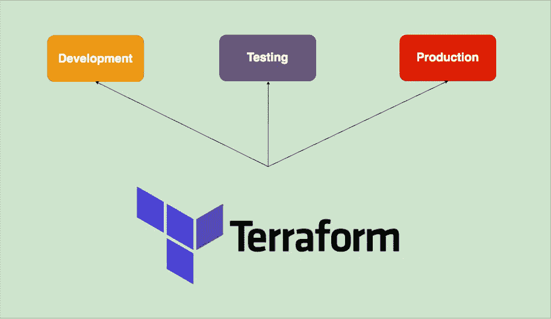

# Terraform —在多种环境中创建基础设施的 5 种方法

> 原文：<https://medium.com/bb-tutorials-and-thoughts/terraform-5-ways-to-create-infrastructure-in-multiple-environments-8a6e3f42a694?source=collection_archive---------0----------------------->

## 使用 Terraform 探索在不同环境中创建基础设施的不同方式

Terraform 是一个开源基础设施，作为一个代码软件工具，提供一致的 CLI 工作流来管理数百个云服务。Terraform 将云 API 编译成声明式的…