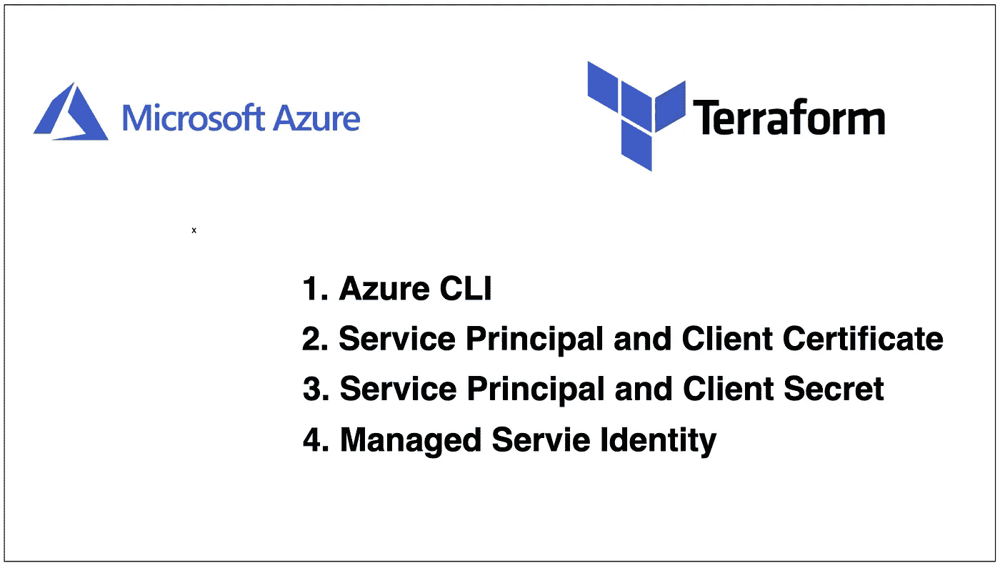

# terraform——通过示例项目使用 Azure 进行身份验证的不同方式

> 原文：<https://medium.com/bb-tutorials-and-thoughts/terraform-different-ways-to-authenticate-with-azure-with-example-project-5bb224e9bbcf?source=collection_archive---------0----------------------->

## 通过一个示例项目探索所有可能的方法

Terraform 是 HashiCorp 提供的基础设施代码。它是一种以安全、可重复的方式构建、更改和管理基础设施的工具。运营商和基础设施团队可以使用 Terraform 来管理环境，并提供…