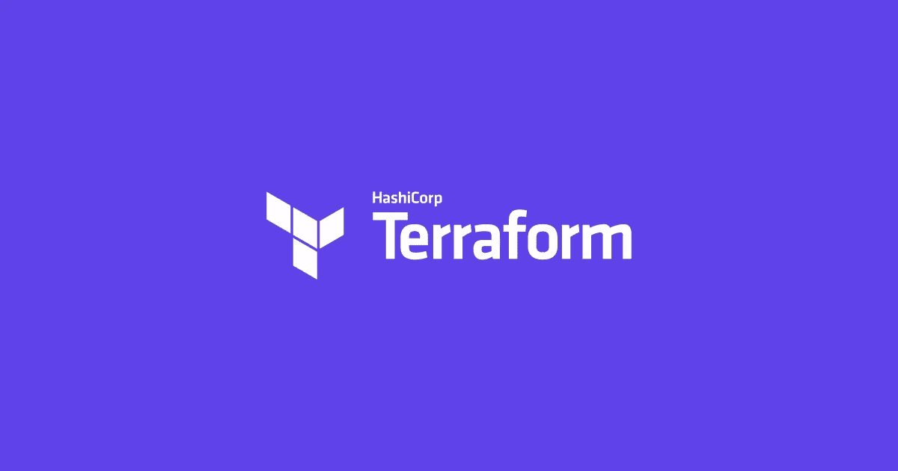

# 现实生活中的地形:经验教训

> 原文：<https://medium.com/version-1/terraform-in-real-life-lessons-learned-2469e3fe74e6?source=collection_archive---------0----------------------->



作为[第一版](https://www.version1.com/)的 [AWS 顾问](https://www.version1.com/about-us/our-technology-partnerships/amazon-web-services/)，基础设施作为代码在我的工作中扮演了重要角色。由于我们是一个云计算合作伙伴，我们选择的 IaC 工具是 Terraform。除了支持许多提供商(包括所有主要的云)，Terraform 还为平台工程师提供了许多好处，包括集中式状态管理、版本可控模块和一些高级语言功能。

我已经为 AWS 和 Azure 使用 Hashicorp 工具超过 4 年了，并且是一名认证的 Terraform 助理。我想用这篇文章来概述我经历过的一些错误/陷阱/最佳实践。

以下不是全面的最佳实践指南。哈希公司提供了[关于如何使用 Terraform 的很棒的材料](https://learn.hashicorp.com/terraform)和他们推荐的做法，如果你还没有的话，值得去看看。以下是我根据自己的经验总结的一些小技巧。

# 非常熟悉提供商文档(和变更日志)

如果你是 Terraform 的新手，并计划更多地使用它，你绝对需要知道如何浏览 [terraform 提供商文档](https://registry.terraform.io/namespaces/hashicorp)。例如，如果你打算在 AWS 中构建，你将在这里花费大量的时间。在撰写本文时，Terraform 支持 140 种 AWS 服务——每种服务都有一个或多个具有许多属性的资源。而这只是针对 AWS。

虽然没有人会使用每一种资源，但你无疑需要知道你使用的资源有哪些选择。在这方面，提供商文档是您的圣经。每当更新提供商时，文档都会作为版本的一部分进行更新，因此它们也会反映最新的可用资源和属性。

另一个方便的信息来源是提供者变更日志。同样，每个提供程序版本都会更新这些信息。它们是检查资源最近变化的有用方法，这些变化有时会导致代码中不必要的变化，甚至破坏您的 Terraform 计划。这可以通过固定您的提供商版本来缓解(见下文)，但有时您需要使用最新的提供商来利用您最喜欢的云的新版本。例如，这里有一个 [AWS 提供商变更日志](https://github.com/hashicorp/terraform-provider-aws/blob/main/CHANGELOG.md)，我发现在这个页面上搜索特定的资源(例如“aws_ec2_transit_gateway”)来查找任何最近的变更非常方便。

# 版本化您的 Terraform(和提供商)

正如 Hashicorp 推荐的[,向 Terraform 和 provider 版本添加约束是最佳实践。虽然您的配置中使用的 Terraform 和每个提供程序的版本都应该被固定(约束)，但它们会以不同的方式影响您的代码:](https://learn.hashicorp.com/tutorials/terraform/provider-versioning?in=terraform/configuration-language)

**Terraform 版本** : `terraform`命令(`init|plan|apply`等)使用安装在其运行的主机上的 Terraform 版本。因此版本不会改变，除非你重新安装 Terraform(或使用`tfswitch`——见下文)。但是，当您开始与其他工程师一起处理更大的项目时，跨桌面一致性的要求就很明显了。通过在配置中设置所需的 Terraform 版本，所有使用该配置的开发人员必须在其计算机上安装正确版本的 Terraform。

```
terraform {
  required_version = "~> 1.0.5" # >= 1.0.5, < 1.1.0
}
```

在上面的例子中，你可以看到我使用了一个`~` (tilda)作为版本约束的一部分，tilda 允许在一个特定的次要版本中发布新的补丁，所以在这种情况下，我们可以使用 1.0.5 到下一个主要版本(1.1.0)之间的任何版本。

**提供者:**与已经安装在主机上的 Terraform 不同，提供者在`terraform init`期间被拉取。默认行为是在您的代码中获取每个提供程序的最新版本。如上所述，最新的并不总是您想要的，因为它会对您已经构建的现有资源带来变化。

Terraform 提供了两种管理提供程序版本的简单方法，传统方法是在 terraform 块中使用约束，即设置 Terraform 版本的位置:

```
terraform {
  required_version = "~> 1.0.5" # >= 1.0.5, < 1.1.0
  required_providers {
    aws = {
      source  = "hashicorp/aws"
      version = "~> 3.0" # >= 3.0 < 4.0
    }
  }
}
```

# 使用 for_each 代替 count

在 Terraform 12 中引入`for_each`之前，`count`是从单个资源块创建多个相似对象的唯一方法。使用`count`的缺点是它创建了一个难以修改的资源列表。举以下例子:

```
variable "subnets" {
  default = ["10.1.11.0/24", "10.1.12.0/24"]
}resource "aws_subnet" "this" {
  count      = length(var.subnets)
  cidr_block = var.subnets[count.index]
  vpc_id     = var.vpc_id
}
```

上面的代码将创建两个子网—列表中的每个 cidr 一个子网:

```
Terraform will perform the following actions:# aws_subnet.main[0] will be created
  + resource "aws_subnet" "main" {
      ...
      + cidr_block                      = "10.1.11.0/24"
      + tags                            = {
          + "Name" = "subnet-10.1.11.0/24"
        }
      ...
    }# aws_subnet.main[1] will be created
  + resource "aws_subnet" "main" {
      ...
      + cidr_block                      = "10.1.12.0/24"
      + tags                            = {
          + "Name" = "subnet-10.1.12.0/24"
        }
      ...
    }Plan: 2 to add, 0 to change, 0 to destroy.
```

现在，如果我们要添加第三个子网，在其他子网之前添加 cidr 块，子网变量如下所示:

```
variable "subnets" {
  default = ["10.1.10.0/24","10.1.11.0/24", "10.1.12.0/24"]
}
```

这将导致以下计划:

```
Plan: 3 to add, 0 to change, 2 to destroy.
```

正如我们从该计划中看到的，我们的 2 个原始子网将被**销毁**并重新创建。这是使用`count`创建资源列表的局限性。解决方法是使用 Terraform 的`for_each`来代替:

```
variable "subnets" {
  default = ["10.1.11.0/24", "10.1.12.0/24"]
}resource "aws_subnet" "main" {
  for_each = toset(var.subnets) # toset converts var.subnets to a set, which is required when using for_each on a list vpc_id     = var.vpc_id
  cidr_block = each.value tags = {
    Name = "subnet-${each.value}"
  }
}
```

当使用 for_each 并将一个条目添加到列表的开头或结尾时，我们的计划中只有一个变化，这就是我们想要的:

```
variable "subnets" {
  default = ["10.1.10.0/24","10.1.11.0/24", "10.1.12.0/24"]
}...Plan: 1 to add, 0 to change, 0 to destroy.
```

上面的例子强调了使用`count`在更新资源时会带来复杂性。因此，将`for_each`用于资源列表，将`count`用于简单的组是一个很好的实践:

> 如果你的实例几乎相同，`count`是合适的。如果他们的一些参数需要不同的值，而这些值不能直接从整数中导出，那么使用`for_each`会更安全。

# 使用(并保护)远程状态

与其他 IaC 工具相比，Terraform 的一个关键特性是它的状态管理。Terraform 使用状态文件来记住它所管理的资源的预期状态。这使我们能够维护和更新环境。

> Terraform 使用此状态将真实世界的资源映射到您的配置，跟踪元数据，并提高大型基础架构的性能。

默认情况下，Terraform 将状态存储在一个名为`terraform.tfstate`的本地文件中。虽然这对于快速的演示/POC 部署来说很好，但是不推荐用于生产构建，尤其是那些由团队管理的构建。每个开发人员都需要访问 statefile 的最新版本，以避免对现有资源的意外更新。

Terraform 提供远程后端，用于存储集中式状态文件，以支持协作和版本控制。例如，在 AWS 中，远程状态可以存储在 S3 或运行在 RDS 上的 Postgres 数据库中。与 S3 相比，使用 Postgres 数据库的一个优点是它提供了**状态锁定**，防止并发更新状态文件(例如，来自多个开发人员或管道)。

在状态文件中需要注意的重要一点是，它们包含资源的所有属性，并且可能包含秘密和其他敏感数据。因此，像保护数据库或其他敏感数据存储一样保护您的远程后端是一个很好的做法。例如，对于 S3，我们建议使用 SSE 加密静态数据，并使用 IAM 和存储桶策略限制用户和网络访问。此外，我建议启用 bucket versioning 来允许在状态文件损坏或删除的情况下进行恢复。

# 全押在 Terraform 上

如前一节所述，Terraform 是有状态的——它跟踪对您的基础设施所做的更改，不管它是否做了这些更改。

例如，如果 Terraform 创建了一个带有一些标记的安全组，然后系统管理员通过控制台手动更改这些标记…下次 Terraform 应用时，它会将标记更新为原始值。虽然这个场景听起来并不是灾难性的，但它强调了在其他地方对由 Terraform 管理的资源进行更改将会出现的问题。

如果 sysadmin 没有修改标签，而是修改了一些更重要的东西，比如将`instance_type`修改为一个更大的实例，然后 Terraform 在下一次应用时恢复它，这会给应用程序带来重大问题。因此，建议在 Terraform 上全押，避免将 IaC 与手动更改结合使用。

Terraform 确实提供了修改其状态的命令(`rm | import | taint`)，可以利用这些命令使 Terraform“忘记”或“发现”资源。但是，根据经验，我发现这些过程可能会很复杂和混乱，应该作为最后的手段使用。我的建议是——如果你用 Terraform 创建它——用 Terraform 管理它。

# Terraform 不能做所有的事情…或者至少不应该做

虽然 Terraform 是构建基础设施的绝佳工具，但它并不适合所有情况。将所有东西都放在您的`.tf`文件中，并使用像`aws_cloudformation_stack`这样的资源，像`local-exec`和`remote-exec`这样的供应器，以及其他运行非本地脚本的方式，这很有诱惑力。沿着这条路线走下去，你会很容易发现自己处于“方钉圆孔”的领地。

通常，当您扩展 Terraform 的边界时，您就开始损害它提供的好处，例如更新现有资源。我并不是说不要在 Terraform 中使用 trigger other 脚本，这在某些情况下是有意义的，比如当你已经在 CFN 定义了一个完整的栈，但是其他的都是用 Terraform 部署的。根据经验，我建议尽可能使用原生 Terraform 资源，并考虑使用其他他们擅长的工具，例如 Ansible，用于配置实例和部署应用程序的管道。

# 使用工具

这篇文章的最后一个技巧是利用现有的地形工具。随着 Terraform 越来越受欢迎，越来越多的开源助手工具变得可用。正如在上面的模块中提到的，随着你的 Terraform 足迹的增长，加强标准化是必要的。这些工具中的许多将有助于实施最佳实践，尤其是当包含在您的 CI 流程中时。以下是我最喜欢的一些，但绝不是详尽的列表:

*   `terraform fmt`:内置[地形命令](https://www.terraform.io/docs/cli/commands/fmt.html)应用推荐的编码约定
*   tfswitch :在你的工作站上管理和切换地形版本的便捷工具
*   tflint :用于实施最佳实践的插件(比如命名约定)
*   tfsec :对您的 terraform 模板进行静态分析，以发现潜在的安全问题(比如硬编码的密码)
*   [terratest](https://github.com/gruntwork-io/terratest) :自动化测试库，通过发出 HTTP 请求、API 调用、SSH 连接等来验证基础设施在该环境中是否正常工作。
*   [terraform_docs](https://github.com/terraform-docs/terraform-docs) :用于生成 terraform 模块文档的包
*   [checkov](https://www.checkov.io/4.Integrations/Terraform%20Scanning.html):IaC 工具的静态代码分析，它提供了 AWS 和 Azure 的[最佳实践检查](https://www.checkov.io/5.Policy%20Index/terraform.html)以及对定制规则的支持
*   [预提交](https://github.com/antonbabenko/pre-commit-terraform):在推送 Terraform 代码之前，强制/提醒开发人员执行某些操作(如 fmt、lint、docs)的 git 挂钩集合


*希望你发现了一些对你自己的 Terraform 冒险有帮助的提示。有许多话题我没有在这篇博客中涉及，包括模块和 CI/CD。我希望在以后的文章中涵盖这些内容。如果你有任何问题，或者你自己的建议，或者工具推荐分享，请在评论中发表。*