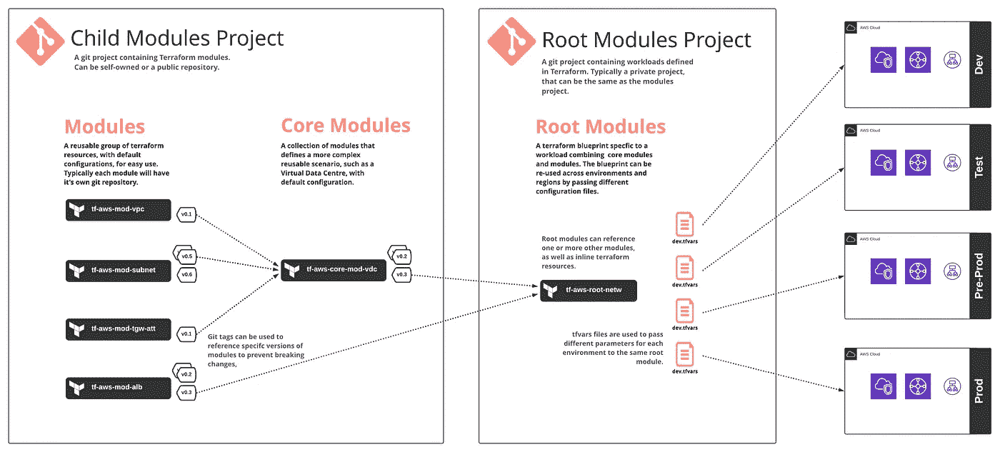
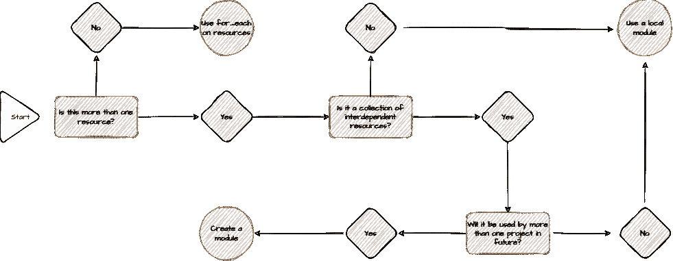
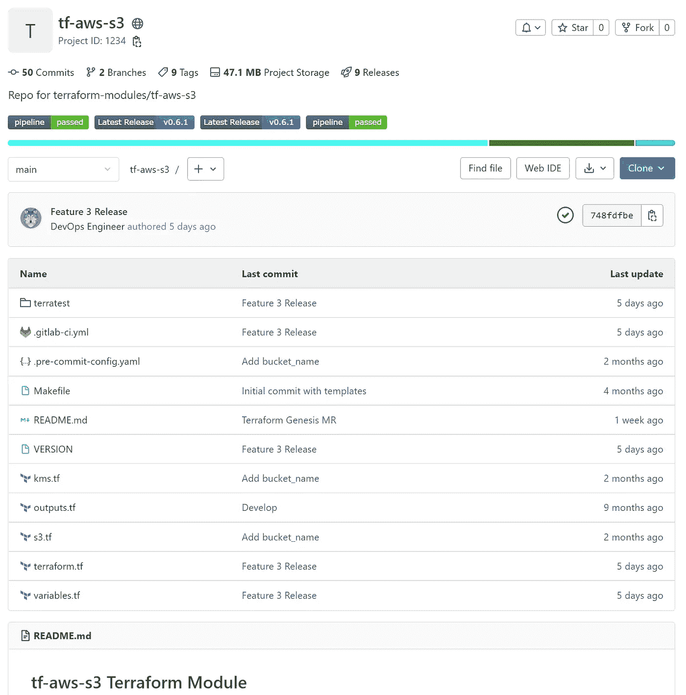

# 现实生活中的地形:编写模块

> 原文：<https://medium.com/version-1/terraform-in-real-life-writing-modules-c0b6b5335218?source=collection_archive---------0----------------------->

这是我在[的第一篇博客](/version-1/terraform-in-real-life-lessons-learned-2469e3fe74e6)的后续。在这篇文章中，我想谈谈我编写 Terraform 模块的经历以及这些年来我收集的一些技巧。

# 什么是模块？

> 模块是一起使用的多个资源的容器。
> 
> 每个 Terraform 配置至少有一个模块，称为其*根模块*，由主工作目录中的`*.tf*`文件中定义的资源组成。

什么是模块？上面来自 terraform 文档的描述解释了基本上每个 Terraform 配置你可以`init`和`apply`是一个模块。然而，当我们谈论模块时，我们通常指的是可重复的 Terraform 代码块，我们可以对其进行测试、版本控制和重用以减少重复。例如，在更传统的编程语言如 Java 中，Terraform 模块等同于类或方法。模块是 Terraform 的一个非常有用的特性，绝对应该加以利用。然而，它们确实给你的开发过程带来了额外的考虑。

terraform 文档中的上述语句表明，任何包含 Terraform 代码的目录本质上都是一个模块。然而，通常，当我们谈论 Terraform 模块时，我们不是在谈论根模块，而是“子”模块——通常称为“模块”。这些是 Terraform 代码片段，可以用作构建块，拼凑在一起以定义工作负载和环境。想想乐高。

Terraform 模块只是一个包含一个或多个`.tf`文件的目录。正确使用时，它可以成为一个强大的工具，提供许多好处，包括:

*   版本控制
*   减小爆炸半径
*   保持地形代码[干燥](https://www.educative.io/blog/coding-best-practices#DRY)(尽可能)
*   确保跨环境和项目的可预测性和一致性
*   支持开发运维团队之间的协作

## 模块类型

在您的代码中可以通过两种方式引用子模块—本地和远程。本地模块存储在根模块旁边的目录中，允许您将代码的相关部分分组并重用它们。这方面的一个例子可能是您希望在您的环境中多次部署的默认 S3 存储桶模板。本地模块易于管理，因为它们只是您的(根)Terraform repo 的另一部分。

另一方面，远程子模块存储在远程位置(例如，一个单独的 git 存储库)。远程模块的主要优势在于，它们可以在多个地形项目中重复使用，这意味着它们可能具有相当大的爆炸半径，因此需要进行一致的管理。

下图说明了如何使用远程模块来构建多个环境。



Overview of how modules can be defined in Terraform

## **从哪里开始？**

在很多情况下，你会在 [Terraform 注册表](https://registry.terraform.io/)中找到你需要的东西。有时你可以直接从注册表中使用模块，或者克隆它们并根据你的需要添加一些调整。在版本 1 中，我们为客户实现了我们的 Terraform 标准，因此我们编写了自己的标准。下面的技巧是针对其他正在编写自己的远程模块的 Terraform 用户的。

# 我的建议

以下建议是过去 6 年在真实客户项目中使用 Terraform 时收集到的。这不是一个详尽的指南，而是我学到的一些经验，希望对其他人有用。我在这里关注的是远程“子”模块，它们存储在自己的 git 存储库中。

## 需要模块吗？

这是你应该问自己的第一个问题。规划模块会让你的生活轻松很多。虽然模块提供了许多优势，但它们确实增加了维护代码库的额外开销。因此，您必须决定远程模块是否适合您的需求——我通过提出以下问题来做出决定:



Module decision Flow

## 强制执行标准

当您决定需要一个远程子模块时，您应该有一个合适的结构——当开发其他团队使用的模块时，一致性和标准是必不可少的。使用一些可用的 Terraform 工具可以极大地帮助执行标准(参见我的[以前的博客](/version-1/terraform-in-real-life-lessons-learned-2469e3fe74e6)中的例子)。在版本 1 中，我们为模块建立了以下标准:

*   一致的回购结构
*   优质读物
*   命名约定— tf- <provider>-<module-name></module-name></provider>
*   语义版本化( [semver](https://semver.org/) )
*   自动化模块测试
*   主/主要分支的保护
*   完整的工作示例

这是一个完整模块回购的示例:



Example of a module repo in GitLab

注意:在上面的例子中，工作示例包含在 Terratest 目录中，该目录用于测试模块和演示如何使用它。

## Pin 提供商和 Terraform 版本

正如哈希公司的[所推荐的](https://learn.hashicorp.com/tutorials/terraform/provider-versioning?in=terraform/configuration-language)，向 Terraform 和 provider 版本添加约束是一个最佳实践。这在`required_providers`块中很容易做到，并减少以后的麻烦。

然而，根据经验，我发现固定提供者会使维护模块变得更加复杂——特别是当它们是嵌套的时候(见下一节)。我的偏好是在一个“子”模块中设置一个最低的提供者版本，然后在根模块中收紧约束。

```
# moduleterraform {
  required_version = ">= 1.0.0"
  required_providers {
    aws = {
      source  = "hashicorp/aws"
      version = "~> 3.0"
    }
  }
}
```

在上面的代码片段中，我们设置了一个最小的 Terraform 版本，以便为模块的用户提供灵活性。我们对 AWS 提供者更加严格，Tilda 允许用户使用所有次要版本(3。x)但不是不同的主要版本，如 4.1。

```
# root moduleterraform {
  required_version = "~> 1.1.0"
  required_providers {
    aws = {
      source  = "hashicorp/aws"
      version = "=3.20"
    }
  }
}
```

这是一个根模块的例子(例如，我们的模块被消费的地方)。这里我们更加严格，因为它不是一个构建模块，而是一个环境蓝图。因此，我们通常不想要相同级别的灵活性，相反，我们希望控制配置更改。

## 子模块中包含什么？

考虑什么进入子模块以及在哪里划线是很重要的。作为一个简单的经验法则，我会问“这些资源总是一起创建的吗？”。

例如，为 AWS 应用程序负载平衡器(ALB)创建模块时，可以添加以下资源:

*   负载平衡器
*   HTTPS 听众
*   默认目标群体
*   53 号公路别名记录

然后输入以下内容，因为这些内容可能是作为另一个网络共享模块的一部分创建的:

*   伐木用 S3 铲斗
*   53 号公路托管区

以上只是一个例子，将取决于你的模块和项目的整体结构。关键是，我们不希望在一个子模块中包含所有可能相关的资源。

## 不要窝来窝去

重申我的第一点，如果你计划好你的模块，它会让你的生活变得容易得多。Terraform 允许模块嵌套，这意味着一组基本模块可以组合起来创建一个更复杂的模式(我们称之为“核心模块”)。例如，由较小的 ALB、EC2 和 RDS 模块组成的应用程序模块。这是一个很好的模块嵌套用例，但是我建议嵌套不要超过 2 层。再多一点就会导致俄罗斯玩偶场景，维护起来很痛苦——最小模块中单个属性的更新需要在嵌套的每一层进行更改。在我看来，这比它的价值要大得多。

## 不要使输入复杂化

通过创建少量具有许多值的变量(如`var.account_config`)来简化模块的输入似乎是一个好主意，这些变量可能包含诸如`region`、`vpc_id`、`hosted_zone_name`和`subnets`的值。

这可以用在如下模块中:

```
# variables.tf -----------------------variable "account_config" {
  type = any
  description = "A really useful object, with all my account details"
  }variable "instance_config" { 
  type = any
  description = "A really useful object, with all my instance details"
} # main.tf ----------------------------resource "aws_instance" "example" {

  key_name         = var.account_config.key_pair_name
  subnet_id        = var.account_config.subnet_id ami              = var.instance_config.ami_id
  instance_type    = var.instance_config.instance_type ...
}data "aws_route53_zone" "domain" {
  name         = var.account_config.hosted_zone_name
  private_zone = true
}resource "aws_route53_record" "ec2_private_dns" {

  zone_id = data.aws_route53_zone.domain.zone_id name = var.instance_config.name type    = "A"
  ttl     = "300"
  records = [aws_instance.example.private_ip]
}
```

在上面的例子中，`variables.tf` 文件很好也很干净——它只有两个输入，填充了我们需要的所有内容。虽然这可能是一个诱人的方法，但这是一个坏主意…相信我，我也经历过。这种方法使得模块的消费者更难理解所需的输入和使用模块。这也使得为输入设置默认值变得更加复杂，并且使一些变量成为可选的。

```
# variables.tf -----------------------variable "key_pair_name" {
  type        = string
  description = "The name of the EC2 keypair to use for the ec2_user SSH key."
  }variable "subnet_id" {
  type        = string
  description = "The ID of the subnet to create your instance in."
 }variable "ami_id" { 
  type        = string
  description = "ID of the AMI to use for your instance."
}variable "instance_type" {
  type        = string
  description = "The type of instance you want to create."
  default     = "t3.medium" # this makes it optional
}variable "instance_name" {
  type        = string
  description = "The name of the instance you want to create."
  default     = "my_ec2_instance" # this makes it optional
}variable "hosted_zone_name" {
  type        = string
  description = "The name of an existing Route 53 Hosted Zone you want to create a record for your instance in."
}# main.tf ----------------------------resource "aws_instance" "example" {

  key_name         = var.key_pair_name
  subnet_id        = var.subnet_id ami              = var.ami_id
  instance_type    = var.instance_type...
}data "aws_route53_zone" "domain" {
  name         = var.hosted_zone_name
  private_zone = true
}resource "aws_route53_record" "ec2_private_dns" {

  zone_id = data.aws_route53_zone.domain.zone_id name = var.instance_name  type    = "A"
  ttl     = "300"
  records = [aws_instance.example.private_ip]
}
```

更好的解决方案是使用简单的输入，如下所示。虽然这使得变量文件变得更大，但它使得模块更少固执己见，更容易使用。这也意味着您可以轻松地使用 [terraform-doc](https://github.com/terraform-docs/terraform-docs) s 为您的模块生成描述性的 readmes。

一个非常好的关于 Terraform 变量最佳实践的博客可以在[这里](https://lachlanwhite.com/posts/terraform/10-11-2021-terraform-variables-a-standard/)找到。

## 设置逻辑默认值

正如前面提到的，创建大量输入为模块的使用者提供了灵活性。通过为它们设置默认值，它们变成可选的。将这些默认值与您组织的标准保持一致非常重要。例如，将`instance_type`的默认值设置为合理的大小:

```
variable "instance_type" {
  type        = string
  description = "The type of instance you want to create."
  default     = "t3.medium" # this makes it optional
}
```

如果您的组织有严格的实施要求(通常与安全性有关)，您可以完全省略输入 var，并在模块中硬编码该值。这意味着消费者没有覆盖默认设置的选项:

```
resource "aws_ebs_volume" "example" {
  ... encrypted  = true # always will be encrypted
  kms_key_id = var.kms_key_id # consumer must provide their KMS key as an input
}
```

## 提供(许多)描述性输出

模块旨在用作构建块，这意味着它们经常需要向根模块和其他模块提供信息。这些信息是通过使用模块的输出来提供的。Terraform 一直允许您输出资源的属性，而 Terraform 的最新版本允许您输出完整的资源。我更喜欢从模块中输出属性，但是这两种方法都是有效的，关键是要在你的模块中保持一致。

```
# ec2 module - outputs.tfoutput "iam_role_name" {
   description = "Name of EC2 instance IAM Role"
   value = aws_iam_role.main.name}output "instance_id" {
   description = "ID of EC2 instance"
   value = aws_instance.main.id}# root module - main.tfmodule "ec2" {
   ...
}output "ec2_iam_role" {
   description = "IAM Role associated with EC2 Instance"
   value       = module.ec2.iam_role_name
}output "ec2_instance_id" {
   description = "EC2 Instance ID"
   value       = module.ec2.instance_id
}
```

这种方法的好处是，模块的消费者很清楚他们可以获得什么样的输出，并且很容易用 terraform docs 这样的工具进行记录。

```
# ec2 module - outputs.tfoutput "iam_role" {
   description = "EC2 instance IAM Role resource"
   value = aws_iam_role.main}output "instance" {
   description = "EC2 instance resource"
   value = aws_instance.main.id}# root module - main.tfmodule "ec2" {
   ...
}output "ec2_iam_role" {
   description = "IAM Role associated with EC2 Instance"
   value       = module.ec2.iam_role.name
}output "ec2_instance_id" {
   description = "EC2 Instance ID"
   value       = module.ec2.instance.id
}
```

这是另一种输出全部资源的方法。不太清楚什么输出是可用的，但是，这确实意味着消费者可以使用输出的资源的任何属性——他们可能只需要查找提供者文档来找到它们。

如前所述，我更喜欢第一种方法，它符合简单输入的建议。同样，您可以使用 [terraform-doc](https://github.com/terraform-docs/terraform-docs) s 来填充您的模块的自述文件的输出部分。如果您选择这条路线，我建议您输出您认为可能相关的每个属性——否则您将花费大量时间更新您的模块，只是为了在需要时添加输出。

## 使用标签

这并不总是能满足您的需求，但是将标签作为模块的输入会很有用。如果您的模块都使用一个`var.label`作为资源名称的前缀，那么在调用多个模块的根模块中实现您的命名约定就很容易了。

例如:

**S3 模块**

```
# S3 moduleresource "aws_s3_bucket" "my_bucket" {
  bucket = "${var.label}-bucket"
  acl    = "private" ...
}
```

**VPC 模块**

```
resource "aws_vpc" "my_vpc" {
  cidr_block = "172.16.0.0/16" tags = {
    Name = "${var.label}-vpc"
  }
}resource "aws_subnet" "my_subnet" {
  vpc_id            = aws_vpc.my_vpc.id
  cidr_block        = "172.16.10.0/24"
  availability_zone = "us-west-2a" tags = {
    Name = "${var.label}-subnet"
  }
}
```

**根模块**

```
# dev.tfvarslabel = "project-app-dev"# test.tfvarslabel = "project-app-test"# main.tfmodule "s3" {
  source = "git::<my-repo>/tf-aws-mod-s3.git"
  label = var.label...
}module "vpc" {
  source = "git::<my-repo>/tf-aws-mod-vpc.git"
  label = var.label...
}
```

## HACK —本地更新(远程)模块

因为模块是用来解耦你的代码的，所以它们在本质上是分布式的。这意味着在多个地方更新和测试代码是非常耗时的。想想下面的设置——你的根模块调用模块`tf-aws-ec2`，模块又调用模块`tf-aws-iam-profile`。在这种情况下，要为您的环境更改 IAM 概要文件模板，您需要更新两个远程模块，更新它们的标记，在根模块中引用新的模块标记，最后测试更新是否按预期工作。

测试这些更改的快捷方式可以在本地机器上的`.terraform`目录中找到。当您运行`terraform init`或`terraform get`时，您的配置中所有模块的副本都被拉入本地`.terraform/modules`目录。这使您能够在本地对模块(`tf-aws-iam-profile`)进行更新，并通过在您的配置上运行`terraform plan`来测试更改。一旦您对更新确信无疑，您就可以将这些更改复制到远程模块 repos 并更新版本标签。


Photo by [Christopher Gower](https://unsplash.com/@cgower?utm_source=unsplash&utm_medium=referral&utm_content=creditCopyText) on [Unsplash](https://unsplash.com/s/photos/computer?utm_source=unsplash&utm_medium=referral&utm_content=creditCopyText)

编写模块是使用 Terraform 管理企业环境的重要部分。在这里，我根据多年的经验总结了一些建议。我希望它对正在编写自己的模块的其他人有用，并期待听到您从自己的经历中获得的任何提示。

# 关于作者:

Shane Mitchell 是版本 1 的高级 AWS DevOps 工程师。