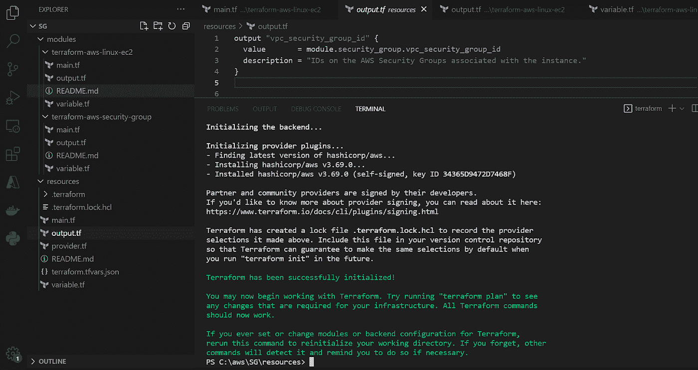
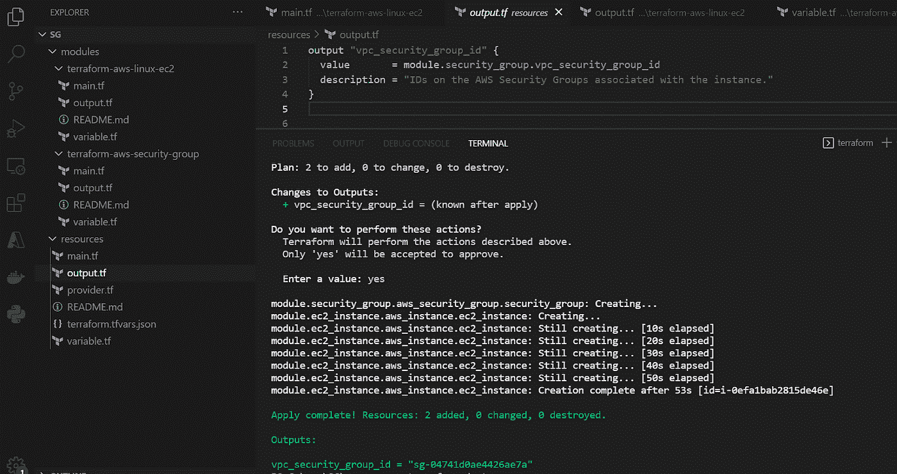

# Terraform 模块:打包和重用

> 原文：<https://medium.com/globant/terraform-modules-package-and-reuse-50d5ec0d5f9d?source=collection_archive---------1----------------------->

# 介绍

随着公共云提供商(如 AWS、Google 和 Microsoft)越来越受欢迎，基础设施即代码(IaC)已经成为主流实践。简而言之，它包括管理一组资源(计算、网络、存储等)。)使用类似于开发人员管理应用程序代码的方法。

在本文中，我们将快速浏览一下 Terraform 模块，看看如何创建 Terraform 模块，使用户能够在任何地方使用相同的代码，并通过使用变量对其进行定制。

Terraform 模块允许您将基础架构的不同资源组合成一个统一的资源。您可以在以后进行可能的定制时重用它们，而不必在每次需要时重复资源定义，这对于具有复杂结构的大型项目是有益的。您可以使用您定义的输入变量定制模块实例，也可以使用输出从它们中提取信息。除了创建你自己的定制模块，现有的模块可以在 [Terraform Registry](https://registry.terraform.io/) 公开获得。

# **地形模块背景**

**模块:打包复用码**

Terraform 模块相当于脚本或编程语言中的函数或方法。它们通过提供输入和返回输出来提供创建资源的标准接口。模块还通过增加可读性和允许团队在逻辑块中组织基础设施来简化项目。模块可以很容易地共享，并提供给任何 Terraform 项目。例如，如果任务是为不同的环境创建多个 VPC，则可以多次调用单个 VPC 模块，而不是为一个完整运行的 VPC 创建每个必要的资源。

模块结构包含 Terraform 文件，如 **main.tf、output.tf、provider.tf、variable.tf** 和 **terraform.tfvars.json** 。

让我们理解这些文件的意义:

**provider . TF:-**Terraform 依靠名为“providers”的插件与云提供商、SaaS 提供商和其他 API 进行交互。要使用来自给定提供者的资源，您需要在配置中包含关于它的一些信息。由于我们在示例中创建了 AWS 资源，所以我们在下图中使用 AWS 作为提供者。

**main.tf :-** 这个文件包含资源配置。参数可以提供输入来定制资源，如下所示:

**variable.tf :-** 我们使用这个文件来提及我们已经在 [main.tf](http://main.tf) 文件中参数化的所有输入变量，如下所示:

**output.tf :-** 在这个文件中，我们为模块中引用的资源生成输出。我们已经生成了安全组 id 的输出，如下所示:

**terraform.tfvars.json :-** 这是我们向变量传递值的重要文件。我们只需要按照我们的要求在这个文件中进行更改，其余的配置将可以在任何地方重用。

**动态块:-** 最后但同样重要的是，动态块是 Terraform 提供的最佳特性之一。在像 resources 这样的顶级块构造中，表达式通常只能在使用 **name = expression** 形式为参数赋值时使用。这涵盖了许多用途，但有些资源类型在其参数中包含可重复的嵌套块，这些嵌套块通常表示与包含对象相关(或嵌入其中)的独立对象。您可以使用特殊的动态块类型动态构造可重复的嵌套块，这在**资源、数据、提供者**和 **provisioner** 块中受到支持。

我在代码中使用了动态块来实际理解这一点。通常，用户将能够只允许有限的 IP 访问安全规则资源中的特定端口。但是使用动态块，用户可以向任何端口添加任意数量的 IP。在下图中，我们展示了一个动态块的例子。

# 先决条件

*   Terraform 安装包含一个二进制文件，我们可以从 Hashicorp 的[下载页面免费下载。](https://www.terraform.io/downloads.html)
*   代码编辑器，如 Visual Studio 代码或 Atom。
*   创建资源的云提供商凭据和权限。

# 地形模块结构

在本节中，我们将定义文件夹结构来映射所有 Terraform 代码。所以这里我们创建了 2 个文件夹，一个是**模块**另一个是**资源**。

Terraform 总是在单个根模块的上下文中运行。一个完整的地形配置包括一个根模块和子模块树(包括根模块调用的模块，这些模块调用的任何模块，等等)。)

**模块:-** 在模块文件夹中，我们需要添加我们想要创建的所有资源配置。我们将为我们的示例创建一个 EC2 实例和一个安全组。

AWS EC2 实例和安全组都创建了 terraform 文件，如 main.tf、outputs.tf 和 variable.tf。

**Resources :-** 在 Resources 文件夹中，我们将调用在 modules 文件夹中创建的模块。我们调用 EC2 实例模块中的安全组模块，这样安全组将自动连接到 EC2。在创建安全组资源时，我们已经从 output.tf 文件中生成了安全组输出。

# 地形执行

**地形初始化:-****地形初始化**命令用于初始化包含地形配置文件的工作目录。这是在编写新的 Terraform 配置或从版本控制中克隆现有配置后应该运行的第一个命令。多次运行该命令是安全的。Terraform 依靠称为“提供商”的插件来与云提供商、SaaS 提供商和其他 API 进行交互。

**terraform init** 搜索提供者的配置，然后安装任何与提供者相关的插件。

**地形计划:-****地形计划**命令用于创建一个执行计划。除非明确禁用，否则 Terraform 会执行刷新，然后确定需要执行哪些操作才能达到配置文件中指定的所需状态。

**地形应用:-****地形应用**命令执行地形计划中提出的动作。在执行之后，我们可以看到已经创建了两个资源(EC2 实例和安全组),我们还可以看到为安全组 id 生成的输出。

**地形摧毁:-** 我们可以用**地形摧毁**命令摧毁已创建的基础设施。

# 结论

在这篇文章的剩余部分，我们将通过深入 Terraform 模块来搭建舞台。如果你从未使用过 Terraform，并且正在寻找更多的实践经验，哈希公司网站上的[教程](https://learn.hashicorp.com/terraform)会很有用。让我们来谈谈平台提供商。Terraform 服务的云提供商超过 100 家。在 Fairwinds，我们使用 Terraform 的三种型号，即 [AWS](https://www.terraform.io/docs/providers/aws/index.html) 、 [GCP](https://www.terraform.io/docs/providers/google/index.html) 和[天蓝色](https://www.terraform.io/docs/providers/azurerm/index.html)。提供者支持与特定 API 的接口，并公开您定义的任何资源。HCL，或 HashiCorp 语言，是用于定义资源的通用语言，不管使用什么提供者。

# 参考

[https://www.terraform.io/language/modules/develop](https://www.terraform.io/language/modules/develop)

[https://www . terraform . io/language/expressions/dynamic-blocks](https://www.terraform.io/language/expressions/dynamic-blocks)

【https://registry.terraform.io/browse/modules 

[https://github.com/nileshjaiwal/Terraform-Modules](https://github.com/nileshjaiwal/Terraform-Modules)