# TerramEarth — 云架构师专业认证案例研究的技术概述

> 原文：<https://medium.com/google-developer-experts/terramearth-vista-t%C3%A9cnica-a-los-casos-de-estudio-de-la-certificaci%C3%B3n-profesional-cloud-architect-218aae2e1999?source=collection_archive---------0----------------------->

本文的目的不是为了阻止您自己研究案例研究,而是帮助您了解分析大型项目时需要考虑的多个方面,并逐步了解每个解决方案组件背后的技术含义。按照您的免费 GCP 帐户中的步骤操作将帮助您为认证做好准备。

**在 Github 中查找代码** [https://github.com/develasquez/studio-case/tree/master/TerramEarth](https://github.com/develasquez/casos-de-estudio/tree/master/TerramEarth)

# 案例研究

你需要做的第一件事是分析[TerramEarth](https://cloud.google.com/certification/guides/cloud-architect/casestudy-terramearth-rev2/)的案例研究。这是最近为 2018 年 11 月进行的考试更新而修订的。

总而言之,TerramEarth 拥有一大批每天产生 TB 数据的农业/矿业车辆,其中 20% 的车辆可以通过无线方式发送这些指标,其余车辆在车辆进入维修阶段时发送。

该公司的架构分为两个流,即批处理和流式处理,类似于下图。请记住,这是一个试验性的解决方案,因为有许多方法可以实现它,我邀请您测试它并找到一个更好的解决方案,它将对 Cert 有很大的帮助。

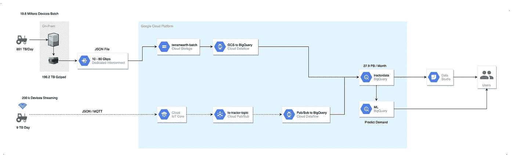

Hora 将为您提供解决方案的每个主要组件的列表和一个实验室(Codelabs 或 Qvolutionab),以便您更深入地了解。

*   云存储(T7)
*   [Functions](https://codelabs.developers.google.com/codelabs/cloud-starting-cloudfunctions/index.html?index=..%2F..index)(这也将是有用的,但对于 TerramEarth 来说太贵了)
*   数据流批处理(Dataflow Batch)
*   (T12) BigQuery (T13)
*   [数据工作室(T1)](https://www.qwiklabs.com/focuses/1005?catalog_rank=%7B%22rank%22%3A5%2C%22num_filters%22%3A0%2C%22has_search%22%3Atrue%7D&parent=catalog&search_id=2128990)
*   (T2) BigQuery ML (T3)
*   [IoT Core 1 (T5)](https://codelabs.developers.google.com/codelabs/iot-data-pipeline/index.html?index=..%2F..index)
*   [IoT Core 2 (T7)](https://codelabs.developers.google.com/codelabs/cloud-iot-core-overview/index.html?index=..%2F..index)
*   [Pub/Sub(T9)](https://codelabs.developers.google.com/codelabs/cloud-spring-cloud-gcp-pubsub-integration/index.html?index=..%2F..index)
*   数据流流(Dataflow Streaming,T11)

不要作弊,停止阅读并结束 XD 实验室。

# 从纸到云

如果你已经让这些实验室进入这个领域,我们将分析将 TerramEarth 带到云端所需的每一个步骤。

首先,在 GCP 中为您的项目命名,以使其更容易:

```
TU_PROYECTO=xxxxxxxx
```

# (1)预转移

对于脱离网络的车辆,预计每天将产生大量数据,这就是为什么在将数据上传到云之前需要压缩数据的原因。

对于他们,我们将使用基于 [**snon**](http://www.snon.org/) 模式的示例数据,您可以查看文件 [example.data.json](https://github.com/develasquez/casos-de-estudio/blob/master/TerramEarth/example.data.json) 作为示例。

要模拟车辆生成的数据,您可以运行 generateRandomMetrics.js 脚本,该脚本将生成一个名为 data.json 的文件,其中包含 90,000 条记录,每条记录大约 120 个字段,总计大约 312 MB。

```
*#debes tener node.js instalado*
node generateRandomMetrics.js > data.json
```

请记住,此阶段的重点是压缩数据以减少传输时间,为此我们将使用 gzip,它将生成一个名为 *data.json.gz* 的文件,该文件将重约 61.3MB,比原始大小减少 80%以上。您可以预期在更大的数据量相同,对于 TerramEarth 的实际案例。

```
gzip data.json
```

好吧,我们已经准备好上传到云端,玩游戏了!！。

# (2)转移

## Batch 传输

现在我们上传了这些数据,但传输方法不是游戏,这对于考试来说非常重要。请注意,对于 TE(TerramEarth),每天将累积约 891 TB,我们必须做出重要决定,我们将使用什么传输机制?让我们来看看 Google 是怎么做的。

*   [**Transfer Appliance**](https://cloud.google.com/transfer-appliance/) **这种传输方法是谷歌向您发送一个大约 100 或 480TB 的 XD 随身碟,这不是开玩笑,它是一个可折叠的设备,您可以在其中上传数据并将其安全地发送到 Google Cloud。这节省了大量的加载时间,从原籍国到谷歌的服务和运输成本的复合。**

**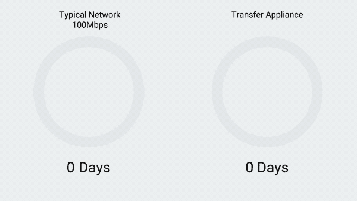**

**对于 TE 而言,此解决方案不适用,因为此系统适用于一次性负载,但 TE 几乎每天都需要上传。**

*   **[**存储传输服务**](https://cloud.google.com/storage-transfer/docs/overview)此传输方法允许您将数据从在线系统导入,这些系统可以是[Amazon S3](https://aws.amazon.com/es/s3/)、Google Cloud Storage、HTTP 或 HTTPS 源到您的项目中的 Google Cloud Storage。**

**对于我们的解决方案,此机制也无济于事,因为数据位于 TE 的物理服务器上,因此通过 HTTP/S 公开数据仅仅是为了使用此机制进行传输是不理想的。**

*   **[**gsutil**](https://cloud.google.com/storage/docs/gsutil) 这个功能强大且通用的工具是用 Python 开发的,让你可以完全控制 Google Cloud Storage 的操作。**

**您需要考虑的是您的网络连接速度、数据量以及您上传网络所需的时间。为此,TE 必须使用 [Cloud Interconnect](https://cloud.google.com/hybrid-connectivity/) 服务并选择连接类型。**

**看看[互连](https://cloud.google.com/interconnect/docs/how-to/choose-type)的两种模式**

*   **专用互连(Dedicated Interconnect)**
*   **合作伙伴 Interconnect**

**假设 TE 使用 **Dedicated interconnect** ,速度介于 10 Gbps 和 80 Gbps(最大允许)之间。现在让我们考虑以下因素,TE 每天生成 981 TB 的数据,如果这些是用 gzip 压缩的,理论上会减少 80%,根据连接类型,总共有 196.2 TB 压缩,最多可能需要 60 小时至 6 小时(80 Gbps)**

**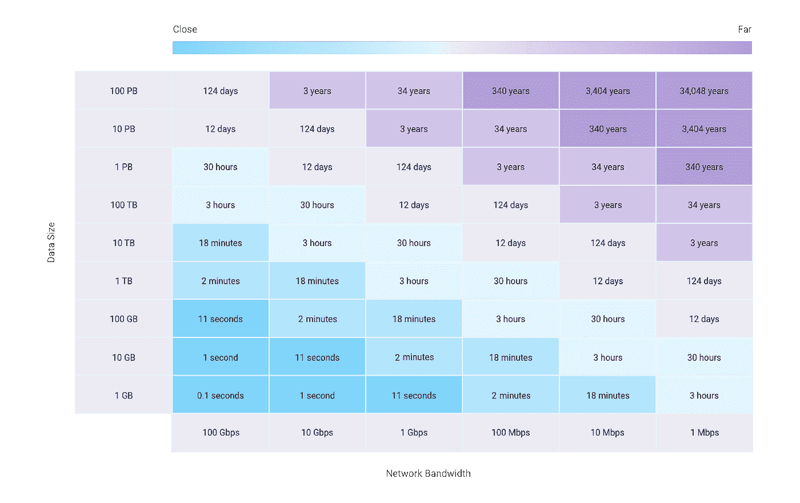**

**但是,仅仅拥有良好的速度是不够的,还有[优化传输](/google-cloud/google-cloud-storage-large-object-upload-speeds-7339751eaa24)的策略,在这种情况下,最有用的策略是调用[**parallel_composite_upload_threshold**](https://cloud.google.com/storage/docs/gsutil/commands/cp),这将把你的文件切成小块,利用并行发送,大大减少了上传时间。**

**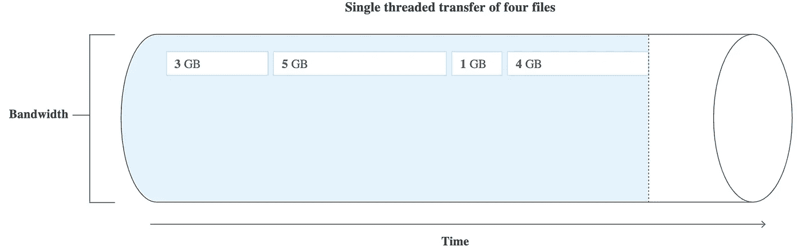****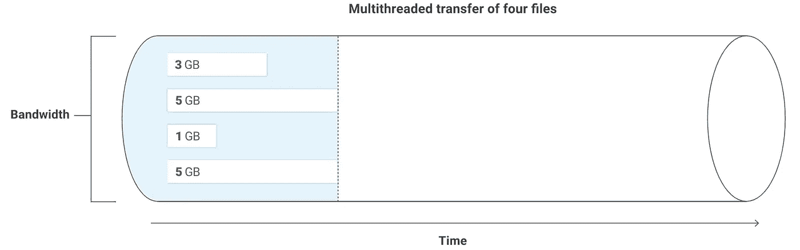**

**为了进行测试,我们在项目中创建一个存储桶,记住名称必须是唯一的,用一些神奇的独特的东西替换 XXXX。**

```
BUCKET_NAME=terramearth-batch-XXXX
gsutil mb gs://$BUCKET_NAME
```

**现在,您需要以 MB 为单位给 parallel_composite_upload_threshold 赋值,在我们的示例中,我们将尝试使用 15MB。**

```
gsutil -o GSUtil:parallel_composite_upload_threshold=15M cp ./data.json gs://$BUCKET_NAME
```

**这将创建多个线程,这将使我们的文件并行上传到 15MB 的小切口,真的很漂亮吗?XD 的。**

**现在让我们来看看这个过程对于连接到互联网的车辆来说会是什么样子。**

## **传输 Streaming**

**在 TE 车队中,有 20%的车辆可以接入网络,从而避免了数据积累和大规模流程的需要。相反,它允许这些数据流式处理,每次在车辆上生成传感器样本时,它们都会实时发送到云端。**

**为此,我们必须理解物联网(T9)的概念,该概念旨在标准化设备/车辆/家用电器通过网络进行通信和管理的方式。**

**其中最常用的协议是[MQTT](http://www.steves-internet-guide.com/mqtt-protocol-messages-overview/)和 HTTP,并且允许我们在 Google Cloud 中使用它们的组件是[Cloud IoT Core](https://cloud.google.com/iot-core/)。**

**它在 TE 的情况下是双向的,因为它允许从车辆收集数据,并将新配置发送给车辆。**

**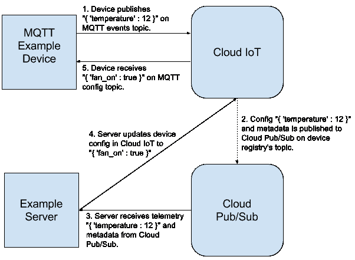**

**如您所见,这些二进制数据通过在[Pub/Sub](https://cloud.google.com/pubsub/)中使用一个[主题](https://cloud.google.com/pubsub/docs/publisher#pubsub-publish-message-nodejs)来传输,我们将在瞬间创建这些数据。**

**要在 Google Cloud 中创建 IoT 核心记录并对其进行测试,您可以使用此存储库的 IoT 文件夹中的示例。**

**由于安全性在云中至关重要,因此想要与 Cloud IoT 核心进行通信的设备必须使用 JWT 令牌,这些令牌必须包含针对 IoT 核心配置中存储的公钥进行验证的私钥。**

**要创建你的自签名证书,你可以运行以下命令,在这里我给你一些[文档](https://cloud.google.com/iot/docs/how-tos/credentials/keys)**

```
#si es que estas en otro directorio
cd IoT/resources; openssl req -x509 -nodes -newkey rsa:2048 -keyout rsa_private.pem -days 1000000 -out rsa_cert.pem -subj "/CN=unused"
```

**首先要注意的是,对于 Cloud IoT Core,只有三个区域可用:us-central1、europe-west1 和 asia-east1。**

**请记住,在这种情况下,您必须在 IoT Core 注册之前创建 主题。这些主题将负责接收设备生成的每个消息作为事件。**

```
gcloud pubsub topics create te-tractor-topic;
gcloud pubsub topics create te-tractor-state-topic;
```

**Cloud IoT Core 允许您创建日志以集中具有共同目标或操作的多个设备,在这种情况下,我们将为拖拉机创建日志。**

```
gcloud iot registries create te-tractor \
    --project=${TU_PROYECTO} \
    --region=us-central1 \
    --event-notification-config=topic=te-tractor-topic \
    --state-pubsub-topic=te-tractor-state-topic
```

**现在我们必须创建设备,即特定的拖拉机。**

```
gcloud iot devices create te-tractor-device \
  --project=${TU_PROYECTO} \
  --region=us-central1 \
  --registry=te-tractor \
  --public-key path=rsa_cert.pem,type=rs256
```

**为了模拟拖拉机生成的数据,我在 Github 的 IoT Core NodeJs 中修改了示例代码[示例代码](https://github.com/GoogleCloudPlatform/nodejs-docs-samples/tree/master/iot/mqtt_example),它将所有 120 个字段的模板放在 JSON 中,并通过 MQTT 将它们发送到 IoT Core,最终将它们注入我们在 Pub/Sub 中创建的主题中。**

```
#vuelve al directorio TerramEarth/IoT
cd ..; 
#instalamos las dependenciasnpm install

# Emulamos en envío de 10 mensajes desde el tractor, puedes cambiar la cantidad pero creo que con 10 se entiende el concepto.node cloudiot_mqtt_example_nodejs.js mqttDeviceDemo    \
  --projectId=${TU_PROYECTO} \
  --cloudRegion=us-central1 \
  --registryId=te-tractor  \
  --deviceId=te-tractor-device  \
  --privateKeyFile=resources/rsa_private.pem \
  --numMessages=10 \
  --algorithm=RS256
```

**即使你看不到 XD,我建议你这样做,使用从 PubSub 到 Cloud Storage 的模板在[DataFlow 中创建一个流,这将创建一个流式处理,该流式处理将提交的事件并将其保存在存储桶中的文件中。由于这不是我们期望的最终性能,所以不要记录这个过程,但它工作得很好,我鼓励你自己尝试一下,特别是考虑到目前我们对即将到来的消息视而不见。](https://cloud.google.com/dataflow/docs/guides/templates/provided-templates#cloudpubsubtogcstext)**

**非常好,我们已经设法从我们的拖拉机中提取数据,无论是连接还是断开连接,但对于 TE 来说,这并不便宜,实际上对于该数据量来说,它非常昂贵。**

**现在,我们将看看流处理的成本,然后我们将看到如何降低批处理成本。**

## **谈谈银**

**首先要注意的是,如果您将 [Cloud IoT Core 与 Cloud Pub/Sub](https://cloud.google.com/iot/pricing) 搭配使用,则还需要单独支付 Cloud Pub/Sub 资源使用费。**

**考虑到 TE 每天生成 9TB 的数据,我们可以理解,如果我们将它们添加到 Google Cloud 的[定价计算器(T3),则每月将生成 279TB,而不是添加将通过 Pub / Sub 传输的数据量,这也是 279TB,总计 153,841.30 美元,Wooow,超过 15 万美元,仅流式处理,在下图中您可以看到每个组件的详细信息。](https://cloud.google.com/products/calculator/#)**

**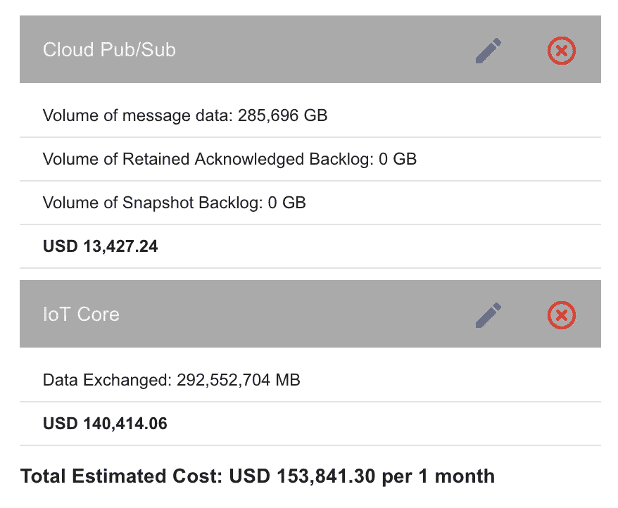**

**在我看来,它非常昂贵,它让我认为也许这些数据是解压缩的,但是 MQTT 的巨大优势之一是它是二进制的,它压缩了接近 85%的有效载荷,这降低了传输的总量,搜索信息我发现了一个[分析 MQTT](https://help.devicewise.com/display/ARG/MQTT+data+usage)及其消耗,并且估计每 1 小时发送 100 个属性,每台设备每月大约 1.4MB。如果我们将其乘以 400 万台设备(占总机队的 20%),它会产生 5.6TB,如果我们记住这是 100 个字段,我们会添加 20%通过云物联网核心的 MQTT 每月产生 6.72TB,并到达可能已经解压缩的 Pub/Sub。让我们做另一个计算。**

**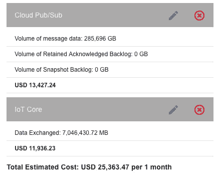**

**这对我来说更有意义,因为否则 IoT Core 对任何公司来说都是不可行的。因此,我们估计通过 MQTT 发送的数据会减少。我留下两个屏幕,帮助我发现了这一点。**

**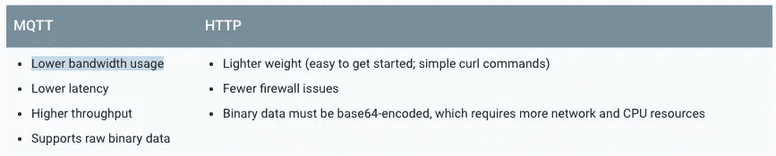**

**和这个伟大的分析在[Device Wise](https://help.devicewise.com/display/ARG/MQTT+data+usage)**

**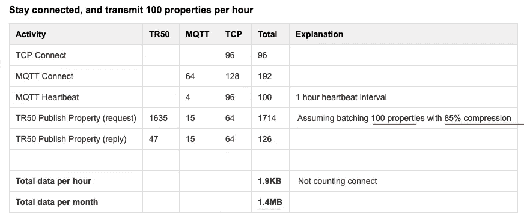**

**现在,让我们看看我们如何优化批处理过程的成本,该过程比流处理大 4 倍。**

# **3)档案存储**

**每当我们需要在云中存储某些内容时,我们必须正确选择要使用的存储类型,可以是各种类型的数据库,NFS,甚至是云存储等全局存储系统。**

**我留下 [链接到官方文档](https://cloud.google.com/storage-options/) 和一个优秀的流程图,这将帮助您确定您的解决方案需要哪种类型的存储,学习它以获得认证将非常有用。**

**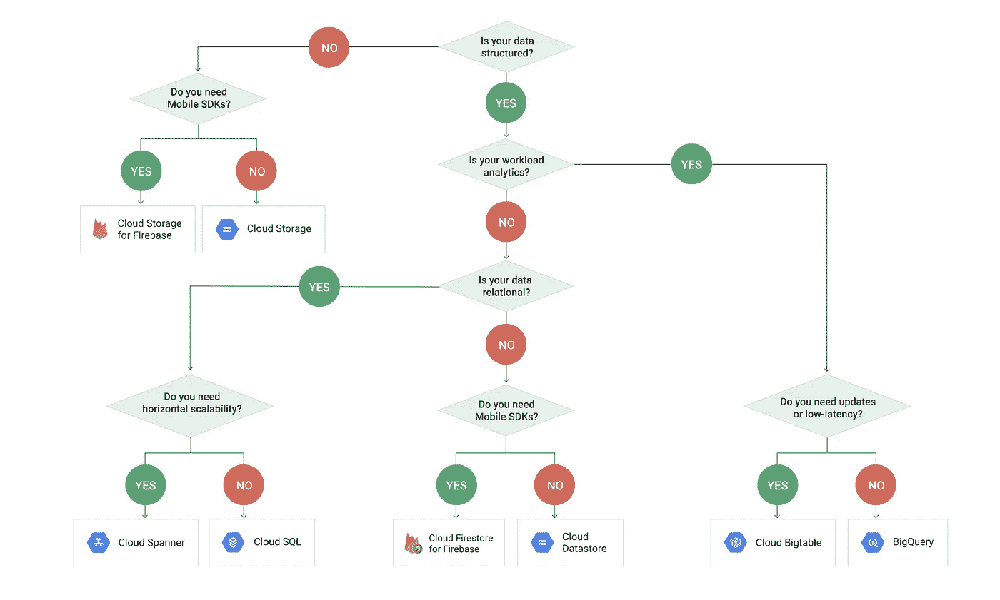**

**对于 TE,我们显然会使用 Cloud Storage,但正如您所知道的那样,本产品中有 [4 种](https://cloud.google.com/storage/docs/storage-classes) 存储类别和一系列最佳实践,可以帮助我们节省一些 [钱包](https://cloud.google.com/storage/pricing) XD。**

**以下是您在使用 Cloud Storage 时应该考虑的 [最佳实践](https://cloud.google.com/storage/docs/best-practices) 链接。**

**每个班级的价格和特点如下**

**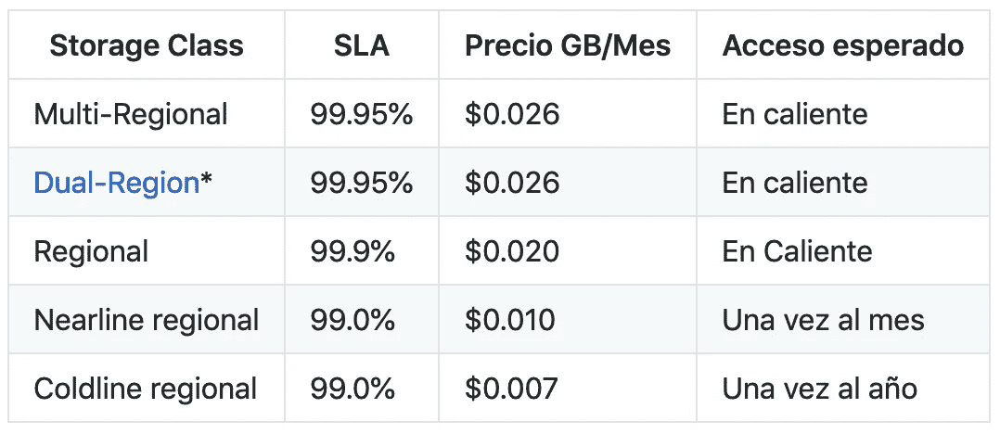**

**如果您担心这些 SLA,请记住,Google 的存储旨在实现 99.999999999%(11.9 秒)的年度持久性,这是通过跨多个可用区域跨多个设备冗余存储对象来实现的。**

## **关于 Storage TerramEarth**

**在我看来,这种情况下最好的策略是**区域存储**,每月每 GB 存储的费用为 0.020 美元,以及允许删除文件的[生命周期策略](https://cloud.google.com/storage/docs/managing-lifecycles)。让我们分开...**

*   ****类型****

**我们需要做的第一件事是将存储类型从多区域更改为区域,这里的 docu[。](https://cloud.google.com/storage/docs/changing-storage-classes)**

```
gsutil rewrite -s regional -r gs://$BUCKET_NAME/**
```

**根据文档应该是这样的,我错了:**

```
BadRequestException: 400 The combination of locationConstraint and storageClass you provided is not supported for your project
```

**因此,在这一点上,最好的解决方案是直接从零创建区域。**

```
# Para eliminar el bucketgsutil rm -r gs://$BUCKET_NAME# Para crearlo regional en gsutil mb -c regional -l us-central1 gs://$BUCKET_NAME/# Subimos nuevamente el Archivogsutil -o GSUtil:parallel_composite_upload_threshold=15M cp ./data.json gs://$BUCKET_NAME
```

**我们已经在一个地区拥有存储桶,与 IoT Core us-central1 相同,剩下的就是创建一个策略来删除文件。**

*   ****政治(T17)****

**我认为最好将其保留 2 天,以防 Batch 流程在第一时间不起作用。为此,我们需要创建一个 JSON 文件,其中包含以下内容,我认为这只是解释。和往常一样,我在这里给你[文档](https://cloud.google.com/storage/docs/managing-lifecycles)**

```
{
	"lifecycle": {
	  "rule": [
	  {
	    "action": {"type": "Delete"},
	    "condition": {
	      "age": 2,
	      "isLive": true
	    }
	  }
	]
	}
}
```

**要应用策略,我们需要使用以下命令:**

```
gsutil lifecycle set lifecycle.json gs://$BUCKET_NAME
```

**这将使我们能够控制一些成本,因为存档将持续最多 2 天。同样,这也使我们在成本方面有点棘手,所以让我们看看云存储中有多少数据。**

*   ****成本(T21)****

**请记住,TE 每天总共生成 196.2TB 片剂,如果这些片剂保留两天,您通常会获得两倍的数据存储量。**

**如果我们计算这些数据的成本,每月在区域存储中永久存储 392.4TB 可为我们提供:**

**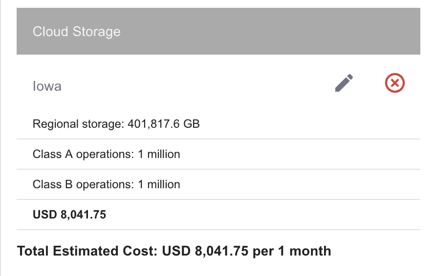**

**无论如何,如果我们没有应用压缩,类别更改和自动删除策略,那么 8000 美元的少量 XD 可能会更昂贵。**

# **4)数据存储**

**在从 Pub/Sub 和 Cloud Storage 移动数据之前,我们需要考虑最终存储数据以供分析,在 GCP 中的所有存储机制中,最适合满足 TE 要求的是 BigQuery。,你应该问自己什么问题来确定这一点。**

**给你几个小把戏:**

1.  ****查看我之前在文件存储部分放置的流程图。(T1 )****
2.  ****数据关系**:
    a) 是关系型,Cloud Sql,BigQuery,Spanner。
    b) 如果是非关系,则为 Datastore、BigTable、Firestore。**
3.  ****考虑数据量**:
    a)如果大于 10TB,请丢弃 Cloud SQL。(B) Petabytes ?使用 BigQuery, Spanner, BigTable**
4.  ****使用或消耗**:
    a) 如果你需要分析,丢弃 Datastore,它是不可取的,它没有 SUM、AVG 等聚合函数,在 Where 中没有 OR,也没有 IN(< - 这是 cert 问题),你应该一个一个地问他们。(T13 B) 用于分析?这就是 BigQuery。(C)实时?使用 Firestore。
    d) TimeSeries ?使用 BitTable**
5.  ****连接到哪个**:
    a) 您必须连接到 Data Studio,那么考虑一下 Cloud Sql 或 BigQuery
    b) 移动应用程序?饰 Firestore**
6.  ****复制**:
    a)一个区域?所有
    b)多区?Cloud SQL
    c) 多区域?出色的 Spanner 非常高的一致性,但它是昂贵的,BigQuery(欧盟,美国),在 Roadmap Cloud SQL 中,目前还没有,如果它是 No SQL,Firestore 和 Datastore。**

**因此,如果 TE 的数据量如此之大,则必须从美国两岸进行访问,其主要目标是分析。所以我认为另一种选择是 Big Query。**

****大查询**:这是一个功能强大的数据库,非常类似于[Apache Hive](https://hive.apache.org/),它允许您在几秒钟内查询数 PB 的数据。你可以说太多关于这个数据库,但它不是目的。我邀请您查看其在认证方面的特点和局限性。但是你需要知道的是谷歌对这个引擎的所有热爱,并试图使其成为市场基准,这对我们来说非常合适。BigQuery 使我们的工作变得非常简单,并与 GCP 平台的其他部分无缝集成。**

## **手在歌剧**

**BigQuery 的一个伟大之处在于,它允许您基于一个文件自动创建我们的数据库架构,该文件可以是 CSV、JSON、Avro 等。它甚至会这样做,如果这是药丸。太棒了 XD**

**要根据我们在 Google Cloud Storage 中留下的 JSON 文件自动创建 [架构,只需运行以下命令即可。](https://cloud.google.com/bigquery/docs/loading-data-cloud-storage-json#loading_json_data_with_schema_auto-detection)**

```
#Creamos el datasetbq --location=US mk --dataset --description "Dataset principal de TerramEarth" ${TU_PROYECTO}:terramearth#Creamos la tabla a partir del archivobq --location=US load --autodetect --source_format=NEWLINE_DELIMITED_JSON terramearth.tractordata gs://$BUCKET_NAME/data.json.gz
```

**这样做的优点是,你不应该复杂的手工创建的方案,特别是当它是如此复杂,因为它是我们想要为您存储。**

**你需要记住的一件事是,数据必须是 JSON,但以换行符分隔,也就是说,它不是一个由逗号分隔的内部有很多对象的数组,而是一个每行都有一个有效的 JSON 对象的文件。**

**要成为一名优秀的云架构师,您需要考虑很多因素,特别是 BigQuery,如果您考虑存储的数据量,并且要消耗的数据量可能会让 TE 付出沉重的代价。因此,让我们来看看有助于我们优化这些成本的一些因素。我在这里留下一个漂亮的[文章!！！](/google-cloud/bigquery-optimized-cluster-your-tables-65e2f684594b)和[官方良好做法在这里](https://cloud.google.com/bigquery/docs/best-practices-performance-compute)。**

*   **尽量不要使用查询转换数据。**
*   **例如,在聚合函数中使用近似值,而不是 COUNT(DISTINCT),则使用 APPROX_COUNT_DISTINCT()。**
*   **在排序之前应用过滤器,以便在较少的日期上进行排序。**
*   **整理你的表格。**
*   **尝试查找与聚类、日期或大型组相关的字段。**
*   **强制在 require_partition_filter=true 查询中指定集群值。**
*   **在 queys 中,它尊重集群的顺序。**
*   **规范化表并正确使用 JOINS。**
*   **使用基于聚集字段的 GROUP BYs。**
*   **配额,您可以在项目级别、数据集级别、用户级别或组级别(甚至在查询级别)设置千字节限制。**

**如果我们对价格粗心,我们可能会发生金融灾难,它已经过去了 XD-什么看看如果我们在一个月的 31 天内每天考虑 900TB,插入,存储和查询,只需 1 个月(27.9 Petabytes)就会产生多少......它提供超过 200 万美元,使其不可行。**

**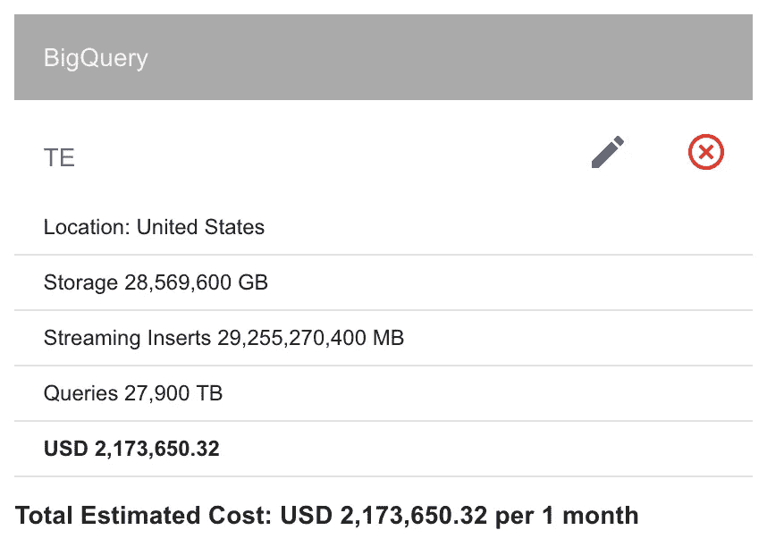**

**为了防止这种疯狂发生,遵循良好的做法。**

## **解决问题的办法 The Solution of the Problem**

**我最近包含在 BigQuery 中的一个很棒的东西是 [计划费率](https://cloud.google.com/bigquery/pricing#flat_rate_pricing) ,你肯定会喜欢这种方法。您可以从具有 2000 个插槽的 Flat Rate 40 到具有 5000 个插槽的 Flat Rate 100(每月 10 万美元)。**

**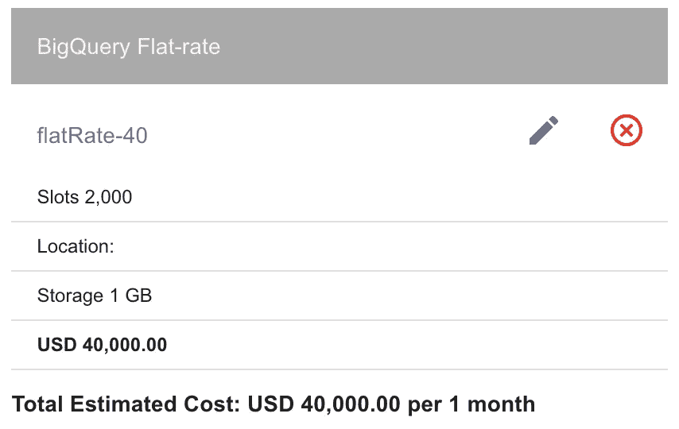**

**您需要支付的唯一额外费用是存储空间,在这种情况下,对于**27 PB**来说,存储空间相当于 600,000 美元。这让我们思考,我们不应该存储所有数据,而应该只存储用于优化备件购买的数据。**

**在认证方面,我还建议您考虑在自己的项目中以及在其他项目中使用 BigQuery 所需的权限(**

**Bueno ya tenemos nuestra Tabla en la Base de Datos y solo nos queda mover los datos desde Pub/Sub y Cloud Storage a BigQuery.**

# **5) Procesamiento**

**Venimos excelente con nuestra implementación profesional de TerramEarth, y no será menos en el procesamiento de datos, para ello haremos uso de Dataflow, tanto para el proceso Batch como para el basado en eventos con Pub/Sub**

**La mejor ventaja que nos da Cloud Dataflow es que tiene plantillas que abordan los escenarios más comunes de movimiento y transformación de datos.**

**Para conocerlos mejor entra a la [官方模板文档](https://cloud.google.com/dataflow/docs/guides/templates/provided-templates) )。在这种情况下最适合我们的是:**

*   **[**Cloud Storage to BigQuery — 流式传输**](https://cloud.google.com/dataflow/docs/guides/templates/provided-templates#cloud-storage-text-to-bigquery-stream):这是 Dataflow 中的一个作业,它从 Cloud Storage 中的源读取文件,获取一个 JSON 格式的文件,甚至可以使用[UDF](https://cloud.google.com/bigquery/user-defined-functions)压缩并转换该文件,将其插入 BigQuery 表中。这个模板的巨大优势是流式传输或更好地理解它,它仍然是运行和基于老板识别何时将文件添加到存储桶并立即处理它。**

**考虑到 [UDF 文档](https://cloud.google.com/bigquery/user-defined-functions),为了实现此流程,必须首先在数据库中生成目标模式,BigQuery 再次使这项工作变得非常容易。要获取此方案,只需运行:**

```
bq show --format=prettyjson ${TU_PROYECTO}:terramearth.tractordata | jq '.schema.fields'
```

**我们获取此命令提供的内容,并将其保存到一个名为 schema.json 的文件中,然后将其上传到存储中。**

```
cd DataFlow;gsutil mb gs://${BUCKET_NAME}-dataflowgsutil cp schema.json gs://${BUCKET_NAME}-dataflow
```

**和一个 UDF 转换功能,在这种情况下不久。但是,如果你想减少你在 BQ 中输入的数据,这是正确的地方...**

```
gsutil cp transform.js gs://${BUCKET_NAME}-dataflow/
```

**一旦你有上面的文件,我们将运行 Dataflow 作业,并让它运行等待新的文件。**

```
JOB_NAME_GCS=gcs_text_to_bigquery-`date +"%Y%m%d-%H%M%S%z"`gcloud dataflow jobs run ${JOB_NAME_GCS} \
    --gcs-location gs://dataflow-templates/latest/Stream_GCS_Text_to_BigQuery \
    --parameters \
javascriptTextTransformFunctionName=transform,\
JSONPath=gs://${BUCKET_NAME}-dataflow/schema.json,\
javascriptTextTransformGcsPath=gs://${BUCKET_NAME}-dataflow/transform.js,\
inputFilePattern=gs://${BUCKET_NAME}/*.json.gz,\
outputTable=${TU_PROYECTO}:terramearth.tractordata,\
bigQueryLoadingTemporaryDirectory=gs://${BUCKET_NAME}-dataflow/temp
```

**在 Dataflow 中可以看到**

**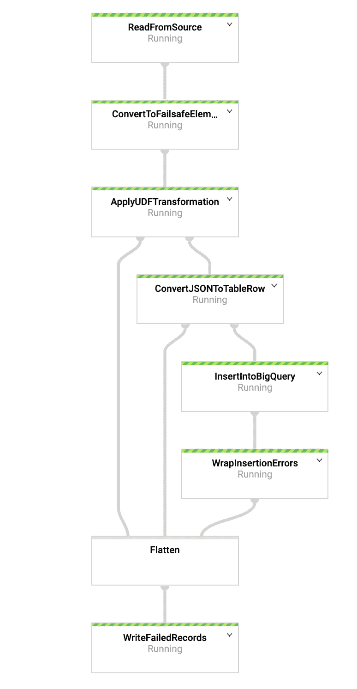**

**为了能够测试它是否有效,我们需要上传一个带有新数据的文件,在这种情况下,它将是相同的,但具有不同的名称,因为流需要的是符合 JSON schema 和名称为*.json.gz 的文件。**

```
gsutil cp ./data.json.gz gs://$BUCKET_NAME/data_2.json.gz
```

**如果我们进入 BigQuery 并拿出一个计数,我们应该看到最初的 90,000 条记录,当这个过程结束时,我们应该有两倍的记录。**

```
bq query --nouse_legacy_sql 'select count(1) from `${TU_PROYECTO}.terramearth.tractordata`';
```

*   **[**Cloud Pub/Sub to BigQuery — 流式传输**](https://cloud.google.com/dataflow/docs/guides/templates/provided-templates#cloud-pubsub-to-bigquery) 这是一个更简单的工作,您将阅读您在其中编写 Cloud IoT Core 的 Pub/Sub 主题并将其插入到 BigQuery 表中,当您听到 Pub/Sub 主题时,此过程处于活动状态,等待数据流式传输。**

**为了能够实施它,它非常简单。执行以下命令:**

```
JOB_NAME_PUB_SUB=pubsub-to-bigquery-`date +"%Y%m%d-%H%M%S%z"` gcloud dataflow jobs run ${JOB_NAME_PUB_SUB} \
    --gcs-location gs://dataflow-templates/latest/PubSub_to_BigQuery \
    --parameters \
inputTopic=projects/${TU_PROYECTO}/topics/te-tractor-topic,\
outputTableSpec=${TU_PROYECTO}:terramearth.tractordata
```

**这是在 Dataflow 中看到的:**

**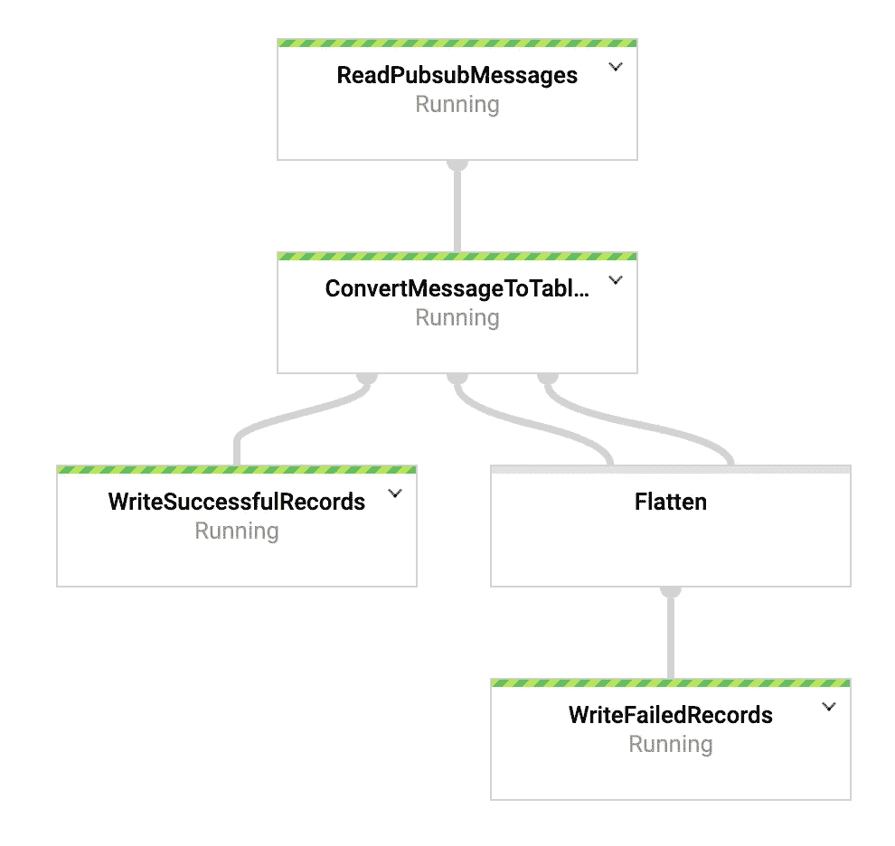**

**我们如何证明它是有效的?？？简单,只需运行我们在开始时使用的将事件发送到 IoT Core 的过程。(给它几分钟的流动举起工人)**

```
#vuelve al directorio TerramEarth/IoT
cd ../IoT; # Emulamos en envío de 10 mensajes desde el tractor, puedes cambiar la cantidad pero creo que con 10 se entiende el concepto.node cloudiot_mqtt_example_nodejs.js mqttDeviceDemo    \
  --projectId=${TU_PROYECTO} \
  --cloudRegion=us-central1 \
  --registryId=te-tractor  \
  --deviceId=te-tractor-device  \
  --privateKeyFile=resources/rsa_private.pem \
  --numMessages=10 \
  --algorithm=RS256
```

**我们可以在 Big Query 中看到结果,记录数量应该增加 10。**

```
bq query --nouse_legacy_sql 'select count(1) from `${TU_PROYECTO}.terramearth.tractordata`';
```

**您已经看到了将 Dataflow 与模板一起使用是多么容易,但如果您想开始使用 Dataflow,我建议您遵循本[指南](https://cloud.google.com/dataflow/docs/quickstarts/quickstart-java-maven) 。**

**到目前为止,我们已经在 BigQuery 中提供了数据,但我们需要使用 Data Studio 对其进行可视化,并使用 BigQuery ML 进行分析,以预测备件需求。**

**我希望这个茶指南有用,我们下一篇文章见。**

# **在接下来的交付中,我们将看到以下几点。**

# **(6)可视化**

# **(7)预测**

**一个拥抱。**