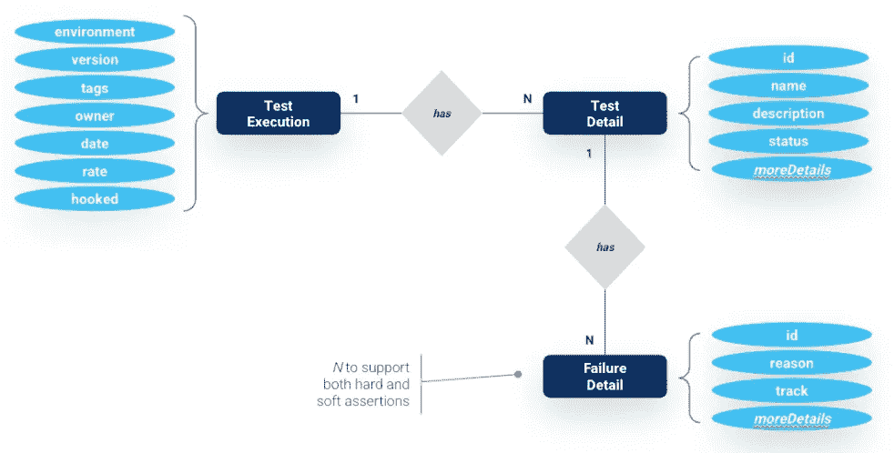
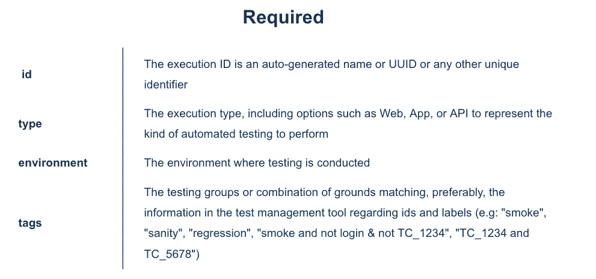
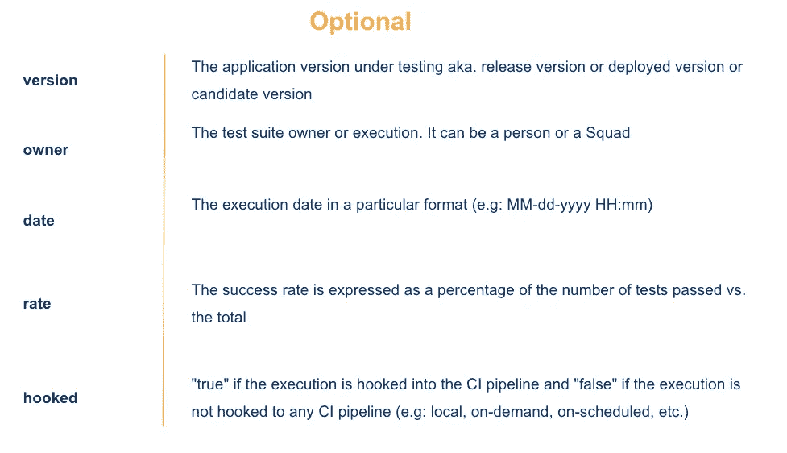
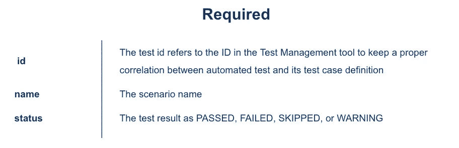
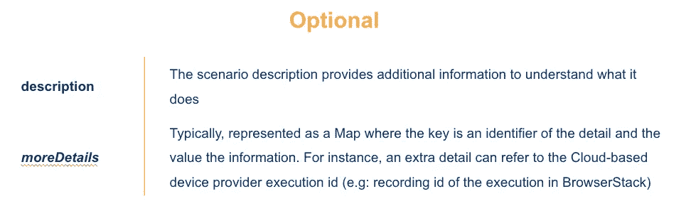
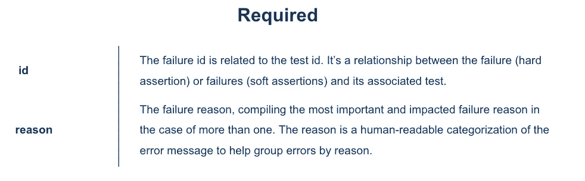
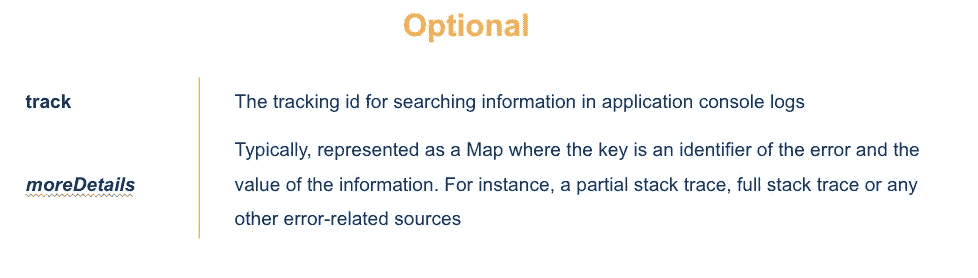
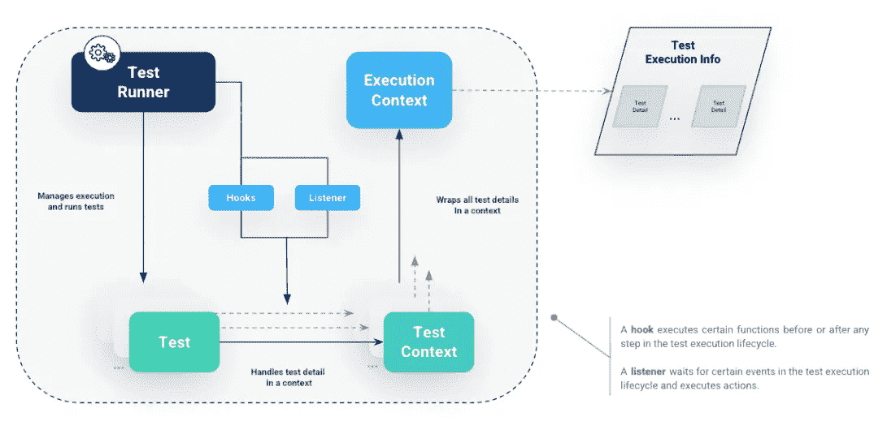

# 测试自动化框架报告和可观察性(第 2/5 部分)

> 原文：<https://medium.com/globant/test-automation-framework-reporting-observability-part-2-b531473dc310?source=collection_archive---------0----------------------->

# 表示测试执行

正如在第一篇文章中所解释的，成功地将报告和可观察性应用到测试自动化框架及其过程的起点是捕获执行信息和测试细节，并以特定的结构和数据关系来呈现它们。

因此，必须遵守测试执行的数据契约，这样测试自动化框架才能在运行时正确地创建和更新信息。

这个信息至少被分成三个部分:测试执行，它的测试细节，以及每个测试的缺陷细节。

## 测试执行

一旦本地、远程或使用任何 CI 工具触发了测试运行，就会编译测试执行信息。每个测试执行信息都与每个测试相关联，因此一次运行包含多个测试细节。

此信息可以包括必填字段或可选字段。根据实现或范围，一些适当且重要的字段可以定义如下:

当然，根据需求还会有更多的字段。

一些字段，如:“id”、“日期”和“环境”在运行开始时立即定义。其他的如“rate”是在执行完成时定义的，评估每个测试结果。

## 测试细节

当测试被执行时，测试细节与测试执行信息相关联。这些细节对于表示测试、访问测试信息和分析测试结果非常重要。

一些相关字段包括:

**一个重要的字段是‘id’，**一种将自动化测试链接到测试管理工具的方式，以便以后与它集成并更新执行的每个测试结果部分。

## 故障详细信息

失败细节是测试细节的重要元素。如果测试失败，它必须包含失败信息和证据，以便进行分析和分类，这样以后就可以用完整的证据报告结果。这些重要的领域包括:

“原因”字段和表示为“错误类型”和“错误消息”的所有其他字段对于错误分组极其重要，因为在同一次执行中出现类似错误是非常常见的。

执行这种分析并根据原因将错误分类，可以提高测试结果及其分析的可见性。错误分析和分类有助于为测试通知创建自定义消息，以及由警报系统处理的其他自定义消息。

# 捕获测试执行挂钩和监听器

现在，我们如何确保在运行时收集这些信息呢？答案在于使用监听器和/或钩子在执行的不同阶段收集测试信息。

测试运行器管理测试执行并运行所有的测试，但是钩子和监听器被实现来在运行时收集信息或执行特定的动作，同时测试被执行。

*   钩子允许在测试执行生命周期的每一步之前或之后执行函数。例如，在执行之前和之后或者在每次测试之前和之后。
*   监听器响应测试执行生命周期中的特定事件并执行动作。例如，当测试完成并处理测试结果时，可能会发生一个事件。

最后，测试执行运行时信息是在不同的上下文中处理和组织的，与代表整个执行的上下文和代表每个单独测试的上下文是分开的。以这种方式管理信息对于处理所有数据并将其存储在内存结构或外部数据源中非常有用:

*   测试执行上下文:拥有一组测试上下文并在线程安全环境中工作的入口点，考虑并行执行和对数据的多次调用。
*   测试上下文:表示在执行期间收集的每个测试细节，与测试执行上下文相关联，并允许测试在该上下文中存储信息。

这个过程捕获、处理和组织信息，以便以后在各种报告、警报和监视替代方案中持久保存和共享。

知道了测试执行是如何在运行时被捕获和组织的，在下面的文章中，我们将通过发送定制的警报和生成测试报告来关注可视化的数据。