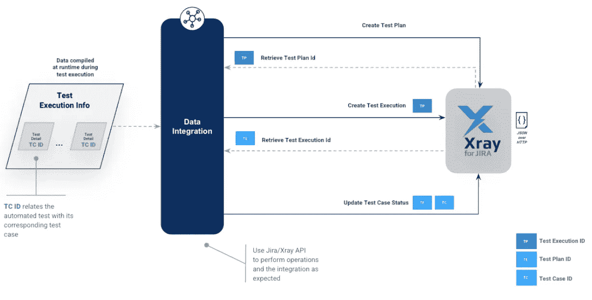
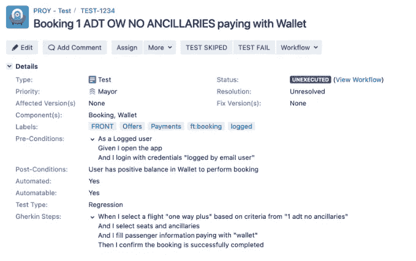
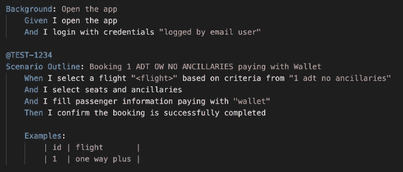

# 测试自动化框架报告和可观察性(第 4/5 部分)

> 原文：<https://medium.com/globant/test-automation-framework-reporting-observability-part-4-5-2c9cdabcefcc?source=collection_archive---------0----------------------->

与**测试管理工具**的集成对于将测试计划、测试执行和测试结果与自动化测试执行联系起来至关重要。这种集成不仅提高了整个测试过程的可见性、敏捷性和透明度，还为更好的分析和数据驱动的决策打开了大门，增加了整个可观察性过程。

通常，作为开发和测试周期的一部分，每个 sprint 都会创建测试计划，将待执行的测试用例与待验证的用户场景联系起来。团队执行手动和自动测试，并更新结果。因此，使用测试管理工具总是比任何其他方法更好、更有成效。

市场上有几种测试管理工具。有些是开源的，只有有限的特性，有些是授权工具，有广泛的支持，并与敏捷项目管理工具集成，如吉拉。

作为推荐工具之一，Xray 非常适合处理测试管理活动，并作为插件与 JIRA 集成。它有各种各样的特性，比如测试计划、测试集、测试用例、测试执行和带有各种度量和仪表板的测试报告。Xray 也有自己的 API，通过它您可以执行各种操作来反映自动化测试的结果。

Real-life example of integrating automated test execution information to Test Management Tool

作为在执行过程的上下文中正确识别测试用例的先决条件，需要在测试管理工具中创建和设置以下元素:测试计划、测试执行和测试状态。

每个自动化测试必须包含 Xray 测试用例 ID 作为元数据(与使用任何其他测试管理工具一样)。这个测试用例 ID 总是被表示为标签的 ID。

下面是一个测试用例的例子，带有相应的 ID TEST-1234 以及与自动化测试的关系，引用了作为元数据添加的 ID @ TEST-1234

Test Case in JIRA/Xray

BDD Scenario linked to its corresponding Test Case by using metadata

1.  **测试计划**

为每个 sprint 创建一个测试计划确保了多个相关的测试执行，而不是孤立的和不相关的多个测试执行。

创建可以是手动的或者自动的，但是总是要考虑每个团队和每个 sprint 的测试计划 ID 的重用。

**2。测试执行**

一旦一个测试计划被创建，一个或者多个测试执行可以在测试周期的不同阶段被分配给它。然而，测试执行可以按需创建，与测试计划没有任何关系，因此 ID 可能不是必需的。

测试执行有相关的信息，比如环境、标签、所有者，以及测试执行本身的任何其他表示。

测试执行包含所有已执行的测试，以及它们的细节，更重要的是，它们的状态。

**3。测试状态**

每个测试用例都有相关的信息以及强制和可选字段，但是它的状态是在测试执行时更新的。

状态可以包含默认值或自定义值(取决于 JIRA 项目配置)。在某些情况下，更新状态是直接操作，在其他情况下，需要一些转换。

作为测试执行的一部分，每个测试可以从未执行更新为通过、失败、取消、执行等。

额外的操作可以通过特定的端点来执行，比如向标签添加评论，将测试结果链接到打开的缺陷，以及在测试执行细节中提供附加信息作为附件。

**4。产生缺陷**

当一个测试失败时，自动缺陷创建减少了人工工作，并补充了与测试管理工具的集成。有了测试用例 ID 和所有关于缺陷的必要信息，缺陷就可以使用相同的 API 来创建测试计划、测试执行和更新结果，但是使用不同的端点。这样，不仅测试结果会在每次执行时更新，而且缺陷也会更新:

*   通过检索(通过 API)与测试用例相关联的缺陷，并添加一个注释(缺陷仍然存在)或者用一个注释结束它，来更新一个现有的缺陷。
*   用测试失败的信息创建新的缺陷。

最后，这些是集成测试自动化和测试管理工具的一些最重要的或者相关的操作，但是随着测试的发展和可观察性的增加，更多的操作可以被包括进来。

# 参考

**x 射线 API:**

*   【https://docs.getxray.app/display/XRAY/Test+Plans+-+REST 
*   [https://docs . getxray . app/display/XRAY/Test+Executions+-+REST](https://docs.getxray.app/display/XRAY/Test+Executions+-+REST)
*   [https://docs . getxray . app/display/XRAY/Import+Execution+Results+-+REST](https://docs.getxray.app/display/XRAY/Import+Execution+Results+-+REST)
*   [https://developer . atlassian . com/server/jira/platform/jira-rest-API-examples/](https://developer.atlassian.com/server/jira/platform/jira-rest-api-examples/)