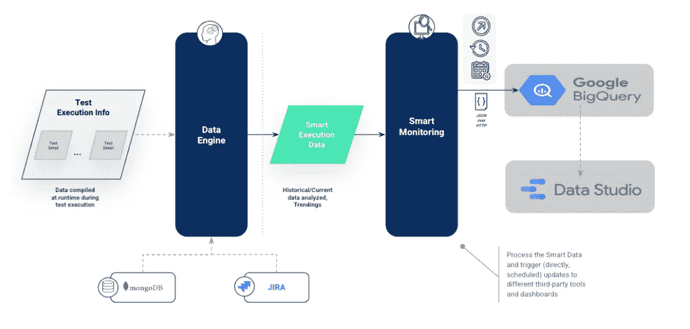
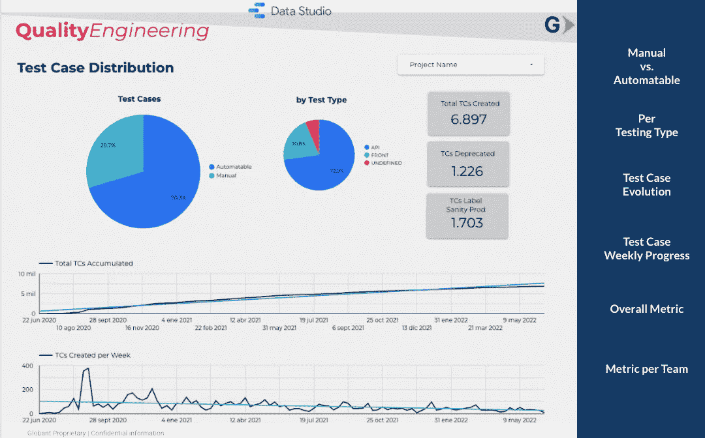
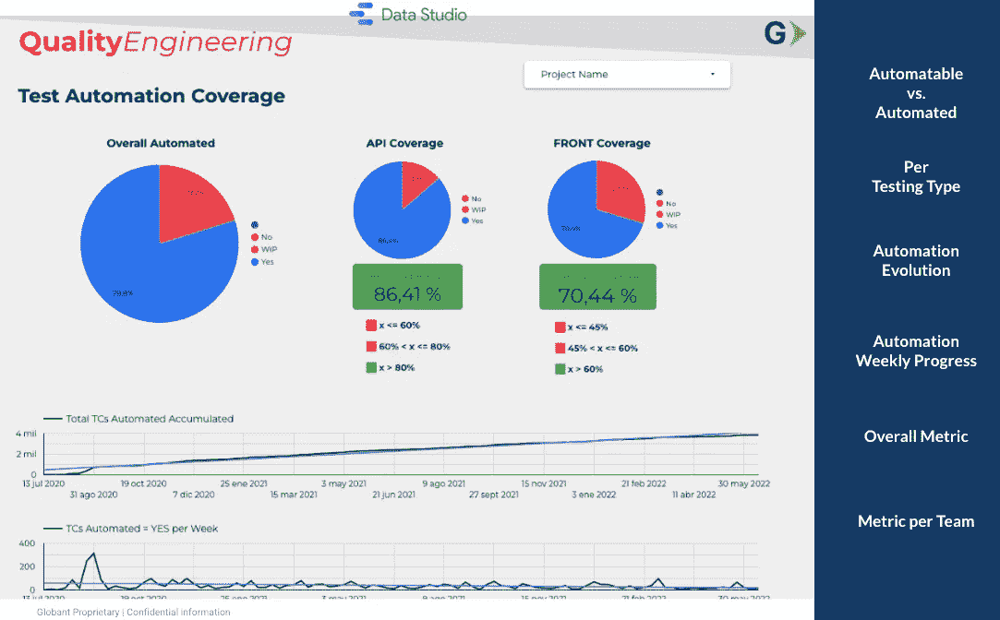
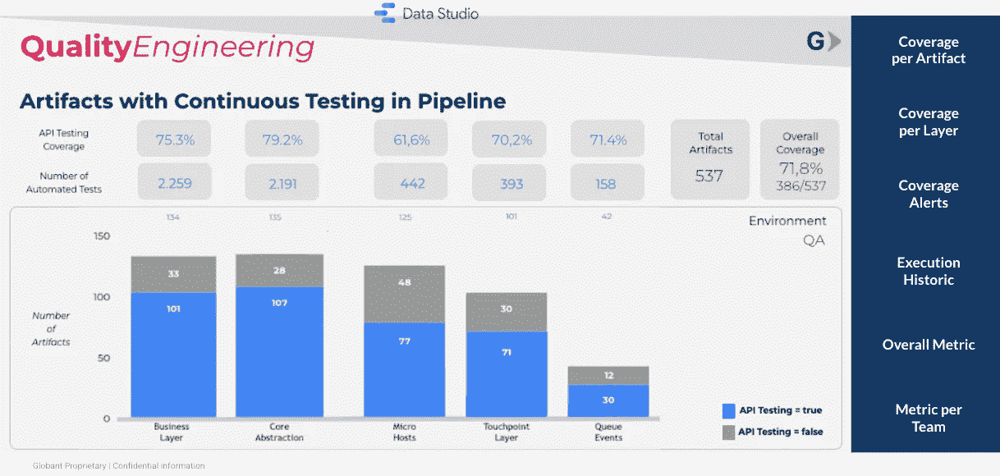

# 测试自动化框架报告和可观察性(第 5/5 部分)

> 原文：<https://medium.com/globant/test-automation-framework-reporting-observability-part-5-5-a1501f781508?source=collection_archive---------0----------------------->

监控测试数据、其细节及其随时间的进展，提高了对如何执行测试活动、如何测试产品以确保预期的质量水平以及如何随时间实现 KPI 或其他项目度量的可见性，并具有实现改进或补救影响测试活动的情况的适当过程。没有数据和实时监控数据的过程，测试自动化过程总是会受到挑战，并且不是完全透明的。

因此，不要认为一份测试报告和一份电子表格就足以做出重大改变。您必须始终记住以有效的方式整合测试数据，以便通过实时仪表板和监控来实现数据驱动的决策。

市场上有各种各样的工具，具有不同的功能和不同的成本。所以选择合适的工具取决于数据更新的频率和数据的显示方式。在某些情况下，测试管理工具中的定制仪表板对于数据可视化来说已经足够了，但是在其他情况下，这还不够，还需要更强大的动态仪表板。因此，选择合适的工具非常重要。

下面是一个实例，展示了测试执行信息是如何在每天和每次执行时存储在数据库中的。使用机器学习、趋势和预先分析的数据，对照预定义的模型来分析历史信息。“智能数据”根据其类型和特征进行组织并发送到可视化工具。

Real-life example of using machine learning models to analyze test execution information and visualize it in real-time dashboards

**1。准备工作**

在发送智能数据并在仪表板中启用其可视化之前，有一些重要的注意事项。

首先，您需要选择正确的数据源来临时保存数据或保存一段特定的时间。这种选择取决于您希望如何保存数据，但更重要的是，您希望如何使用特定的查询过滤器来访问数据。由于 DataStudio 是可视化工具，BigQuery 是对 Google Dremel 技术提供外部访问的一个很好的补充，Dremel 技术是一个用于分析嵌套数据的可伸缩的交互式专门查询系统。BigQuery 提供了各种功能，用于管理数据、查询数据，以及与其他工具集成或运行机器学习模型。

其次，您应该提供一个 API 端点来将智能数据作为 JSON 发送，并在内部处理云函数以将数据存储在 BigQuery 数据表中。

**2。可视化**

通常，应该在发送信息之前创建仪表板，但是在任何情况下，都可以在特定的仪表板中发送、存储和显示信息。

根据数据的可视化方式和项目的 KPI 或 okr，可以用不同的部分和图表创建一个或多个仪表板。

*   测试分布:测试用例是如何在每个团队中分布的，取决于测试类型、类别(冒烟、健全、回归、环境、工件、优先级)，当然还有测试是手动执行的、计划为自动化的还是自动化的。
*   测试覆盖率:测试覆盖率如何根据业务单元、关键功能和每个团队进行分配，这取决于自动化测试和手动测试的数量以及它们随时间的演变。
*   测试执行:测试是如何执行的？环境、工件和测试类型的覆盖率是如何分布的？以及在一天中任何给定时间每个团队执行的测试数量。
*   测试有效性:每个环境、每个类别、每个优先级或严重性的缺陷指标，以及影响业务的缺陷数量。Bug 检测率:多久发现一次 bug，在什么环境下发现。这些 bug 是通过自动化测试检测出来的吗？

借助 DataStudio，您可以使用多种图表(条形图、折线图、地图、密度图、散点图、甘特图和气泡图)、数据控件(数据列表、文本框、高级过滤器和控件)、原始数据以及美化信息的附加功能来实现这一点以及更多功能。

下面，我们将这些仪表板中的一些作为测试信息可视化的例子，允许分析不同领域中的覆盖范围(不仅仅是在测试级别)，以及执行结果、频率和随时间的演变。所有的数据都来自 BigQuery，并且之前由测试自动化框架从测试执行中捕获和处理。

第一个仪表板描述了测试用例的总体分布以及每个项目的分布(根据每个团队的分布)并可视化相关信息，例如手动测试用例与自动化测试用例相比的百分比、每个类型的测试用例的分布或者每个周期的测试过程的发展(累积的测试用例、每周创建的 tc、累积的手动 TC、累积的自动化 TC、过时的 TC 的数量等)。).

Total distribution of test cases and per team (filtering)

第二个仪表板显示了整个测试自动化的覆盖率，以及每个项目的覆盖率。它提供了覆盖率指标，这些指标考虑了可以自动化的测试用例的百分比，自动化测试用例，以及按测试类型的分布。它还显示其他相关信息，如累计自动化 TC、每周自动化 TC 总数和自动化 WIP 趋势。

Total test automation coverage distribution and per team (filtering)

第三个仪表板分解了每一层和每一个测试类型的覆盖率，在这种情况下，只有与 API 测试相关的覆盖率，以及在给定环境中部署的工件的覆盖率，它们在 CI 管道中具有直接和集成的覆盖率。这些信息对于理解测试的覆盖率和数量如何在应用程序层中分布是有价值的，并且还允许搜索没有覆盖率的特定工件(在一个单独的仪表板中)。此外，基于所获得的测试执行信息，可以显示额外的信息，例如每个工件的成功率，随时间的发展(当覆盖率在给定的时期内降低时，添加警告或标记)，并且信息不仅可以按层组织，还可以按团队或受影响的区域组织。

Artifacts with continuous testing (API testing) in the CI pipeline

总之，值得提醒我们自己的是，报告和可观察性是由行业最佳实践、先进的测试自动化解决方案和框架、智能实时监控以及数据驱动的决策支持的互补方法。这是一个执行、数据收集和可视化的连续过程，团队和整个组织可以通过获得每个执行活动的适当可见性和透明度来感受测试的价值。结果，通过测试自动化中的可观察性，上市时间被加速，信息分析的人工努力被减少，并且整个质量过程被智能和自动地保证。