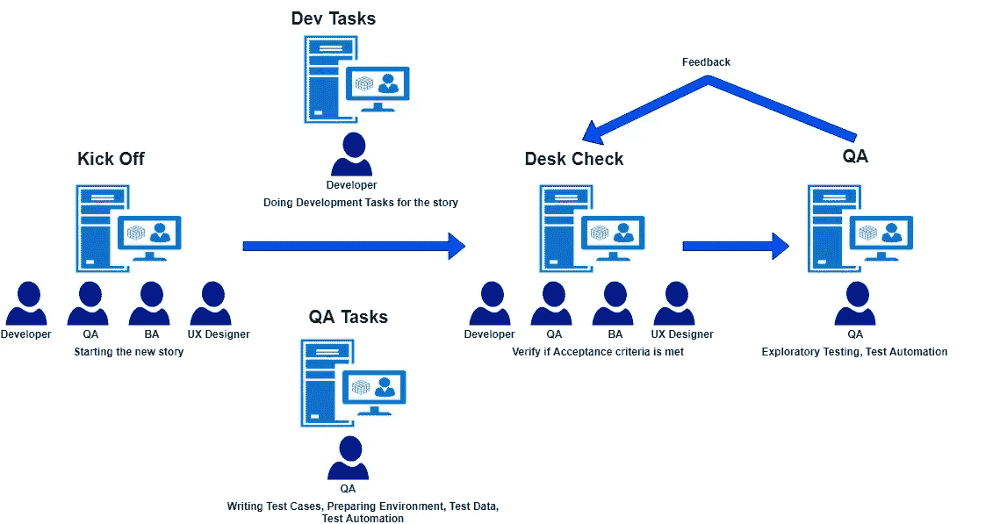
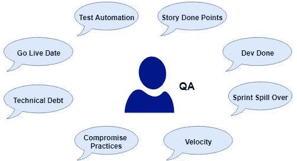

# 测试自动化和用户故事完成标准

> 原文：<https://medium.com/quick-code/test-automation-saga-5514c130abb2?source=collection_archive---------3----------------------->

这是一个团队的故事，他们参与了一个平台建设项目。项目的发现和启动已成功完成。产品经理提供了产品所有者分解成史诗的需求。在吉拉，商业分析师将史诗转化为故事。形成了多个 scrum 团队。每个 scrum 团队都会召开迭代计划会议，会上他们会将 Sprint 的范围归零。随着 Sprint 的进展，工程师——开发人员、质量保证人员、开发人员都开始收集故事。

在开始任何故事之前；开发，质量保证，UX 设计师和产品负责人经常坐在一起。他们四个人都曾经在吉拉通过故事的描述来集思广益并冻结接受标准。开球期间；开发人员和质量保证人员将讨论并最终确定开发人员在单元测试和集成测试中要覆盖的测试用例，以及质量保证人员在端到端测试中要覆盖的测试用例。由于开发人员将处理这个故事，QA 将创建测试用例、数据、环境和自动化测试用例。一旦开发人员完成了这个故事；开发、质量和 BA 将再次聚在一起进行案头检查，以确保所有事情都按照预期实施。QA 编写的测试用例在这个仪式上执行，以获得更快的反馈循环。如果所有的测试用例都通过了，那么开发和 QA 将讨论单元、集成和端到端测试。如果遗漏了任何验证点，则在[测试金字塔](https://martinfowler.com/articles/practical-test-pyramid.html)的基础上对其进行适当的识别和添加。端到端测试与持续集成管道集成在一起，并针对构建定期执行，以获得更快的反馈。由 Api 测试和 UI 测试组成的端到端测试。

在最初的几个冲刺阶段，一切都很顺利。然而，该项目有一个固定的上线日期，不能妥协。按照目前的速度，不可能实现计划的上线日期。这时，商业利益相关者开始推动工程团队提高速度。工程小组抵制变革，但这种抵制付诸东流了。结果是，为了达到更高的速度，团队开始在实践中妥协，从而偷工减料。

开发人员开始编写展示 80℅+代码覆盖率的单元和集成测试。由于给定了开发 QA 比率，开发人员开始以更快的速度生产故事，QA 开始赶不上编写新的端到端测试和更新现有测试的时间。工程团队在 Retros，Scrum of Scrums 中多次提出这个问题，但都是徒劳的。由于缺乏高质量单元、集成和端到端套件形式的安全网来防止回归，错误数量开始增加。由于 Scrum 团队之间产生的特性孤岛，一个团队的变更会破坏第二个团队开发的用例。在所有这些中，业务涉众不断推动提高速度，以实现固定的上线日期。由于缺乏单元和集成测试形式的安全网，团队中的 QA 开始有困难，他们没有时间编写和维护端到端测试。正因为如此，QAs 开始在执行可重复的手工测试上花费更多的时间。随着时间的推移，由于手动重复测试，QAs 的效率开始下降。这种情况一直持续到产品上线。该产品上线是为了同名。由于折衷的做法，产品的质量非常低。结果和预期的一样——非常高的生产缺陷。

在上线日期前将产品投入生产的不可能任务实现了。商业利益相关者已经实现了他们的主要目标。但是现在是时候将遗留平台的用户迁移到新部署的 shinny 平台上了。但是由于缺陷的数量越来越多，让用户参与进来几乎变得不可能。最后，一个性能卓越的新 UI 只有在显示正确的数据时才会增加价值。这是焦点第一次转移到质量方面。我所说的质量不仅仅指 UI 和 Api 自动化。但这涉及到；单元、集成和性能测试。

整个产品架构如上面的快照所示。有一种写入机制，用于从各种数据源获取数据并写入数据库。还有一种读取机制，它使用 API 从这些数据库中读取数据，并将其显示在 UI 上。工程作为一个整体低估了事物书写方面的重要性。因此在质量方面没有太多的强调。大多数测试自动化的焦点是验证来自数据库的数据是否正确地显示在 UI 上。但是随着缺陷数量的增加，缺陷趋势开始以相反的方式说话。结果是，因为不正确的数据本身不存在于数据库中；API 用于提供不正确的响应，从而在 UI 上显示无效数据。因为与质量相关的多个方面受到影响，即单元、集成、端到端测试；有必要提出一种测试策略来缓解这一挑战。

已经有大量的技术债务需要开发者去处理。低单元和集成测试覆盖率只是其中之一。让技术债务优先化是另一个挑战。因此，QA 团队试图依赖开发团队来添加单元和集成测试是一件危险的事情。因此，QA 团队决定开发一个测试自动化套件，从数据注入系统到写入数据库的整个过程中验证所有的东西，从而通过 API 和 UI 进行验证。然而，当谈到验证和验证点时，有两种不同的想法。

一种观点认为测试只验证 API 和 UI。另一种想法建议通过模仿将数据插入到系统中，然后首先在数据库中验证该数据；然后通过 API，最后在 UI 上。按照第一种方法，数据没有在数据库中进行验证。因此，如果在将数据写入数据库的代码中存在缺陷，那么 Api 和 UI 测试就会标记出来。这在游戏中已经很晚了，而且旗帜也在不正确的地方升起。

这个故事的寓意是，在这个持续交付的快节奏世界中，从部署到生产每天都要进行多次，因此将自动化作为故事完成标准的一部分非常重要。没有坚实的测试自动化套件，就不可能实现连续交付。为此，将自动化作为完成标准的一部分非常重要。此外，作为一个 QA，编写一个测试套件来标记失败的实现，从而在适当的连接点标记不正确的用例是非常重要的。