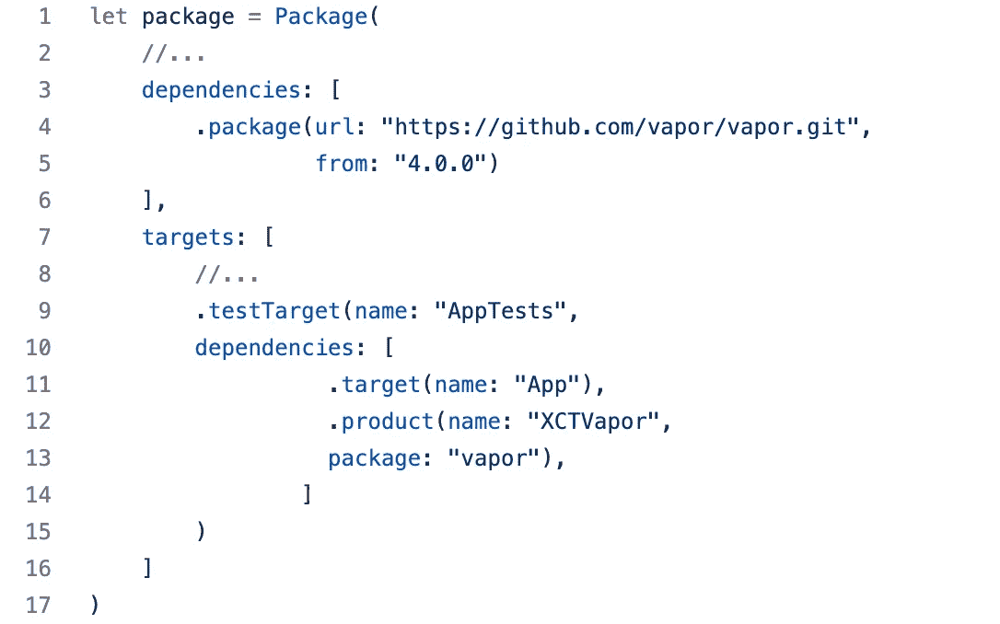
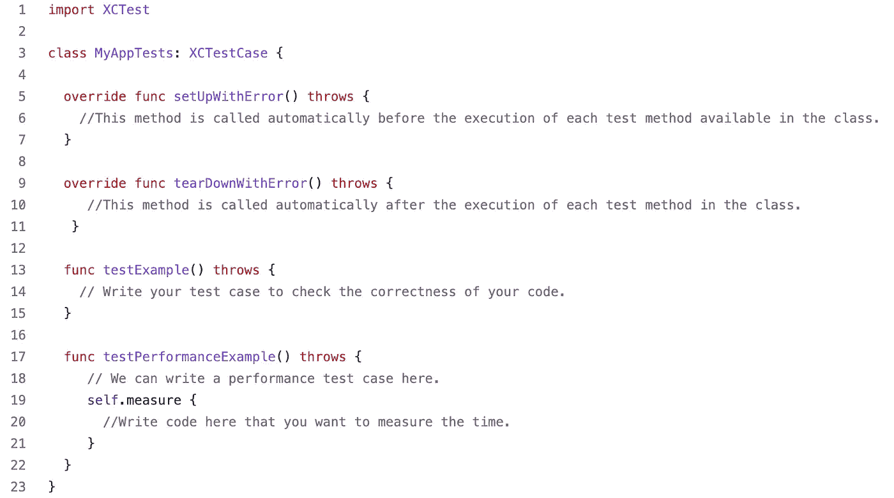
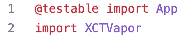
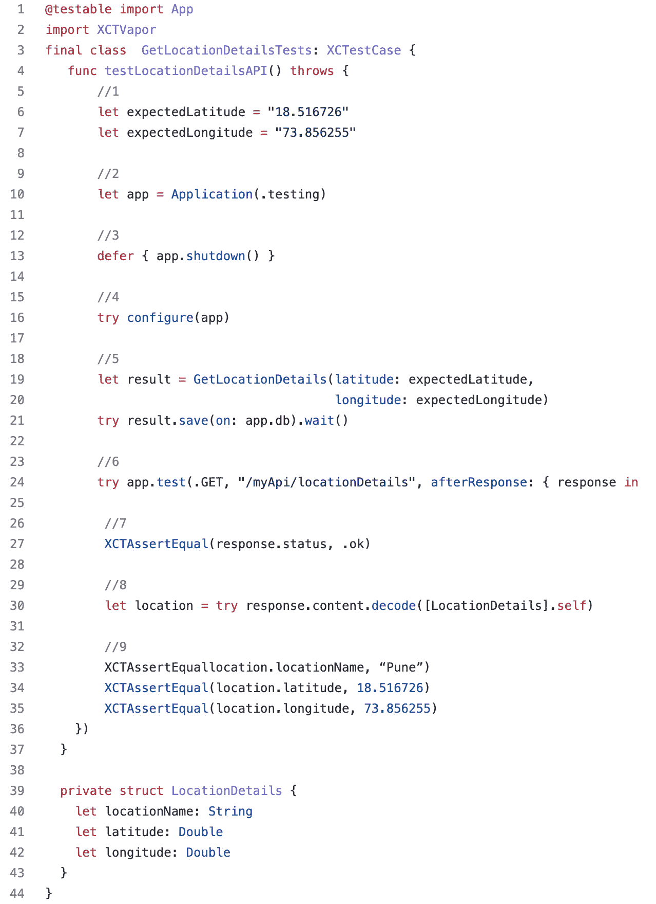
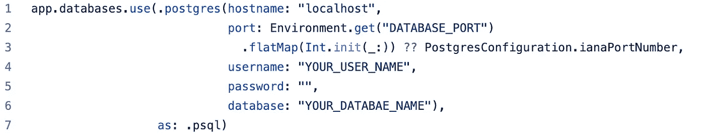
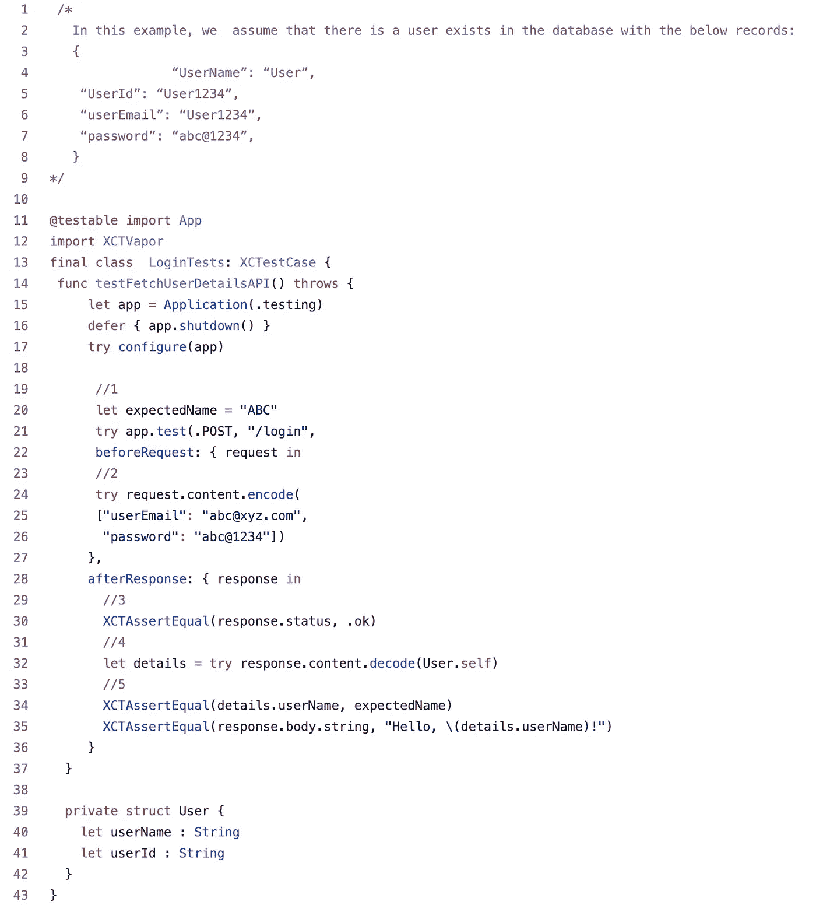

# 蒸汽测试

> 原文：<https://medium.com/globant/testing-in-vapor-72af46c8cdb9?source=collection_archive---------0----------------------->

测试在软件开发过程中非常重要。当你重构代码时，编写单元测试给你信心。Vapor 包含一个 **XCTVapor** 模块，它提供了基于 XCTest 构建的测试助手。这些测试助手允许以编程方式或通过 HTTP 服务器向 Vapor 应用程序发送测试请求。

**初始设置写单元测试代码** 要使用 XCTVapor 模块，应该将它添加到包的测试目标中。
要将它添加到测试目标，在 XCode app
中打开“ **Package.swift** ”文件，并在 targets 数组中定义测试目标，如下所示:

**开始编写单元测试代码** 一旦我们添加了依赖项，我们必须从终端运行下面的命令:

这将打开 Xcode 项目，但我们应该等到所有的依赖项都加载完毕。一旦加载了所有的项目依赖，我们就可以开始编写单元测试用例了。现在我们可以创建一个遵循以下命名约定的测试文件:
<FileName>tests . swift
示例:AppTests.swift

一旦文件被创建，它有一些内置的可用方法，这些方法是不言自明的，如下所示:

现在要包含 app target 并扩展 XCTestCase 来编写 Vapor 相关的测试用例，我们必须在顶部导入下面的库:

现在下一步是创建你自己的方法，但是要确保每个函数名称都以测试前缀开头，这样当你的类和应用程序被测试时它们会自动运行。

**单元测试测试一个 GET API 调用** 我们以一个 GET API 为例来了解整个测试过程。我们正在编写一个单元测试用例，从 API 调用中获取位置细节。

我们来讨论一下上面的代码是怎么回事:
1。为测试定义一些期望值:即纬度和经度。

2.创建应用程序，这将创建整个应用程序对象。它不负责运行应用程序。

3.在测试结束时关闭应用程序，以便它关闭数据库连接并清除事件循环。

4.为测试配置您的应用程序。这是为了确保我们正确配置我们的应用程序。

5.调用 API 并将数据保存在数据库中。

6.创建一个响应者类型，它只是响应你的请求。使用 XCTVapor(vapor 的测试模块)向/myApi/location details 发送 GET 请求。使用 XCTVapor，我们可以指定路径和 HTTP 方法。XCTVapor 还允许我们在发送 API 请求之前和收到 API 响应之后提供闭包来运行。

7.我们需要确保收到的响应包含预期的状态代码。

8.将响应数据解码为 LocationDetails 对象的数组。

9.确保响应中有正确的值，并且位置详细信息与测试开始时创建的信息相匹配。

现在，在运行这个应用程序之前，我们必须更新应用程序的配置以支持测试。因此，打开" **Configure.swift** "并用以下内容替换 app.databases.use:

**单元测试测试一个 POST API 调用** 现在让我们再举一个 POST API 方法的例子。这里是一个登录页面的示例，用户在成功登录后将导航到仪表板屏幕，该屏幕将检查并获取用户的详细信息。

让我们讨论一下上面的代码是怎么回事:

1.  为测试定义一些预期值:即预期名称
2.  调用带有两个参数用户电子邮件和密码的 API
3.  检查响应状态代码是否成功
4.  将响应解析到用户模型中
5.  用预期结果测试用户模型的用户名值

# 运行测试

要运行 Vapor 应用程序，选择 package scheme 并使用键盘上的 cmd+u，这将在 Xcode 中运行您的单元测试。要通过命令行对此进行测试，请使用以下命令:

# 可测试方法

Vapor 以编程方式提供测试 API 支持，并通过实时 HTTP 服务器发送测试请求。使用 testable 方法，我们可以指定您想要使用的方法。要以编程方式执行测试，需要以下代码:
app.testable(方法:。inMemory)。测试(…)

使用下面的代码通过 live HTTP 运行单元测试用例 severe:
app.testable(方法:。跑步)。测试(…)

的。inMemory 选项是默认选项，我们也可以使用。运行选项。在这种情况下，我们必须指定我们将使用哪个端口号。
举例:。正在运行(端口:8080)
这里默认的端口是 8080。

# 结论

让我告诉你整个蒸汽测试过程的要点。
1。将 XCTVapor 模块和所需的依赖项添加到测试目标中。
2。安装依赖项。
3。打开项目并使用 Tests 作为后缀创建文件。
4。导入 XCTVapor 模块
5。更新 configure.swift 文件以设置数据库配置。
6。编写单元测试用例。
7。选择包方案并运行您的测试用例。

这些实践帮助我们到达测试的好点，并且它有利于超过成本，并且它也有利于编写单元测试并尽可能地自动化它们。