# 搜索引擎优化测试

> 原文：<https://medium.com/globant/testing-on-seo-c08babef70c2?source=collection_archive---------0----------------------->

**克劳迪娅·科罗拉多——技术经理 QE**

**玛塞拉·奥尔蒂斯·桑多瓦尔——技术经理 QE**

**SEO“搜索引擎优化”**

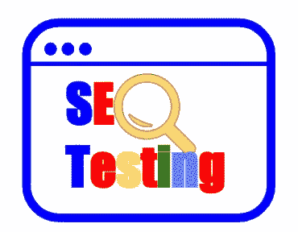

SEO 是一个提高网站在搜索引擎中排名的过程，从而让更多的人找到这个网站。当需要在互联网上搜索时，即使有 URL，我们也不需要键入它，我们求助于搜索引擎，直观地我们会点击第一个结果的页面，这样网站在列表中的位置越高，获得访问的概率就越大。

这个博客将涵盖 SEO 测试的一些基本实践，其目的是找到网站的当前状态，从而启动优化行动。这些基本实践中的许多可以用工具来实现，以便于它们的执行。为了说明 SEO 中的验证，我们在它们的试用版中用工具实现了其中的几个，从而显示了作为结果要遵循的过程。

SEO 包含不同的元素，必须以特定的方式进行评估。找到一个执行所有验证的工具并不容易，尤其是在非付费版本中。出于这个原因，我们选择了其中的一组，这有助于我们更好地练习解释。 ***Sistrix*** 用于评估可见性指数、标题、URL 和关键字。我们也有使用 ***Gtmetrix*** 的例子，它评估与页面性能相关的问题， ***Seo-browser*** ，它帮助我们验证网站结构；最后是 Google 的***pageseed insights***，有助于页面的技术分析。当然，正如后面解释的那样，SEO 的重点是 Google 提供的排名，这个搜索引擎是用来获取更多关于索引和元数据的信息的。

搜索引擎有两种结果:有机搜索索引结果和广告商付费结果。有机的结果意味着你不能付费来这里，付费的结果表明你必须付费来这里。作为一个在线分销渠道，SEO 有助于网站在那些搜索引擎中处于自然的特权地位，但 SEO 并不影响付费结果。

**SEO 是如何工作的？**

两种类型的 SEO 策略可以优化 web 应用程序:SEO OnSite，包含在页面内执行的操作；SEO Off-page，所有在网页外执行的 SEO 操作。

现场分析包括内容分析，它允许对网站的内容进行逐页的彻底审查，以验证关键词的位置是否正确，以及内容是否专注于目标受众以及所提供的产品或服务。

这种分析生成页面之间的内部链接，定义适当的 URL 结构以确保没有断开的链接，站点地图生成良好，有正确的元数据，没有垃圾关键字，在域改变的情况下，它被适当地重定向，并且正确地使用响应代码。现场搜索引擎优化还负责用户体验分析，确定什么时候导航容易，它是否能快速找到你要找的东西。

SEO 离页负责验证什么可以对外影响页面，很大程度上是定位；这方面要做的主要是分析页面的入站链接。

SEO 的目标是让一个网站出现在最常用的搜索引擎的第一个位置，以响应用户搜索，增加流量，销售，以及分布和定位的可能性。虽然 SEO 被认为是非常有竞争力的，但是当它被专业地使用时，它的伸缩性非常好。

**SEO 定位是如何实现的？**

根据*reliable soft Digital 的说法，通过使用不同的技术，SEO 允许网站在主要搜索引擎中的定位，其中谷歌是至关重要的，因为这个搜索引擎目前统治着 **92.26%** 的互联网搜索。营销代理。这就是为什么本文将重点讨论 Google 作为一个搜索引擎来实施 SEO 策略。*

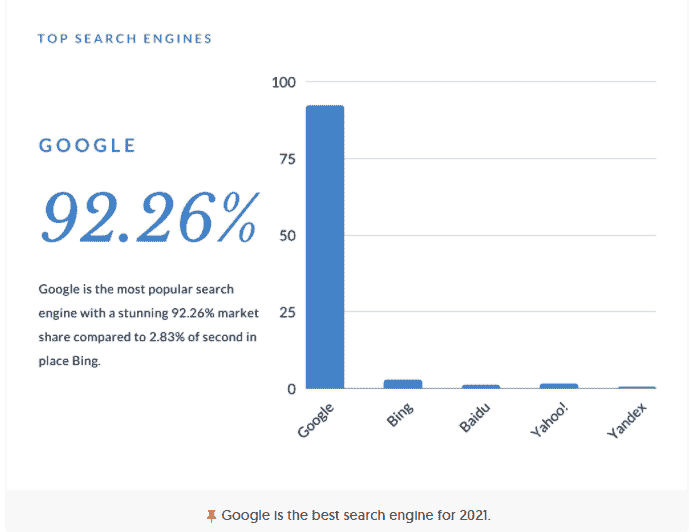

*谷歌市场份额。摘自* ***ReliableSoft 数字营销代理网站*。**

一个网站如何出现在第一个谷歌搜索结果中？

SEO 有助于在搜索中获得较高的位置，但首先，Google 必须意识到网页的存在。虽然我们不会深入探讨这个问题，但有一点很重要，即使用反向链接并通过 Google 搜索控制台发送站点地图可以避免 Google 长时间等待自己发现站点。一旦确定 Google 已经找到了站点地图，下一步就是使用优化、**测试**和调整的过程来执行 SEO 分析。

**什么是 SEO 测试？**

SEO 测试是评估优化搜索引擎结果(SERP)的最佳实践的过程，是在不同搜索引擎中获得高排名和刺激网站有机流量所必需的。

SEO 中的测试总是从评估开始，使用不同的工具并考虑最佳实践，目的是识别改进的机会，然后必须由专家团队实施。以下是实施该测试过程的一些基本验证:

1.  **基础 SEO 测试**

所有 SEO 网页分析的第一步都是检查网站索引，也就是 Google 是否已经有了索引的网站(由 Google robots 检测分析)。为了检查这一点，有必要使用命令:site: domain。扩展。

下图显示了此搜索的一个示例，该示例使用搜索引擎 google chrome 分析了网站“globant.com”的索引，得出的结论是所搜索的网站包含 9，130 个索引页面。

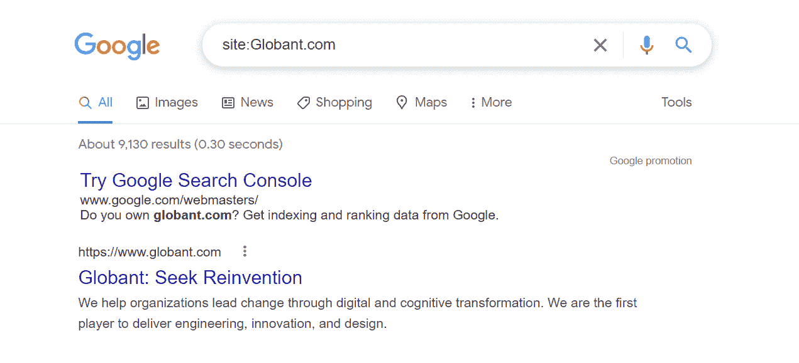

*命令结果== >站点:* **中的 domain . extension*谷歌搜索引擎*中的**

由于用户可以访问搜索结果的所有 URL，因此之前的分析允许我们检测那些不想显示的 URL，例如，具有重复内容的页面、内容很少的博客页面等等。为此，有必要对它们进行调整，以免在谷歌的搜索中受到惩罚。同样，验证 web 使用 URL“www . site.com”或裸域“site . com”重定向到主页也很重要，在这种情况下，搜索引擎必须将我们重定向到网站的主页。

**2。验证可见度指数**

可见性指数是一个衡量一个域名在谷歌搜索结果中的可见性总值的数字。这个指数可以通过正确使用关键词和按照 SEO 标准正确建设网站来提高；这两个项目将在以下段落中解释。

该图显示了一个网站的可见性指数的例子*xxx.com.au*使用搜索引擎优化工具 Sistrix.com，在其试用版:

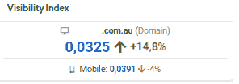

*使用 SEO 工具* ***在 xxx.com.au 网站上的可见性指数。从 Sistrix.com 试用版*生成**

**3。标题回顾**

每个网址必须有一个标题，这必须是唯一的。为了验证这个前提，可以一页一页地检查，这可能需要很长时间，或者在 SEO 工具的帮助下，可以自动完成。

如图所示，该工具，在此，*在其试用版中，执行自动扫描并显示结果:*

*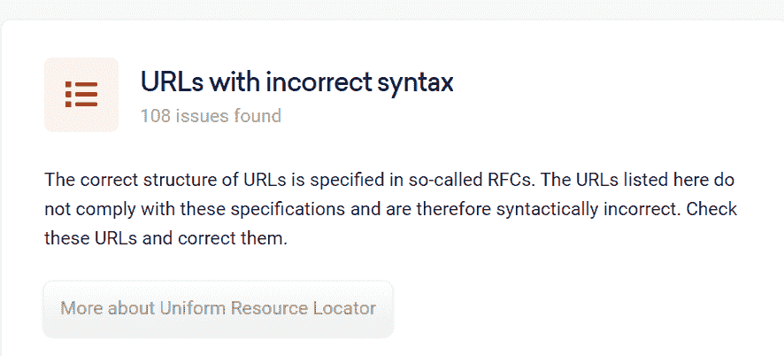*

**xxx.com.au 某网站使用 SEO 工具****Sistrix.com 试用版*** 的标题审核结果*

## *4.URL 的审查*

*URL 构造有不同的标准；在 SEO 标准下，一个页面必须避免空格、代码、数字和不指定任何内容的字符，以及大量的这些字符。例如，如果页面的目的是提供特定产品的信息，那么在 URL 中使用该产品的名称而不是代码或编号将是一个好的做法。*

*URL 的字母可以是小写或大写，因为这个变量不影响 SEO。然而，整个网站必须保持相同的风格。如果不这样做，搜索引擎就会认为这不是同一个页面，而是两个不同的页面。*

*下面的 Sistrix 截图显示了特定页面的一些 URL 是如何通过位于前 10 名和前 100 名的关键字进行排名的。如前几个位置所示，这些都是短网址，与网站的目的直接相关。*

*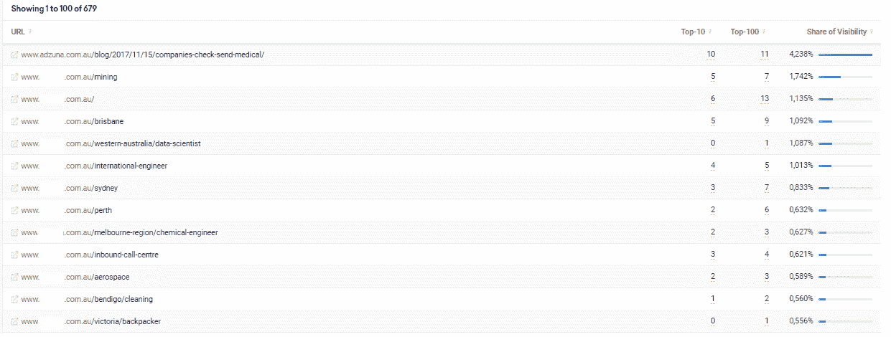*

**xxx.com.au 网址排名。摘自 SEO 工具****【Sistrix.com】****，在其试用版**

***5。关键词分析***

*关键词是 SEO 策略的基础。当选择它们时，考虑哪些关键字更好地识别了公司的商业目的，以便决定在每个页面中使用哪些关键字。一旦投入使用，就应该定期评估这些词的选择是否恰当。为了使这一点得到很好的实现，有必要分析网站的页面是如何根据关键词及其行为比率进行定位的。例如，具有多次印象但很少点击的关键词(即，低点击率)表明目标受众可能不会被触及，或者寻找该词的人心里有另一个目标。*

*正如在 Sistrix 中的以下关键字分析截图中可以看到的那样，我们可以查看关键字的行为和相关性:*

*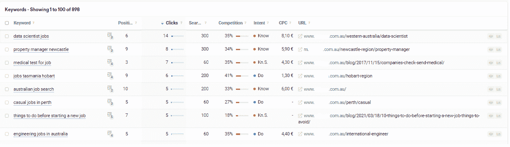*

**使用* ***SEO 工具 Sistrix.com****对网页 xxx.com.au 中与关键词及其行为比率相关的 URL 进行定位**

**也可以使用 Google Analytics 并进一步查看通过关键词到达的用户在页面上有什么行为。如果用户登陆网站后会花很多时间在上面，那太好了！这是一个目标明确的关键词指标。**

****6。文本验证****

**验证文本不是通用的或简短的是至关重要的。一个页面必须具体说明它卖什么，而不是泛泛而谈，如果页面销售洗衣服务，它不应该说它销售服务，因为它将进入一个重要的细分市场的竞争，在那里它失去了被识别的机会。它想要解释的关于页面的一切都必须是个性化的，并调整以适应业务；这种特殊化增加了定位。为了进行这种验证，应该手动进行，策略之一是在网站页面的文本中定位关键词。**

**7。元描述**

**元描述是用来描述网页内容的 HTML 标签。该描述将出现在搜索引擎结果中页面标题和 URL 的下方。为了在 Google 中保持可见，它应该包含 140-160 个字符。因此，有必要在每个网页部分有一个元描述，这必须是唯一的，对每个部分的描述。例如，图像向我们展示了元描述的成功使用:**

**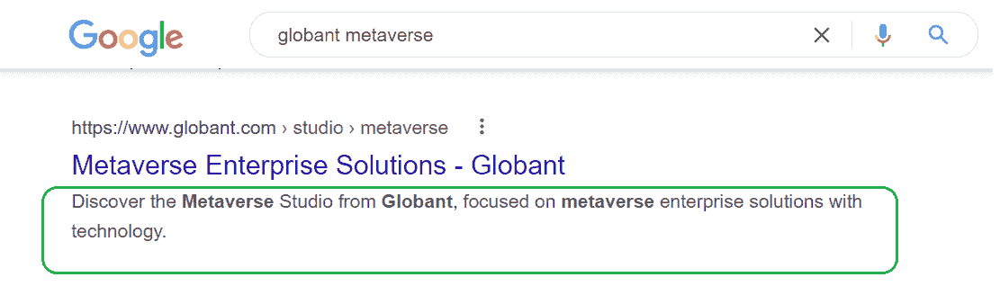**

***使用谷歌 chrome 搜索引擎* ***在 xxx.com 网站上正确使用元描述。*****

**在代码级别，该元描述包含:**

**元宇宙工作室来自 **Globant** ，专注于**元宇宙**企业解决方案与技术。></头> < br/ > < br/ >**

****8。标题结构****

**标题构成了网页的语义结构。必须验证所有 H1 标签在每个页面上都是分层组织的，以便正确操作。因此，每个网址必须包括一个独特的 H1 标题，包含该网页的主要关键字。**

**下图显示了使用 SEO 浏览器工具试用版进行审查的结果。**

**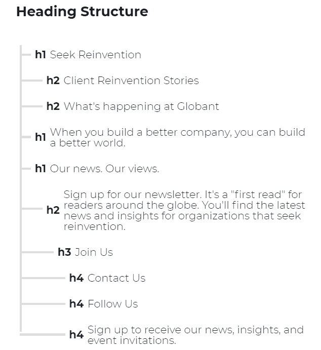**

***标题结构分析为 globant.com 用 SEO 工具*****在其试用版******

****9。确保页面没有复制的文本****

**一个可悲的常见策略是使用其他已知且成功的类似页面的内容，但这不是一个好的做法；相反，这会适得其反，因为网页的文本必须是唯一的。谷歌迅速识别这些副本，当它找到它们时，它会通过将它们排在最差的位置来惩罚网站。有许多免费和付费的工具可以找到文本匹配，以确定复制文本。**

****10。技术分析****

**当然，网站的正确技术功能是一切的基础，在 SEO 中，这是必不可少的验证之一。为了衡量这一方面，您可以使用 [*核心网络指标*](https://www.smashingmagazine.com/2021/05/core-web-vitals-case-study) 来帮助谷歌在下一次搜索算法更新中对网站进行分类，谷歌根据最终用户在网站上的 LCP、FID 和 CLS 分数将体验分为“好”、“需要改进”和“差”:**

*   ****LCP:** 最大内容油漆，衡量内容装载速度。为了提供良好的用户体验，LCP 值应该小于 2.5 秒。**
*   ****FID** :第一个输入延迟测量交互速度。为了提供良好的用户体验，FID 应该保持在 100 毫秒以下。**
*   ****CLS:** 累计布局移位。它测量视觉稳定性以提供良好的用户体验。CLS 值应该小于 0.1。**

**为了实现这种分析，有一些工具如[*【PageSpeed Insights】*](https://developers.google.com/speed/pagespeed/insights/)*[*Chrome DevTools*](https://developers.google.com/web/tools/chrome-devtools)*[*搜索控制台*](https://search.google.com/search-console/about)*[*Web Vitals Chrome 扩展*](https://chrome.google.com/webstore/detail/web-vitals/ahfhijdlegdabablpippeagghigmibma) *，以及* [*Chrome UX 报告*](https://developers.google.com/web/tools/chrome-user-experience-report)*****

**如下图所示，使用 PageSpeed 工具可以获得上述指标的网站评级。**

**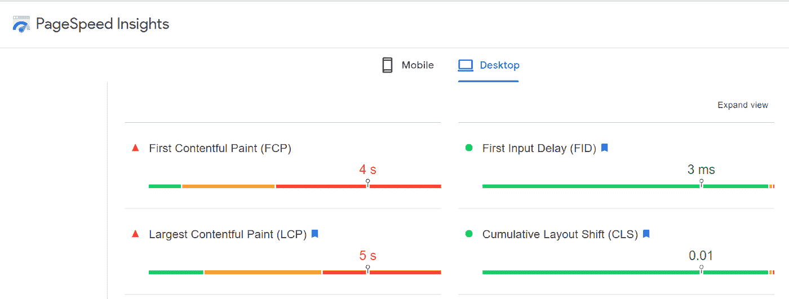**

***使用****PageSeed Insights****工具*评估 FCI、LCP 和 CLS**

****11。装载速度。****

**搜索引擎优化验证中另一个重要的里程碑是关于搜索引擎的加载速度；用户能够快速访问信息至关重要。为了验证网站的加载速度，可以使用以下工具之一:**

*   **[http://gtmetrix.com/](http://gtmetrix.com/)**
*   **[https://developers.google.com/speed/](https://developers.google.com/speed/)**
*   **[https://www.webpagetest.org/](https://www.webpagetest.org/)**

**这些在线工具中的大多数只需要你输入网站的网址，就可以生成一份分数在 0 到 100 分之间的报告。但是，建议结果必须大于 70%。速度不仅是提高网站 SEO 的一个关键因素，即使是为高排名付费的页面，速度也直接影响在线销售。**

**下图显示了正在检查的页面的可显示加载结果:**

**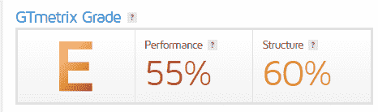****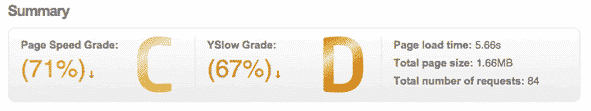**

***SEO 评分测试结果分析网页性能 xxx.com 使用***工具****

****结论****

**正如本文开头所提到的，SEO 是一种有助于正确定位网站的策略，它可以被视为一种优势，但鉴于在线市场的增长，SEO 开始成为在可用选项的海洋中生存的必要条件，并且迫切需要将这些检查作为测试过程的一部分。**

**SEO 测试是可用性测试的一部分，可以被视为可用性测试的一个子集，旨在向潜在用户展示他们的可见性。此外，当然，页面的可用性增加了可见性。**

**SEO 是一种评估和寻找改进点的策略；它没有介绍最佳实践。与任何测试一样，SEO 测试是一种了解状态并提出纠正措施的策略，但它不会提高质量。它只是测量它。**

**使用 SEO 进行评估并不能保证提高定位。尽管如此，它有助于找到弱点，并进行有助于改善定位的更改。**

**本文介绍了什么是 SEO，为什么它很重要，以及它的一些基本验证。然而，还有许多其他相关的审查，如链接建设，正确的图像实施，使用搜索引擎优化测试工具，以及提示实施搜索引擎优化分析中确定的改进。它希望在本文的第二个版本中解决这些问题。**

****参考文献****

*   ****搜索引擎优化测试指南:如何运行搜索引擎优化测试(和 7 个让你开始的想法)，作者:特雷文，** [**雪莉·https://www.webfx.com/blog/seo/seo-testing/**](https://www.webfx.com/blog/seo/seo-testing/)**
*   ****Ahrefs 搜索引擎优化入门，**[【https://ahrefs.com/seo】T21](https://ahrefs.com/seo)**
*   ****我们如何改进我们的核心网络生命体征(案例研究)作者博·哈特向，**[**https://www . smashingmagazine . com/2021/05/Core-We b-Vitals-Case-Study**](https://www.smashingmagazine.com/2021/05/core-web-vitals-case-study/)**
*   ****我们如何改进我们的核心网络生命体征(案例研究)作者博·哈特向，**[**https://www . smashingmagazine . com/2021/05/Core-We b-Vitals-Case-Study/**](https://www.smashingmagazine.com/2021/05/core-web-vitals-case-study/)**
*   ****罗梅罗院长**[**https://www.inboundcycle.com/**](https://www.inboundcycle.com/)**
*   ****迪安·罗梅罗**[**https://www.inboundcycle.com/**](https://www.inboundcycle.com/)**
*   ****Estrategia SEO:10 pasos y claves para crear la 作者 Johanna Hernández，**[**https://www . inboundcycle . com/blog-de-inbound-marketing/10-pasos-crear-Estrategia-SEO**](https://www.inboundcycle.com/blog-de-inbound-marketing/10-pasos-crear-estrategia-seo)**
*   ****现场 SEO 和非现场 SEO 有什么区别？作者亚历克斯·克里斯，**[**https://www . reliable soft . net/what-is-difference-on-site-and-offset-SEO/**](https://www.reliablesoft.net/what-is-the-difference-between-onsite-and-offsite-seo/)**