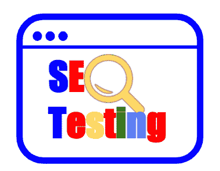
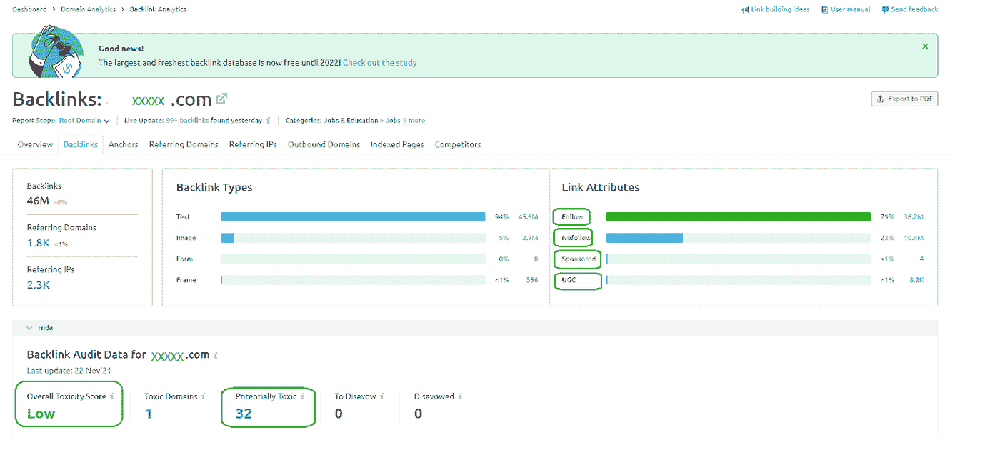
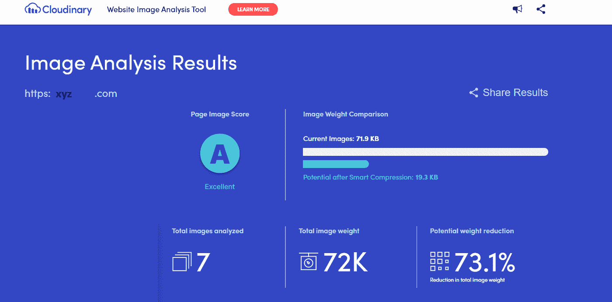

# SEO 测试第 2 部分

> 原文：<https://medium.com/globant/testing-on-seo-part-2-447954ab4023?source=collection_archive---------0----------------------->

在文章[***SEO 测试第一部分*** ，](https://docs.google.com/document/d/1N-1vsyGFjfb9eZDFmlspQjswlMPZ1BOL1iiT_6VL1yY/edit#)中，我们谈到了实施 SEO 策略意味着什么，提高网站在搜索引擎中的排名，从而让更多的人找到它。

第二篇文章将讨论在进行测试和验证 SEO 实施的良好实践时应该考虑的其他重要方面。

了解这些其他方面，包括在搜索引擎优化策略及其测试过程中。我们将深入探讨一些基本概念，如**反向链接**，它们的**类型和优势**，图像和视频**的正确实现**，以及一些免费和付费 SEO 工具**的建议**，它们将允许更友好的 SEO 实现。

**反向链接:**在 SEO 中也称为“入站链接”或“外部链接”，反向链接是从一个网页指向另一个网页的链接。反向链接是增加谷歌网站流量的最重要的离页 SEO 定位因素之一。2016 年，谷歌证实，内容和反向链接是用来定位网站的重要信号；谷歌的这种定位算法基于两个基本方面:信任和受欢迎程度。

如果我们谈论信任，有必要注意链接，因为谷歌和其他搜索引擎使用它们来了解页面权限。这些链接构成了在线网站的声誉。网站链接 A 到网站 B 被视为是一个可靠来源的标志。例如，如果五个互不认识的人推荐某个酒店为该市最好的酒店，你可能会相信它提供了良好的体验，因为有几个人认可它。

另一方面，如果我们谈论流行度，谷歌将反向链接解释为一个网站或网页的流行度投票。所以，再一次，网站之间有很强的联系，有更多的链接指向他们，排名最高。

不是所有的反向链接都有相同的权重；谷歌优先考虑来自可信和授权网站的反向链接，而不是那些不可信甚至未知的网站。这种信任以 PageRank 的形式出现，这是谷歌的一种算法，它评估指向一个页面的反向链接的质量和数量，以确定该页面的重要性和权威性的相对分数。

**反向链接的类型**

我们已经提到，反向链接并不都是一样的。下面是需要了解和理解的不同类型:

*   **无关注链接:**链接就像是对可信任资源的投票，但是如果你不想对一个网站投下保证票，但仍然需要链接到该网站，该怎么办？无关注链接使用属性 rel = "nofollow "通知 Google 和其他搜索引擎不要传递“信任”(PageRank)。**一个没有跟随的反向链接看起来像这样的 HTML 代码:**
*   [无关注链接](”https://www.domain.com/")
*   因为没有关注的链接不会通过 PageRank，它们不会帮助你在 SERPs 中排名更高。
*   **Do-Follow 链接:**Do-Follow 链接传递信任(PageRank)。因此，它没有添加 no-follow 属性。因为没有“do-follow”属性。**一个 do-follow 反向链接看起来像这样:**
*   [do-follow 链接](”https://www.domain.com/")
*   **赞助或付费链接:**有时，你可以付钱给博主或有影响力的人来推广你的部分内容或发布对你的产品的评论。如果用金钱、产品或服务交换了一个链接，那么必须添加一个属性 Rel = "sponsored，"来通知 Google。值得注意的是，付钱或送礼以获得他人对你网站的追随链接违反了谷歌网站管理员指南，并会对网站在搜索结果中的排名产生负面影响。
*   rel = "sponsored "这个属性防止你的网站被排名有害使用这些链接。**一个赞助的反向链接在 HTML 中是这样的:**
*   [赞助商链接](”https://www.domain.com/")
*   **UGC 链接:**使用 2019 年推出的另一个新属性，UGC(用户生成内容)链接来自论坛和博客评论。该属性通知 Google 该链接是由用户而不是网站管理员放置的。一个 UGC 反向链接看起来像这样:
*   [UGC 链接](”https://www.domain.com/")
*   高权威链接:正如我们已经提到的，并非所有的链接都是相同的，谷歌的算法更倾向于信任那些它不认识的链接。高权威的反向链接是那些来自可信的来源。；例如，对于谷歌来说，更有意义的是信任来自亚马逊的链接或已经赢得谷歌所要求的信任的已建立的网站。
*   **有毒链接(非自然链接):**“坏”链接通常被称为有毒或非自然链接。这些不好的链接会损害你的网站在谷歌中的排名。它们通常来自可疑或不成功的劣质网站，可能会影响您的网站并影响任何评级。这一类别中还有违反谷歌网站管理员指南的链接，该指南的存在完全是为了操纵搜索引擎排名。例如，它可以转换为没有标记禁止关注或赞助属性的付费链接，那些来自低质量目录或书签网站的链接，广泛用作页脚链接，或者许多使用精确重合文本的非自然链接。

使用 ***Semrush*** 工具，特别是反向链接审计功能，可以获得更多关于审计反向链接和识别可能的有害或非自然链接的信息。它允许你分析和消除指向你的域名的有害链接，降低你的排名。

*下图显示了使用 Semrush 试用版的反向链接分析仪表板。对于这个例子，使用任何 page.com。*

*xxx.com 的反向链接审查结果。网站使用 SEO 工具* ***Semrsush 试用版***

**SEO 反向链接的优势**

**1。提高有机排名:**反向链接帮助你在搜索引擎中获得更好的排名。如果任何网页内容有其他网站的有机链接，该内容自然会在搜索引擎中排名靠前。然后，目标应该是创建指向个人帖子/页面的链接，以及指向您主页的链接。

**2。更快的索引:**反向链接帮助搜索引擎机器人发现链接到你的网站，并有效地抓取。特别是对于一个新网站，获得反向链接是非常重要的，因为它们有助于更快地发现和索引你的网站。

**3。推荐流量:**反向链接有助于获得推荐流量，因为它通常是有针对性的和低跳出率。

**验证图像的正确使用**

当谈到 SEO 时，大部分注意力都集中在 Google 文本搜索的结果上。不过在测试 SEO 优化的时候有一个方面也是必不可少的:***“Google images。”***

*下图显示了使用****webpagetest.org 工具分析 xyz.com 网站上图片使用情况的 SEO 测试结果分数。***

*xyz.com 某网站使用 SEO 工具* ***网页测试试用版*** 的图片审核结果

为了在关于图像搜索的搜索排名中实现定位，有必要执行以下验证:

*   **验证搜索引擎可以访问图像:**确保 robots.txt 文档允许搜索引擎访问网络上的图像。Robots.txt 是位于根目录或层次结构中的第一个目录或文件夹中的文件，用于向搜索引擎指定他们可以访问哪些目录或文件，以及不可以访问哪些目录或文件。您还可以利用并在此文件的限制或权限下指示站点地图 URL。这些限制的一个说明性例子是带有公司详细联系信息的页面。尽管它们为用户提供了有用的信息，但有可能该公司对搜索引擎在其结果中包含这些信息并不感兴趣。因此，在 robots.txt 文件中指定它就足以避免这种情况。
*   **图片文件名:**网站上的每张图片都必须有一个名称，如果是复合名称，必须用连字符隔开。比如谷歌不读空格和重音:“Globant-converge-2021.jpg”。
*   **Alt 文本属性中的图片描述:** Alt 文本是图片、照片和形状最重要的 SEO 因素。它是一个描述属性，必须插入到图像的 HTML 代码中:
*   例如，避免在同一张图片的文件名和替代文本中出现重复的关键字是至关重要的。谷歌认为这是一种算法操纵，导致你的网站受到处罚。
*   **将图像与页面内容对齐:**与页面内容相关的图像上下文也直接影响定位。例如，一个房子的图像在一篇谈论房地产的文章中会比在一篇关于技术的文章中定位更好。因此，页面上的图像和文本需要相关联。
*   **验证合适的图片尺寸:**这是另一种影响页面 SEO 的技术。因此，减小文件大小可以加快页面的加载速度。因此，使用在不损失图像质量的情况下减小文件大小的程序。Optimizilla、Kraken.io、imageOptim 和 TinyPNG 等工具可以方便地实现这一目的。
*   **合适的格式:**应选择压缩格式，使图像重量轻，如 jpeg 或 png，避免使用带有额外元数据的格式，如 tiff。对于动画图像，gif 是理想的格式。另一方面，PNG 非常适合透明的图像，如徽标，JPEG 是照片的标准格式。
*   **开放图对于 SEO 来说是必不可少的:**开放图是一个 HTML 代码标签，当内容被共享时，就会出现一个相关的图片。在 HTML 中是这样的:
*   。
*   配置开放图表标签可确保每次您共享文章时，相关图像都会出现。

**验证正确的视频实现**

与图像一样，在视频的情况下，有必要考虑搜索引擎还不能像人眼那样解释内容。因此，确保以下事项至关重要:

*   包括视频元描述
*   验证页面收到的链接。
*   检查指向视频的外部站点的链接锚文本
*   验证用户观看视频时的持续时间。
*   审查收到的社交互动及其效果(喜欢、订阅者、评论数量和互动频率)。
*   确保将所有视频保存在同一个目录中有助于搜索引擎更容易找到它们。
*   使用视频网站地图。对于搜索引擎来说，这是一个包含有价值数据的文档，适用于快速找到它们。

**对于发往 YouTube 和其他类似社交网络的视频，这些是必须验证的方面:**

*   编写关键字的元数据，并注意标签或标签列表。一般来说，这些列表最多允许 120 个字符，建议添加一个指向公司网站的链接。
*   优化视频缩略图，也称为其缩略图，使其更引人注目。YouTube 目前提供了三张上传视频的截图供选择，作为可能的缩略图，你应该选择最有吸引力的一张，背景最亮。它提高了点击率，因此影响了搜索引擎优化的定位。
*   创建额外的内容，鼓励访问者访问网站，如文章或信息图表，将它们添加到视频描述中，甚至在视频中添加嵌入文本。此操作可以帮助我们改进包含此内容的网页的定位。
*   在元数据中使用单词 video，因为用户会不断地搜索这个单词。
*   确保视频不超过 5 分钟，除非内容需要更长的持续时间。
*   在战略站点中包括关键字，例如，在描述和标题的开头；这种做法可以被认为是黑帽，但提供了良好的结果，而不是使用同义词或语义变体。

**SEO 分析工具**

下面是一些搜索引擎优化工具，可以让我们更深入地分析一个网站，并确认它是否在谷歌排名良好，以及搜索引擎优化推荐的实施标准是否得到遵守。然而，其中一些工具是有成本的。

[**SISTRIX:**](https://www.sistrix.com/) 有用的付费工具，以毫米为单位评估网站的有机增长；今天评价网页上某些活动的 SEO 影响可能是最准确的。Sistrix 包括六个独立的模块:搜索引擎优化，通用，链接，广告，社会和优化。它主要从事:

*   验证关键词研究。
*   查看有机搜索引擎结果中的可见性指数分析。
*   审查页面搜索引擎优化错误审计。
*   验证网站链接的数量和质量。
*   查看 Google Adwords 中的投资、广告和关键词测量。

[**SEO 雷神之锤:**](https://www.seoquake.com/index.html) 一款免费插件，提供基本的 SEO 指标。例如:

*   概览主要指标。
*   运行网页的搜索引擎优化审计。
*   确定关键字密度。
*   查看社交网络的统计数据。

[**GOOGLE ANALYTICS:**](https://analytics.google.com/analytics/web/provision/#/provision)**该工具允许分析和查看网站性能，获取访问转化率信息，以及技术分析报告(广告、社交网络、内容等)。**

**[**谷歌搜索控制台**](https://search.google.com/search-console/about) **:** 谷歌的免费工具可以让你分析网页流量；虽然不是 SEO 专属，但是提供了有趣的数据；由于来自谷歌，你可以从你的搜索引擎获得完整的信息。其功能可以强调如下:**

*   **它允许从网站上删除有害的网址和反向链接。**
*   **它提供了关于搜索分析、抓取错误和网站搜索的详细报告。**
*   **允许您更改域。**
*   **它可视化了常见的 SEO 问题(例如，优化失败)。**
*   **它执行入站链接分析。**
*   **它允许您导出 SEO 数据，如关键字、站点地图、站点地图和搜索引擎的抓取错误。**
*   **它控制一个网站的印象(也就是说，所述网站的 URL 在用户的搜索结果中出现的次数)。**
*   **这样更容易知道点击次数。(表示用户访问网页的次数)。**
*   **它标识了所讨论的 URL 在特定关键字的搜索结果中到达的平均位置。例如，如果这个 URL 在一次搜索中出现在位置 3，在另一次搜索中出现在位置 7，那么你的平均位置将是 5 [(3 + 7) / 2]。**
*   **计算点击率(点击率，或 CTR)。这个变量的计算方法是将点击次数除以印象次数，然后将结果乘以 100。**

**[**GOOGLE TRENDS**](https://trends.google.com/trends)**:**该工具可以检测国家和国际层面的搜索趋势:根据地理区域观察哪些是最活跃的搜索，YouTube 上观看次数最多的视频的趋势列表。**

**[**GOOGLE 页面速度洞察:**](https://pagespeed.web.dev/) 提升用户体验的一个必不可少的方面就是提高加载速度，增强网页定位或者 SEO。有了这个工具，你将能够分析和优化你的网页或博客的页面速度。**

**[**谷歌手机友好测试** :](https://search.google.com/test/mobile-friendly) 越来越多的用户通过手机上网。因此，您的客户也将通过他们的设备浏览您的网站。这个谷歌工具允许优化网站，让你的用户在任何设备上的体验都一样好。**

**[**GOOGLE MY BUSINESS:**](https://www.google.com/business/)在个人资料中，您可以添加所有可能对潜在客户有吸引力的贵公司信息。此外，通过谷歌我的业务，你拉近了你和你的用户之间的距离，创造了那种吸引搜索引擎算法眼球的对话。**

**[**谷歌商业评论链接 WHITE SPAR 生成器:**](https://whitespark.ca/google-review-link-generator/) 让你的客户快速找到你，让你的用户有地方与你的公司分享经验，这一点至关重要。这个工具允许你创建个性化的链接发送给你的客户，让他们直接在你的谷歌个人资料上写下他们的意见。**

**[**AHREFS:**](https://ahrefs.com/) 它是一个付费的 SEO 工具，有很多有用的功能。它主要以链接构建分析而闻名。它允许查看项目链接和与链接类型相关的信息(跟随、不跟随、创建周期、位置、锚等)。).甚至与竞争对手进行比较。此外，它可以突出关键字分析，提供一些额外的有价值的信息，如点击率。通过社交网络中的份额或对链接建设的影响等变量来定位最佳内容对以下方面非常有帮助:**

*   **强大的力量来进行关键字研究过程**
*   **最理想的是了解你的页面中更有权威的页面**
*   **它允许你检测你的网页上的负面搜索引擎优化攻击。**

**[**SEMRUSH** :](https://www.semrush.com/projects/) 一款模型免费增值工具，免费功能包括关键词研究或竞争对手分析。使用付费选项，您还可以享受 SEOquake 的优势，这是一个附属的 Chrome 扩展，具有多种功能。**

**[**尖叫青蛙:**](https://www.screamingfrog.co.uk/seo-spider/)SEO 审核最常用的工具之一。在免费版本中，可以分析多达 500 个网址，并消除网站的所有搜索引擎优化错误。**

**[**SERPROBOT:**](https://www.serprobot.com/) 了解一个网站在搜索引擎中的排名对于控制 SEO 策略至关重要，这正是这个工具所提供的。通过这种方式，可以精确地确定网站上哪些地方有效，哪些地方需要改进。**

**[过时内容查找器](https://www.visiospark.com/outdated-content-finder/):顾名思义，过时内容查找器有助于在你的网站上找到要更新的过时内容。**

**建议控制可能的剽窃案例，并找出谁分享了你的内容，确定他们是否链接到你的网站，或者是否有必要要求他们这样做。**

**[**打开链接分析器:**](https://openlinkprofiler.org/) 在搜索栏中输入域名，查看网页反向链接。**

**[**SEO 分析器:**](https://www.seo-browser.com/) 它可以让你检查反向链接、标题结构、页面加载速度、分析 SEO 页内、分析排名、竞争对手。**

****:这是一个免费的工具，可以用来测试网站的性能。****

******结论******

****正如文章开头所指出的，我们继续讨论 SEO 对于网站定位的重要性。但是在这个机会中，我们详细介绍了 SEO 策略的其他重要方面，例如反向链接，以及专业的实现如何帮助网站更好地排名。****

****合并图像和视频也进行了详细解释，因为这是至关重要的使用良好的搜索引擎优化实践，以包括在网站上。这些都是网页内容的必要组成部分，也是产生流量和获得谷歌良好排名的重要因素。****

****免费和付费工具使得 SEO 审核更加容易，因为手动审核非常耗时，并且无法产生预期的结果。这篇博客展示了其中的一些，但可能性甚至更大。****

******参考文献******

*   ****什么是反向链接？如何获得更多的反向链接由约书亚哈德威克[https://ahrefs.com/blog/what-are-backlinks/](https://ahrefs.com/blog/what-are-backlinks/)****
*   ****迪安·罗梅罗著[https://www.inboundcycle.com/](https://www.inboundcycle.com/)****
*   ****迪安·罗梅罗著[https://www.inboundcycle.com/](https://www.inboundcycle.com/)****
*   ****有毒的反向链接:詹姆斯·布洛克班克的《cómo hacer un análisis de backlinks y detectar su calidad》，[https://es . SEM rush . com/blog/toxic-backlinks-analisis-de-calidad/](https://es.semrush.com/blog/toxic-backlinks-analisis-de-calidad/)****
*   ****《如何找到(任何网站的)反向链接》，作者康纳·莱希，[https://www.semrush.com/blog/find-backlinks/](https://www.semrush.com/blog/find-backlinks/)****
*   ****26 个 SEOs 的最佳免费 Chrome 扩展(试用和测试)，尼克·丘里克，[https://ahrefs.com/blog/seo-chrome-extensions/](https://ahrefs.com/blog/seo-chrome-extensions/)****
*   ****《技术搜索引擎优化初学者指南》，作者帕特里克·斯托克，[https://ahrefs.com/blog/technical-seo/#technical-seo-toolss](https://ahrefs.com/blog/technical-seo/#technical-seo-toolss)****