# 在移动应用程序中测试 SSL 固定

> 原文：<https://medium.com/globant/testing-ssl-pinning-in-a-mobile-application-44e0175f9244?source=collection_archive---------1----------------------->

# 摘要

本文描述了 SSL 固定的概念及其在移动项目中实现的重要性，以防止专用网络上的应用程序使用代理拦截 TLS/SSL 请求。

# 描述

OWASP 将 SSL 固定定义为*“用户和开发人员在他们的应用程序中发送和接收数据时，期望端到端的安全性，尤其是受 VPN、SSL 或 TLS 保护的通道上的敏感数据。虽然控制 DNS(域名系统)和 CA(证书颁发机构)的组织已将大多数威胁模型中的风险降低到微不足道的水平，但用户和开发人员受制于他人的 DNS 和公共 CA 的层级，他们面临着不小的风险"*。在移动应用程序的情况下，应该考虑的一个优先事项是，对应用程序使用的服务的调用或请求不应该被拦截。如果用户(在特定情况下是恶意用户)可以捕获应用程序对后端/服务的请求以及它传递给它的参数，攻击者就可以操纵所发出的请求，方法是操纵请求中发送的参数、请求头、您发出的请求的类型、将不同类型的参数传递给那些在前端层而不是后端层验证的预期参数，等等。

恶意用户捕获应用程序请求(即使它们受到安全通道的保护)的方法之一是，通过他/她自己的 CA 安装签名证书，并配置一个使用该证书捕获应用程序发送的请求的代理。通过依赖代理证书，即使请求通过安全通道，也有可能捕获请求，并公开发送到应用程序使用的服务的请求的参数、标头、URL 和类型。避免这类重大威胁的一种方法是在应用程序中实现 SSL 固定。

也就是说，SSL pin 接受主机或服务的证书或公钥散列；它可以在开发时添加到应用程序中，并在应用程序每次发送请求时与发布的服务进行比较。它也可以添加到应用程序和服务之间的第一次握手中。最好选择第一种方法，因为预加载证书或带外公钥通常意味着攻击者无法发现 pin。如果证书或公钥是在第一次遇到时添加的，它可能会锁定攻击者的证书。

SSL 固定利用用户与组织或服务之间的现有关系来帮助做出更好的安全相关决策。因为您已经有了关于服务器或服务的信息，所以您不需要依赖通用的机制来解决密钥分发问题。也就是说，您不需要通过 DNS 获得名称/地址，也不需要通过 CA 分配获得链接和状态。

每次应用程序向主机或服务发送请求时，它都会将应用程序中的证书与从服务收到的证书进行比较，如果它们匹配，则表示它们之间存在安全连接，否则应用程序不会发送数据，并将通知用户连接错误。可以对叶证书、中间证书或根证书进行锁定。Mathew Dolan 在他的 [Android Security: SSL Pinning 文章](/@appmattus/android-security-ssl-pinning-1db8acb6621e)中广泛解释了每种类型、差异和实现。

以下概念证明(PoC)是一个关于 SSL 固定重要性的示例。该示例用登录表单捕获请求，以纯文本形式公开凭据，并通过代理工具修改它们。第二个示例包括 SSL Pinning 的实现，它防止登录表单被拦截。此 PoC 包括 Burp Suite Community Edition，用于捕获应用程序请求，其中包含一个代理，可以设置该代理来执行捕获。

# 概念开发的证明

## 拓扑学

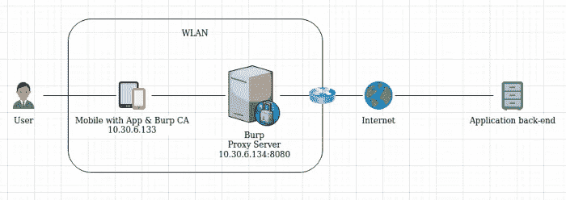

*Image 1: Topology Context Diagram*

## 代理设置

对于这个特定的案例，使用了 Burp Suite Community Edition 工具。这个工具带有一个集成的代理功能。不同的工具可用于此目的，例如:Charles、MitM Proxy、ZAP 等。

对于此 WLAN，Burp 代理的 IP 在端口 8080 上设置为 10.30.6.134。这些配置必须在装有要测试的应用程序的手机上进行设置。

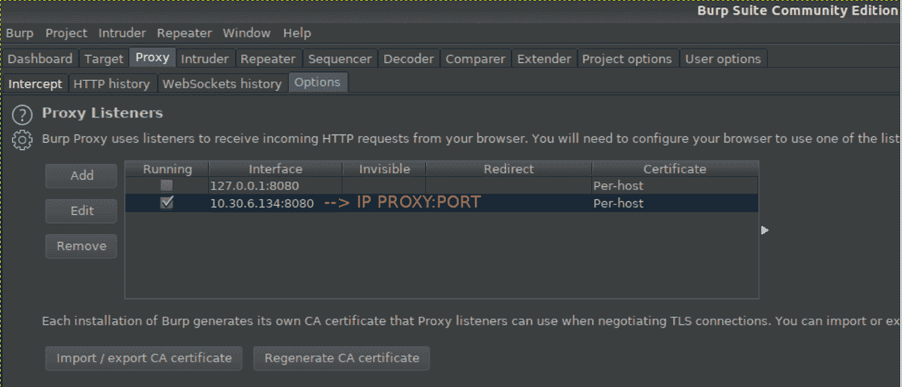

*Image 2: Burp Proxy configuration*

## 移动配置

对于 WLAN，将在其中测试应用程序的客户端/电话(iPhone 7 v13.3.1)的私有 IP 设置为 10.30.6.133。然后，我们还需要用上一步中定义的 IP 来配置电话使用的代理。

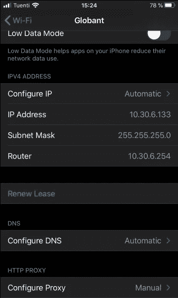

*Image 3: Mobile IP Topology configuration*

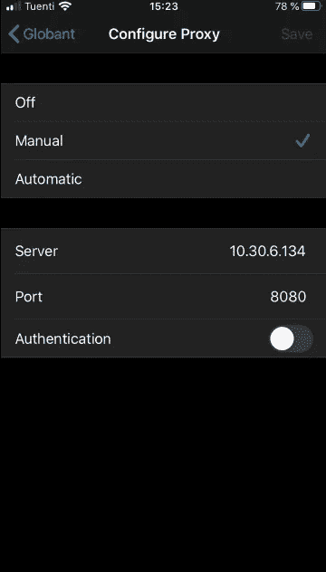

*Image 4: Mobile Proxy Topology configuration*

如果您使用的是 Android Studio 模拟器，则必须在设置菜单和代理选项卡中的模拟器扩展控件中配置代理。在本例中，IP 设置如拓扑所示。

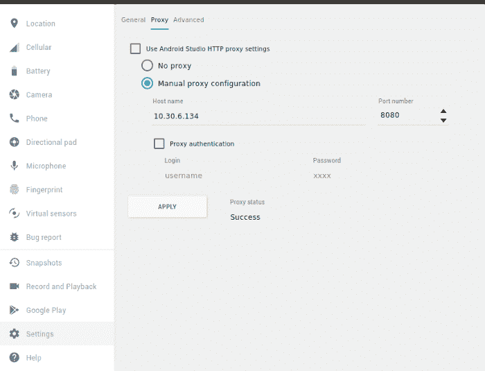

Image 5: Android Studio emulator proxy configuration

## 移动证书配置

Burp 证书(Portswigger CA)必须设置为“完全信任”,以便 Burp 拦截请求。安装证书的所有步骤都可以在 [iOS](https://portswigger.net/support/installing-burp-suites-ca-certificate-in-an-ios-device) 和 [Android](https://portswigger.net/support/installing-burp-suites-ca-certificate-in-an-android-device) 的官方 Portswigger 文档中找到。

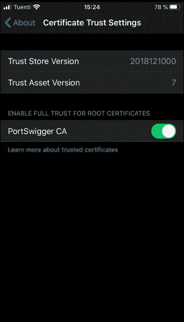

*Image 6: Mobile certificate configuration full trust*

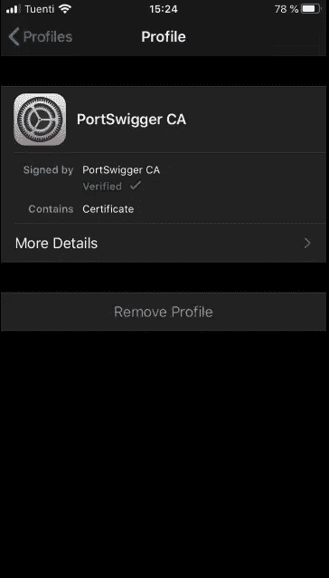

*Image 7: Mobile certificate configuration verified*

# 捕获请求

在这一步，我们可以开始测试和拦截请求。请注意，在拦截请求时，代理会捕获对受 SSL 保护的 URL 的请求，即使它通过安全通道传播，也可以用纯文本形式看到请求的参数。

## 登录不正确的凭据测试

第一个测试针对的是一个应用程序，该应用程序具有一个发送电子邮件和密码的表单，用于在应用程序内部对用户进行身份验证。在此测试中，为了以纯文本形式显示请求中发送的参数，在表单上使用不正确的凭据进行了测试，并在 Burp 上捕获了这些参数。

*   **通过移动应用发送凭证**

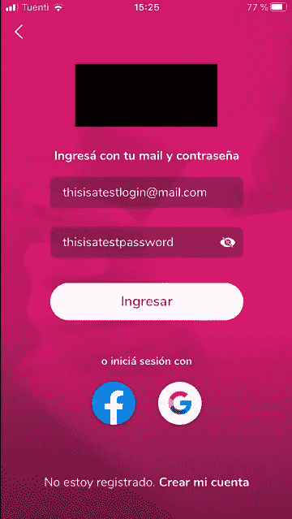

Image 8 Mobile application login test

*   **代理拦截请求错误凭证**

该请求在 Burp 代理中被拦截，我们可以看到，参数中发送的公开端点的 URL 和用户凭据以纯文本形式显示。这些参数将被发送到应用程序后端，并可在具有 Burp 的中继器工具上进行操作。

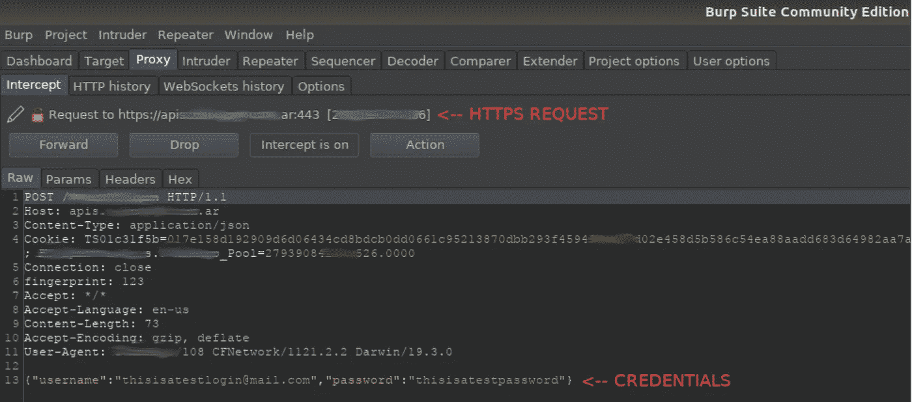

*Image 9: Proxy request intercepted incorrect credentials*

*   **代理历史记录请求不正确的凭据**

对于此测试，我们还可以在“代理 HTTP 历史记录”选项卡中查看请求响应的状态。

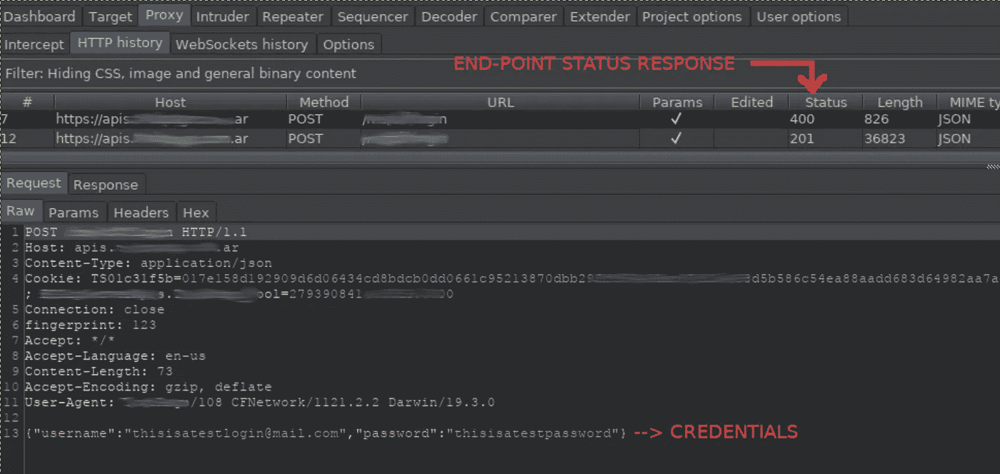

*Image 10: Proxy history request incorrect credentials*

*   **代理历史响应错误凭证**

我们还可以看到从端点收到的请求的响应。

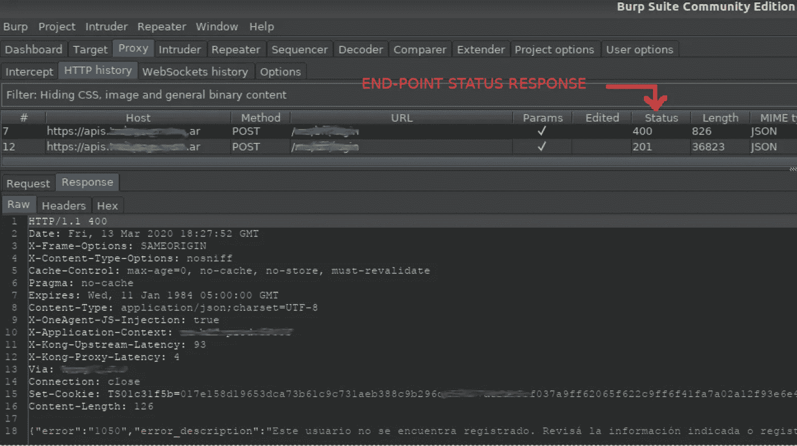

*Image 11: Proxy history response incorrect credentials*

## 使用正确的凭据登录测试

下一个示例使用相同应用程序表单的正确凭据完成，并截取了应用程序后端服务的响应。

*   **代理历史记录请求正确凭证**

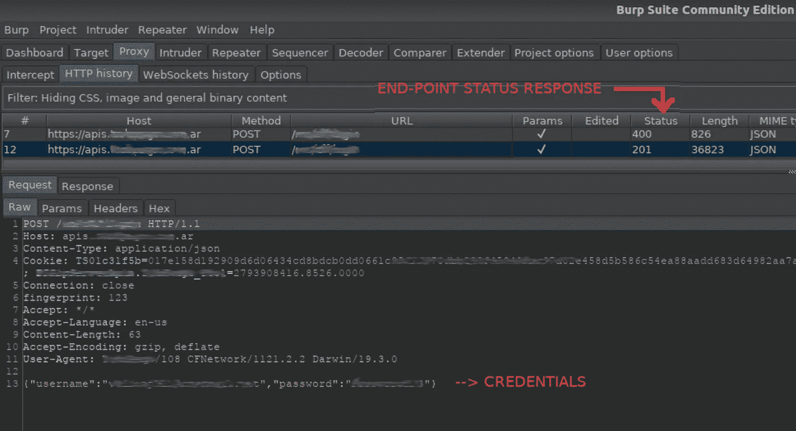

*Image 12: Proxy history request correct credentials*

*   **代理历史响应正确凭证**

在这个测试中可以看到，响应显示了一个 access_token 和有关用户的详细信息。这些信息以及第一次测试中显示的信息可用于自动执行针对此应用程序后端的暴力攻击，或对其执行 DDoS 攻击。

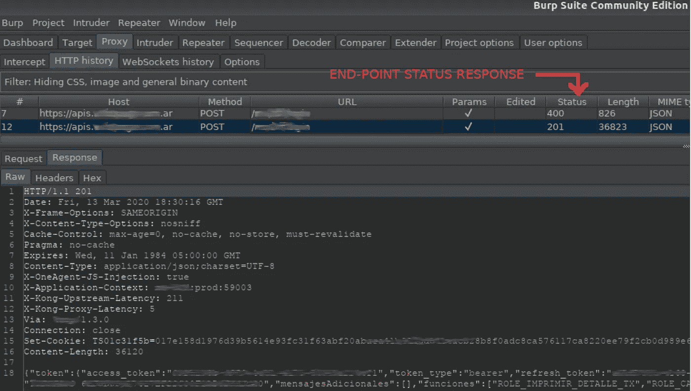

*Image 13: Proxy history request correct credentials*

# SSL 锁定实现

## ios

Swift 5.2 为 iOS 应用程序提供了一种实现 SSL 锁定的相对简单的方法。必须下载端点的凭证。一旦下载了证书，就必须将证书作为文件放在资源文件夹中，以便在希望调用它的项目的类中可以识别它。对于这个例子，它被称为“certificade-文件名”，并且具有。der 扩展。比较现有证书，并解决来自服务的“质询”。每次应用程序发送请求时，都使用已开发的方法。在这种情况下，“urlSession”方法。

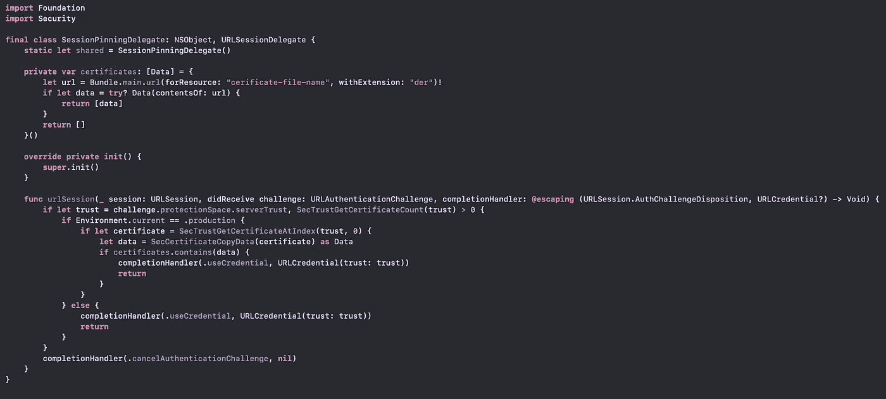

*Image 14: Swift code SSL pinning, credits to Ivan Rapoport*

## 机器人

在 Android 的情况下，不需要下载整个证书，只需要包含散列并与来自服务的散列进行比较。在 extras 部分，您可以找到 bash 代码来提取公共证书的散列。OkHttp3 库在客户端有一个方法，处理每个请求的散列验证。在下一个 Kotlin 代码示例中，它在构建 okHttpClientBuilder 对象的部分执行锁定，创建一个单独的 CertificadePinner 类型的对象，其中包含作为 *sha256* 的散列。CertificadePinner 对象作为 okHttpClientBuilder 对象的 certificatePinner 方法中的参数发送:

```
//OkHttp3 Client
val okHttpClientBuilder = OkHttpClient.Builder()
 .authenticator(CustomAuthenticator.getInstance(context))//SSL Pinning
val certPin = CertificatePinner.Builder()
 .add(BuildConfig.PATTERN, "sha256/**YOUR-HASH-HERE**")
 .build() okHttpClientBuilder.certificatePinner(certPin)
```

更多 Android 中的实现方法:

[](/@appmattus/android-security-ssl-pinning-1db8acb6621e) [## Android 安全性:SSL 锁定

### 在 Android 应用中使用 SSL 很容易，但是确保连接的安全却是另一回事。一个…

medium.com](/@appmattus/android-security-ssl-pinning-1db8acb6621e) 

# 实现 SSL 固定的测试请求捕获

实现完成后，是时候再次检查前面部分中完成的过程并比较结果了。

首先，在 Burp 仪表板上的事件日志中可以看到，当在应用程序上发送请求时，连接 SSL 无法完成，因为它在证书交换时失败。

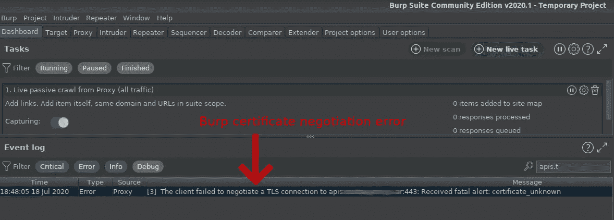

*Image 15: Burp certificate negotiation error*

同样，如果您有可能使用 Logcat 调试应用程序，对于 Okhttp3 库，您可以看到一个错误，通知您一个 SSL 握手异常，即已配置的证书 pin 与应用程序和端点之间当前交易的 pin 不匹配。换句话说，库无法找到在当前请求中收到的证书的路径，并且不允许在证书对之间建立连接。

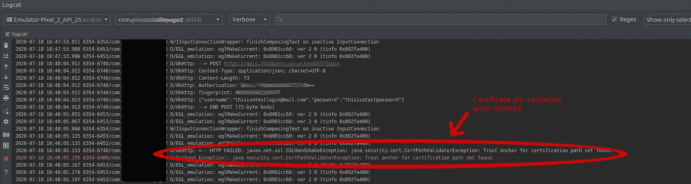

*Image 16: Android logcat Okhttp3 pinning error*

应用程序中 SSL 固定的错误或无效配置会暴露移动应用程序对其后端的调用。恶意用户可以将此作为攻击媒介。

# 风险

SSL 牵制是一种预防方法，但是仍然有办法避免这种保护，例如使用程序，如 Frida，允许注入 snipes，允许您绕过这一措施。另一个例子是对应用程序执行逆向工程，改变散列(在 Android 上)并重新构建它。建议在应用程序与其后端之间的通信中对敏感信息使用加密算法，这样如果有人看到请求，请求就不会是明文。

# 临时演员

在 iOS 上安装 burp 证书
在 iOS 设备上安装 Burp 的 CA 证书

在 Android 上安装 burp 证书
[在 Android 设备上安装 Burp 的 CA 证书](https://portswigger.net/support/installing-burp-suites-ca-certificate-in-an-android-device)

Bash 提取公共证书 *sha256* 中 hash 的代码(提取自: [Android Security: SSL Pinning。在 Android 应用中使用 SSL 很容易……|作者马修·多兰](/@appmattus/android-security-ssl-pinning-1db8acb6621e)

```
#!/bin/bash
certs=`openssl s_client -servername $1 -host $1 -port 443 -showcerts </dev/null 2>/dev/null | sed -n '/Certificate chain/,/Server certificate/p'`
rest=$certs
while [[ "$rest" =~ ' - - -BEGIN CERTIFICATE - - -' ]]
do
 cert="${rest%% - - -END CERTIFICATE - - -*} - - -END CERTIFICATE - - -"
 rest=${rest#* - - -END CERTIFICATE - - -}
 echo `echo "$cert" | grep 's:' | sed 's/.*s:\(.*\)/\1/'`
 echo "$cert" | openssl x509 -pubkey -noout |
 openssl rsa -pubin -outform der 2>/dev/null |
 openssl dgst -sha256 -binary | openssl enc -base64
Done
```

# 参考

1.  [证书和公钥锁定控制](https://owasp.org/www-community/controls/Certificate_and_Public_Key_Pinning)
2.  [安装 Burp 的 CA 证书](https://portswigger.net/burp/documentation/desktop/tools/proxy/options/installing-ca-certificate)
3.  [安卓安全:SSL 牵制。在 Android 应用中使用 SSL 很容易……|作者 Matthew Dolan](/@appmattus/android-security-ssl-pinning-1db8acb6621e)