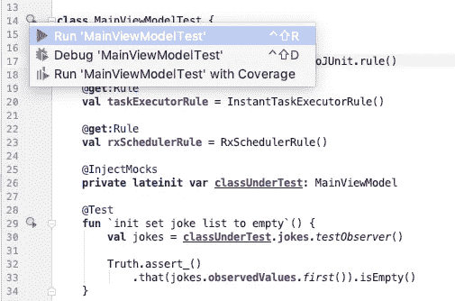
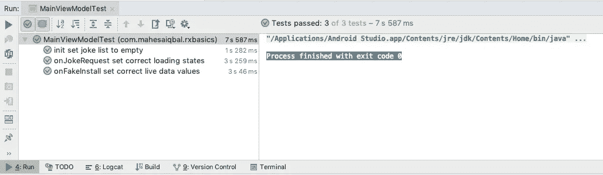

# Testing ViewModel dalam MVVM menggunakan LiveData dan RxJava

> 原文：<https://medium.easyread.co/testing-viewmodel-dalam-mvvm-menggunakan-livedata-dan-rxjava-855489281590?source=collection_archive---------7----------------------->

Setelah berhasil membuat aplikasi sederhana dengan LiveData dan Rxjava di artikel [sebelumnya](https://medium.com/@mahesaiqbal6/mencoba-implementasi-rxjava-pada-aplikasi-android-f606a195b7f1) . Sekarang saya ingin mencoba implementasi Unit Testing pada aplikasi tersebut.

Sebelumnya, saya akan mencoba memberikan sedikit pemahaman tentang Unit testing terlebih dahulu.

> A unit test generally exercises the functionality of the smallest possible unit of code (which could be a method, class, or component) in a repeatable way. You should build unit tests when you need to verify the logic of specific code in your app.
> 
> For example, if you are unit testing a class, your test might check that the class is in the right state. Typically, the unit of code is tested in isolation; your test affects and monitors changes to that unit only.

Berdasarkan pengertian diatas, Sebuah tes unit umumnya menjalankan fungsionalitas dari unit terkecil yang mungkin dari kode (yang bisa berupa metode, kelas, atau komponen) dengan cara yang berulang. Anda harus membuat tes unit ketika Anda perlu memverifikasi logika kode tertentu di aplikasi Anda.

Misalnya, jika Anda menguji unit kelas, tes Anda mungkin memeriksa apakah kelas dalam keadaan benar. Biasanya, unit kode diuji secara terpisah; pengujian Anda memengaruhi dan memantau perubahan hanya pada unit itu.

## Gradle

Saya menggunakan mockito dan google truth

## Testing LiveData Values

Cara yang tepat untuk menguji LiveData adalah menyimpan nilainya dalam daftar tertentu, kemudian lihat daftar ini dan periksa apakah kontennya benar.

Pertama-tama, mari kita buat **Observer** khusus untuk mengisi daftar, dan *extension function* untuk digunakan.

**TestRule** spesifik diperlukan untuk menguji *Architecture Component* : **InstantTaskExecutorRule()**

Keren bukan? Tapi mengapa kita membutuhkan *list* /daftar untuk tidak menyimpan apa-apa? Mari kita bahas lebih dalam dan lihat contoh berikut ini.

## Testing Rx methods

Setelah selesai dengan nilai-nilai yang ada pada **LiveData** , mari kita lihat **Rx** . Jika kita mencoba menjalankan pengujian sebelumnya dengan **onInstall()** yang menggunakan **Rx** , kami menghadapi kesalahan ini:

> java.lang.AssertionError: Not true that is equal to

Tugas dijalankan secara paralel dengan io Scheduler. Itu sebabnya pelaksanaan tes lebih cepat daripada operasi di latar belakang. Nilai-nilai LOADING dan INSTALLED tidak memiliki waktu untuk ditetapkan sebelum tes berakhir.

Apa yang indah dengan RxJava adalah semua yang mungkin Anda butuhkan sudah ada. Untuk mencapai pengujian unit/ *Unit Testing* , ada penjadwal khusus yang disebut **Trampoline** . Semua pekerjaan yang *subscribe* akan diantrikan dan dikeluarkan satu persatu. Mari buat **TestRule** baru untuk menggunakannya.

Sekarang jalankan pengujiannya.

> Process finished with exit code 0

 [## mahesaiqbal/RxBasics

### Learning base reactive interface on RxJava. Contribute to mahesaiqbal/RxBasics development by creating an account on…

github.com](https://github.com/mahesaiqbal/RxBasics.git) 

## Referensi

Testing ViewModel in MVVM using LiveData and RxJava : [https://medium.com/@nicolas.duponchel/testing-viewmodel-in-mvvm-using-livedata-and-rxjava-b27878495220](https://medium.com/@nicolas.duponchel/testing-viewmodel-in-mvvm-using-livedata-and-rxjava-b27878495220)

*Artikel ini di tulis oleh* [*Mahesa Iqbal Ridwansyah*](https://medium.com/u/423a2702de9a?source=post_page-----855489281590--------------------------------) *beliau sering menulis artikel mengenai Software Engineering dan Programming. Follow profilnya untuk mendapatkan update-an terbaru artikel-artikel beliau.*

*Jika anda merasa artikel ini menarik dan bermanfaat, bagikan ke lingkaran pertemanan anda, agar mereka dapat membaca artikel ini.*