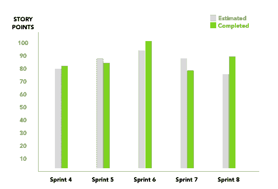
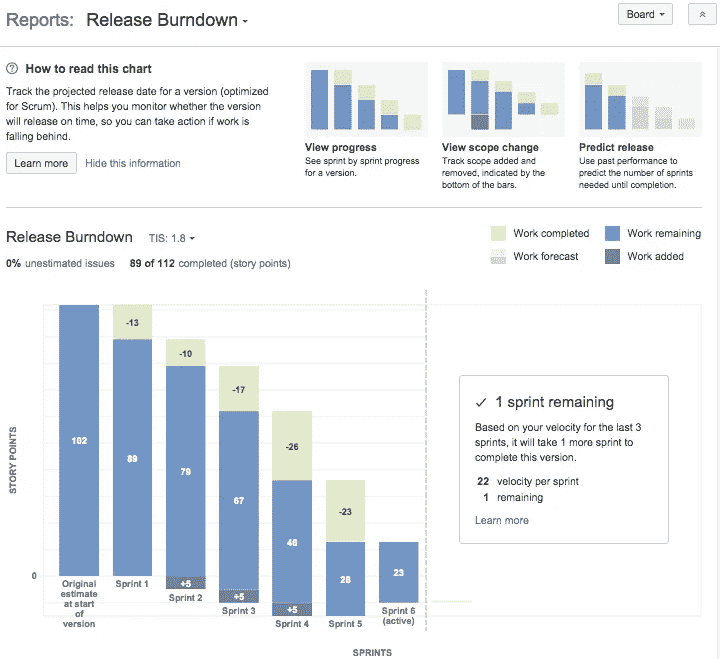
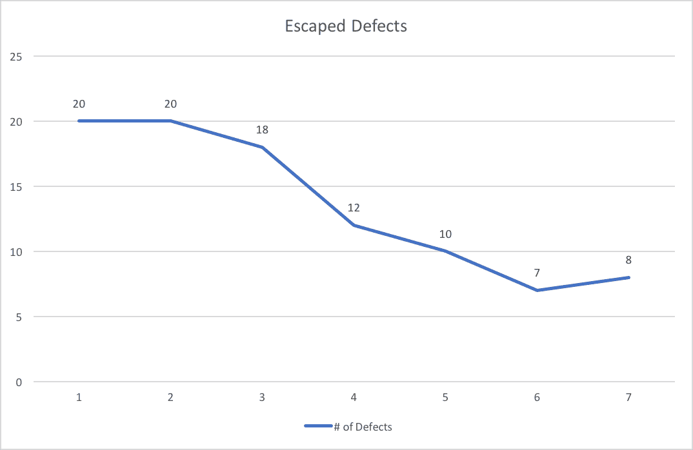

# Tetap Produktif ketika Work from Home

> 原文：<https://medium.easyread.co/tetap-produktif-ketika-work-from-home-wfh-7dc27712ae5a?source=collection_archive---------1----------------------->

## Product Manager Life

## Mengukur produktifitas tim dan juga tantangan yang dihadapi ketika *work from home*

Photo by [🇨🇭 Claudio Schwarz | @purzlbaum](https://unsplash.com/@purzlbaum?utm_source=medium&utm_medium=referral) on [Unsplash](https://unsplash.com?utm_source=medium&utm_medium=referral)

Selama pandemi berlangsung, telah banyak merubah cara bekerja kebanyakan orang. Dan dengan perubahan tersebut kita diminta untuk bisa beradaptasi dengan cara yang baru. Mulai dari bekerja dari rumah dan tanpa tatap muka langsung, jam kerja yang disesuaikan oleh masing masing orang, komunikasi yang biasanya bisa dengan mudah dilakukan kini harus mengatur waktu dan masih banyak penyesuaian lainnya.

Bagi kebanyakan perusahaan, penyesuaian ditengah pandemi ini sulit untuk dilakukan karena berbagai faktor sehingga mengharuskan karyawannya tetap bekerja dari kantor. Akan tetapi jika melihat dunia *startup* hal ini akan lebih mudah untuk dilakukan. Misalkan terkait *work from home* , kebanyakan *startup* atau perusahan yang bergerak di bidang teknologi pasti sudah tidak asing dengan kebijakan ini. Biasanya perusahaan memiliki kebijakan bagi karyawan nya yang ingin *work from home* dengan memastikan bahwa pekerjaan nya akan tetap selesai walaupun sedang bekerja dari rumah.

> N amun ketika pandemi berlangsung, yang menjadi pembeda Work from Home dengan biasanya adalah durasi. Biasanya Work from Home (WFH) hanya terbatas beberapa hari — minggu, ketika pandemi melanda durasi nya menjadi lebih lama.

Karena durasinya yang lebih lama dan tidak adanya kepastian sampai kapan *work from home* berlangsung, maka perusahaan dan juga para karyawan harus melakukan persiapan jauh hari sebelumnya agar ketika bekerja dari rumah tetap bisa produktif seperti biasanya.

# **Persiapan Work from Home**

Saya dan tim langsung melakukan *briefing* terkait bagaimana pola kerja yang akan dilakukan selama *work from home* . Mulai dari cara dan *tools* yang akan digunakan untuk berkomunikasi, menyesuaikan jadwal kerja masing-masing orang, jadwal untuk melakukan *daily standup* , bagaimana kami akan melakukannya dan berbagai hal kecil lainnya tetap diatur agar proses *development* tetap berjalan lancar.

Work from home — [giphy](http://giphy.com)

Berikut beberapa *tools* yang biasa digunakan sebagai penunjang ketika *work from home* :

*   [Slack](http://slack.com) , untuk melakukan komunikasi dengan tim
*   [Google Meet](http://meet.google.com) , untuk melakukan video call/conference dengan tim atau customer
*   [ClickUp](http://clickup.com) , untuk project management

# **Metric untuk mengukur produktifitas tim selama Work from Home**

为了提高 tim 的生产效率，tim 提供了几个指标*来提高在家办公*的效率，比如:

*   团队速度
*   释放燃尽
*   逃脱的缺陷

## 团队速度

> 定义:在每次迭代结束时，团队增加与在该迭代中[完成](http://guide.agilealliance.org/guide/sashimi.html)的[用户故事](http://guide.agilealliance.org/guide/stories.html)相关的[估计](http://guide.agilealliance.org/guide/nuts.html)的工作量。这个总数被称为速度— [敏捷联盟](https://www.agilealliance.org/glossary/velocity/#q=~(infinite~false~filters~(postType~(~'page~'post~'aa_book~'aa_event_session~'aa_experience_report~'aa_glossary~'aa_research_paper~'aa_video)~tags~(~'velocity))~searchTerm~'~sort~false~sortDirection~'asc~page~1))

*这一指标旨在评估蒂姆·伯奇(Tim berlard)在 sprint 中创造的数百万个故事点的趋势。德米基安*产品经理*阿陶 *Scrum Master* 达帕特·梅利哈特*价值*杨达帕特·蒂姆·克帕达*客户*达拉姆周期。*

Team Velocity — [Openclassrooms](https://openclassrooms.com/en/courses/4544631-learn-the-fundamentals-of-agile-estimation/5157751-discover-the-concept-of-team-velocity)

**Contoh:**Tim*development*menyelesaikan 15、20、dan 13 *故事要点*di tiga*sprint*terakhir。Jika diambil rata — rata maka *速度* nya adalah 16 *故事点*。这可能是冲刺阶段的关键。丹·卢迪说，要想达到速度*、境界*和完成*的目的*。这个定义很快就能实现。

## **发布燃尽图**

> 一个大型图表，显示剩余工作量(纵轴)和项目开始以来经过的时间(横轴，显示过去和未来)——[敏捷联盟](https://www.agilealliance.org/glossary/burndown-chart/#q=~(infinite~false~filters~(postType~(~'page~'post~'aa_book~'aa_event_session~'aa_experience_report~'aa_glossary~'aa_research_paper~'aa_video)~tags~(~'burndown*20chart))~searchTerm~'~sort~false~sortDirection~'asc~page~1))

Release Burndown Chart — [Attlasian](https://confluence.atlassian.com/jirasoftwareserver073/release-burndown-861254693.html)

有了这一点，这将有助于解决许多人面临的任务和 T2 任务的问题。Grafik 将帮助*产品经理*按时或不按时开发*产品，这样就可以更快地开发出不符合预期的产品。*

## **逃逸缺陷**

> 逃脱的缺陷是质量保证团队没有发现或者逃脱的缺陷。通常，这些问题是在发布的版本对他们可用之后由最终用户发现的— [软件开发生命周期度量百科全书](https://sites.google.com/site/sdlcmetrics/)

Escaped Defects Charts — [Stickyminds](https://www.stickyminds.com/article/4-balanced-metrics-tracking-agile-teams)

*度量*这是一个测试过程*的发布*测试*的发布*发布*这是一个测试过程*测试*和*工具*发布*测试*测试*的发布

***更新 5 梅 2020***

## 循证管理

> 基于证据的管理是一个框架，组织可以使用它来帮助他们衡量、管理和增加他们从产品交付中获得的价值。EBM 专注于改善结果、降低风险和优化投资。—[Scrum.org](https://www.scrum.org/resources/evidence-based-management)

Metrik ini menggunakan empat *价值*面积，antara lain **当前价值**，**未实现价值**，**创新能力** dan **上市时间**。为了更好地理解这一点，我们可以用约书亚·스크람的部分来讲述这个故事。

 [## 如何衡量您的组织敏捷性

### 你好，了不起的人。我想与您分享我最近与一位需要…

medium.com](https://medium.com/agility-path/how-to-measure-your-organisation-agility-71ae9f8334f0) 

# 在家工作

许多挑战来自于在家工作，这使得我们无法生产。但我认为这是一个巨大的挑战:

*   糟糕的时间管理
*   沟通
*   娱乐

## 糟糕的时间管理

Ini adalah hal yang kemungkinan terjadinya paling besar. Banyak orang selama bekerja dari rumah *management* waktu nya berantakan. Sebenarnya, dengan bekerja dari rumah kita sudah menghemat banyak waktu (tidak perlu berangkat dari rumah ke kantor dan sebaliknya, tidak butuh waktu yang lama untuk melakukan persiapan sebelum bekerja, tidak perlu merasakan macet di jalanan). Hal itu membuat kita menganggap bisa melakukan banyak hal.

Padahal itu adalah kesalahan! Karena ketika dirumah maka selain melakukan pekerjaan kantor kita juga terkadang harus mengurusi perihal rumah, seperti beberes, memasak, mencuci, tidur siang dan sebagainya.

Untuk itu kita tetap harus membatasi waktu kerja kita sama seperti di kantor. Untuk menghindari hal tersebut, berikut adalah tips agar tetap produktif:

*   **Batasi waktu bekerja** , start dari jam 10 pagi dan berakhir di jam 6 sore. Usahakan tetap fokus dengan pekerjaan. Jika ada *task* , *email* , personal chat yang berkaitan dengan pekerjaan diluar jam itu saya usahakan tidak membalas nya kecuali memang mendesak.
*   **Buat to-do list harian** , ini akan membantu agar kita tetap fokus dalam menyelesaikan task. Banyak tools yang bisa digunakan dan gratis, seperti [Google Keep](http://keep.google.com) , [Evernote](http://evernote.com) .

## Communication

*Product Manager* dituntut untuk dapat berkomunikasi dengan banyak *stakeholders* , tim *engineering* , tim design, *marketing* dan *sales* .

Untuk memudahkan komunikasi, berikut tips yang dapa dilakukan:

*   **Always available** , di dalam chat *messaging* jika ada tim yang bertanya bisa langsung direspons. Jika perlu maka lakukan *video call* agar lebih jelas dan biasa nya dengan melakukan *video call* bisa memangkas waktu dibandingkan dengan chat.
*   **Set agenda dan objective dengan jelas** , ketika melakukan *meeting* meskipun itu *meeting* yang singkat usahakan selalu berikan agenda dan *objective* yang jelas terlebih dahulu kepada *member* (yang akan ikut dalam *meeting* ), ini akan sangat membantu agar *meeting* tetap terarah dan tidak memakan waktu yang banyak.

## **Distractions**

Terkadang notifikasi email masuk, suara berisik, atau bahkan keluarga dirumah bisa menggangu fokus anda ketika *work from home* .

Untuk mengurangi *distraction* , berikut hal yang bisa dilakukan:

*   **Setup schedule breaks** , bekerja dari rumah juga membutuhkan istirahat sejenak. Buat rencana untuk istirahat di jam-jam tertentu setiap harinya. Dengan begitu ini akan membuat kita tetap fokus ketika kembali bekerja.
*   **Dengarkan musik** , baik dikantor ataupun di rumah saya selalu mendengarkan musik agar bisa fokus, dan ini juga bisa membantu untuk menjaga kita dari suara yang dapat mengganggu konsentrasi.

# Penutup

Setelah pandemi berakhir, maka *work from home* akan menjadi hal yang biasa dilakukan, bukan hanya bagi *Startup* atau perusahaan teknologi, tapi juga bagi perusahaan yang sebelumnya tidak atau belum terbiasa dengan *work from home* .

Banyak manfaat yang didapatkan ketika *work from home* seperti mengurangi stress, bisa meningkatkan produktivitas dan juga lebih dekat dengan keluarga dirumah.