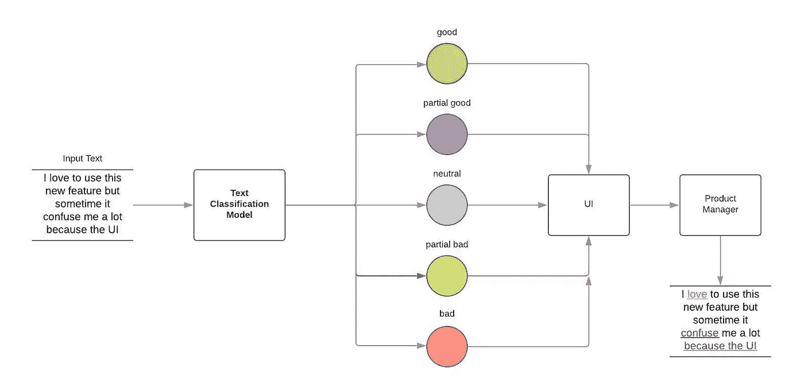

# 文本分类:BERT 如何提高性能

> 原文：<https://medium.com/walmartglobaltech/text-classification-how-bert-boost-the-performance-e65d1d678afb?source=collection_archive---------0----------------------->

使用 BERT 进行自然语言处理的小指南

[朱](https://medium.com/u/630a6397128e?source=post_page-----e65d1d678afb--------------------------------)撰写

Photo credit: Pixabay

# 伯特

这是《T2》*芝麻街* *里的伯特吗？？？*今天我不会谈论这个黄色木偶卡通人物，而是一种自然语言处理的机器学习技术(简称 NLP)*。* BERT 是变压器双向编码器表示的简称。它由谷歌开发，由雅各布·德夫林(Jacob Devlin)等在 2018 年出版。

# 议程

*   什么是文本分类？
*   数据预处理
*   使用 CNN 和 LSTM 进行实验
*   使用 BERT 进行实验
*   CNN vs LSTM vs 伯特
*   结论

# **什么是文本分类？**

由于文本是不像结构化表格那样的非结构化格式，自然语言处理在数据挖掘中起着非常重要的作用。它也是监督学习的一部分，这意味着它对训练数据有预先标记的响应。在训练该模型之后，我们可以使用该模型对未来的输入文本进行分类。例如，电子邮件可以被分类为垃圾邮件或不是垃圾邮件，来自客户的文本反馈可以被分类为正面或负面，社交媒体文本可以被分类为对待或不对待等。

还有一个更实际的例子，我们有很多来自 Twitter、脸书等社交网络的顾客评论数据。我们想理解这些文本的意思，比如积极或消极。对于高层次，我们将致力于以下过程。

1.  根据五个类别标记这些文本输入:好的、部分好的、中性的、部分坏的、坏的。
2.  我们可以使用这个训练数据集来训练我们的 NLP 模型。
3.  我们可以将新的文本输入到 NLP 模型中得到预测。

输入下面的自由文本，也许我们会得到 ***部分坏的*** 输出，然后产品经理可以从 UI 端或其他地方深入到这个文本中去做未来的改进，比如在 UI 端做一些改变。

> “我喜欢使用这个新功能，但有时它让我很困惑，因为它的用户界面”——伯特·斯诺

Example: The workflow for one text classification

包括上面的例子，通常我们可以将文本分类分为以下几类:

> **情感分析:**理解给定文本是正面还是负面谈论给定主题的过程(例如，用于品牌监控目的)。(参考文献 1)
> 
> **话题检测:**识别一段文字的主题或话题的任务(例如，在分析客户反馈时，了解产品评论是关于*易用性*、*客户支持*还是*定价*)。(参考文献 1)
> 
> **语言检测:**检测给定文本的语言的过程(例如，知道传入的支持票是用英语还是西班牙语写的，以便自动将票发送给适当的团队)。(参考文献 1)

# 二元文本分类模型

我们将使用 CNN、LSTM 和伯特提出三个二进制文本分类模型。

## 数据预处理

因为我们从 Twitter 或脸书等社交网络获取数据，所以原始数据集中有大量无用或有噪声的数据。在将数据输入 NLP 模型进行训练之前，我们首先需要清理我们的文本数据。我在下面列出了一些我们遵循的步骤，你可以在这里为清理方面修改任何规则。

*   *删除空规则*
*   *转发规则*
*   *标签规则*
*   *标记规则*
*   *url 规则*
*   *电子邮件规则*
*   *编号规则*
*   *去掉标点符号*
*   *移除不可打印的内容*
*   *删除 ascii 子集*
*   *引理化规则*
*   标记化规则
*   矢量化规则
*   *等*

## CNN 和 LSTM 实验

对于 CNN 模型(卷积神经网络的简称),它通常用于图像部分，但我们只是将其用作基线，看看最坏的情况是什么。我们可以在下面找到模型定义。

nlp cnn model

对于长短期记忆的 LSTM 模型，它具有从递归神经网络(RNN)到反馈连接的一切。对于 NLP，使用 LSTM 或 RNN 更有意义，因为在一个句子中，一些后面的单词会影响前面的单词。我们可以在下面找到 LSTM 模型的定义。

nlp lstm model

## 使用 BERT 进行实验

迁移学习是机器学习领域中非常重要的一部分。

> 它专注于存储在解决一个问题时获得的知识，并将其应用于另一个不同但相关的问题。(参考文献 2)

BERT 是用于语言理解的深度双向转换器的预训练。我们可以在训练前 BERT 模型的基础上增加几层。例如，在我们的例子中，基于 sequence_output 层，我们添加了 4 个更密集的层，并带有 dropout 和 regularizer。在最后一层，因为我们做了二进制分类，num_classes 是 2。下面我们可以填充整个 BERT 模型。

nlp bert mode

## CNN vs LSTM vs 伯特

基于这三个模型，我们计算了一些性能指标，如精确度、召回率、AUC 和准确度。此外，我们使用 15 个纪元来训练我们的模型。

我们可以发现，BERT 的参数比其他算法多 167 倍，训练时间更长，性能更好。我们正在使用的 BERT 是 BERT _ en _ un cased _ L-24 _ H-1024 _ A-16。

performance metric

# 结论

在我们的例子中，BERT 确实提高了 NLP 的性能，但是它很耗时。基于模型再训练的频率，我们可以选择使用哪个版本。例如，我们需要每周重新训练模型，我们肯定可以使用 BERT 来获得高精度，但是如果我们需要每天重新训练模型，我们可以使用其他方法来减少训练时间。然而，让我们欢迎伯特来到我们的世界。如果你有任何问题，请在这里评论，我们可以讨论更多。

# 参考

1.  [https://monkeylearn.com/what-is-text-classification/](https://monkeylearn.com/what-is-text-classification/)
2.  https://en.wikipedia.org/wiki/Transfer_learning