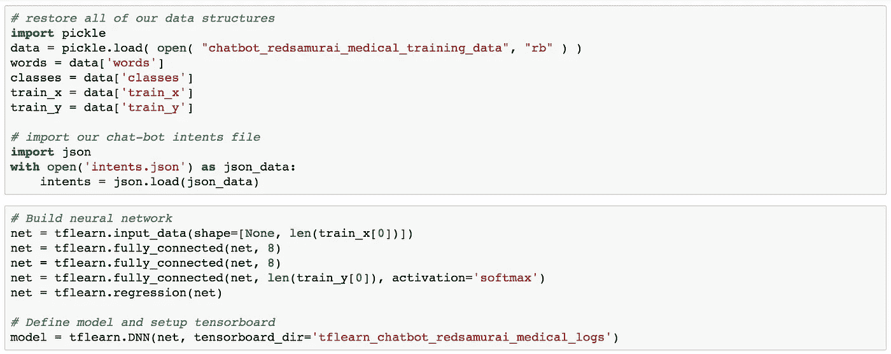

# TensorFlow 中深度神经网络的文本分类——简单说明

> 原文：<https://medium.com/oracledevs/text-classification-with-deep-neural-network-in-tensorflow-simple-explanation-be07c6cbe867?source=collection_archive---------0----------------------->

用 TensorFlow 实现文本分类可以很简单。文本分类可以应用的领域之一——聊天机器人文本处理和意图解析。我将在这篇文章中一步一步地描述，如何为文本分类建立 TensorFlow 模型，以及分类是如何完成的。请参考我以前的类似主题相关的帖子— [使用 TensorFlow、Node.js 和 Oracle JET 的上下文聊天机器人—如何安装并使其工作的步骤](http://andrejusb.blogspot.com/2018/07/contextual-chatbot-with-tensorflow.html)。我推荐阅读这篇关于聊天机器人实现的伟大文章— [带 Tensorflow](https://chatbotsmagazine.com/contextual-chat-bots-with-tensorflow-4391749d0077) 的上下文聊天机器人。

完整的源代码可以在 [GitHub](https://github.com/abaranovskis-redsamurai/shenzhen) repo 中获得(参考上面提到的博客中描述的步骤)。

文本分类实现:

**第一步:准备数据**

*   将模式标记为单词数组
*   小写和干所有的话。例如:药房= pharm。尝试表示相关单词
*   创建类别列表—意图
*   创建文档列表—模式列表和意图列表之间的组合

Python 实现:

**步骤 2:准备张量流输入**

*   [X: [0，0，0，1，0，1，0，0，1，0，0，0，0，1，…N]，Y: [0，0，1，0，0，0，…M]]
*   [X: [0，1，0，0，0，0，1，0，0，0，0，0，1，0，1，0，…N]，Y: [0，0，0，0，1，0，0，…M]]
*   用 0/1 表示模式的数组。N =词汇量。1 当词汇中的单词位置与模式中的单词匹配时
*   用 0/1 表示意图的数组。M =意向数量。1 当意图/类别列表中的意图位置与当前意图匹配时

Python 实现:

**第三步:训练神经网络**

*   使用 ***tflearn*** —深度学习库，为 TensorFlow 提供高级 API
*   定义 X 输入形状—等于单词词汇量
*   用 8 个隐藏神经元定义两个层—最适合文本分类任务(基于实验)
*   定义 Y 输入形状-等于意图数量
*   应用回归找出最佳方程参数
*   定义深度神经网络模型(DNN)
*   运行 ***model.fit*** 构建分类模型。提供 X/Y 输入、时期数和批量大小
*   在每个时期，执行多个操作以找到最佳模型参数，从而对转换成 0/1 数组的未来输入进行分类

批量大小:

*   较小的批处理大小需要较少的内存。对于具有大量词汇的数据集尤其重要
*   通常情况下，小批量网络训练速度更快。权重和网络参数在每次传播后更新
*   批次越小，梯度(描述数据的函数)的估计越不准确

Python 实现:

**步骤 4:初始模型测试**

*   标记输入句子—将其拆分成单词数组
*   为输入句子创建单词包(数组为 0/1)——数组等于词汇量，输入句子中的每个单词为 1
*   使用给定的单词包数组运行 model.predict，这将返回每个意图的概率

Python 实现:

**第五步:重用训练好的模型**

*   为了提高可重用性，建议创建单独的 TensorFlow 笔记本，以处理分类请求
*   我们可以通过加载 TensorFlow pickle 来重用之前创建的 DNN 模型

Python 实现:

**第六步:文本分类**

*   定义 REST 接口，以便可以在 TensorFlow 之外访问该函数
*   将输入的句子转换为单词包数组并运行 model.predict
*   考虑概率高于 0.25 的结果来过滤噪声
*   返回多个确定的意图(如果有)，以及分配的概率

Python 实现:

*原载于 2018 年 7 月 30 日*[*andrejusb.blogspot.com*](https://andrejusb.blogspot.com/2018/07/text-classification-with-deep-neural.html)*。*