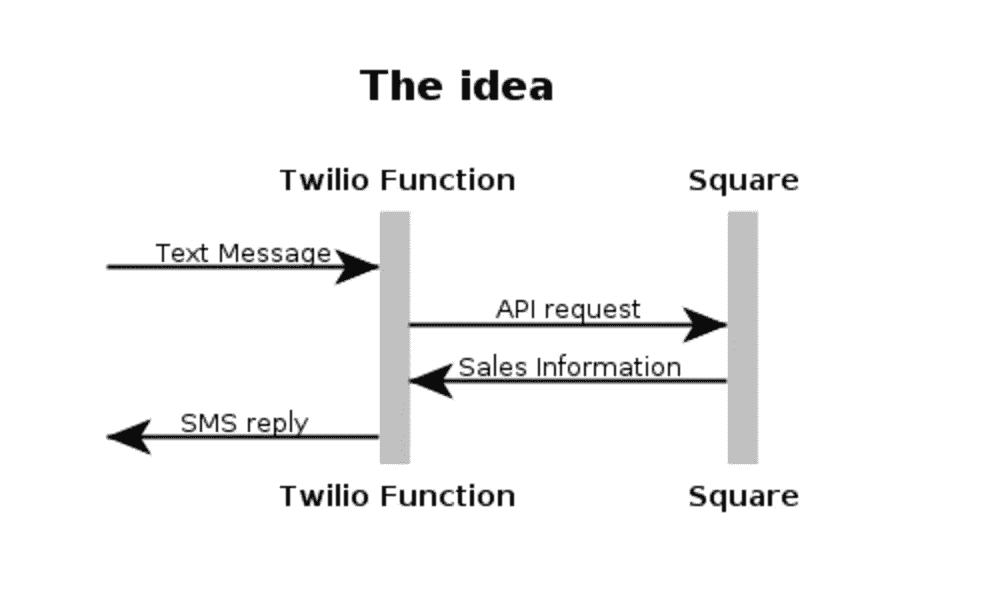
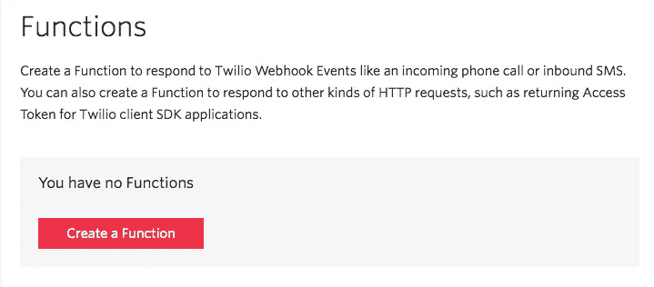
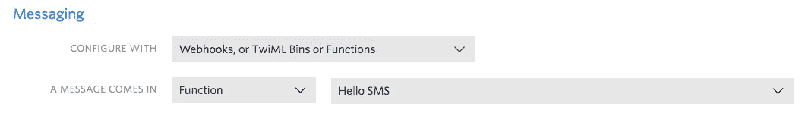
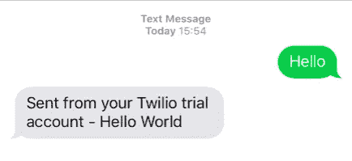

# 使用 Twilio 函数和 Square 为您的销售报告添加文本

> 原文：<https://medium.com/square-corner-blog/text-for-your-sales-using-twilio-functions-and-square-e30d6537b720?source=collection_archive---------6----------------------->

## **Square 的开发者团队刚刚从**[**SIGNAL 2017**](https://www.twilio.com/signal)**回来，在那里我们做了一个 Twilio 和 Square APIs 的混搭。**

> 注意，我们已经行动了！如果您想继续了解 Square 的最新技术内容，请访问我们的新家[https://developer.squareup.com/blog](https://developer.squareup.com/blog)

## 这个想法

在为你的企业(或许多企业)构建应用程序时，通知是体验的一个重要层面。Twilio 有许多产品可以让你将通信和消息添加到你的应用程序中，但我们尝试了新发布的 [Twilio Functions](https://www.twilio.com/blog/2017/05/introducing-twilio-functions.html) 来建立一种体验，在不增加现有应用程序复杂性的情况下增加额外的价值。

基本想法是发送一条简单的文本消息，并接收当天的最新销售情况。你可以很容易地修改它，通过文本来检查你的库存，或者甚至让客户发短信询问你的业务信息。



A basic Web Sequence Diagram of what we wanted to build

## 设置

对于这个演示，除了我的 Square 帐户，我还创建了一个 [Twilio 帐户](https://www.twilio.com/try-twilio)——免费试用完全满足了我的需求。我还必须在我的 Twilio 账户中设置一个[电话号码，当然还要在](https://www.twilio.com/console/phone-numbers/getting-started) [Square 开发者门户](https://connect.squareup.com/apps/)中创建一个应用程序来访问我的个人访问令牌。

## 什么是 Twilio 函数？

Twilio 函数允许你把你的代码放在一个无服务器的环境中，为收到的信息、电话等自动运行。这样，您就不必担心服务器，而是可以专注于编写代码。

为了创建我们新的无服务器功能，我访问了 Twilio 控制台的[功能页面。在那里，我点击“创建一个函数”按钮，开始创建一个新函数。](https://www.twilio.com/console/runtime/functions/manage)



我为我的应用程序选择了“Hello SMS”模板。接下来，我回到我的 Twilio 控制台的[电话号码部分，用我的功能分配我的电话号码来回复收到的信息。](https://www.twilio.com/console/phone-numbers/incoming)



有了这些，我决定给我的函数一个测试消息:



It’s alive!

那很容易！然后，我添加了一些逻辑来从我的函数连接到 [Square 的 API](https://squareup.com/developers)，在导航回我的函数后，编写代码来查询 List Transactions 端点，对结果求和，并将消息返回给我。你可以在下面看到我的全部代码(一定要把 URL 中的`LLLLLLLL`替换成你的位置，把`sq0atp-XXX`替换成你来自 Square 开发者门户的个人访问令牌。

```
exports.handler = function(context, event, callback) {
  //include the request library to make our API calls
  var request = require("request");

  //set the end date of our reporting to right now
  var end_time = new Date(Date.now()).toISOString();
  //and the starting time to be 24h hours ago.
  var begin_time = new Date();
  begin_time.setDate(begin_time.getDate()-1);
  begin_time = begin_time.toISOString();

  //The URL and authorization for accessing my transactions
  var url = "[https://connect.squareup.com/v2/locations/LLLLLLLL/transactions?begin_time=](https://connect.squareup.com/v2/locations/75MBQ5SS3SKJK/transactions?begin_time=)"+begin_time+"&end_time="+end_time
  var options = {
    url:url,
    headers: {
      'Authorization': 'Bearer sq0atp-XXXXXXXXXXX'
    }
  }

  //a callback for handling the API response
  request(options, function(error, response, body) {
    total = 0;
 body = JSON.parse(body);
    //loop through all the returned transactions and tenders to sum the total
    for (var i = body.transactions.length - 1; i >= 0; i--) {
      for (var j = body.transactions[i].tenders.length -1; i >= 0; i--){
        total+= body.transactions[i].tenders[j].amount_money.amount
      }
    }
    //create a new message response
   let twiml = new Twilio.twiml.MessagingResponse();
    //add the total to the message
 twiml.message("You have made $"+total/100+" in sales today");
 callback(null, twiml);
  });
};
```

现在，当我发送 Twilio 号码时，我的代码将执行调用 Square 的 API 并获取我所有销售额的总和:


Success! Now, anytime I text my Twilio number, it’ll return daily sales.

如需进一步阅读，请查看 Twilio 的[博客帖子，宣布 Twilio 的功能](https://www.twilio.com/blog/2017/05/introducing-twilio-functions.html)，或 [Square 的文档](https://docs.connect.squareup.com/)。让我们知道你如何修改我们所做的，以及如何在你的 Square 应用中使用 Twilio 功能。