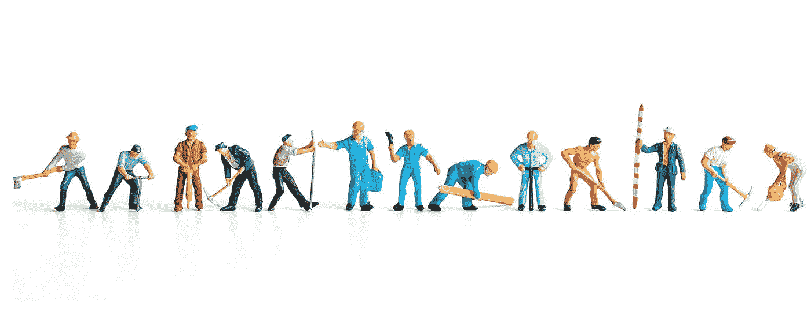
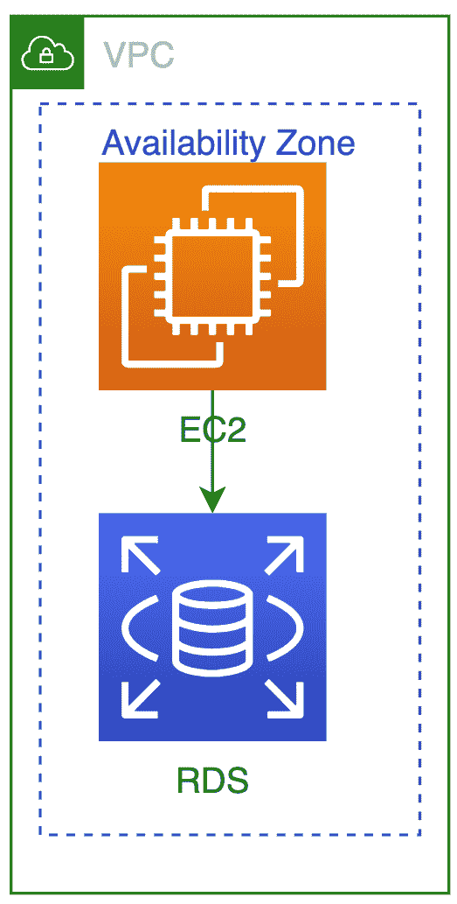
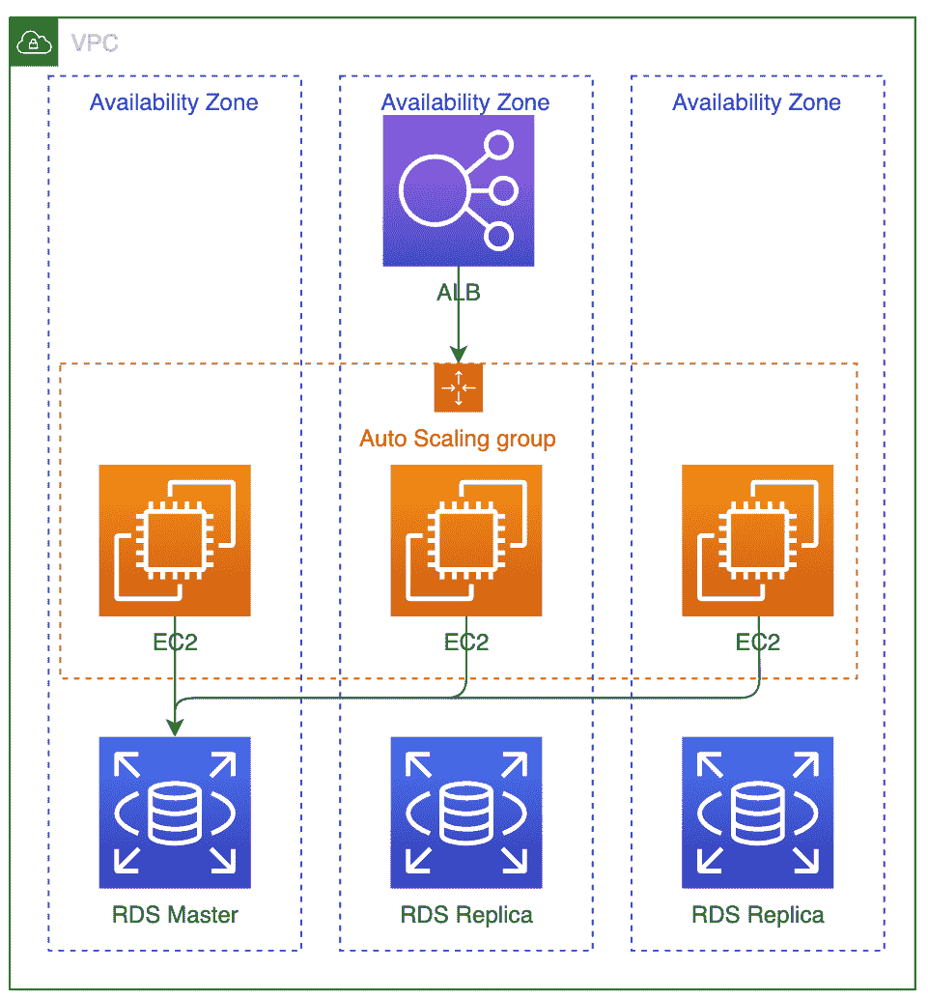
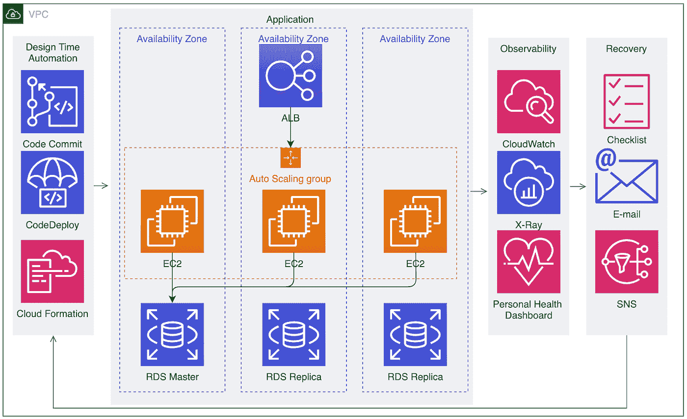
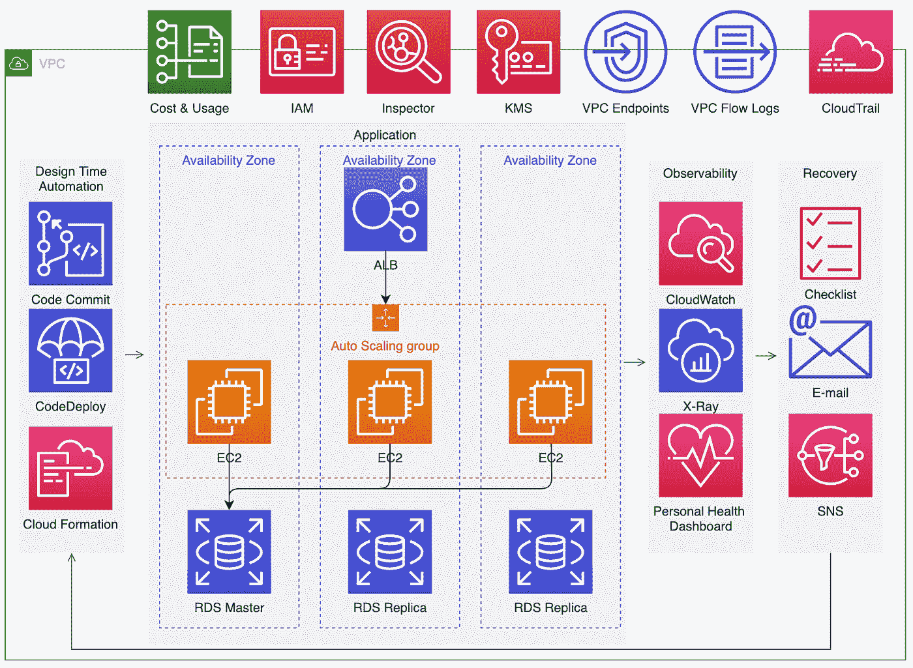

# SREs 的 3 R:弹性、恢复和可靠性

> 原文：<https://medium.com/capital-one-tech/the-3-rs-of-sres-resiliency-recovery-reliability-5f2f5360a91b?source=collection_archive---------2----------------------->

## 使用 3 R 作为镜头来构建可靠的应用程序

在我作为 Capital One 的弹性和站点可靠性工程(SRE)架构师的工作中，弹性、恢复和可靠性的概念是设计经验证的应用程序的基础。每一个概念都建立在另一个概念的基础上，通过不同的视角提供了一个架构考虑的框架，共同实现了一个更可靠的产品。

但是首先，让我们对 3 R 及其定义有一个更好的理解。

# 定义弹性、恢复和可靠性

1.  **弹性**是指在发生故障后，通过快速响应和完全恢复来避免或减轻不利事件影响的能力。对弹性的关注通常等同于对*高可用性*的强调。这允许增加正常运行时间。
2.  **Recovery** 是发生故障时恢复服务的能力。如上所述，恢复对于强大的恢复能力至关重要。恢复直接影响[恢复时间目标(RTO)](https://en.wikipedia.org/wiki/Disaster_recovery#:~:text=The%20Recovery%20Time%20Objective%20(RTO,a%20break%20in%20business%20continuity) ，即应用程序在故障后恢复到正常服务水平的持续时间，以及[恢复点目标(RPO)](https://en.wikipedia.org/wiki/Disaster_recovery) ，即在持续时间方面对数据丢失的容忍度。由于需要为所有可能的故障点确定恢复方法，对恢复的关注通常会导致对设计时和运行时依赖性的良好理解。这可以消除单点故障，防止潜在故障和数据丢失。
3.  **可靠性**是服务提供其预期功能的能力。正如[谷歌 SRE 版](https://landing.google.com/sre/)所展示的，可靠性涉及到许多概念，从技术执行到过程和文化。对可靠性的关注通常会导致与客户期望一致的稳定性。*注意，这里的稳定也包括安全。一个可靠的系统是一个高性能的、安全的、满足服务水平目标(SLO)的系统，从而建立信任。*

# 使用 3 R 来设计系统

接下来，让我们看看如何将 3 R 应用到系统设计中。让我们假设这是一个非常简单的 AWS 应用程序，其中计算层是一个服务于客户事务的 web 层，数据库存储事务信息:

# 弹性镜片

运用**弹性**透镜，我们可以检查该架构，考虑以下几点:

*   该应用程序是否可以根据变化水平向上或向下扩展？
*   所使用的服务是否有足够的容量来支持扩展？例如，子网是否有足够的空闲 IP 空间？AWS API 比率限制不会被触及吗？

这些考虑可能导致以下结果:

我们的简单应用程序现在已经扩展为“高度可用”:

1.  **弹性** —我们的单个 EC2 现在是自动扩展组的一部分，允许它水平向上或向下扩展，并使用负载平衡器作为应用流量的入口点。负载平衡器可以跨计算层分配流量。*请注意，我们的 VPC 子网被假定为大小合适，因此没有显示。*
2.  **高度可用的数据层** —我们的单个 RDS 实例现在支持多 AZ，这允许分布式读取以及在原始主服务器出现故障时通过将读取副本提升到主服务器的恢复过程。

# 该恢复透镜

应用**恢复**透镜允许我们检查该架构的其他考虑事项:

*   可能的故障点是什么，我们如何知道它们？
*   哪些故障点是关键的，哪些不是？
*   与正常降级并可能需要人工干预相比，可以做些什么来自动恢复？
*   尽可能快地恢复关键功能，然后进行完全恢复的恢复阶段是什么？
*   什么是故障转移策略？
*   标准恢复程序是什么，是否经过测试？

这些考虑可能导致以下结果:

我们的高可用性、弹性应用程序现在得到了工具和服务生态系统的支持，以支持恢复活动:

1.  **设计时间** —自动化旨在支持应用程序代码以及基础设施代码的更新(补丁、恢复)。例如，代码提交可以存储受版本控制的源代码，然后可以通过 CodeDeploy 将这些源代码作为应用程序更新部署到由 CloudFormation 提供的基础架构上。
2.  **可观察性** —支持支持故障排除、调试和恢复活动所需的遥测(日志、指标、跟踪)。例如，CloudWatch 可用于度量、日志和警报，X 射线可用于跟踪，个人健康仪表板可帮助监控 AWS 服务问题。
3.  **恢复** —通知人类或触发自我修复动作的标准操作程序和机制。例如，作为活文档不断更新的清单可以帮助指导程序，电子邮件可以将通知升级到人类，SNS 可以用于触发自我修复行动。*注意，自我修复动作(如自动化脚本)未显示。*

# 可靠性镜头

运用**可靠性**透镜，我们可以检查该架构的其他考虑因素:

*   对于预期的客户需求，这是正确的投资水平吗？换句话说，关键事务的 SLO 是什么？这需要更多冗余吗？一个地区足够吗？
*   有哪些安全隐患，如何实现更高的安全性？
*   根据客户的期望，性能要求是什么？资源的规模是否合适？是否进行了性能测试？
*   基于客户的期望，架构是否有成本意识？选择的资源是否最大限度地提高了成本效率？

这些考虑可能导致以下结果:

我们可恢复的弹性系统现在通过旨在提高可靠性的工具和服务生态系统得到了增强:

1.  **成本优化** —能够随着时间的推移跟踪成本使用情况，从而为资源管理提供纠正措施。
2.  **安全性** —能够保护基础设施并提供护栏。例如，IAM 允许对最低特权访问进行身份和访问管理，Inspector 允许漏洞检测和管理，KMS 允许静态加密，VPC 端点允许 AWS APIs 的流量留在 AWS 主干网内，VPC 流量日志和云跟踪支持异常情况的审查和检测。

# 你申请中的 3 R

对弹性、恢复和可靠性的透彻理解对于构建可靠的应用程序至关重要。从每一个角度来审视一个体系结构，有助于全面考虑影响高可用性、恢复和稳定性的各种因素，从而做出全面的体系结构决策。请注意，每个决策都需要权衡成本和复杂性。因此，理解和定义客户对可靠性的实际期望必须是任何努力实现弹性、可恢复性和可靠性的架构的起点。

例如，如果客户只希望一个事务具有高可用性和可靠性，那么在弹性、恢复和可靠性方面的投资应该放在支持该事务的组件上，而不是组成应用程序的所有组件上。

我鼓励您在未来的所有应用程序中使用弹性、恢复和可靠性这三个方面。

*最初发表于*[*【capitalone.com】*](https://www.capitalone.com/tech/software-engineering/SREs-architecting-with-resiliency-recovery-reliability/)*。*

*披露声明:2020 资本一。观点是作者个人的观点。除非本帖中另有说明，否则 Capital One 不隶属于所提及的任何公司，也不被这些公司认可。使用或展示的所有商标和其他知识产权是其各自所有者的财产。*