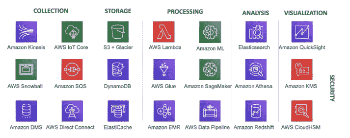
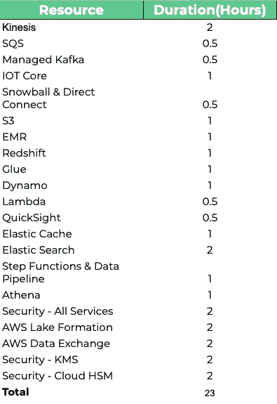

# 在三个月内获得 AWS 数据分析认证的 5 步计划

> 原文：<https://medium.com/globant/the-4-steps-program-to-get-the-aws-data-analytics-certification-2020-in-three-months-84733c00bb98?source=collection_archive---------0----------------------->

H 我！我是一名充满激情的数据工程师，于 2020 年 10 月获得了 [AWS 数据分析认证](https://aws.amazon.com/certification/certified-data-analytics-specialty/)。达到这一点后，许多人来找我，询问如何通过同样的考试。在这篇博文中，我将与你分享我的经验以及实现这个目标的 **5 步计划**。说了这么多，开始吧！

# 🌎认证要求

该认证旨在验证数据专业人员能够在高效、经济且安全的 AWS 上设计、构建、保护和维护分析解决方案。根据考试指南，推荐的 AWS 知识是:

*   *至少 5 年的常用数据分析技术经验*
*   *至少 2 年 AWS 实际操作经验*
*   *与 AWS 服务合作设计、构建、保护和维护分析解决方案的经验和专业知识*

当我决定参加考试时，我已经有了 8 年的数据工程师工作经验，主要是在 AWS，所以开始准备认证对我来说并不难。

> 如果你没有 AWS 建议的所有技能，让我告诉你(对我来说)这些都是夸大的期望。如果你没有 AWS 推荐的所有经验，我可以再写一篇帖子帮助你开始备考。留下你的评论，让我知道你是否会觉得有用

在下面，您可以找到认证中涵盖的所有 AWS 服务:

值得一提的是，在考试中你会发现两种类型的问题:

*   如何通过设计合适的软件架构来满足需求
*   如何通过使用特定的工具来实现目标。

因此，仅仅了解每个工具的工作原理是不够的。你必须注意每一个的**利弊，它们的**差异，**以及如何**整合**它们。**

# 👩‍🚀5 步计划

现在我们有了目标，我们需要定义计划。所以，让我向你展示:

## **第一步——为挑战做好准备**

📆所需时间:1 个月

您需要对本次考试的主题和服务有较高的理解。通过这种方式，你可以评估这个挑战对你来说是否有趣，以及你离获得认证还有多远。因此，为了热身，我完全建议您查看以下课程:

 [## AWS 认证大数据专业 2020 -认证课程

### 夏羽是一名解决方案架构师、顾问和软件开发人员，他对所有事物都有特殊的兴趣…

www.udemy.com](https://www.udemy.com/course/aws-big-data/) 

它有 12.5 小时的视频。根据我的经验，我推荐你认为你需要 **20 个小时。**很多时候，你会发现自己会停下来记笔记或搜索某个特定的话题。如果你一周花 5 个小时，第一个月底就能搞定。

> 一旦你开始学习这门课程，如果你意识到你对 EC2、红移或 S3 没有任何概念，你可能需要回到“认证要求”一节。

这还不足以获得认证，但一定会让你走上正确的方向。

## **第二步——报名参加考试**

📆所需时间:30 分钟

这是整个程序中最短、最快的一步。请访问以下链接，并安排在 60 天内参加考试。

[https://AWS . Amazon . com/certificate/certified-data-analytics-specialty/](https://aws.amazon.com/certification/certified-data-analytics-specialty/)

我想你可能在想*“为什么莱安德罗告诉我在讨论所有话题之前就订阅？”嗯，根据我和许多其他同事的经验，你需要一个期限来确保你会尽最大努力得到你想要的结果。如果你没有日期，你就不会在近期内达到目标。其他优先事项会出现，你会推迟这个挑战。*

## **第三步——努力学习！**

📆所需时间:6-9 周

这是最长的一步。您将花费六周时间学习这些工具，但是我已经在计划中额外增加了三周，因为延迟是正常的。

要解决一个复杂的问题，一个好的技巧就是把它分成小块。首先，你需要研究所有的工具。对于每一项，我建议:

*   **阅读文档。你不必知道所有的细节，但你必须知道所有可用的功能**
*   **阅读常见问题(FAQ)**
*   你也可以在网上查看一些好的视频。举个例子，我给你看一个我看过的关于红移的视频:

> 看看演讲的提交日期！由于 AWS 中的工具变化很大，请经常查看最新的可用视频。

在这里，您可以找到我用每种工具创建的表格，以及您需要为每种工具花费的时间:

学习完每种工具后，您应该能够解释:

*   它的重要性和独特性*——我将使用胶水数据目录做什么？*
*   利弊— *什么时候(什么时候)我会选择红移来存储数据？*
*   与其他类似工具的区别— *为什么要用 DynamoDB 而不是 RDS 来存储数据？*
*   它与 AWS 生态系统中其他服务的集成— *哪些工具可以与 Kinesis Data Firehose 集成？*

上面最后一项是考试的重点。有些工具不能与其他工具集成。如果你知道这一点，你将能够轻易地从多项选择中丢弃一些选项。

## 第四步——阅读报纸

📆所需时间:1 周

该计划的下一步包括阅读 AWS 推荐的一些白皮书和文章。根据我的经验，我发现只研究以下三种资源是有用的:

*   [EMR](http://d0.awsstatic.com/whitepapers/Big_Data_Analytics_Options_on_AWS.pdf)中的大数据选项:这有点长，但您会找到关于最佳实践的信息，它将帮助您巩固在上一步中学习的工具知识。除此之外，对于考试中回答一些建筑学的问题也会很有用。
*   [使用 Amazon Kinesis 的 AWS 上的流数据解决方案](https://d1.awsstatic.com/whitepapers/whitepaper-streaming-data-solutions-on-aws-with-amazon-kinesis.pdf?did=wp_card&trk=wp_card):通过不同的例子，它将呈现处理流应用的架构和模式。如果您还没有使用过这类应用程序，这篇文章将为您增加很多价值。
*   [数据&分析—样题](https://d1.awsstatic.com/training-and-certification/docs-data-analytics-specialty/AWS-Certified-Data-Analytics-Specialty_Sample-Questions_v.1.1_FINAL.pdf):这个简短的 pdf 包含十个问题，它是理解考试中会出现的情景的关键。

完成以上四个步骤后，你大概会觉得自己已经准备好考试了。但是，我建议您等待并完成最后一步。这将增加你获得批准的可能性，而且只需要三天时间！

**第五步——复习一切！**

📆所需时间:3 个完整的(8-10 小时)天！

在考试中，你必须在 180 分钟内回答 60 道选择题。你需要记住大量的信息，以便能够在适当的时候回答每一个问题。

出于这个原因，最后一步是拿起你的笔记，回顾一切。为了检查你的记忆和验证你是否在正确的道路上，你可以使用互联网上的一些在线评估。在我们第一步复习的 Udemy 课程中，你会发现一个可靠的测试。

不要害怕！我坚信三天足够完成这最后一步。我的考试在周三，所以我选择了周日，我请了周一和周二的假来集中精力。

# 🌘最后的想法

在这些困难时期，我发现实现一个目标让我感觉很棒。我希望你也一样。我坚信，如果你遵循这个计划，你将能够以一种有效的方式学到很多东西，获得一个将会影响你的职业生涯的认证，并且对此感觉很好。

最后，这是我的第一篇媒体文章，所以我很想听听你的意见。感谢阅读！下次见！🌟