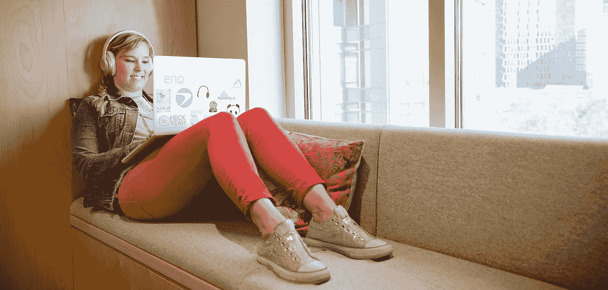
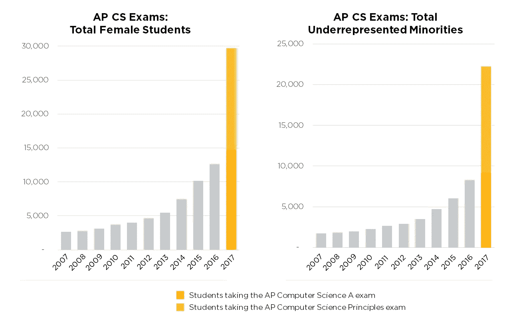

# 这 44%以及为什么它们对激励更多的女性从事科技行业很重要

> 原文：<https://medium.com/capital-one-tech/the-44-and-why-they-matter-to-inspiring-more-women-in-tech-2824f7dac48c?source=collection_archive---------5----------------------->

*资本一号共享技术高级副总裁兼多样性和包容性技术执行发起人 Julie Elberfeld*

当我在 80 年代开始我的科技职业生涯时，女性的人数要多得多。然而，随着时间的推移，这个数字已经下降。当你看职业寿命时，有数据显示，近 56%的女性在 15 岁时退出了科技行业。

这是我们在业内经常讨论的问题，也是理所当然的，但我认为我们忽略了另一个重要问题:

*44%的女性留在科技行业怎么样？*

人们经常问我，在第一资本公司支持女性参与科技项目的工作中，最让我兴奋的是什么。虽然具体的回应可能会有所不同，但主题总是相同的:提升女性技术专家的正面故事。

关于推动突破性创新、领导大型技术团队并将新产品推向市场的女性，我们听得还不够多。虽然在解决性别平等的问题上，整个技术领域肯定存在挑战，但也有受欢迎的公司文化和令人兴奋的职业机会，但这些都没有得到足够的重视。最近的一份 NCWIT 报告显示，留在该领域的妇女报告了更多的培训和发展机会，来自经理的支持，以及对平衡工作和其他竞争性责任的支持。

作为留在科技行业的 44%的一员，我致力于分享积极的故事，并促成新的故事。我担心，如果没有这种灵感，我们描绘的画面将继续阻碍妇女和女孩留在或进入有意义和有回报的职业。

**最近引起我注意并让我对未来充满希望的几件事是:**

**1。2017 年，超过 29700 名女学生参加了 AP 计算机科学考试，比 2016 年增加了 135%，比 10 年前参加考试的 2600 名女学生大幅增加(来源:Code.org)。自 2016 年以来，黑人和拉美裔学生的参与人数增加了 170%，超过 22，000 人。学习 AP 计算机科学的学生人数增长最快，去年翻了一番，超过 111，000 人。([来源:今日美国](https://www.usatoday.com/story/tech/news/2017/07/18/code-org-helps-ap-computer-science-increase-diversity/486482001/))**

[Source: code.org](/@codeorg/girls-set-ap-computer-science-record-skyrocketing-growth-outpaces-boys-41b7c01373a5)

**2。当 Github 的 Alice Goldfuss 认识到科技界的女性在艰难的一周需要一个光明的时刻，并激励成千上万的女性成为自己最好的倡导者并分享她们的成功时，WITBragDay 成为了社交媒体上的全国热门话题。继续这场谈话无疑是鼓舞人心的。如果你还没有，在社交媒体上搜索#WITBragDay，我保证你会看到当今科技界女性的真实故事，并希望我们有一个光明的未来。**

**3。**虽然这不是一个新的举措，但我喜欢我们在 Women Who Code 的朋友们为她鼓掌的持续努力。“女性代码”鼓励女性自信地分享她们的成就，并通过在社交媒体上与# ApplaudHer 分享，以及亲自参加她们的活动和网络聚会来相互庆祝。

我的口头禅仍然是:技术就是寻找解决方案，这也是女性最擅长的——我们解决问题。我在 Capital One 的同事几乎每天都提醒我这一点。从凯西·安东内尔用数据科学和人工智能解决问题，到凯琳·吉比尔特拉对传播围棋编程语言的热情，再到梅芙·休斯顿在人机交互方面的深厚专业知识，我比以往任何时候都更加确信女性对技术做出了如此重要的贡献。

我期待着在 10 月份的格蕾丝·赫柏庆典上看到更多这样的例子。如果你是 18，000 多名计划去那里的人之一，我鼓励你在各种行业的技术领域寻找榜样，找到能激励你的故事。花时间建立有意义的联系，拓宽你的人际网络。你永远不知道你会向谁学习，或者你会用自己的成功激励谁。

*以上观点为作者个人观点。除非本帖中另有说明，否则 Capital One 不属于所提及的任何公司，也不被其认可。使用或展示的所有商标和其他知识产权都是其各自所有者的所有权。本文为 2017 首都一。*