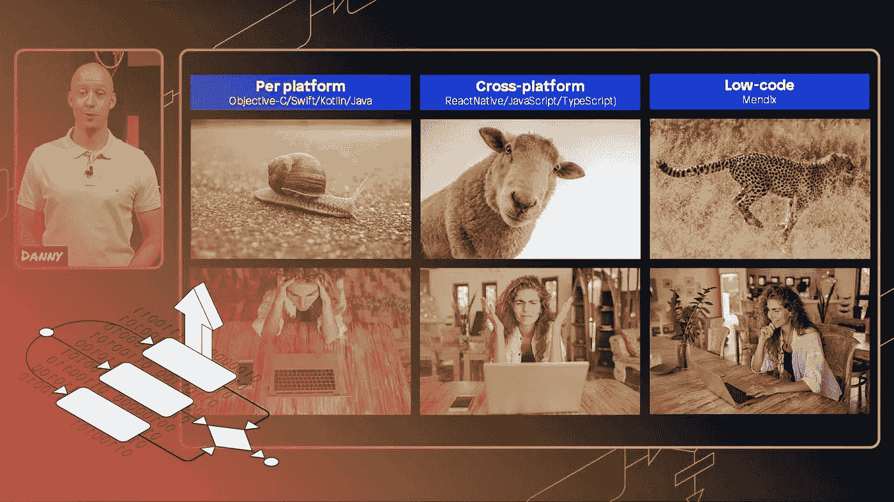

# 在 Mendix World 2021 上的 5 次会议，每个开发人员都需要回去重新观看

> 原文：<https://medium.com/mendix/the-5-sessions-at-mendix-world-2021-every-developer-needs-to-go-back-and-rewatch-1e0485447a86?source=collection_archive---------2----------------------->

# 我最喜欢 Mendix World 的部分是它提供的一系列会议。技术会议总是吸引我。今年也不例外，会议内容包括原生移动(我最喜欢的)、API 和 Rest(具有挑战性)以及产品路线图(令人兴奋！).但每年我都需要做出艰难的选择，决定参加哪些课程。每年我都觉得好像我错过了一些很棒的东西。

幸运的是，由于活动转移到了网上，所有的记录都保留了下来，我们可以按照自己的节奏返回，现在活动结束几个月后，我已经梳理了大部分目录，我有几个必看的会议，我认为这些会议概括了所有的公告和关于 Mendix 平台在未来一年你应该知道的事情。

因此，排名不分先后，以下是我今年参加的 Mendix World 的前 5 场会议，我认为这些会议很有启发性或很有见地，甚至我也是其中的一员:

# [每个人都可以用 Mendix 构建一个原生移动应用](https://events.mendixworld.com/widget/mendix/world21/catalog/session/1615220128789001nnCR)

这是原生移动产品经理 Danny Roest 的一个很棒的会议，它包含了一些关于如何开始构建自己的原生移动应用程序的要点。对于新的 Mendix 开发人员，或者那些还没有完全理解原生应用的人，Danny 消除了一些关于使用低代码构建原生应用的常见误解。他谈到了客户的成功和他自己的经历，让你深入了解如何与你的团队一起开始构建原生应用。

> **‘开始吧，不要害怕’—丹尼·罗斯特**

我从这次会议中得到的主要收获是 Danny 关于构建原生应用的 10 个技巧，我认为这是优秀应用设计的基础，也是新开发者应该知道的。

## **看这里******。****

****

**我真的很喜欢他打破 Mendix 固有的移动端的方法，终端用户可以认为这是理所当然的，就像 UX 和良好的设计。这是一个很好的开始了解你需要了解的关于本地移动的信息的地方，但是我每天都从这个会议中得到一个信息，那就是“**开始吧，不要害怕**”。毕竟，如果你在你的本地机器上破坏了一个小的练习应用程序也没关系，而且当你这样做的时候，不要害怕向有经验的人请教。**

# **[使用非持久域模型创建 REST 服务密集型本地应用](https://events.mendixworld.com/widget/mendix/world21/catalog/session/16167478821560015Nq2)**

**如果你曾经不得不弄清楚如何在任何应用程序中调用 API，你会知道这可能很棘手，在原生移动设备中更是如此。从微流传递数据仅限于非持久数据和简单数据类型，这可能是有限制的。另一种方法是使用持久数据，但应用严格的同步配置。**

**凯捷的沃特·彭里斯(Wouter Penris)不得不为一家金融科技公司开发一款 REST heavy 应用程序，该程序符合最高的安全标准。在会议中，他比较了他和他的团队研究的多种方法，例如，使用原始类型作为参数来查找和检索数据，作为一种只能将非持久数据从微流调用传递回纳流的方法。**

## **看这里。**

****

**我从本次会议中获得的主要收获是，从您开始创建应用的那一刻起，就要考虑您的设备同步配置、域模型和安全性——所有这些都将严重影响您在自己的项目中采用的方法。**

# **[直播 AMA:与约翰·登汉合作的 Mendix 产品路线图](https://events.mendixworld.com/widget/mendix/world21/catalog/session/1624032080689001aVwo)**

**每年发布的新功能如此之多，以至于很难掌握所有的信息。不过，在主题演讲的时候不需要做笔记！在这次直播中，来自 Mendix 的 AMA·约翰·丹·哈恩首席技术官与您最喜欢的低代码社区经理 Jan de Vries 坐在一起。**

**在会议中，他们回顾了社区的一些热点问题，并讨论了路线图中宣布的一些新功能。我知道我最期待的是黑暗模式为 Studio Pro 发布！**

## **看这里。**

****

**从可插拔小部件框架即将发生的变化，到新的前端功能，甚至为什么 Johan 如此痴迷于 Lego，这种轻松的对话是确保您了解所有已发布内容的最佳方式。**

# **[利用人工智能构建自动化索赔流程](https://events.mendixworld.com/widget/mendix/world21/catalog/session/1628002546036001ETnO)**

**是的，没错——这是我自己的会话(但这是我的博客，你不能阻止我)。玩笑归玩笑，在这个现场会议中，我和 Jan de Vries 再次演示了如何构建 Mendix 应用程序的几个关键功能。**

****

## **看这里[看这里](https://events.mendixworld.com/widget/mendix/world21/catalog/session/1628002546036001ETnO)。**

**这次我建了一个 app，我叫它“Breezey”。该应用程序通过使用人工智能和机器学习来分析最终用户拍摄的车辆照片，并自动检测任何损坏，从而自动化保险索赔流程。这个应用的人工智能部分不是我开发的，而是我的同事 Bryan Yeung 开发的。在这个环节中，我向制作人展示了我是如何制作出其他所有东西的，同时也允许观众在这个过程中“选择他们自己的冒险”。我们讨论了如何使用 REST 调用连接到 AI，构建页面和逻辑，以及如何构建一个自定义小部件来在本机应用程序中呈现 base64 编码的图像。**

*   *****下载项目文件*** [***此处***](https://bit.ly/MXW21_livebuild) ***。*****
*   *****训练好的模型(AI)在 github 上*** [***这里***](https://github.com/btyeung/car-damage) *。***

# **[利用 Mendix Workflow 实现关键业务流程的自动化](https://events.mendixworld.com/widget/mendix/world21/catalog/session/1620640329349001Qjrb)**

**Mendix 9 最大的新特性之一就是工作流。由于这是一个全新的特性，即使是有经验的 Mendix 开发人员也可能从这个伟大的实践课程中受益。加入产品营销经理 Abel Verweg 和产品经理 Paul Jongen 的 18 分钟讨论，他们将向我们展示如何开始使用工作流编辑器。**

## **这里看[这里看](https://events.mendixworld.com/widget/mendix/world21/catalog/session/1620640329349001Qjrb)。**

****

**Paul 自动化了一个关键的工作流程，提供了一个良好的使用案例作为起点，并提供了清晰的实用步骤供您遵循。了解如何为任务页面使用预制模板、创建可重复使用的自定义工作流操作以及构建仪表板来显示所需指标。**

**如果您还没有尝试过工作流，并且想自己尝试一下，这是一个很好的起点。**

# **直到下次**

**在今年的活动中有这么多其他令人惊讶的会议，几乎不可能只挑选五个。还有很多其他的值得关注，我在这里没有提到，所以请确保您不会错过任何东西，通过[点击此处](https://paper.dropbox.com/doc/The-5-sessions-at-Mendix-World-2021-every-developer-needs-to-watch--BUM_khtn_nAAEjBLFJNkkuYyAQ-5vYoLFLuzoCcfCotruzZn)查看面向普通开发人员和专业开发人员的课程。**

**特别感谢参加活动的每一个人，直到我们在下一届 Mendix 世界再次相见——让它成为**重要的事情**！**

***来自发布者-***

***如果你喜欢这篇文章，你可以在我们的* [*中页*](https://medium.com/mendix) *找到更多喜欢的。对于精彩的视频和直播会话，您可以前往*[*MxLive*](https://www.mendix.com/live/)*或我们的社区*[*Youtube PAG*](https://www.youtube.com/c/MendixCommunity/community)*e .***

***希望入门的创客，可以注册一个* [*免费账号*](https://signup.mendix.com/link/signup/?source=direct) *，通过我们的* [*学苑*](https://academy.mendix.com/link/home) *获得即时学习。***

**有兴趣加入我们的社区吗？你可以加入我们的 [*Slack 社区频道*](https://join.slack.com/t/mendixcommunity/shared_invite/zt-hwhwkcxu-~59ywyjqHlUHXmrw5heqpQ) *或者想更多参与的人，看看加入我们的*[*Meet ups*](https://developers.mendix.com/meetups/#meetupsNearYou)*。***