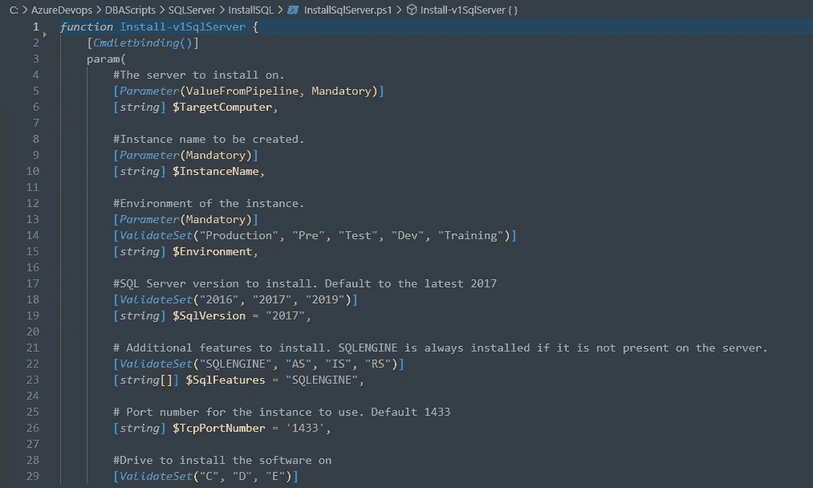
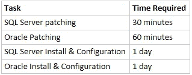
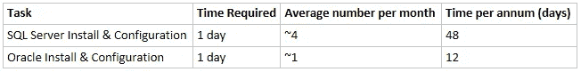
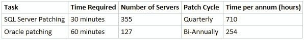
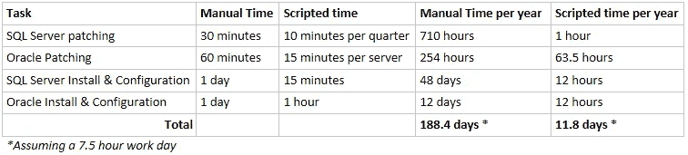
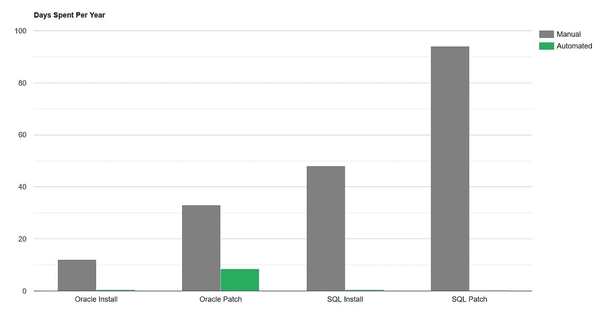

# DBA 中的“A”应该代表自动化

> 原文：<https://medium.com/version-1/the-a-in-dba-should-stand-for-automation-dc247b107680?source=collection_archive---------0----------------------->



One of the functions I created, which fully automates SQL Server installation

我已经做了 6 年多的数据库管理员(DBA)，都是用[版本 1](https://medium.com/version-1) 做的——我热爱我的工作。但是有些任务可能不如其他任务有趣。主要“罪魁祸首”是；

*   数据库修补
*   数据库安装和配置

这些是我们作为 DBA 最常见的一些任务，当您不得不做很多这些任务时，就会变得非常重复。在过去两年左右的时间里，我开发了 PowerShell 脚本来为 Oracle 和 SQL Server 自动执行这些任务。在这篇博文中，我将会介绍:

1.  手动操作需要多长时间
2.  通过自动化节省的时间
3.  每个脚本的功能摘要。

# 有问题的流程

为了让非 DBA 了解这些过程通常需要多长时间，下面是对每个过程的粗略估计；



**多久安装一次？**

安装频率因客户而异，但对于我目前工作的客户，我们平均每个月安装 3 到 4 次 SQL Server，大约每个月安装 1 到 2 次 Oracle。粗略估计一下这需要多少时间；



这相当于平均每年在安装上总共花费 60 天。

与我合作的客户在 2021 年也有一个 Oracle 升级项目，他们拥有的 127 个 Oracle 实例中的大部分都迁移到了 Oracle 19c，每个实例都需要在新的服务器上进行新的安装。在升级项目期间，Oracle 安装脚本为我们节省了 100 多天的手动工作。

**多久打一次补丁？**

同样，这将因客户而异。对于我工作的客户，我们每半年应用一次 Oracle 补丁，每季度应用一次 SQL Server 补丁。该客户有 127 个 Oracle 数据库和 355 个 SQL Server 实例。如果这些是手动修补的，花费的时间将是；



这相当于每年总共 964 个小时，或者说是惊人的 128 个工作日——仅仅花在修补房屋上。这个时间不包括发送电子邮件，与用户一起组织停机时间，或测试以确保应用程序在修补后仍能正常工作。

# 解决方案:自动化

任何开发人员都会告诉你，当你有一个重复的和/或耗时的任务时，你应该尝试自动化它。这就是我对上述每一项任务所做的。我使用 PowerShell 开发脚本，因为我们客户的资产几乎完全托管在 Windows 上，包括 Oracle 数据库。PowerShell 非常适合在 Windows 上实现自动化，从 Windows Server 2008 R2 SP1 开始，它默认安装在每个版本的 Windows [上](https://docs.microsoft.com/en-us/powershell/scripting/windows-powershell/install/installing-windows-powershell?view=powershell-7.1#:~:text=Windows%20PowerShell%20comes%20installed%20by,Installing%20PowerShell%20Core%20on%20Windows)

上述任务的自动化大大减少了我们在这些任务上花费的时间。下表显示了与手动操作相比，每项操作所用的新时间；



如您所见，自动化这些流程为我们节省了大量时间。当然，这些都是粗略的估计，但这只是为了让您了解我们通过自动化节省了多少时间。这里有一个条形图来进一步展示节省的时间 SQL 修补时间很少出现在这个范围内；



Bar chart for days spent on each task per year.

下面是每个脚本的简要总结。每个脚本都有广泛的日志记录和错误检查，在执行过程中向用户显示，并保存到日志文件中，以便以后查看。

# SQL Server 修补

这个脚本是最节省我们时间的一个。向该函数传递一个服务器列表，它将在遍历列表时并发处理 X 个(缺省值为 5 个)服务器。对于每个服务器，该脚本将:

1.  自动获取要修补的实例的 SQL Server 版本
2.  从给定的文件共享中获取适用于该版本的最新补丁
3.  上传并应用补丁
4.  必要时重新启动服务器
5.  为每台服务器创建大量日志，并在所有修补完成后，将摘要报告和日志一起发送到指定的电子邮件。

示例用法；

```
Install-SPMultipleSqlPatches -Servers “Server1”, “Server2”, “Server3” -PatchFileDirectory “C:\SQLPatchDir\”
```

其中“修补文件目录”是存储所有 SQL Server 修补程序的位置。该命令将同时修补所有三台给定的服务器。

该功能可以通过任务调度器作业进行调度，因此不需要 DBA 干预。例如，您可以将其计划为每月运行一次—如果在给定的共享中找到更新的适用修补程序，脚本将仅对列表中的服务器执行某些操作—因此 DBA 只需向共享中添加更新的修补程序，当脚本再次运行时，它将应用任何新的修补程序。它与 SQL Server 2008 及更高版本兼容。

# Oracle 补丁

该脚本完全自动化了 Windows 上 Oracle 的修补过程。您可以向该函数传递服务器名和要修补的 Oracle 主目录的路径，脚本会完成剩下的工作。步骤是:

1.  检测主目录的 Oracle 版本
2.  从我们的共享中获取该版本的最新适用补丁
3.  在服务器上更新 OPatch
4.  停止从该主目录运行的所有数据库、服务和进程
5.  修补房屋
6.  在升级模式下打开数据库并运行 datapatch
7.  在打开模式下重新启动数据库
8.  确认补丁程序已经应用到主目录和主目录中的每个数据库。

该脚本适用于 Oracle 11g 及更高版本。由于 Oracle 修补程序偶尔会有独特的步骤，并且不像 SQL Server 修补程序那样可预测，因此该脚本通常不会被安排在后台自动运行。DBA 通常会在通读补丁自述文件并确保它不包含任何额外步骤后开始。用户为它提供主机名和要修补的主目录，并可以在脚本执行这些步骤时监视它。

示例用法；

```
Install-v1OraclePatch -TargetServer “ORAHOST01” -OracleHome “D:\Oracle\ora19\dbhome_1”
```

# SQL Server 安装

此脚本完全自动在 Windows 上安装 SQL Server。现在，安装只需 15 分钟，而且完全自动化，而手动安装需要一整天，因此该脚本为每个实例节省了大约 1 天的工作时间。该脚本还改进了数据库标准，因为它确保所有新实例都是相同的，在设置过程中不会遗漏任何东西，并且所有参数都是按照最佳实践设置的。该脚本在被调用时执行以下任务；

1.  在服务器上执行先决条件检查，以确保安装可以继续进行
2.  上传并在服务器上安装 SSMS 和 SQL Server。SQL Server 版本通过参数传递，可以是 SQL Server 2016 及更高版本的任何版本。如果环境是生产环境，则安装企业版；如果是非生产环境，则安装开发人员版。
3.  根据最佳实践设置几个 SQL Server 参数
4.  根据最佳实践配置临时数据库
5.  设置 SQL Server 维护作业，如数据库备份、索引优化、完整性检查、更新数据库统计信息等。
6.  设置一个监视数据库和作业，它将监视和记录实例上所有数据库的活动会话，这对将来的调查非常有用
7.  对实例应用最新的适用补丁程序。
8.  生成新实例的报告，并将其与详细的日志一起发送到团队的电子邮件地址以供审查。

示例用法；

```
Install-v1SqlServer -TargetComputer “SQLHOST01” -InstanceName “SQLPRD01” -Environment “Production” -SqlVersion 2019
```

这将在 SQLHOST01 上上传并安装 SQL Server 2019 企业版，实例名为 SQLPRD01。它将执行上述所有步骤。

# Oracle 安装

该脚本完全自动化了 Oracle 在 Windows 上的安装。安装大约需要 60 分钟，而手动安装需要一整天。与 SQL Server 脚本一样，这也提高了我们的标准，因为它使每个新的安装都完全相同，并且符合我们的标准。该脚本在被调用时执行以下任务；

1.  在服务器上执行先决条件检查，以确保安装可以继续进行
2.  上传并安装指定的 Oracle 软件(适用于 18c+)
3.  除非在调用脚本时另行指定，否则使用默认设置配置 Oracle 侦听器。
4.  给家里安装最新的补丁
5.  如果在调用脚本时指定了 CDBName，那么使用符合我们标准的 dbca 模板，创建一个具有指定名称的容器数据库
6.  如果在调用脚本时指定了 PDBName，则在容器数据库中创建一个具有指定名称的可插拔数据库
7.  为新数据库配置导出和 RMAN 备份

示例用法；

```
Install-v1Oracle -TargetServer “ ORAHOST01” -OracleInstallVersion 19 -CDBName TESTCDB1 -PDBName TESTPDB1
```

该示例将执行上述所有任务，并使用 CDB TESTCDB1 创建一个新的 19c 安装，在容器中使用 PDB TESTPDB1。

# 结束语

自动化是我热爱的事情，我很幸运能为一个积极鼓励自动化的客户工作。正如你在这篇文章中看到的粗略数字，它可以为你、你的团队和客户节省大量的时间。自动化脚本的最初创建是耗时的，但是回报可能是惊人的。自动化一个任务不仅提高了你的自动化和脚本技能——而且当你自动化一个过程时，你会非常了解这个过程，所以你也是这样学习的。这也意味着你可以花更多的时间在有趣的任务上，花更少的时间做重复性的工作。

如果您对这些脚本的代码感兴趣，请通过电子邮件或下面的评论告诉我，我很乐意分享它们并提供更多细节。你可以打 patrick.cull@version1.com 的电话找到我。


Photo by [Kevin Ku](https://unsplash.com/@ikukevk?utm_source=medium&utm_medium=referral) on [Unsplash](https://unsplash.com?utm_source=medium&utm_medium=referral)

**关于作者:**
*Patrick Cull 是这里版本 1 的高级数据库管理员。关注我们的媒体出版物，了解更多数据博客，或访问*[*www.version1.com*](http://www.version1.com/)*了解更多关于我们服务的信息。*