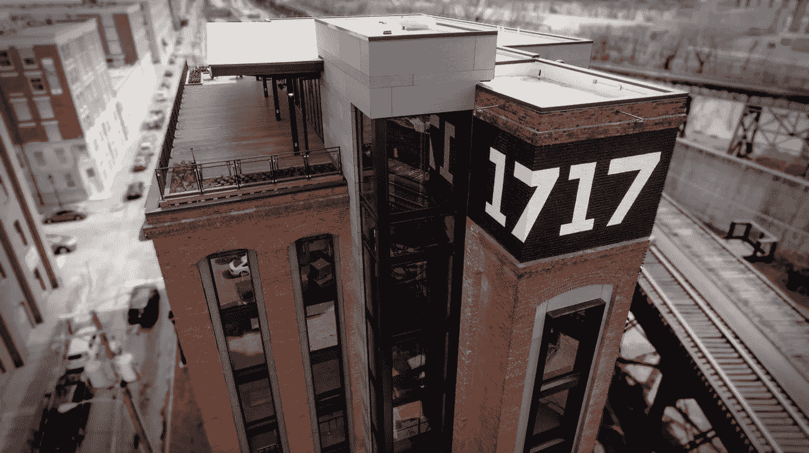
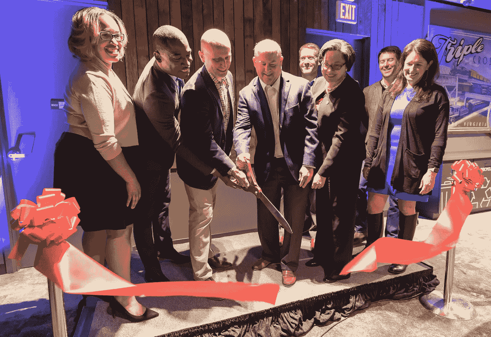
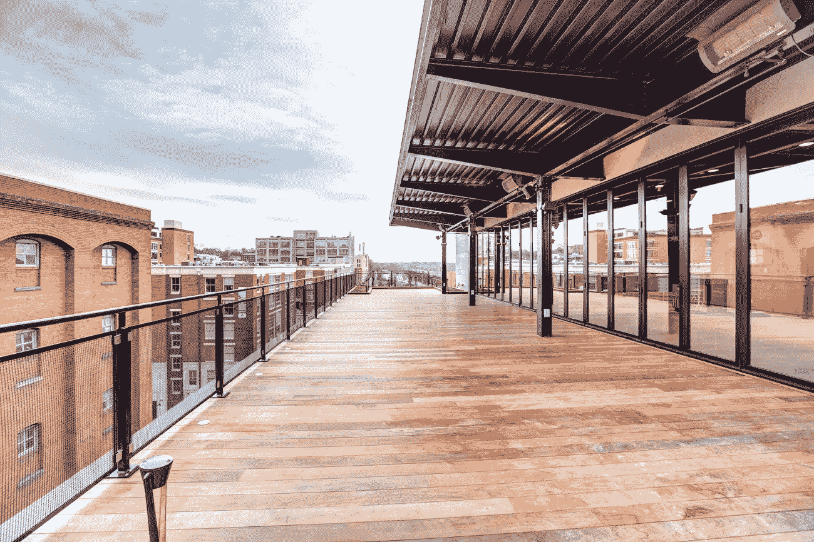

# 创新的地址是 1717 年

> 原文：<https://medium.com/capital-one-tech/the-address-for-innovation-is-1717-440c64f08cd8?source=collection_archive---------0----------------------->

*首都一号 1717 创新中心主任拉希达·n·克雷顿*

当我走进位于肖科底部的有着 100 年历史的烟草仓库时，它现在是 1717 年的创新中心，我想起了多年来在里士满发生的创新。正是在这里，发明家弗兰克·斯普拉格于 1888 年成功安装了第一个大型电动街道铁路系统。一年之内，100 多条类似的电气化铁路在几个大洲规划或开发中。今天，从里士满的六所学院和大学毕业的人才留下来为顶级公司工作，享受该地区的生活质量。作为一个土生土长的里士满人，我目睹了这座城市的巨大变化，我真的相信生活在这里是一个激动人心的时刻。

我由两位当地企业家抚养长大，从小就受到了强烈的职业道德的熏陶。我哥哥受到我父母榜样的影响，在建立自己的咨询公司方面取得了成功。除了我的家庭成员在创业过程中表现出的创造力、激情和毅力，我一直很钦佩他们回馈社会的决心。我经常想起玛丽安·赖特·埃德尔曼博士的一句话，这句话指导着我在社区的许多工作:“服务是我们为生活支付的租金。这是生活的真正目的，而不是在闲暇时间做的事情。”当我看到许多成功的企业家时，我意识到这种心态，回馈社会以创造一个充满活力的社区的重要性，是一个共同的线索。

令人激动的是，Capital One 将开设 [1717 创新中心](http://www.1717innovationcenter.com)——这是一个企业家和社区组织共同学习和创新的地方，以建设一个更好的里士满。我们通过 Capital One 的[未来优势](https://www.capitaloneinvestingforgood.com/)计划投资于该项目，该计划为个人提供在当今数字经济中取得成功所需的技能、工具和资源。有了 1717，我们的影响力将会增长，因为员工将成为基于技能的志愿者，提供指导并领导旨在帮助解决社会和业务挑战的计划。

与我们合作完成这项重要工作的是弗吉尼亚创业公司(Startup Virginia )( T7 ),这是一家非盈利、高增长的创业孵化器，为成员组织提供由 70 多名多学科专家组成的导师网络。Capital One 是初创公司 Virginia 的创始合伙人，从 1717 年开始，该公司将一次培育多达 50 家初创公司。我们也很荣幸能与 UnBoundRVA、Lighthouse Labs 和 RVA 工厂合作，这些公司致力于通过为未来的商业成功提供资源来支持来自不同背景的企业家。

一家将从 1717 工作中受益的初创公司是[提供变革](https://servingupchange.com/)。联合创始人张克帆·梅奥决定利用他作为妈妈 J 餐厅共同所有者的经验，推出一个在线捐赠管理平台。通过提供变革的“虚拟回馈”活动，支持者可以从餐馆购买电子礼品卡，非营利组织可以从筹集的资金中获得一定比例的收入。

根据梅奥的说法，“在提供变革方面，初创企业弗吉尼亚已经成为了一个游戏规则的改变者。我接触到了一个由经验丰富的专业人士组成的网络，这是我自己很难接触到的。除了在一系列主题上令人惊叹的指导之外，与其他创始人的交流和学习也非常有帮助。我真的很感谢有机会成为其中一员，也很高兴能在 1717 创新中心工作。”

第一资本公司很高兴像服务改变这样的公司在 1717 年找到了家。

> 25 年前，我们从一家位于里士满的初创公司发展成为该地区最大的雇主之一，回馈长期以来支持我们的社区非常重要。

25 年前，我们从一家位于里士满的初创公司发展成为该地区最大的雇主之一，回馈长期以来支持我们的社区非常重要。去年，Capital One 捐赠了 330 万美元，7600 名员工在里士满志愿服务了 13 万多个小时。我们希望能够找到向企业家和社区组织学习的方法，并利用我们最好的资源——我们的同事——来支持他们在里士满产生自己的影响。

我们都知道小企业是美国经济的支柱。根据[美国小企业管理局](https://www.sba.gov/sites/default/files/advocacy/SB-FAQ-2017-WEB.pdf)的说法，企业家创造了大部分新的工作岗位，他们的创新通过为新产品和服务创造新的市场来推动经济增长。显而易见，当小企业表现良好时，当地经济就会成功，社区也会得到加强。

> 第一资本希望 1717 成为我们社区创新繁荣的地方。

第一资本希望 1717 成为我们社区创新繁荣的地方。我很高兴看到我们的员工如何与整个里士满的人才合作，以发展经济和加强我们的社区，我很荣幸作为 1717 的董事成为这一旅程的一部分。

*内部和外部建筑照片由 John Romeo & Associates 提供。*

这些是作者的观点。除非本帖中另有说明，否则 Capital One 不属于所提及的任何公司，也不被其认可。使用或展示的所有商标和其他知识产权都是其各自所有者的所有权。本文为 2018 首都一。