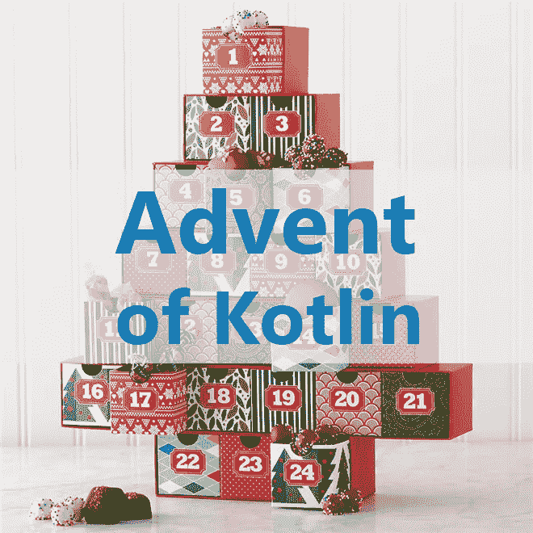

# Kotlin 2018 问世，第一周:最短路径算法

> 原文：<https://blog.kotlin-academy.com/the-advent-of-kotlin-2018-week-1-229e442a143?source=collection_archive---------0----------------------->



> 更新:本次挑战已经结束。这周的结果在最后。不过，如果你想挑战自己，也可以随意面对这个任务。最终，目标是学习和实践。

我们的使命是教学，我们相信最好的方法是分享知识和挑战。这就是为什么在这个降临节，我们挑战你们每一个人。在每个星期的开始，我们会公布一个你要在科特林解决的挑战。这些问题可以通过许多不同的方式和使用不同的 Kotlin 功能来解决。

在每个周末，我们将检查所有共享的解决方案，并根据我们的代码分析选择我们最喜欢的一个。该解决方案的作者将是获胜者(参见“如何？”部分)。我们将在这里、邮件和 Twitter 上公布他或她的 Twitter/Github 用户名。我们还将展示这个解决方案，并解释为什么我们最喜欢它。我们也可能包括一些荣誉提名。

听起来不错？您可以从今天开始，因为这已经是第 1 周了！但首先，让我们描述一些细节。


# 代码分析

当我们判断不同的解决方案时，我们会想到几件事:

*   正确性——程序应该像描述的那样工作，而不仅仅是通过单元测试。
*   编码惯例和 Kotlin 的习惯用法——我们车间的所有服务员都知道我们非常认真地对待 Kotlin 中的良好实践。我们甚至在[有一个单独的工作室](https://kot.academy/Effective_Kotlin.html)专门研究这个课题。你用科特林习语吗？你能用 Kotlin 的特性让你的程序干净吗？
*   可读性——清楚这个程序是如何工作的吗？
*   时机——我们知道一个人可以复制另一个人的解决方案并加以改进。这就是为什么时间对我们也很重要。
*   性能——最不重要的参数，但在我们看来是非常低效的解决方案。

# 怎么会？

如果你想让我们考虑你的解决方案，你需要在 Twitter 上分享一个代码链接(可以是 GitHub 片段或 Kotlin REPL 的链接)，标签为#AdventOfKotlin18。或者，您可以将您的解决方案发送到电子邮件 contact@kt.academy。我们在周日发布每周挑战，并在下周周日宣布获胜者。我们将只接受那些片段发送到欧洲中部时间周六下午 12 点。

# 第一周挑战:在地图上标记最短路径

你可能在日常生活中使用算法来寻找最短路径，而你甚至不知道。例如，你可能会使用谷歌地图这样的导航工具来帮助你找到准时到达某个地方的最佳路线。


我第一次想到它们是在我还是个孩子的时候，当时我在玩一个老游戏——帝国时代——我想知道当你选择一个单位并点击你想让它去哪里时，它怎么可能总是选择最近的路径。


这就是我们今天要学习的内容，而你面临的挑战是如何实施它。最后，你将为这样的地图做一个算法，其中`S`是起点，`X`是终点，`B`是一堵墙:

```
**....................
......X...B.........
..........B.........
........BBB....S....
....................**
```

寻找并标记最佳方式:

```
**.......****.........
......*...B*........
..........B.*.......
........BBB..***....
....................**
```

假设直线梯级的权重为 1，对角线梯级的权重为 1.5。

怎么做？

# Dijkstra 算法

最简单的算法是[迪杰斯特拉算法](https://en.wikipedia.org/wiki/Dijkstra%27s_algorithm)。这个想法类似于[广度优先搜索](https://en.wikipedia.org/wiki/Breadth-first_search)——我们开发通向所有方向的路径，直到到达最终点。我们总是开发最近的下一个点(从一开始就最近)。这种第一次到达新点的方式总是最优的。点的发展呈现在下面的动画中。


这种简化算法可以描述如下:

1.  设置一个可能的路径列表，从起始节点开始发展到所有可能的方式。
2.  在所有可能的路径列表中查找最短的新路径。
3.  如果该路径指向最终节点，则完成该算法。这条路径是我们寻找的最佳路径。
4.  从可能开发的路径列表中，删除所有到所选节点的路径，并添加从该节点开始的所有路径。
5.  如果我们有一个到达终点的最优方法，就完成了。否则，请转到步骤 2。

关于 [Wiki](https://en.wikipedia.org/wiki/Dijkstra%27s_algorithm) 的详细描述。请注意，这里描述的算法略有不同。

[](https://leanpub.com/effectivekotlin/c/3YYtCtqCC6a4)

# A*算法

Dijkstra 算法的一个大问题是，它向所有方向搜索，而不是集中在最有希望的方向。当然，有时为了到达左边的点，我们首先需要向右绕过障碍物。这种情况出现在“Labitynth”测试中:

```
**BB..B...B...BBBBB...
....B.X.BBB.B...B.B.
..BBB.B.B.B.B.B.B.B.
....B.BBB.B.B.BS..B.
BBB.B...B.B.BBBBBBB.
..B...B.............**
```

解决方案:

```
**BB..B...B...BBBBB.*.
....B.*.BBB.B...B*B*
..BBB*B.B.B.B.B.B*B*
....B*BBB.B.B.B**.B*
BBB.B.**B.B.BBBBBBB*
..B...B.***********.**
```

尽管在大多数情况下，尽可能快地朝着我们的目标前进会更好。下面的动画展示了所需的行为，我们将使用 [A*算法](https://en.wikipedia.org/wiki/A*_search_algorithm)来实现它:


如何才能实现？我们需要引入一些简单的度量——称为启发式——来告诉我们应该首先开发哪些节点。地图上最流行的一个参数是从这点到终点的直线距离。可以使用以下平衡计算:


现在，当我们决定下一步要发展哪一点时，我们考虑两个值的和:

*   从起点开始的最短的路
*   直线到终点的距离

这样我们更喜欢我们这边的节点。它总是能给我们正确的结果吗？好了，证明了对于图的每条边( *x* ， *y* )，如果启发式 *h* 满足条件*h*(*x*)≤*d*(*x*，*y*)+*h*(*y*)，则 A*正确工作，其中*这对我们的启发式算法来说是正确的，所以它会工作得很好。*

# 挑战

你的任务是编写一个算法，在地图上找到最佳路径，并返回带有最佳路径标记的地图。起点以`S`标记，终点以`X`标记。你只能在圆点`.`上移动，并且不能走出地图。`B`是障碍。假设直线步长权重为 1，对角线步长的权重为 1.5。当你找到最佳路径时，你应该用`*`代替所有应该去的节点，在地图上标记出来。

例如，您对以下地图的功能:

```
**...........
.......S...
...........
...........
...........
...........
..X........**
```

应该会返回以下结果:

```
**...........
.......*...
......*....
.....*.....
....*......
...*.......
..*........**
```

如果遇到障碍，应该绕行:

```
**....................
......X...B.........
..........B.........
........BBB....S....
....................****.......****.........
......*...B*........
..........B.*.......
........BBB..***....
....................**
```

但是它不应该超出地图的范围:

```
**......X...B.........
..........B.........
........BBB....S....
....................****......*...B.........
.......*..B.........
.......*BBB*****....
........***.........**
```

你可以选择任何你想要的算法，但性能将被考虑在内。尽管你不需要使用比 A*更高级的算法。你的算法应该总是给出正确的结果，而且不应该是随机的。如果你的算法选择的方法是最优的，但是与单元测试中的不同，那就没问题。您可以调整这个单元测试。尽管如果你决定实现一个*，选择的方式应该总是和单元测试中的一样。

> 你可以用来测试的单元测试是[这里是](https://gist.github.com/MarcinMoskala/2f586da50a93f7954beff616e9207fa8)。
> 
> 你也可以在 REPL 上在线实现一个解决方案[(你也可以使用新的)](https://try.kotlinlang.org/#/UserProjects/ib5k5pb4gkqasl37jqbiuinsmg/keopnss8rr8e6n9as5l8atbi4m)

祝你好运:)

# 结果

我对这次挑战的结果感到非常惊讶。这个相当复杂的任务只用了一个星期，我就收到了 20 多个正确的答案！一位与会者甚至发表了一篇文章描述他的解决方案:

[](https://ykanivets.com/doing-bfs-with-kotlin/) [## 和科特林一起跳 BFS

### 自从我用 Kotlin 写了第一行代码以来，已经快 2 年了。现在我把它用于所有新的应用程序，并积极地…

ykanivets.com](https://ykanivets.com/doing-bfs-with-kotlin/) 

我知道每个人要为此付出多少努力，所以我决定把他们都提到(最后)。

现在，因为这个挑战的目的是学习，我想从我的网站上给出一些评论:

1.  我注意到最大的麻烦是为一些概念选择正确的抽象层次。这是一个复杂的问题，我将在我的下一本书中深入探讨，但在这里我只触及两个极端。

首先，用不同于字符列表的方式来表示地图是有好处的。额外的抽象可以通过保存额外的信息来帮助我们，例如关于职位的信息。

你如何表示一个点？我很清楚，你所需要的只是一个简单的类:

```
class Point(x: Int, y: Int)
```

尽管有些人很想用`Pair<Int, Int>`来代替。然后他们需要给它命名，并定义 typealias:

```
typealias Point = Pair<Int, Int> 
```

他们还需要命名坐标，并定义扩展属性:

```
val Point.x get() = first
val Point.y get() = second
```

这是个好主意吗？我不这么认为，而且我确信这不是科特林惯用的方式。Kotlin 团队有意放弃元组，以推动人们使用类来代替，从长远来看，这是一种更好的做法。

可以想象，使用 typealias 的解决方案很容易被另一个以相同方式表示的类似类型破坏。例如方向:

```
typealias Direction = Pair<Int, Int>
val Direction.dx get() = first
val Direction.dy get() = second
```

如果你需要命名元组，它在 Kotlin 中被称为数据类，你这样定义它:

```
data class Point(x: Int, y: Int)
```

它是安全的，并且总是清晰的。在科特林上课很便宜，用吧！

另一个极端是当我们在代码中提取太多抽象时。大多数项目都很好地平衡了它，但是在不同的文件和包中有太多的抽象。这让我想起了以前的好时光 [FizzBuzz 企业版](https://github.com/EnterpriseQualityCoding/FizzBuzzEnterpriseEdition) :D YAGNI！保持简单。

2.我很高兴看到人们使用各种收集处理功能。这个问题需要很多人。只是一些建议:

*   为了创建`Comparator`，我们可以使用几乎满足所有情况的`compareBy`。要使用比较器排序，我们可以使用`sortedWith`。
*   我们可以通过`indexOf`函数找到一个元素的索引。

3.我们真的很喜欢 GitHub 项目中的基准和 ReadMe。尽管我们喜欢更简短和简洁的解决方案。我们喜欢注释，但是我们喜欢自我解释的代码。

4.我们需要一个接一个地添加节点，因为否则可能会选择更短的节点而不是更长的路径。这是另一个测试，一些解决方案无法通过:

```
@Test
**fun** `Not too fast`() {
    **val** mapString = **"""
    ....X.B.B.BBB.......
    .....B.B.B.BB.......
    .....BBBBBB.B.......
    .....B..BB.BB.......
    .....BBBB.BB........
    .....B....S.........
    ....................
    """**.*trimIndent*()

    **val** marked = **"""
    ....*.B.B.BBB.......
    ....*B.B.B.BB.......
    ....*BBBBBB.B.......
    ....*B..BB.BB.......
    ....*BBBB.BB........
    ....*B*****.........
    .....*..............
    """**.*trimIndent*()

    *assertEquals*(marked, *addPath*(mapString))
}
```

每个在挑战中学到东西的人都是赢家。我们最喜欢的解决方案是尼古拉斯·莱佩奇·‏(@ njble page)发来的:

[](https://twitter.com/search?q=%23AdventOfKotlin18&src=tyah) [## #AdventOfKotlin18 - Twitter 搜索

### #AdventOfKotlin18 最新推文。阅读人们在说什么，并加入对话。

twitter.com](https://twitter.com/search?q=%23AdventOfKotlin18&src=tyah) 

它简洁、简短，并且经过了很好的优化。看看这个。

以下是我们收到的所有其他正确答案的列表(按日期和时间排序):

Bryan Wilkinson 通过电子邮件向我们发送了正确的解决方案。

彼得·博罗万斯基通过电子邮件给我们发来了正确的解决方案。

Radim Vecerek 通过电子邮件向我们发送了正确的解决方案。

Evgenii Kanivets 通过电子邮件向我们发送了正确的解决方案。

何塞·伊格纳西奥·阿辛·波佐( [SO](https://stackoverflow.com/users/6783451/jose-ignacio-acin-pozo) 和 [Github](https://github.com/Ganet) )通过电子邮件给我们发来了正确的解决方案。

Ruben Gees 通过电子邮件向我们发送了一个正确的解决方案。

彼得·古利亚斯通过电子邮件向我们发送了正确的解决方案。

Balázs Németh 通过电子邮件向我们发送了正确的解决方案。

Send after qualified time

非常好，但不完全正确的解决方案已发送给 Serhii Siryi。

如果您向我们发送了正确的解决方案，但在这里没有看到您的名字，请通过 contact@kt.academy 通知我们。

[](https://blog.kotlin-academy.com/write-for-kotlin-academy-abebd70937ce)

## 单击👏说“谢谢！”并帮助他人找到这篇文章。

你需要 Kotlin 工作室吗？访问[我们的网站](https://www.kt.academy/)，看看我们能为您做些什么。

了解卡帕头最新的重大新闻。学院，[订阅时事通讯](https://kotlin-academy.us17.list-manage.com/subscribe?u=5d3a48e1893758cb5be5c2919&id=d2ba84960a)，[观察 Twitter](https://twitter.com/ktdotacademy) 并在 medium 上关注我们。