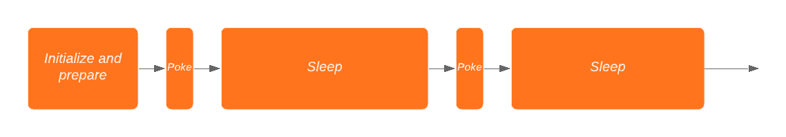
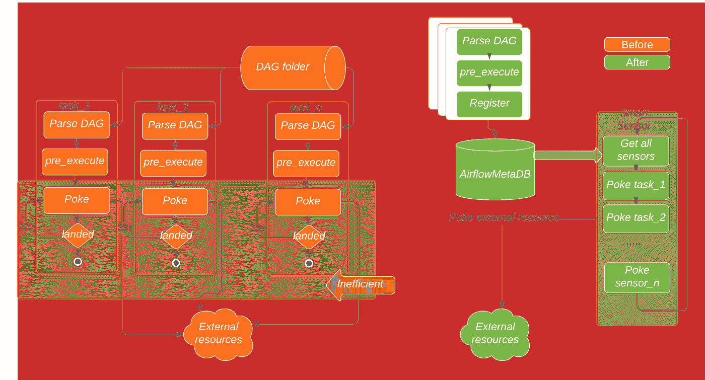
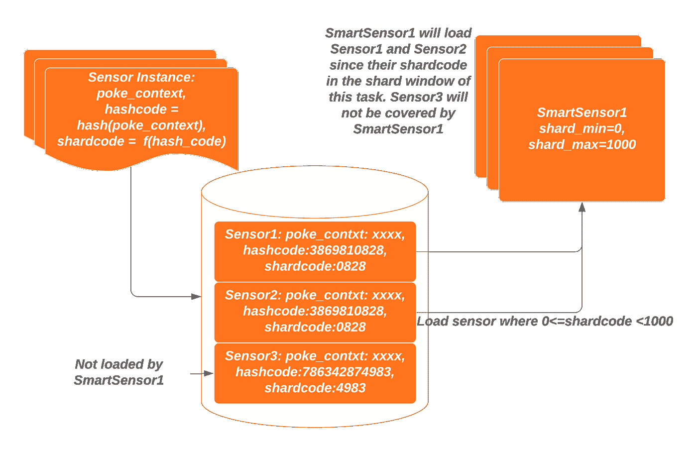
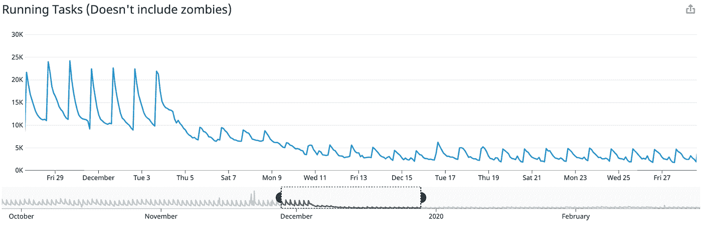

# 气流智能传感器服务

> 原文：<https://medium.com/airbnb-engineering/the-airflow-smart-sensor-service-221f96227bcb?source=collection_archive---------5----------------------->

整合长时间运行的轻量级任务，以提高资源利用率

**作者:** [王英博](https://www.linkedin.com/in/yingbo-wang-86aa3027/)，[杨凯文](https://www.linkedin.com/in/ruiqinyang/)

# 介绍

Airflow 是一个以编程方式创作、调度和监控数据管道的平台。一个典型的 Airflow 集群支持数千个工作流，称为 Dag(有向无环图)，在高峰时段可能会有数万个并发运行的任务。回到 2018 年，Airbnb 的 Airflow 集群有几千个 Dag 和超过 3 万个任务同时运行。这种工作量通常会导致 Airflow 的数据库过载。这也使得集群非常昂贵，因为它需要大量资源来支持这些并发任务。

为了使系统更加稳定，并降低集群的成本，我们希望优化气流系统。我们很快发现，长时间运行的轻量级(LRLW)任务浪费了大量资源，因此我们提出了一种智能传感器来整合它们并解决浪费问题。

# 长时间运行的轻量级任务

当我们研究气流性能问题时，我们发现有几种任务共享相同的 LRLW 模式。它们是传感器任务、子标记和 SparkSubmitOperator。

**传感器**或传感器任务是一种特殊的操作程序，它会一直运行，直到满足某个标准。该标准可以是在 HDFS 或 S3 登陆的文件、出现在 Hive 中的分区、其他外部任务是否成功，或者甚至是一天中的特定时间。

**Figure 1\. The lifespan of a sensor task**

当传感器任务运行时，它会调用其“poke”函数来定期检查标准，通常是每 3 分钟一次，如果传感器任务的“poke”函数返回 true，则标记为“成功”,如果传感器超时，则标记为“失败”。一次“戳”的执行速度非常快，大多不到 100ms，所以大部分时间传感器都是空闲的，等待下一次“戳”的时间到来。传感器任务的生命周期是从检查时间到满足条件的时间，可以从几分钟到几天不等。

**子标记**是长时间运行的轻量级任务的另一个例子。它们用于将一组任务封装在 DAG 中，并使复杂的 DAG 结构更加清晰，可读性更强。在 pre_execute 函数中为子 DAG 创建 DAG 运行，然后子 DAG 任务在 execute 函数中“戳”DAG 运行状态。

**SparkSubmitOperator** 也是一个长时间运行的轻量级任务的例子。Airflow 中的 Spark 客户机提交作业并轮询，直到完成。在一些初始化工作之后，所有这些任务都变成了轻量级的，有时是长时间运行的状态。

从前面的例子中，我们可以看到这些任务都属于相同的“长期运行、轻量级”模式，其特征如下:

*   **资源利用率很低。**这些任务的工作进程 99%的时间都处于空闲状态。
*   **在大规模集群中，这些任务通常占并发运行任务的很大一部分。**在 Airbnb，70%以上的运行任务都是传感器。在高峰时段，他们占用了 20 多个工作岗位。
*   **有很多重复的传感器任务。**超过 40%的传感器作业是重复的，因为许多下游 Dag 通常等待来自少数重要上游 Dag 的相同分区。

# 智能传感器

我们提出了智能传感器来整合这些 LRLW 任务。虽然最初创建它是为了合并长时间运行的传感器任务，但后来扩展到合并所有 LRLW 任务。我们为这项服务保留了智能传感器的名称。

# 它是如何工作的

智能传感器服务的主要思想是使用集中式进程来批量执行长时间运行的任务，而不是对每个任务使用一个进程。

**Figure 2\. Sensors before and after enabling smart sensor**

使用智能传感器服务，传感器任务分两步执行:

1.  首先，每个任务解析 DAG，获取任务对象，运行 pre_execute 函数，然后向智能传感器服务注册自己。在注册中，它将轮询外部资源所需的信息保存到 Airflow metaDB。注册成功后，任务退出并释放工作线程。
2.  然后，一些集中式进程(来自内置 DAG 的智能传感器任务)不断检查数据库中所有已注册任务的最新记录，并批量执行这些任务的“戳”功能。通常，一个智能传感器任务能够轻松处理数百个传感器任务。智能传感器还可以将重复的传感器任务合并到一个实例中，以节省更多资源。

**智能传感器通过定义传感器任务碎片来删除重复任务并平衡工作负载。**并发运行的传感器数量可能会很大，并且会有多个智能传感器任务在短时间内执行所有这些任务。在设计该系统时，如何将传感器任务分配给智能传感器是我们的主要挑战之一。我们试图平衡所有智能传感器任务的工作负载。同时,“重复的”传感器任务必须分配给同一个智能传感器，这样我们可以避免对同一个目标的多次攻击。

**Figure 3\. Deduplicating tasks by shardcode**

在智能传感器服务中,“poke _ context”是传感器作业的签名。这是一个执行传感器的 puk 功能所需的参数字典。具有相同操作员类别和相同“poke _ context”的两个传感器运行相同的“puk”功能，并被视为重复任务。通过使用“poke _ context”的 hashcode 进行分割，并使每个智能传感器任务负责 hashcode 在特定范围内的任务，它应该能够将“重复的”传感器分配给同一个智能传感器。由于 hashcode 很长，我们使用 hashcode 的 mod 进行优化，可以在数据库中对其进行索引。我们称这个键为“shardcode”。

图 3 显示了分片如何在智能传感器服务中工作。Sensor1 和 sensor2 具有相同的“poke _ context ”,因此它们具有相同的“hashcode”和“shardcode”。在运行时，它们将被同一智能传感器拾取，例如“智能传感器 1”。所有重复的传感器在一个戳环中只会被戳一次。

**智能传感器是所有传感器类别的通用服务。**集中式智能传感器任务是一个总体框架。它旨在支持各种类。只要类有一个 puk 函数，并且这个 puk 函数的参数可以被序列化，智能传感器任务就可以支持它们。

**日志的处理类似于未整合的流程。**虽然任务执行被整合到更少的进程中，但是智能传感器服务支持从气流 UI 读取或下载日志的相同能力。用户可以从原始传感器任务的 URL 读取日志。

**智能传感器可轻松应用于气流集群。**启用和禁用智能传感器服务很简单，我们只需要在气流中的“smart_sensor”会话上进行系统级配置更改。cfg。该更改对单个用户是透明的，无需更改现有的 Dag。此外，旋转集中式智能传感器任务不会导致任何用户的传感器任务失败。

# 效率的提高

在部署第一个版本的智能传感器后，Airbnb 能够将高峰时间并发运行的任务数量减少 60%以上。我们还将正在运行的传感器任务减少了 80%。传感器所需的处理槽从 20，000 个减少到 80 个。由于运行的任务少得多，数据库负载也大大降低。

**Figure 4\. Number of running tasks after Smart Sensor deployed**

在智能传感器中，重复数据消除机制减少了对 Hive metastore 约 40%的请求，从而减少了绝对传感器流量和底层数据仓库的负载。

# 结论

智能传感器是一种将小型、轻量级任务流量整合为大型集中式任务的服务。它可以降低气流的基础设施成本，并提高集群的稳定性。对于具有大量传感器任务的大型集群来说尤其如此。对于 Airbnb 的巨大气流集群，智能传感器降低了大量成本，并大大提高了整体集群的稳定性。

智能传感器服务是作为 [Apache Airflow 2.0](https://airflow.apache.org/docs/apache-airflow/stable/concepts/smart-sensors.html) 中的主要新功能之一发布的，自那以来，它一直用于提高更多 Airflow 用户的资源利用率。因为智能传感器服务引入了将任务生命周期分成多个进程的想法，并解锁了任务执行的“异步”模式，开源社区已经开始投资于“异步”解决方案的更通用用例，其中[可延迟(“异步”)操作符](https://cwiki.apache.org/confluence/pages/viewpage.action?pageId=177050929)是一个旨在将异步模式扩展到更多任务的操作符。

# ****************

*所有产品名称、标识和品牌均为其各自所有者的财产。本网站中使用的所有公司、产品和服务名称仅用于识别目的。使用这些名称、标志和品牌并不意味着认可。*