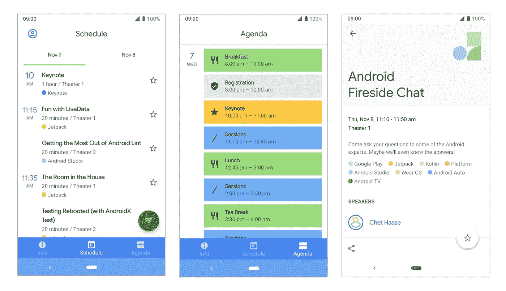
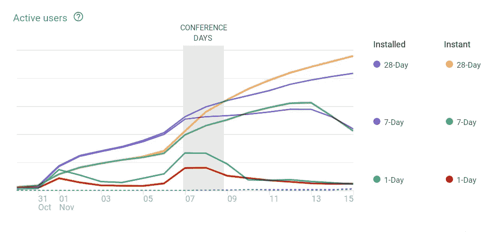
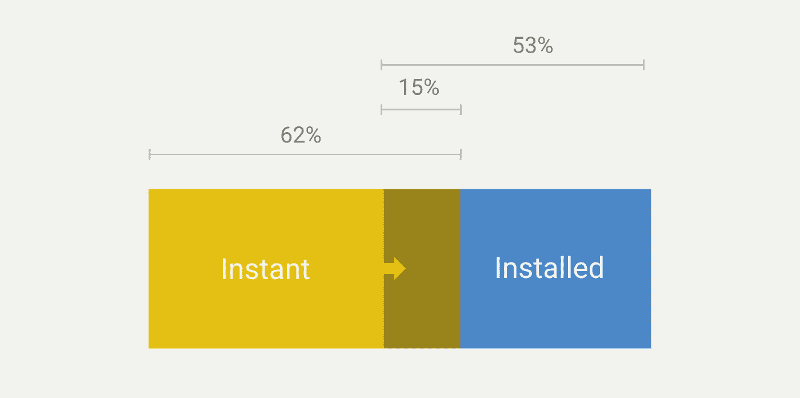
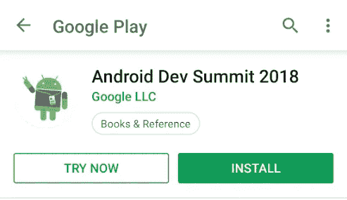
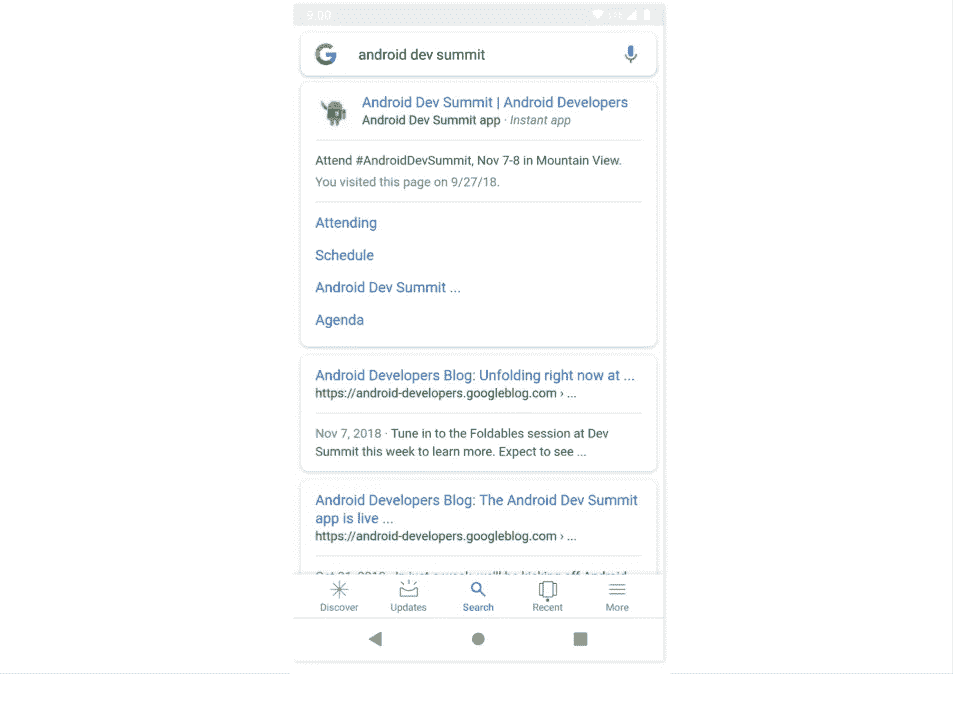
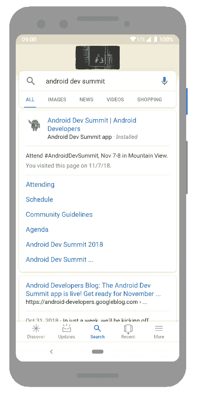

# Android Dev Summit 2018 应用(即时应用外卖+开源)

> 原文：<https://medium.com/androiddevelopers/the-android-dev-summit-2018-app-instant-app-takeaways-open-source-e5b590f78f38?source=collection_archive---------6----------------------->

*创建 Android Dev Summit 应用和发布即时体验应用捆绑包的心得。*

11 月 7 日和 8 日在加州山景城举行的 [Android 开发峰会](https://developer.android.com/dev-summit/)应用面向与会者和远程观众发布。

*Android Dev Summit app*

# IO-Sched -> ADS-Sched

Android Dev Summit 应用( [adssched](https://github.com/google/iosched/tree/adssched) )基于 Google I/O 应用(iosched)，这是一个开源项目[，可在 Github](https://github.com/google/iosched/) 上获得。删除了一些不需要的功能，例如:

*   **保留**[主提交](https://github.com/google/iosched/commit/65a5eb2d61bdd7507148db4d3b32a34f85a9e422)。这个特性与应用程序的每一层都有很深的耦合，给数据存储库带来了很多复杂性。在 I/O 应用程序中，我们使用了一个端点来指示用户是否是注册的参与者。非与会者有不同的用户体验。在 addsched 中，所有用户都是相同的，这使得业务逻辑简单得多。
*   **映射**屏幕[提交](https://github.com/google/iosched/commit/36c1e942379fcfac9181dcac58db434ebcdbb532)。会议只有两条跑道，所以不需要地图。这在底部导航中释放了一个位置，允许我们将议程提升到顶级目的地。

我们还增加了一些新功能:

*   **通知** [ [提交](https://github.com/google/iosched/commit/a13dcdae7e2bee6c287549ef4674a84b78f2218c)。使用 AlarmManager 在带星号的项目开始时间前 5 分钟设置提醒。
*   **即时 app**[提交](https://github.com/google/iosched/commit/07092236185425bb5e10c5b5629377ed9dcc6e10)。现在，从 Android Studio 项目构建即时应用程序非常容易。我们使用 flavors 生成了两个不同的包(installed/instant)。现在这是一个要求，但是将来你可以上传一个单独的包。

# 即时应用统计

这是我们第一次将会议应用作为即时应用发布，我们很好奇有多少人会使用这种模式。

*Installed app usage vs Instant experience usage [Oct 30th — Nov 15th]*

大约 25%的即时用户(占总用户的 15%)**跳转到已安装的应用**:

*Instant experience usage + Installed app usage*

## 收养:

*   当这款应用在发布会前一周[宣布](https://android-developers.googleblog.com/2018/10/the-android-dev-summit-app-is-live-get.html)时，我们通过即时体验看到了大约 **40%的用户。它可以从搜索结果和游戏中的*立即尝试*按钮进入。**

[The “try now” button](https://play.google.com/store/apps/details?id=com.google.samples.apps.adssched) opens the instant experience

*   在会议期间，这个数字**下降到 30%** ，可能是由于通知的可用性。
*   还有一点很有意思的是，发布会结束后安装少了，即时 app 用户多了。用户似乎明白通知是两者之间的唯一区别。

在发布即时应用程序之前，请遵循[指南来设置分析](https://developer.android.com/topic/google-play-instant/guides/analytics)并为即时安装流添加事件(遗憾的是我们没有这样做！).

# 增加即时体验的好处

运作良好的事情:

*   **认证**机制不需要修改。 [Firebase Auth](https://firebase.google.com/docs/auth/) 和 Google Smart Lock for Passwords 处理了一切，因此登录即时体验非常顺利。
*   在安卓手机上搜索峰会的用户找到了即时应用。

*Google Search results for the summit showing the instant app*

*   从即时应用程序安装应用程序的**流程由 Google Play 无缝处理。**

*Google Play’s instant->installed flow*

本来可以做得更好的事情:

*   活动别名发现的**问题**阻止了应用在即时启动后出现在启动器上。它出现在*最近的*屏幕上，但是离理想的还差[。由于时间限制，我们无法及时发布缺陷修复程序。](https://twitter.com/lehtimaeki/status/1058077669076729857)
*   **通知**不能直接从即时应用程序获得。但是，你可以通过 Play 服务发送推送通知(目前在 [beta](https://docs.google.com/forms/d/e/1FAIpQLSeu5yabEoJNXfTIugoqqhAqI6HMu2ebpLhyHuWZ2D85s4rRLw/viewform) )。由于这需要后端代码，我们决定使用通知展示 instant- > installed 流。这是两种口味的唯一区别。

# 开源广告计划

IOSched 一直被认为是一个学习的样本(因此有了这个包的名字),并被用作其他会议应用的基础。然而，I/O 有一些特定的要求，使得对常规会议应用程序的适应变得复杂，比如预订系统。

Android Dev 峰会在规模和要求上与其他会议相似，这使得它更适合被分支和重用。新版本只需要一个 Firebase 项目(我们建议使用第二个 staging 项目，链接到 Debug 构建类型)和一个存放[会议数据 JSON 文件](https://github.com/google/iosched/blob/adssched/shared/src/main/resources/conference_data_2018.json)的地方，该文件的格式很简单。

https://github.com/google/iosched/tree/adssched[➡](https://github.com/google/iosched/tree/adssched)

如果你需要帮助为你的会议创建一个分支，请随意在 [Github 项目](https://github.com/google/iosched)上打开一个问题。

这个即时实验是成功的，并且**产生了非常有趣的数据**，但是我们的用例非常简单，因为整个应用足够小，我们只有一个单一的即时入口点，并且用户群有限。我们迫不及待地想看看开发者把即时应用带到哪里，以及社区用 adssched 构建了什么！

*演职员表:* [*本维斯*](/@keyboardsurfer)*(ad sched 的即时 app 功能拥有者)* [*尼克屠夫*](/@crafty) *(神奇 gif 的创造者)*