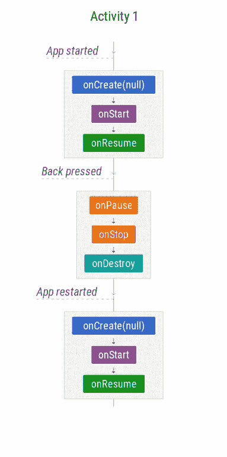
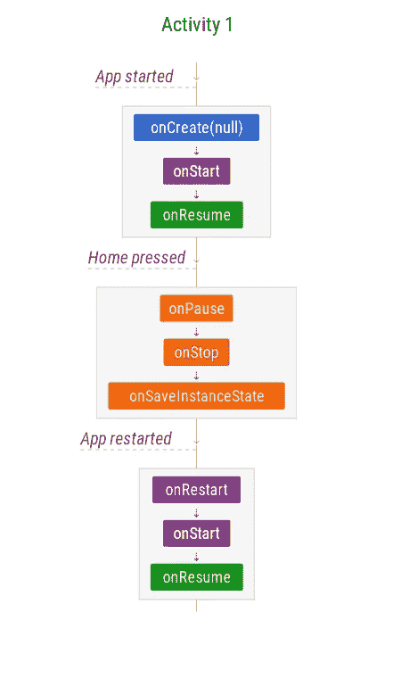
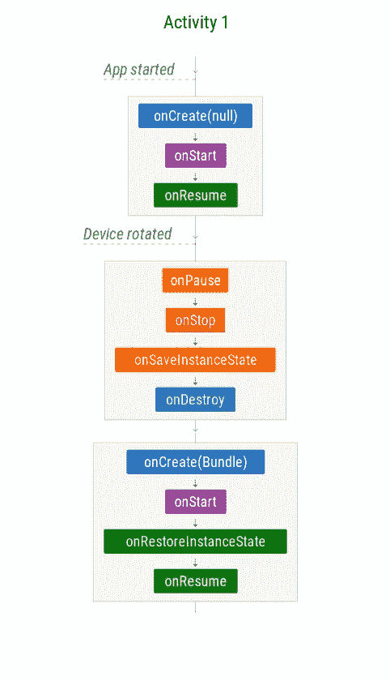
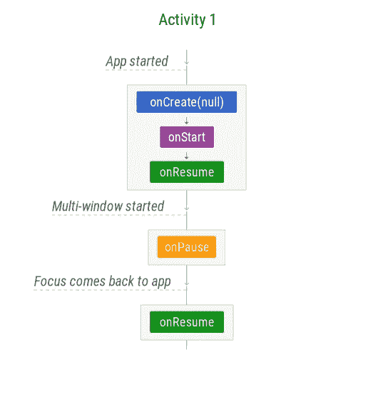

# Android 生命周期备忘单——第一部分:单一活动

> 原文：<https://medium.com/androiddevelopers/the-android-lifecycle-cheat-sheet-part-i-single-activities-e49fd3d202ab?source=collection_archive---------1----------------------->

Android 旨在赋予用户权力，让他们以直观的方式使用应用程序。例如，应用程序的用户可能会旋转屏幕，响应通知，或切换到另一个任务，并且他们应该能够在这样的事件后无缝地继续使用应用程序。

为了提供这种用户体验，您应该知道如何管理组件的生命周期。组件可以是活动、片段、服务、应用程序本身，甚至是底层流程。组件有一个生命周期，在这个生命周期中，它会经历各种状态。每当转换发生时，系统会通过生命周期回调方法通知您。

为了帮助我们解释生命周期是如何工作的，我们定义了一系列场景，这些场景根据存在的组件进行分组:

**第一部分:活动** —单个活动生命周期(本帖)

[**第二部分:多活动** —导航和回栈](/@JoseAlcerreca/the-android-lifecycle-cheat-sheet-part-ii-multiple-activities-a411fd139f24)

[**第三部分:片段** —活动和片段生命周期](/@JoseAlcerreca/the-android-lifecycle-cheat-sheet-part-iii-fragments-afc87d4f37fd)

[**第四部分:视图模型、半透明活动和启动模式**](/androiddevelopers/the-android-lifecycle-cheat-sheet-part-iv-49946659b094)

这些图表还可以作为 PDF 格式的[备忘单](https://github.com/JoseAlcerreca/android-lifecycles)快速参考。

> 注意:这些图表适用于 **Android P / Jetpack 1.0** 行为。

除非另有说明，否则以下方案展示了组件的默认行为。

如果你发现错误或者你认为遗漏了什么重要的东西，请在评论中报告。

# **第一部分:活动**

## 单个活动—场景 1:应用程序完成并重启

触发者:

*   用户按下**后退按钮**，或者
*   调用了`Activity.finish()`方法

最简单的场景显示了当用户启动、完成和重启单活动应用程序时会发生什么:

**Scenario 1: App is finished and restarted**

**管理状态**

*   `[onSaveInstanceState](https://developer.android.com/reference/android/app/Activity.html#onSaveInstanceState(android.os.Bundle))`未被调用(由于活动已经完成，不需要保存状态)
*   `[onCreate](https://developer.android.com/reference/android/app/Activity.html#onCreate(android.os.Bundle))`重新打开应用程序时没有捆绑包，因为活动已完成，状态不需要恢复。

## **单个活动—场景 2:用户导航离开**

触发者:

*   用户按下**主页按钮**
*   用户切换到另一个应用程序(通过概览菜单、从通知、接受呼叫等。)

**Scenario 2: User navigates away**

在这种情况下，系统将[停止](https://developer.android.com/guide/components/activities/activity-lifecycle.html#onstop)活动，但不会立即完成它。

**管理状态**

当您的活动进入停止状态时，**系统使用 onSaveInstanceState 保存应用程序状态，以防系统稍后在**(见下文)**终止应用程序的进程。**

假设流程没有被终止，活动实例将驻留在内存中，保留所有状态。当活动回到前台时，活动会调用这些信息。您不需要重新初始化之前创建的组件。

## **单一活动—场景 3:配置变更**

触发者:

*   配置变化，如**旋转**
*   用户在多窗口模式下调整窗口大小

**Scenario 3: Rotation and other configuration changes**

**管理状态**

像旋转或调整窗口大小这样的配置变化应该让用户从他们离开的地方继续。

*   活动被完全销毁，但是状态被保存并为新实例恢复。
*   `onCreate`和`onRestoreInstanceState`中的捆绑是相同的。

## **单个活动——场景 4: App 被系统暂停**

触发者:

*   启用多窗口模式(API 24+)并失去焦点
*   另一个应用程序部分覆盖了正在运行的应用程序(购买对话框、运行时许可对话框、第三方登录对话框……)
*   出现一个意图选择器，如共享对话框

**Scenario 4: App is paused by the system**

这个场景*不适用于:*

*   同一个应用程序中的对话框。显示一个`AlertDialog`或一个`DialogFragment`不会暂停潜在的活动。
*   通知。用户收到新通知或下拉通知栏不会暂停底层活动。

# 继续阅读

*   [Android 生命周期备忘单第二部分——多项活动](/@JoseAlcerreca/the-android-lifecycle-cheat-sheet-part-ii-multiple-activities-a411fd139f24)