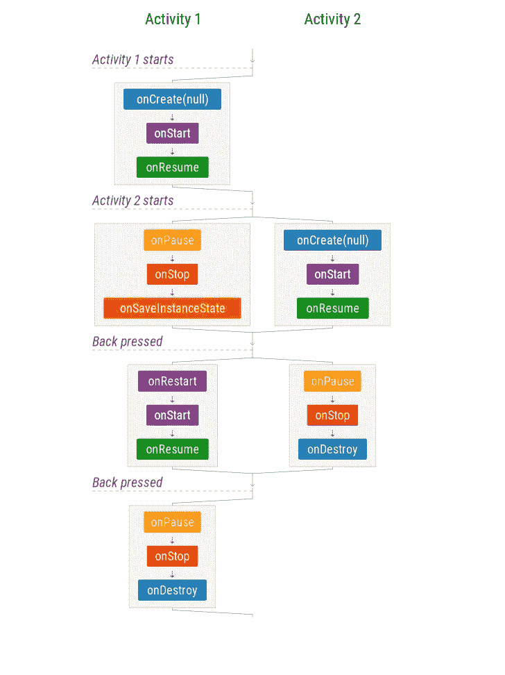
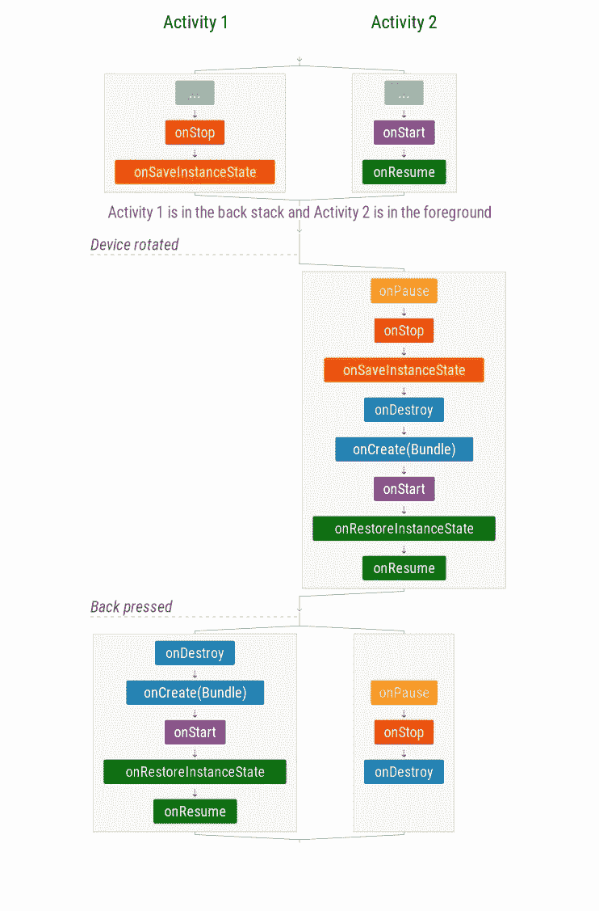
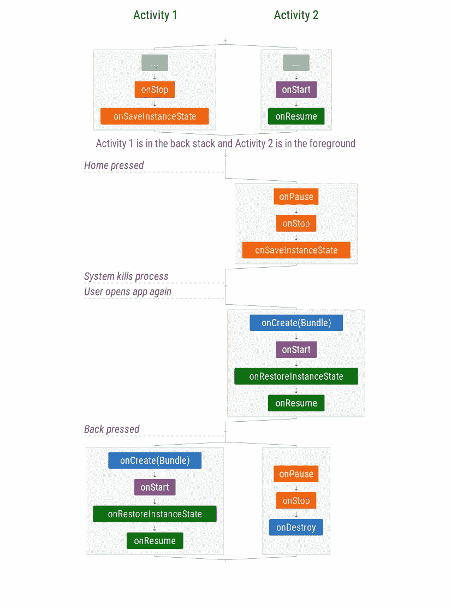

# Android 生命周期备忘单——第二部分:多项活动

> 原文：<https://medium.com/androiddevelopers/the-android-lifecycle-cheat-sheet-part-ii-multiple-activities-a411fd139f24?source=collection_archive---------4----------------------->

本系列:
* [**第一部分:活动** —单个活动生命周期](/@JoseAlcerreca/the-android-lifecycle-cheat-sheet-part-i-single-activities-e49fd3d202ab)
* **第二部分:多个活动** —导航和回栈(本帖)
* [**第三部分:片段** —活动和片段生命周期](/@JoseAlcerreca/the-android-lifecycle-cheat-sheet-part-iii-fragments-afc87d4f37fd) cle
* [**第四部分:视图模型、半透明活动和启动模式**](/androiddevelopers/the-android-lifecycle-cheat-sheet-part-iv-49946659b094)

这些图表还可以作为 PDF 格式的[备忘单](https://github.com/JoseAlcerreca/android-lifecycles)快速参考。

> 请注意，当在图表中显示多个组件(活动、片段等)的生命周期时，并排出现的分组事件并行运行。执行焦点可以在任何时候从一个并行事件组切换到另一个，所以并行事件组之间的调用顺序没有保证。但是，组内的顺序是有保证的。
> 
> 以下场景不适用于定义了自定义启动模式或任务关联性的活动和任务。有关更多信息，请参见 Android 开发者网站上的[任务和后台堆栈](https://developer.android.com/guide/components/activities/tasks-and-back-stack.html)。

# 后台堆栈—场景 1:在活动之间导航

**Scenario 1: Navigating between activities**

在这种情况下，当一个新的活动开始时，活动 1 被[停止](https://developer.android.com/guide/components/activities/activity-lifecycle.html#onstop)(但不被销毁)，类似于用户导航离开(就好像“Home”被按下)。

当按下返回按钮时，activity 2 被销毁并结束。

## 管理状态

注意，`[onSaveInstanceState](https://developer.android.com/reference/android/app/Activity.html#onSaveInstanceState(android.os.Bundle))`叫做，**但是** `[**onRestoreInstanceState**](https://developer.android.com/reference/android/app/Activity.html#onRestoreInstanceState(android.os.Bundle, android.os.PersistableBundle))` **不是**。如果在第二个活动处于活动状态时发生了配置更改，那么只有当第一个活动重新获得焦点时，它才会被销毁并重新创建。这就是为什么保存状态的实例很重要。

如果系统为了节省资源而杀死 app 进程，这是另一个需要恢复状态的场景。

# **后台堆栈—场景 2:配置发生变化的后台堆栈中的活动**

**Scenario 2: Activities in the back stack with configuration changes**

## 管理状态

保存状态不仅对前台的活动很重要。**配置更改后，堆栈中的所有活动都需要恢复状态**以重新创建它们的 UI。

此外，系统几乎可以在任何时候终止你的应用程序的进程，所以你应该准备好在任何情况下恢复状态。

# 后台堆栈—场景 3:应用程序的进程被终止

当 Android 操作系统需要资源时，它会在后台杀死应用程序。

**Scenario 3: App’s process is killed**

## **管理状态**

注意，完整回栈的状态被保存，但是为了有效地使用资源，活动仅在它们被重新创建时被恢复。

# 也阅读

*   [谁生谁死？Android 上的进程优先级](/google-developers/who-lives-and-who-dies-process-priorities-on-android-cb151f39044f)

# 继续阅读

*   [Android 生命周期备忘单第三部分——片段](/@JoseAlcerreca/the-android-lifecycle-cheat-sheet-part-iii-fragments-afc87d4f37fd)