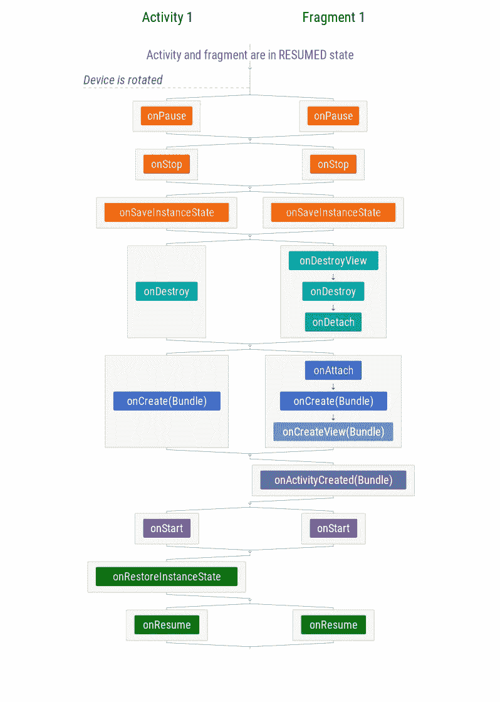

# Android 生命周期备忘单——第三部分:片段

> 原文：<https://medium.com/androiddevelopers/the-android-lifecycle-cheat-sheet-part-iii-fragments-afc87d4f37fd?source=collection_archive---------0----------------------->

在本系列中:
* [**第一部分:活动** —单个活动生命周期](/@JoseAlcerreca/the-android-lifecycle-cheat-sheet-part-i-single-activities-e49fd3d202ab)
* [**第二部分:多个活动** —导航和回栈](/@JoseAlcerreca/the-android-lifecycle-cheat-sheet-part-ii-multiple-activities-a411fd139f24)
* **第三部分:片段** —活动和片段生命周期(本帖)
* [**第四部分:视图模型、半透明活动和启动模式**](/androiddevelopers/the-android-lifecycle-cheat-sheet-part-iv-49946659b094)

这些图表还可以作为 PDF 格式的[备忘单](https://github.com/JoseAlcerreca/android-lifecycles)快速参考。

在这一节中，我们将介绍附加到活动的片段的行为。不要将这个场景与添加到后台堆栈的片段相混淆(有关片段事务和后台堆栈的更多信息，请参见[任务和后台堆栈](/google-developers/tasks-and-the-back-stack-dbb7c3b0f6d4))。

# **场景 1:包含片段的活动开始和结束**

**Scenario 1: Activity with Fragment starts and finishes**

注意，保证活动的`onCreate`在片段的之前执行。然而，并排显示的回调——比如`onStart`和`onResume`——是并行执行的，因此可以按任意顺序调用。例如，系统可能在片段的`onStart`方法之前执行活动的`onStart` 方法，但是在活动的`onResume`方法之前执行*片段的* `onResume`方法。

*小心管理各个执行序列的时间，以避免竞争情况。*

# 场景 2:具有片段的活动被旋转

**Scenario 2: Activity with Fragment is rotated**

## 状态管理

片段状态的保存和恢复方式与活动状态非常相似。不同的是片段中没有`onRestoreInstanceState`，但是在片段的`onCreate`、`onCreateView`和`onActivityCreated`中有 Bundle。

可以保留片段，这意味着在配置更改时使用相同的实例。如下一个场景所示，这稍微改变了图表。

# **片段—场景 3:循环使用保留片段的活动**

**Scenario 3: Activity with retained Fragment is rotated**

在循环之后，片段既不会被销毁，也不会被创建，因为在重新创建活动之后，会使用同一个片段实例。状态包在`onActivityCreated`中仍然可用。

不建议使用保留的片段，除非它们用于存储配置更改中的数据(在非 UI 片段中)。这是架构组件库中的[视图模型](https://developer.android.com/topic/libraries/architecture/viewmodel.html)类在内部使用的，但是使用了更简单的 API。

*如果你发现错误或者你认为遗漏了什么重要的东西，请在评论中报告。此外，请让我们知道您希望我们写的其他场景。*