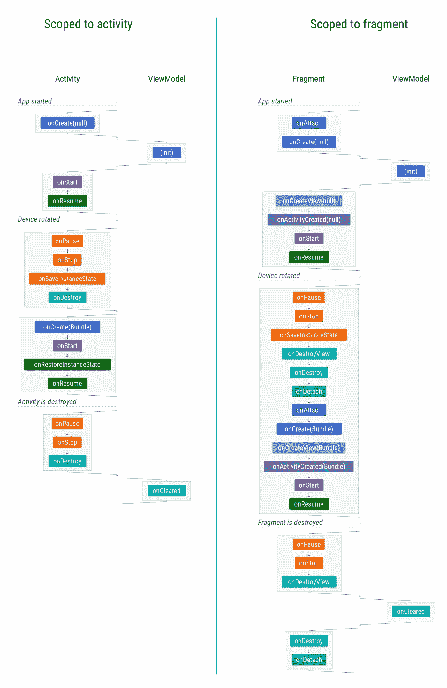
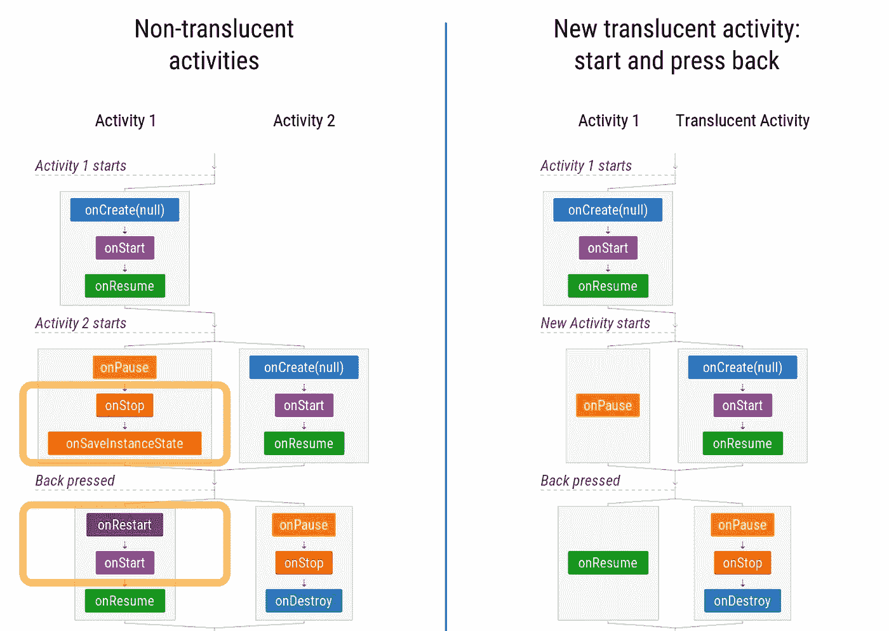
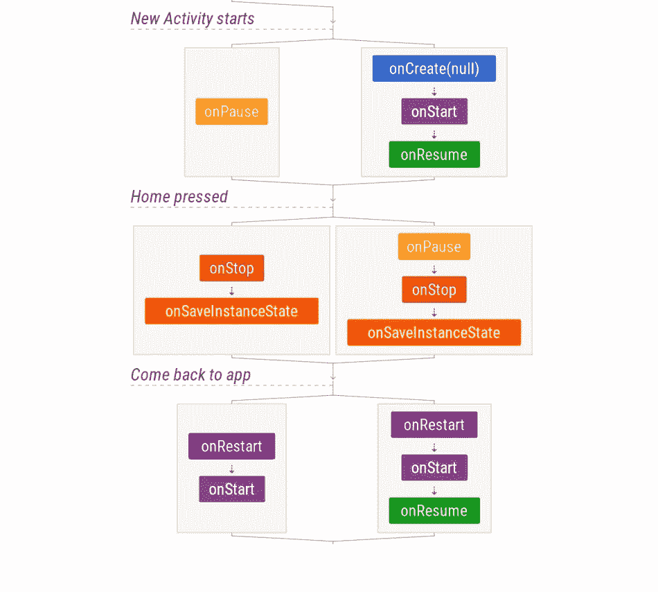
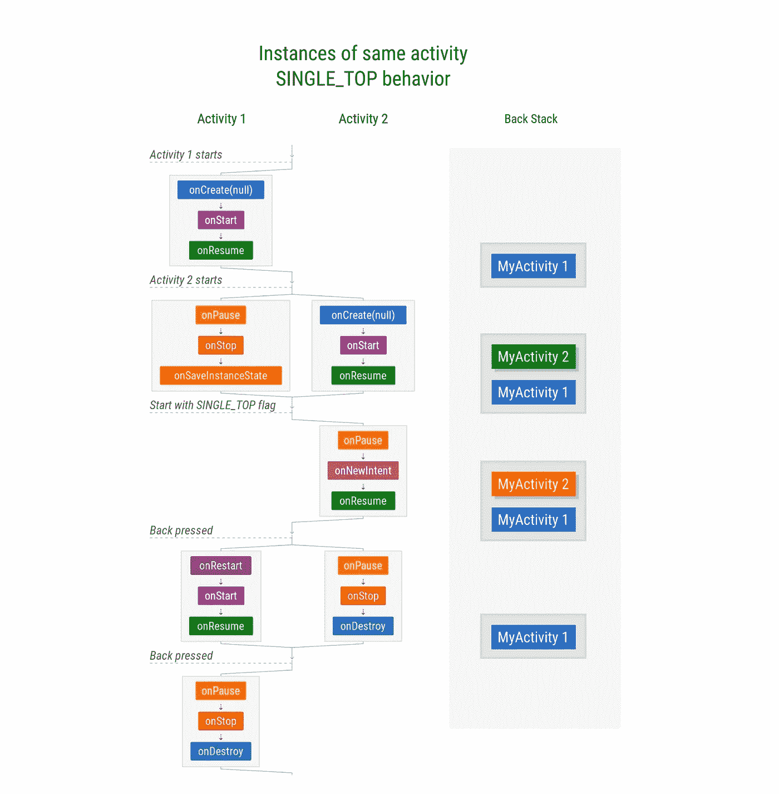
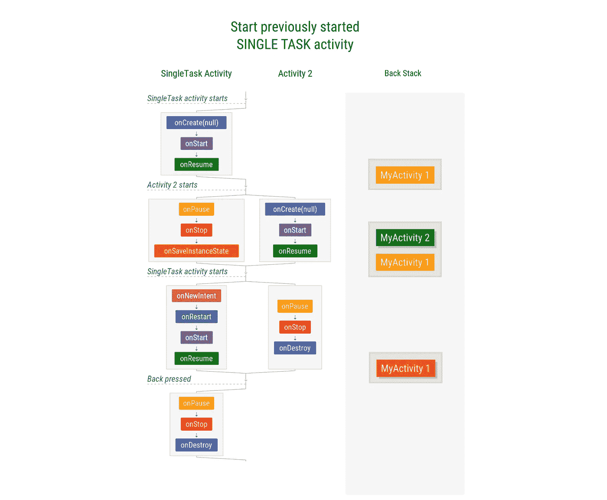

# Android 生命周期备忘单——第四部分:视图模型、半透明活动和启动模式

> 原文：<https://medium.com/androiddevelopers/the-android-lifecycle-cheat-sheet-part-iv-49946659b094?source=collection_archive---------3----------------------->

在这个系列中:
* [**第一部分:活动** —单个活动生命周期](/@JoseAlcerreca/the-android-lifecycle-cheat-sheet-part-i-single-activities-e49fd3d202ab)
* [**第二部分:多个活动** —导航和回栈](/@JoseAlcerreca/the-android-lifecycle-cheat-sheet-part-ii-multiple-activities-a411fd139f24)
* [**第三部分:片段** —活动和片段生命周期](/androiddevelopers/the-android-lifecycle-cheat-sheet-part-iii-fragments-afc87d4f37fd)
* **第四部分:视图模型、半透明活动和启动模式**(本帖)

这些图表也是 PDF 格式的以便快速参考。

# 视图模型

`ViewModel` s 的生命周期相当简单:它们只有一次回调:`onCleared`。然而，活动范围和片段范围是有区别的:

ViewModel scoping

请注意，每当您获得`ViewModel`时，初始化就会发生，这通常在`onCreate`中完成。

⬇️ [下载 ViewModels 图](https://github.com/JoseAlcerreca/android-lifecycles/blob/a5dfd030a70989ad2496965f182e5fa296e6221a/cheatsheetviewmodelsvg.pdf)

# 半透明的活动

半透明活动有半透明(通常是透明的)背景，所以用户仍然可以看到下面的内容。

当属性`android:windowIsTranslucent`被应用到一个活动的主题时，图表会有轻微的变化:后台活动永远不会停止，只会暂停，所以它可以继续接收 UI 更新:

Comparison between regular and translucent activities

此外，当返回到任务时，两个活动都被恢复和启动，只有半透明被恢复:

Pressing home and coming back to an app with a translucent activity

⬇️ [下载半透明活动图](https://github.com/JoseAlcerreca/android-lifecycles/blob/a5dfd030a70989ad2496965f182e5fa296e6221a/cheatsheettranslucent.pdf)

# 启动模式

处理任务和后栈的推荐方式是，基本上: ***不要****——*你应该采用默认行为。要了解更多细节，请阅读 Ian Lake 关于这个主题的帖子:[任务和后台堆栈](/androiddevelopers/tasks-and-the-back-stack-dbb7c3b0f6d4)。

如果你*真的需要使用* `[SINGLE_TOP](https://developer.android.com/guide/topics/manifest/activity-element#lmode)`，下面是它的示意图:

Single Top behavior

为了便于比较，下面是`[singleTask](https://developer.android.com/guide/topics/manifest/activity-element#lmode)`的样子(但您可能不应该使用它):

Single Task

注意:如果你使用 Jetpack 的[导航架构组件](https://developer.android.com/topic/libraries/architecture/navigation/)，你将受益于单顶支持和自动合成后栈。

⬇️ [下载发射模式图](https://github.com/JoseAlcerreca/android-lifecycles/blob/a5dfd030a70989ad2496965f182e5fa296e6221a/cheatsheetmodes.pdf)

如果你发现错误或者你认为遗漏了什么重要的东西，请在评论中报告。此外，请让我们知道您希望我们写的其他场景。