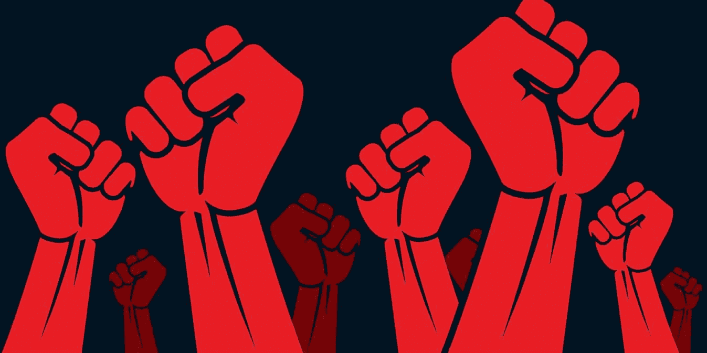
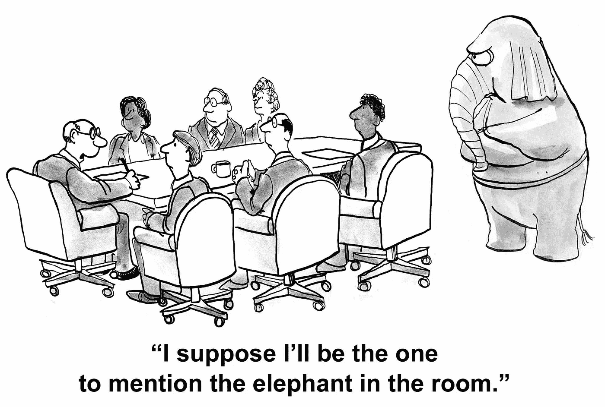
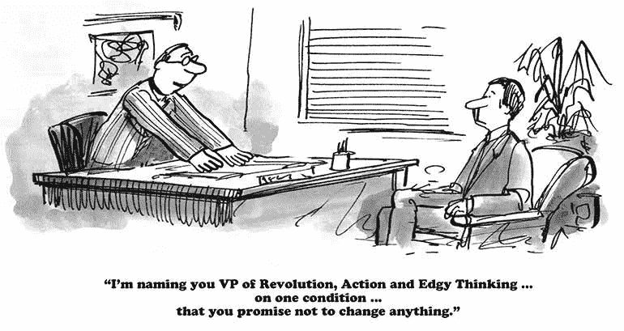
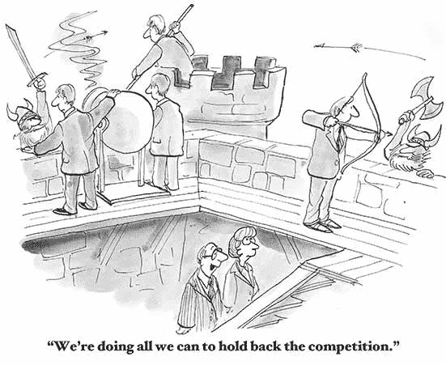
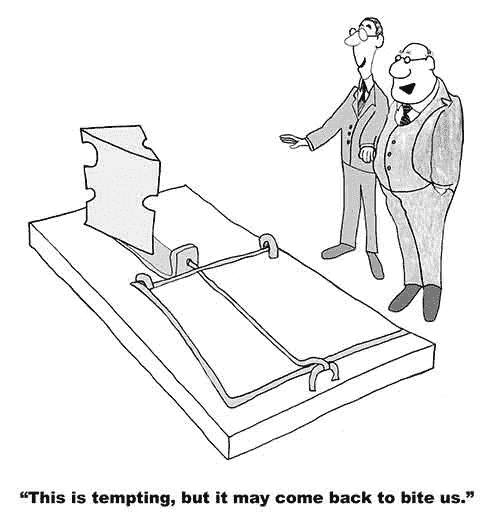
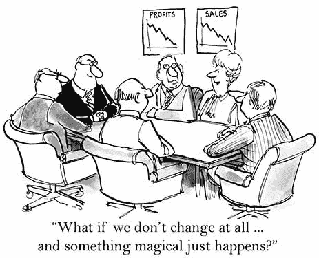
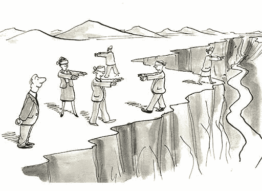
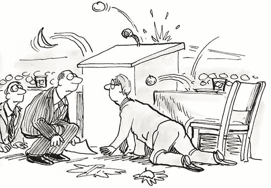

# 企业叛变的艺术:引领效率之路

> 原文：<https://medium.com/walmartglobaltech/the-art-of-corporate-mutiny-leading-the-way-towards-efficiency-bcd80121c482?source=collection_archive---------1----------------------->

Photo Credit: [Atypeek](https://www.istockphoto.com/vector/clenched-fist-held-in-protest-vector-illustration-panoramic-gm465519837-33234224)

# **房间里的公司大象**

Photo Credit: [Atypeek](https://www.istockphoto.com/vector/elephant-in-the-room-gm485901014-72396785)

在我的职业生涯中，我接触过各种大大小小的组织。公司越小，就越容易交流共同的动机和信念。随着公司的发展，新的态度和行为开始形成，有些形成了有害的工作环境。

我们都经历过这些:繁文缛节、官僚主义、分析瘫痪、*【在此插入任何让工作受挫的词】等等* …这是一个我们选择忽视的明显问题，接受了工作中每天效率低下的命运。

*【队列戏剧音乐】*

进入企业叛变的艺术！

# **企业叛变的艺术**

Photo Credit: [Atypeek](https://www.istockphoto.com/vector/refusal-to-change-gm531695456-93908121)

企业叛变是公开反对反效率模式的行动。以一种委婉的方式这样做是艺术。为了有一个成功的叛变，你必须能够识别这些模式。

在接下来的章节中，我们将回顾困扰每个公司的四种反效率模式以及如何解决它们。

如果你准备开始一场叛乱，请继续阅读。

# **反效率模式**

有四种反效率模式对工作场所有害。每一个都导致公司内部的冲突，影响员工、团队，最终影响客户。本文的目标是帮助您识别每种模式，以及需要采取什么措施来反对它。

# 食人文化

Photo Credit: [Atypeek](https://www.istockphoto.com/vector/hold-back-competition-gm494248482-77342825)

顾名思义，这是指一个组织为了实现同一个目标而相互竞争，而不是作为一个团队一起工作。

## *反效率模式:*

*   **不健康的竞争:**当两个或更多的团队试图“超越”或“击败”另一个团队来提供一个共同问题的解决方案时，就会出现这种情况。
*   **孤岛式开发:**当部门或团队故意排除信息共享，或完全无意与他人合作以减少重叠时，就会出现这种情况。
*   重建而不是重用:当一个团队没有尽职调查或者故意重新创建一个已经存在的解决方案时，就会出现这种情况。

## *为什么会这样:*

这些模式的常见原因是缺乏沟通、协调和团队合作来实现一个目标。通常，当一个组织意识到这是一个问题时，他们通常会添加更多的“流程”作为解决方案，而不是解决实际问题:*员工的态度和行为*。

## *开始你的革命:*

找出问题的根源所在。清楚地传达他们的态度和行为如何对组织产生负面影响。如果他们不愿意改变，他们可能不适合公司文化。

请记住，如果你决定留住表现出反效率行为的员工，短期价值永远不会超过对公司文化的长期影响。

# 反应文化

Photo Credit: [Atypeek](https://www.istockphoto.com/vector/temptation-at-work-gm515312266-88485909)

你会注意到这种行为，当一个组织的员工盲目地对一种情况做出反应，而不理解问题是什么、为什么以及如何发生的。

## *反效率模式:*

*   **对含糊不清的领导指示的反应**:这发生在当一个领导发表声明或提出要求，而组织没有要求澄清就匆忙完成的时候。
*   **对外部环境的反应**:当一个组织对与其核心关注领域无关的公司、行业或客户变化做出反应时，就会出现这种情况。

## *为什么会这样:*

这些模式的共同原因是员工不愿意向领导要求明确所要求的目的和价值。当范围、时间表和资源似乎固定时，很容易进入“恐慌模式”,感觉没有能力协商*现实*成功的定义。

## *开始你的革命:*

当遇到看似模糊或不现实的任务时:

*   中止
*   评估问题
*   标出*正在请求什么*
*   理解*为什么*很重要
*   确保你在*上与*公司利益保持一致

如果这几点你都没有明确的答案，那就去获取吧。之后，对准:

*   什么是真正需要的
*   由*当*和
*   完成它需要什么

在你得到上述答案之前，不要执行任何事情。通过理解所要求的目的，你和你的团队将会成功。

# 高度敏感的文化

Photo Credit: [Atypeek](https://www.istockphoto.com/vector/prefer-magic-over-change-management-gm486342566-72706125)

这种行为的关键指标是整个组织缺乏情商。恐惧、消极意图和回避是员工的普遍特征。

## *反效率模式:*

*   缺乏情感上的自我意识:缺乏阅读和理解自己情绪的能力，也没有意识到情绪对工作表现和人际关系的影响。
*   **缺乏自制力:**缺乏控制破坏性情绪和冲动的能力。
*   **缺乏社交意识:**缺乏感知他人情绪、理解他人观点、积极关注他人关切的技能。
*   **缺乏冲突管理:**缺乏化解分歧和协调解决方案的能力。

## *为什么会这样:*

这些模式的常见原因是缺乏员工之间的关系建设，以确保在提供和接收反馈时有信任和积极的意图，而不用担心误解。

## *开始你的革命:*

在工作场所公开羞辱的意识形态创造了一个不受欢迎的行为被容忍或放任的环境。

鼓励整个组织各个层面的实时反馈。每个人都有以专业的方式公开处理不符合公司文化的行为的自由，而不会遭到报复，这应该是一种普遍的做法。

# 误导的文化

Photo Credit: [Atypeek](https://www.istockphoto.com/vector/team-building-gm488629230-74282439)

这种行为对公司文化最具破坏性，是整个组织领导力、远见和关注度不足的结果。

## *反效率模式:*

*   **无效领导:**个人贡献者转变为经理，没有经过正式的培训或评估来确定是否继续适合该角色。
*   缺乏领导能力:犹豫不决，不愿正面解决难题，把责任推给别人。
*   缺乏有效的沟通:缺乏发送清晰、令人信服、和谐的信息来激励他人实现共同目标的能力。

## *为什么会这样:*

这些反效率模式的主要原因是由于缺乏经验的管理者没有受过训练或没有能力领导、辅导或指导他人。

## *开始你的革命*

因为这些反效率的模式对组织是如此有害，一旦你发现一个员工不适合做领导，立即把他们从职位上撤下来。

如果他们是强有力的个人贡献者，让他们回到那个角色。或者基于他们的兴趣和需求，他们可能更适合另一家公司的文化。

这一行动本身通过展示公平、迅速应对挑战的能力，凸显了强大的领导力。

# **在叛乱中幸存**

Photo Credit: [Atypeek](https://www.istockphoto.com/vector/upset-audience-gm607769928-104221225)

我相信你已经处理过或者仍然在处理一个或多个这样的反效率模式。如果你厌倦了，这篇文章中的建议要求你坚持你认为正确的立场。

这里有一些有用的提示供你参考:

*   使用你的声音:不要害怕谈论专业问题。你很快就会意识到其他人也有同样的感受，当他们团结在你身后时，你的声音就会变成他们的声音。
*   确定志趣相投的人:和那些想帮助公司文化变得更好的人在一起很重要。建立你的关系网，了解你的工作环境和需要解决的问题。
*   **用数据做工具:**领导喜欢数据。收集信息以突出痛点，如反效率模式如何影响生产率、产品质量或公司利润。
*   **以解决方案为导向:**提出抱怨是一回事，找到能产生积极效果的解决方案是另一回事。如果你想引发改变，就要有一个明确的计划、目的和衡量你所发现的问题是否成功的标准。

我的问题是:你会如何处理这些信息？你会继续坐以待毙，做一个被动的观察者，还是会发动一场叛乱，领导企业提高效率。